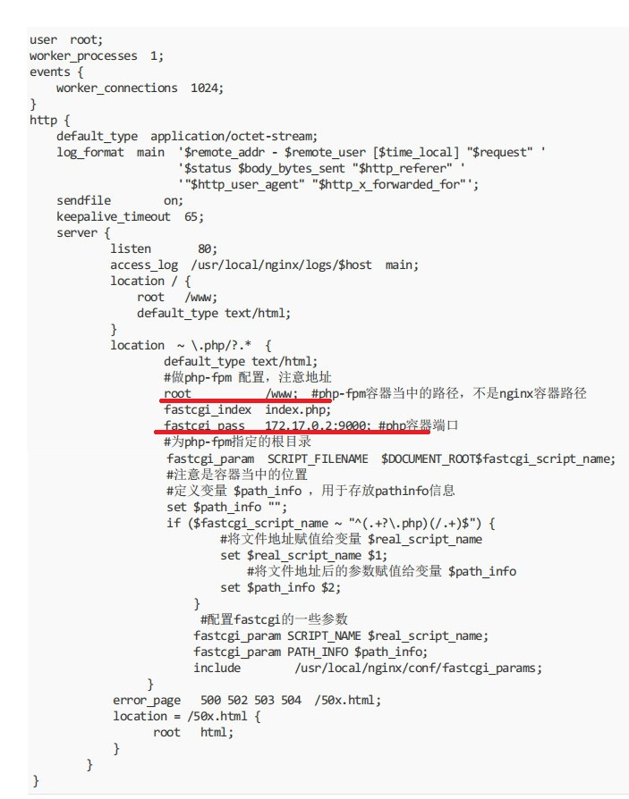
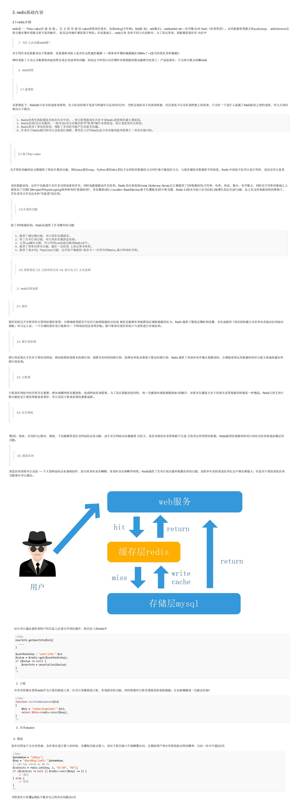
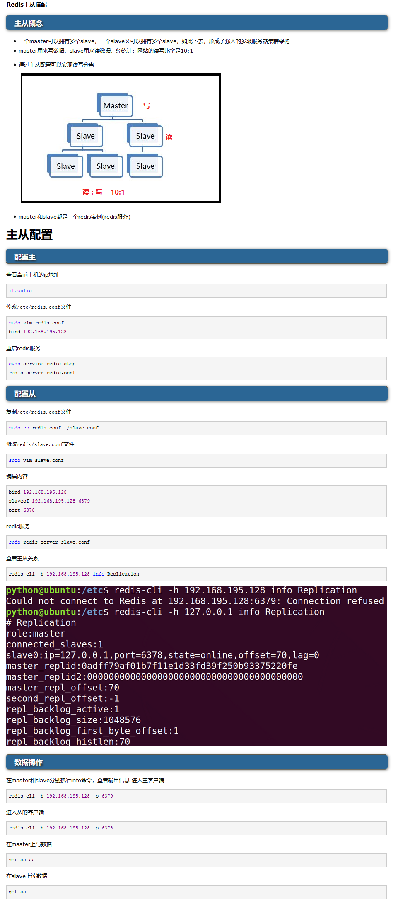
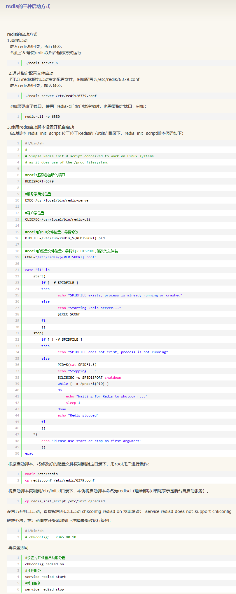

# Docker网络模式 Redis主从复制构建

### lnrp环境构建
````
nginx的dockerfile 

FROM centos:centos7 
RUN mkdir /data && mkdir /conf 
RUN groupadd -r nginx && useradd -r -g nginx nginx 
#修改时区 
RUN cp /usr/share/zoneinfo/Asia/Shanghai /etc/localtime && echo 'Asia/Shanghai' >/etc/timezone ARG PHP_VERSION=7.2 
#添加centos源(先下载wget) 
COPY ./epel-7.repo /etc/yum.repos.d/epel.repo 
#COPY 
#RUN yum install -y wget 
#RUN wget -O /etc/yum.repos.d/epel.repo http://mirrors.aliyun.com/repo/Centos-7.repo 
RUN yum update -y \ 
    && yum clean all \ 
    && yum makecache \ 
    && yum -y install gcc gcc-c++ autoconf automake make zlib zlib-devel net-tools openssl* pcre* wget \ 
    && yum clean all && rm -rf /var/cache/yum/* 
#声明匿名卷 
VOLUME /data 
COPY ./nginx-1.14.1.tar.gz /data/nginx-1.14.1.tar.gz 
RUN cd /data \ 
&& tar -zxvf nginx-1.14.1.tar.gz \ 
&& cd nginx-1.14.1 \ 
&& ./configure --prefix=/usr/local/nginx --user=nginx --group=nginx \ 
&& make && make install && rm -rf /data/nginx-1.14.1.tar.gz && rm -rf /data/nginx-1.14. 
COPY ./conf/nginx.conf /conf 
#全局使用nginx,软链接 
RUN ln -s /usr/local/nginx/sbin/* /usr/local/sbin 
#进入容器时默认打开的目录 
WORKDIR /conf 
#声明端口 
EXPOSE 80 
#容器启动的时候执行,在docker run过程当中是会被其他指令替代 
#CMD ["/usr/local/nginx/sbin/nginx","-c","/conf/nginx.conf","-g","daemon off;"] 
#执行一条指 
# ENTRYPOINT ["/usr/local/nginx/sbin/nginx","-c","/conf/nginx.conf","-g","daemon off;"]
````

````
php的dockerfile 


FROM php:7.3-fpm-alpine
ENV PHPREDIS_VERSION 4.0.0 
# Libs 
RUN sed -i 's/dl-cdn.alpinelinux.org/mirrors.aliyun.com/g' /etc/apk/repositories \ 
&& apk add \ 
curl \ 
vim \ 
wget \ 
git \ 
openssl-dev\ 
zip \ 
unzip \ 
g++ make autoconf 
# docker方式安装PDO extension 
# 安装扩展 
RUN mv "$PHP_INI_DIR/php.ini-production" "$PHP_INI_DIR/php.ini" \ 
    && docker-php-ext-install pdo_mysql \ 
    && docker-php-ext-install pcntl \ 
    && docker-php-ext-install sysvmsg 
# Redis extension 
RUN wget http://pecl.php.net/get/redis-${PHPREDIS_VERSION}.tgz -O /tmp/redis.tar.tgz \ 
    && pecl install /tmp/redis.tar.tgz \ 
    && rm -rf /tmp/redis.tar.tgz \ 
    && docker-php-ext-enable redis 
# 修改php.ini的文件 extension=redis.so 
EXPOSE 9000 
#设置工作目录 
WORKDIR /www
````

````
redis的dockerfile


RUN groupadd -r redis && useradd -r -g redis redis 
RUN mkdir data ;\ 
    yum update -y ; \ 
    yum -y install gcc automake autoconf libtool make wget epel-release gcc-c++; 
COPY ./redis-5.0.7.tar.gz redis-5.0.7.tar.gz 
RUN mkdir -p /usr/src/redis; \ 
    tar -zxvf redis-5.0.7.tar.gz -C /usr/src/redis; \ 
    rm -rf redis-5.0.7.tar.gz; \ 
    cd /usr/src/redis/redis-5.0.7 && make ; \ 
    cd /usr/src/redis/redis-5.0.7 && make install 
COPY ./conf/redis.conf /usr/src/redis/redis-5.0.7/redis.conf 

EXPOSE 6379 
ENTRYPOINT ["redis-server", "/usr/src/redis/redis-5.0.7/redis.conf"]
````
#### 构建构建容器
- 保存容器的数据卷
````
[root@localhost /]# mkdir docker 
[root@localhost /]# mkdir docker/images 
[root@localhost /]# mkdir docker/images/data/ 
[root@localhost /]# mkdir docker/images/data/php 
[root@localhost /]# mkdir docker/images/data/nginx 
[root@localhost /]# mkdir docker/images/data/redis 
[root@localhost /]# mkdir docker/images/data/php/www 
[root@localhost /]# mkdir docker/images/data/nginx/conf
````
- 构建容器
````
[root@localhost nginx]# docker run -itd -v /docker/images/data/nginx/conf:/conf -p 81:80 --name nginx1.4 nginx1.4 

8bbe17dab8522b39ddd25d8f64c2077e421dcc7fde73beb87bc304d74a621c84 

[root@localhost nginx]# docker run -itd -v /docker/images/data/php/www:/www -p 9001:9000 --name php-fpm-7 php7 

1f5bb19c2a12181b55dd0daf4b7aef18b513f7d885e9185365168f1c4c474cfc
 
[root@localhost redis]# docker run -itd -p 6379:6379 --name redis5 redis5 

a2563c777fd517fa70fa9da5bfc45dd7f0a0b1bac10f2c74ec52c2a17f843f12 

[root@localhost ~]# yum -y install telnet 

[root@localhost ~]# telnet 192.168.169.160 9001 
Trying 192.168.169.160... Connected to 192.168.169.160. Escape character is '^]'. 
Connection closed by foreign host.
````
- 配置连接测试
>查看IP命令 docker inspect 容器ID | grep IPAddress
````
注意redis.conf配置文件中解开一下内容注释

bind 127.0.0.1 
protected-mode no
````
````
nginx.conf配置文件
````



````
需要注意的是nginx.conf中的 fastcgi_pass 172.17.0.2:9001; 
#php容器端口 这行配置 中的 
172.17.0.2 是宿主机ip 

对应的PHP文件放置于： 
/docker/images/data/php/www 

index.php文件内容: 
<?php 
$redis = new Redis(); 
$redis->connect('192.168.169.160', 6379);//serverip port 
$redis ->set( "test" , "Hello World"); 
echo $redis ->get( "test"); 
?> 

注意访问的地址是 
http://192.168.169.160:81/index.php 需要带上 index.php
````

[redis在php中应用-基础篇](https://m.weibo.cn/status/4483215790528880?sourceType=qq&from=10A1295010&wm=4260_0001&featurecode=newtitle)




### 构建redis主从
>如果要制作镜像，强烈推荐alpine linux作为基础镜像，当然最大的优点是镜像小，对于运行分发肯定有好处的。可能有人觉得centos里面命令多，软件、库比较多，理应会比较好，事实上恰好相反，alpine包含了基础的一些命令足够在容器中使用，然centos中包含的很多库都潜藏着很多系统漏洞，从安全层面来说真不如alpine
alpine现在的软件包也有很多，而且国内也有很多站点提供软件包的下载，也是得益于docker广泛使用，alpine也会变得现在越来越流行了
````
FROM alpine:3.11
RUN sed -i 's/dl-cdn.alpinelinux.org/mirrors.aliyun.com/g' /etc/apk/repositories \
  && apk add  gcc g++ libc-dev  wget vim  openssl-dev make  linux-headers \
  && rm -rf /var/cache/apk/*

COPY ./redis-5.0.7.tar.gz redis-5.0.7.tar.gz

#通过选择更小的镜像，删除不必要文件清理不必要的安装缓存，从而瘦身镜像
#创建相关目录能够看到日志信息跟数据跟配置文件  sh
RUN mkdir -p /usr/src/redis \
      && mkdir -p /redis/data \
      && mkdir -p /redis/conf \
      && mkdir -p /redis/log   \
      && mkdir -p /var/log/redis \
      && tar -zxvf redis-5.0.7.tar.gz -C /usr/src/redis \
      && rm -rf redis-5.0.7.tar.gz \
      && cd /usr/src/redis/redis-5.0.7 && make \
      && cd /usr/src/redis/redis-5.0.7 && make install;

EXPOSE 6379

# CMD ["redis-server","/usr/src/redis/redis-5.0.7/redis.conf"]

#ENTRYPOINT ["redis-server", "/usr/src/redis/redis-5.0.7/redis.conf"]


docker build -t redis/redis:5 .  


创建网络:
 docker network create --subnet=192.160.1.0/24 redis


创建容器
docker run -itd -v /redis/master:/redis -p 6350:6379 --network=redis --ip=192.160.1.150 --name redis_master  redis/redis:5

docker run -itd -v /redis/salve:/redis -p 6340:6379 --network=redis --ip=192.160.1.140 --name redis_salve redis/redis:5

进入容器
docker exec -it ba24e9cdcbb6  sh //这里不用bash命令
docker exec -it bfdsafdas9cd  sh


//修改配置文件
确保主服务器的redis-master的配置文件这两项是开启的
bind 0.0.0.0
protected-mode no

进入从服务器 
执行如下命令 
SLAVEOF 192.160.1.150 6379

````

- docker network命令
````
1.docker network create
    # 不指定网络驱动时默认创建的bridge网络
    docker network create simple-network
    --subnet选项创建子网
    docker network create --subnet=192.160.1.0/24 redis5sm

docker network ls

docker network rm
    docker network rm simple-network
docker network inspect
    # 查看网络内部信息
    docker network inspect simple-network

启动docker容器时报错：
iptables failed: iptables --wait -t nat -A DOCKER -p tcp -d 0/0 --dport 5000 -j DNAT --to-destination 172.18.0.4:5000 ! -i br-ff45d935188b: iptables: No chain/target/match by that name. (exit status 1)

解决方案：重启docker
systemctl restart docker
````



