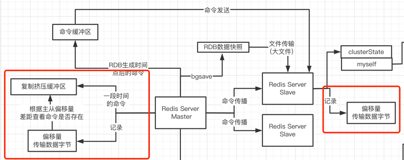
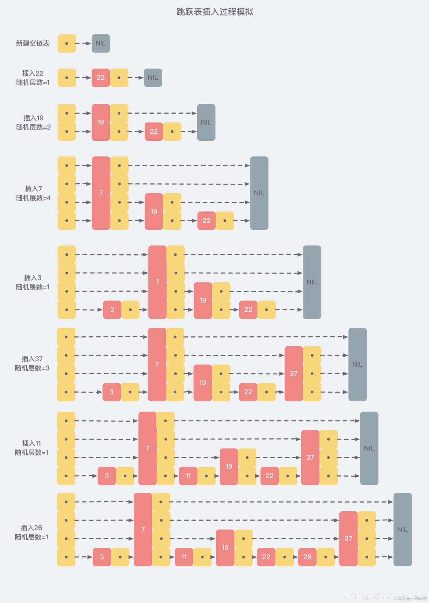

# Redis主要内容汇总

----
## 1 redis server (单机)的运行原理
### 1.1 Redis 基于文件事件的网络通信模型

**Redis 基于 Reactor 模式开发了自己的 网络事件处理器 ： 这个处理器被称为文件事件处理器（file event handler）**
- 文件事件处理器使用 I/O 多路复用（multiplexing）程序来同时监听多个套接字， 并根据套接字目前执行的任务来为套接字关联不同的事件处理器
- 当被监听的套接字准备好执行连接应答（accept）、读取（read）、写入（write）、关闭（close）等操作时， 与操作相对应的文件事件就会产生， 这时文件事件处理器就会调用套接字之前关联好的事件处理器来处理这些事件。

> 虽然文件事件处理器以单线程方式运行， 但通过使用 I/O 多路复用程序来监听多个套接字， 文件事件处理器既实现了高性能的网络通信模型， 又可以很好地与 Redis 服务器中其他同样以单线程方式运行的模块进行对接， 这保持了 Redis 内部单线程设计的简单性。

**文件事件处理器的四个组成部分**
- 套接字
- I/O 多路复用程序
- 文件事件分派器（dispatcher）
- 事件处理器


**处理流程**
- 文件事件是对套接字操作的抽象， 每当一个套接字准备好执行连接应答（accept）、写入、读取、关闭等操作时， 就会产生一个文件事件。 因为一个服务器通常会连接多个套接字， 所以多个文件事件有可能会并发地出现。

- I/O 多路复用程序负责监听多个套接字， 并向文件事件分派器传送那些产生了事件的套接字。

- 尽管多个文件事件可能会并发地出现， `但 I/O 多路复用程序总是会将所有产生事件的套接字都入队到一个队列里面`， 然后通过这个队列， 
以有序（sequentially）、同步（synchronously）、每次一个套接字的方式向文件事件分派器传送套接字： 当上一个套接字产生的事件被处理完毕之后（该套接字为事件所关联的事件处理器执行完毕）， I/O 多路复用程序才会继续向文件事件分派器传送下一个套接字


- 文件事件分派器接收 I/O 多路复用程序传来的套接字， 并根据套接字产生的事件的类型， 调用相应的事件处理器。
- 服务器会为执行不同任务的套接字关联不同的事件处理器， 这些处理器是一个个函数， 它们定义了某个事件发生时， 服务器应该执行的动作。

#### 1.1.1 Redis 多路复用 监听 与 文件事件类型
**多路复用**

socket网络编程
- bio模式
- nio模式

当你手头有大量的客户端来并发访问的时候，server端里就可能会有大量的socket, 处理请求可以多个线程，也可以一个线程
- bio模式下，一个socket连接就对应了一个线程来进行监听他的请求
- nio模式下，可以实现 IO多路复用，一个线程，就可以多路复用去监听多个socket的网络事件（请求发送过来）

**事件的类型**

I/O 多路复用程序可以监听多个套接字的 ae.h/AE_READABLE 事件和 ae.h/AE_WRITABLE 事件， 这两类事件和套接字操作之间的对应关系如下：
- 当套接字变得可读时（客户端对套接字执行 write 操作，或者执行 close 操作）， 或者有新的可应答（acceptable）套接字出现时（客户端对服务器的监听套接字执行 connect 操作）， 套接字产生 AE_READABLE 事件。
- 当套接字变得可写时（客户端对套接字执行 read 操作）， 套接字产生 AE_WRITABLE 事件。

I/O 多路复用程序允许服务器同时监听套接字的 AE_READABLE 事件和 AE_WRITABLE 事件， 如果一个套接字同时产生了这两种事件， 那么文件事件分派器会优先处理 AE_READABLE 事件， 等到 AE_READABLE 事件处理完之后， 才处理 AE_WRITABLE 事件。

> 这也就是说， 如果一个套接字又可读又可写的话， 那么服务器将先读套接字， 后写套接字。

----
### 1.2 Redis串行化单线程模型为什么能高并发
redis高并发，并发能力很强，单机可以抗每秒几千并发是少了说了，机器配置高一些，可能可以抗几万并发，那么究其原因是为什么呢？

#### 1.2.1 首要问题是大量的 redis-client 同时间要跟 redis-server 建立网络连接，负责连接的socket，短时间内会有大量的要建立连接的请求和事件,为什么短时间内 redis-server 可以跟大量的 redis-client 建立连接？
采用 「多路复用的长连接」 接收请求

> 连接的建立，往往来说，性能开销是可控的，短时间内完成大量的连接的建立
> 
> 对于 redis-client 而言，你是短连接还是长连接，建立长连接，短连接模式（频繁的建立和断开连接，这个就不靠谱了），建立的都是长连接，第一次建立连接是要花费一些时间的，后续这个连接就不用重复建立和断开了，就可以复用了
>
> 短时间之内大量的客户端来同时建立连接，这个是没有问题的
#### 1.2.2 大量的 redis-client 在短时间之内，高并发的发送请求过来，redis-server 端的各个 socket 短时间内频繁的出现网络事件（read/write）
全部进行 「队列串行化 + 单线程」 来处理每个请求

> 针对内存里的共享的数据结构，如果说你要是允许多个线程并发的访问共享内存数据结构，会导致频繁的加锁和互斥
> 
> 另外一个多线程，多线程对cpu负载消耗是很大的，如果说cpu负载太高了以后，多线程运转的效率会急转直下的，多线程访问一块共享内存数据结构，大量的加锁和互斥，竞争，会导致性能也是不高的
>
> 而单线程就有效避免多线程切换对cpu负载消耗，避免对内存数据结构大量的加锁和互斥，竞争

#### 1.2.3 那 redis 能否抗高并发，靠的是什么？
靠的是每个请求执行和处理的速度和效率 「基于内存 + 优秀的数据存储结构」

> 假设说你一个请求，如果要耗费10ms，才能处理完毕，此时每秒钟只能处理100个请求，如果说你一个请求只要1ms就可以处理完毕，1000个请求，如果说你一个请求基于纯内存数据结构来操作，而且避免了加锁和互斥之后，低于1ms
> 
> 一秒钟进来了几千个请求，都积压在一个队列里，单个线程拿出一个请求就直接基于内存来操作，低于的1ms，1s之内，单个线程就可以快速的把几千个请求基于内存数据结构全部都处理掉

#### 总结归纳
- 允许短时间建立大量的 socket 长连接， 「多路复用」
- 队列「串行化 + 单线程」 来处理每个请求， 避免上下文切花以及加锁问题
- 「基于内存」的完成处理，加上优秀的「数据结构」

----
### 1.3 Redis内核级请求处理流程与原理
#### 1.3.1 Redis 缓冲区
在Redis中，主要有**三个场景用到了缓冲区**的概念。
- 客户端和服务器端之间进行通信时，用来暂存客户端发送的命令数据，或者是服务器端返回给客户端的数据结果。
- 主从节点间进行数据同步时，Redis使用缓冲区来暂存主节点接收的写命令和数据。
- 在Redis进行AOF持久化的时候Redis为了避免频繁写磁盘同样用到了缓冲区的概念。

这里我们描述的是「客户端缓冲区」，客户端缓冲区又有两个，输入缓冲区和输出缓冲区，都是为了解决「客户端和服务器端的请求发送和处理速度不匹配」所设置的
- 「输入缓冲区」会先暂存客户端发送过来的命令，Redis 主线程从输入缓冲区中读取命令，进行处理。
- 当 Redis 主线程处理完数据后，会把结果写入到「输出缓冲区」，再从输出缓冲区返回给客户端


#### 1.3.2 客户端缓冲区溢出
**「输入缓冲区」溢出**
- 写入了BigKey，如一次性写入了百万级别的哈希或集合数据，超过了缓冲区的大小
- 服务端处理请求的速度过慢导致阻塞，无法及时处理请求，使得客户端发送的请求在缓冲区内越积越多

**「输出缓冲区」溢出**
- 返回BigKey的大量结果
- 执行了某些不合理的命令，如 monitor等
- 缓冲区大小设置不合理，通过设置client-output-buffer-limit来做限制

> 从输入和输出缓冲区常见导致溢出的原因来看，BigKey是最可能导致溢出的原因，因此我们应该尽量避免使用BigKey。对于输入缓冲区，因为没有办法改变其大小(默认每个客户端1G)，我们只能通过控制命令的发送和处理速度入手，尽量避免阻塞。
>
> 对于输出缓冲区则要避免一些返回大量结果的命令的使用如KEYS，MONITOR等，同时可以通过调整输出缓冲区的大小来避免溢出。

----
### 1.4 Redis通信协议与内核级请求数据结构
client 要发送什么样的数据给 server 端，server 端才可以理解我们想要干什么「命令」，不然 client 发送
AFDSfdsfd，而 server 能够解析的是 fdsWEQRWEQ，鸡同鸭讲，所以这里需要「网络协议」，协议是很关键！！！
````
命令 SET key value -> GoRedis.set(key, value) -> 通过协议组织成数据

网络通信的过程，代码里的对象和数据结构，往往需要进行按照协议进行封装和组织，
按照协议进行组织之后，会得到协议数据，

*3\r\n$3\r\nSET\r\n$3\r\nkey\r\n$5\r\nvalue\r\n，（*来打头，证明命令开始，\r\n 作为分隔符，$3 代表命令长度）

按照协议组织的数据，还必须进行序列化，请求数据，从client端发送到server端来，
序列化成字节数据流，byte[]字节数组，然后再去通过socket，
使用网络去传输字节数据流，以字节数据流的格式，传输到server端去

server，通过socket读取出来的一般是字节流，还得把字节流进行反序列化的过程，拿到一个
*3\r\n$3\r\nSET\r\n$3\r\nkey\r\n$5\r\nvalue\r\n
此时会被放入到你的RedisClient的输入缓冲区里

响应结果，跟请求数据，是一样的，都必须按照约定好的协议，去组织你的数据
> set key value
OK

返回
+OK\r\n0
````
这里所有请求过来的 RedisClient 会串成一个「链表」，当客户端请求将命令写入到 RedisClient 的 client-input-buffer 中,
这里有两个关键的部分，分别是「querybuf」和 「argv」，「querybuf」承载的我们发送的命令「字节流」，「argv」承载的是解析后的命令


----
### 1.5 Redis内核中的命令函数查找和执行
- 输入缓冲区根据 「argv」中的命令到 「命令查找表」 中查找对应命令
- 在「命令查找表」中每个命令都对应一个「RedisCommand」，之间存在一个引用关系（指针）
- 查找到具体的「RedisCommand」后就要更新「输入缓冲区」的 「cmd」参数的值（也是指针），这样就可以调用命令函数
- 调用命令函数「RedisCommand」就会根据具体「内存数据结构」来处理请求
- 最终将结果写入到「输出缓冲区」


----
### 1.6 redis-server 结构图


----
## 2 主从模式
### 2.1 主从内核结构图


---
### 2.2 Redis SYNC & PSYNC 复制
#### 2.2.1 Redis SYNC主从复制原理以及缺陷
redis主从复制原理，演进过程，redis 2.x以前的老版本里，SYNC复制, 过程如下


通过「bgsave」「命令缓冲区」「命令传播」三种方式进行数据同步

**缺陷**

slave崩溃了，重启，slave断线重启，会导致每次slave重启，都需要去发送SYNC命令给master，让master按照之前的步骤去把数据同步重新做一遍，每次salve重启都要执行sync，这里开销最大的点在于bgsave操作，是一个极为重量级，耗时的操作
耗时原因来自一下三点（生成/传输/装载）
- 把redis master内存里的大量数据（几个GB，多则几十个GB），执行大量的磁盘IO，非常耗时
- 把这么大的一个文件（几个GB~几十个GB），传输给salve，也非常耗费网络资源，网络带宽，可能都会被打满
- slave收到了RDB之后，几乎会阻塞掉对外部的服务和操作，专门把RDB通过大量的网络磁盘IO，加载到内存里来

#### 2.2.2 PSYNC 的偏移量和复制积压缓冲区分析
redis新版本，增加了PSYNC，主要是针对「断线重连」做了一些优化
> 如果说你断开的时间间隔还比较短的话，那其实就还好，就不需要传输rdb，bgsave，其实只要想办法把你断开这段时间里，
> 做出一些命令变更，传输给slave，slave把这些命令去重新执行一遍就ok了
>
> 如果说你要是断开的时间太长了，几个小时，几天，在这段时间里做出的数据变更太多了，此时就没办法了，
> 还是得走一个老路子，bgsave 生成 rdb 传输，把命令传输过去做一个同步

**PSYNC 实现依靠 「偏移量」+ 「复制积压缓冲区」**



- 如果说导致偏移量差距的这些命令都在复制积压缓冲区里，此时就可以把这些命令传输给从节点，他把这些命令执行一遍，就可以让数据完成同步
- 如果说你要是落后的太多太多了，导致重启的时候，主从之间的数据偏移量差距太大太大了，这些偏移量对应的命令在复制积压缓冲区里找不到了，此时就只能做一个全量的同步，rdb快照传输过去，实现主从数据同步

---
### 2.3 Redis 故障探测和故障转移
````
每个redis节点，slave节点也是一样，都会定时的发送ping消息给所有的其他节点，每个节点都会定时的发送ping消息给其他节点，集群里，是没有controller/leader的概念，大家都是对等的，中心化的一个总控节点，都是通过集群里各个节点互相之间进行探测和通信实现集群的功能

每个人尝试去探测其他节点，是否还存活，定时发送ping，如果说人家是存活的，pong，ping-pong，ping-pong，探测的消息来回，两个slave节点，发送出去的ping消息，并没有在指定的时间范围内，收到pong

此时，每个slave节点，都会把这个master标记为，pfail，疑似下线

各个节点之间会把疑似下线的情报，发送给其他的节点，去跟其他节点进行信息交换

每个节点在汇总针对某个节点的下线报告的时候，都会去判断一下，如果说超过了集群里一半的节点，都认为某个节点下线了，mater+2个slave，一共是3个节点，3/2+1 = 2，只要有2个节点，包括你自己，认为他下线了，此时就可以标记为正式下线

必须要把正式标记fail的状态同步给其他的节点

对于任何一个节点，无论是master，还是slave，关于他的故障探测，都是这套机制：每个节点都定时ping其他节点 + 一段时间没收到pong + 标记pfail + pfail交换给其他所有节点 + 汇总fail report + 过半节点数量都认为pfail + 标记fail以及同步给其他所有节点，这个时候下线的节点正式死亡

对于这个master节点，如果说他挂掉的话，他的slave节点肯定会感知到他的fail下线的状态，一旦说slave节点感知到自己的master节点故障下线了，slave节点会尝试开始进行master选举

每个slave节点，都会发送投票请求给其他的一些master，请求master给自己投一票，这个时候，其他master如果说要是还没有给任何人投过票，此时就可以给这个slave投出一票，看你的各个salve谁的投票请求先过来

收票的时候，如果说发现自己得到了n节点/2+1大多数人的投票，此时就可以把自己选举为一个新的master

他就会去通知所有的节点，之前下线的master，他负责的槽位slots都归自己管了，所有人都会更新自己内存里的数据结构，之前的其他的salve，此时就会开始从新的master那里去同步数据

如果一轮投票里没人收到n/2+1大多数人的投票，此时开启下一轮投票就可以了
````

### 2.4 主从结构


----
## 3 集群模式
Redis 集群实现了对Redis的水平扩容，即启动N个redis节点，将整个数据库分布存储在这N个节点中，每个节点存储总数据的1/N。

Redis 集群通过分区（partition）来提供一定程度的可用性（availability）： 即使集群中有一部分节点失效或者无法进行通讯， 集群也可以继续处理命令请求

Redis 集群每个 Server 作为一个独立节点

---
### 3.1 Redis节点之间的三次握手原理分析
三次握手协议，是redis自己协议，跟TCP网络连接的三次握手还不是一个概念，TCP三次握手是用来建立基础的底层网络连接，
redis这个是他的应用层面的三次握手，是用来作为集群里的各个节点进行连接

首先肯定会以一台redis节点作为基础，告诉他有另外一个redis节点
- 第一步就是 redis1 给要连接的其他节点（redis2, redis3...）在内存里创建一个 ClusterNode 数据结构，将要待通信的 redis2 数据加入 ClusterNode
- 第二步，redis1 就是发送一个「meet」消息，对方（redis2）会在内存里也创建一个 ClusterNode 数据结构, 将 redis1 数据加入 ClusterNode
- redis2 回复 redis1 一个 「pong」消息
- redis1 收到「pong」消息后， 回复一个「ping」消息

启动和部署一个集群，实施一些命令，肯定会在一个node上去执行的，对于你的一个node通过你的命令一般来说都可以感知到其他的node，[Gossip协议](https://wenku.baidu.com/view/7735ad0b4873f242336c1eb91a37f111f1850d3a.html) 
「流言协议」 就是说把一个信息像散播流言一下，散播给集群里他能感知到的其他所有的节点，这个类似于流言传播，刚刚建立连接的node信息，传播给其他的节点就可以了

---
### 3.2 Redis 集群 slots 分配与内核数据结构
**数据分片的概念**
> 各个节点里有一个数据分片的概念了，每个节点包含n个数据分片，在写入数据的时候，我们可以通过一定的路由算法，把每条数据写入到一个节点的 1个 数据分片里去(随机分配、轮询分配...)
>
>数据分片 -> slots，槽位的概念，所有的数据分片是固定的数量的，16384 个 slots，我们就需要给集群的各个节点分配他们负责的 slots 槽位，
>每个节点会负责一部分的 slots 槽位，每个 slot 槽位就是一个数据分片

**槽位分配与记录**

槽位在 3.2 之前需要通过命令手动进行分配，之后的版本可以通过命令进行快速分配，在分配完 slots 后，在 ClusterNode 数据结构
会通过 「slots」 和 「numslots」来记录「当前节点槽位的位置以及数量信息」

一个节点分配好了槽位之后，会把自己负责的槽位信息同步给其他的所有节点，当槽位完成分配后，ClusterNode 中的 state 就会处于一个可用状态


**在 redis-cluster 中有一个很重要的概念 「去中心化」**
> redis-master，他都是属于对等的，大家干的活儿，做的事情，都是一样的，避免了说可能还要去选举一个 controller、leader来管控整个集群

---
### 3.3 基于跳跃表的 slots 和 key 关联
**slots槽位的命令执行流程分析**
>key-value 一定是属于一个 slot，slot 一定是属于一个节点，按说应该是找到那个节点，去执行这个命令，客户端随意找一个节点，发送命令过去就可以了，
那个节点内部会计算一下这个key是属于哪个 slot
>
> CRC算法（key）-> 值 -> 16384做一个运算，得到的是一个 0~16384 范围内的一个数字，代表了这个 key 对应的 slot

**数据和槽位的关联**
在集群模式下，所有的数据都是被划分到 16384 个数据槽位里去的，16384 个数据槽位就等于 16384 个数据分片，
每个槽位里都有一部分的数据，客户端发送命令的时候，确实在server端也会去计算key所属的槽位，可以把数据放在槽位里，数据就属于这个槽位数据分片的一份子了

那么数据是如何与槽位进行绑定的呢？

> 每次操作完 key-value 数据之后，对于这个key，他会通过专门的 skipList「跳跃表」数据结构，跟我们的slot做一个关联


````
跳跃表:

跳跃表在 Redis 当中的应用只出现在两个地方
- zset 的底层实现
- 集群节点中用作内部数据结构。

跳跃表(skiplist)是一种有序数据结构，是为了弥补链表在查询时的 O(n) 时间复杂度而设计的，它通过在每个节点
中维持多个指向其他节点的指针，从而达到快速访问节点的目的。跳跃表支持平均 O(logN)、最坏 O(N）时间复杂
度的节点查找，还可以通过顺序性操作来批量处理节点。在大部分情况下，跳跃表的效率可以和平衡树相媲美。

Redis 使用跳跃表作为有序集合键的底层实现之一，如果一个有序集合包含的元素比较多，又或者有序集合中元
素的成员(member)是比较长的字符串时，Redis 就会使用跳跃表来作为有序集合键的底层实现。有序集合的另一
种实现方式是压缩列表。

----------------------------------------- 源码 ------------------------------------------------
typedef struct zskiplistNode {
    //层，可以包含多个元素，每个元素都包含一个指向其他节点的指针，程序可以通过这些层来加快
    //访问其他节点的速度，每次创建一个新跳跃表节点的时候，
    //程序都会根据幂次定律(power law，越大的数出现的概率越小）
    //随机生成一个介于 1 和 32 之间的值作为 Level 数组的大小，这个大小就是层的"高度"
    struct ZskiplistLevel {
        // 前进指针，每个层都有一个指向表尾方向的前进指针(Level[i].forward 属性）
        // 用于从表头向表尾方向访问节点
        struct zskiplistNode *forward;
        
        // 跨度，用于记录两个节点之间的距离，指向 NULL 的所有前进指针的跨度都为 0，因为
        // 它们没有连向任何节点
        uns igned int span;
    } Level[];
    
    
    // 后退指针，用于从表尾向表头方向访问节点，跟可以一次跳过多个节点的前进指针不同，因为每个
    //节点只有一个后退指针，所以每次只能后退至前一个节点
    struct zskiplistNode *backward;
    
    // 分值，所有节点按分值从小到大来排序
    double score;
    
    // 成员对象，指向一个字符串对象，这个对象保存着一个 SDS 值，同一个跳跃表中成员对象必须唯一
    // 但分值可以相同，分值相同的情况下将按照成员对象的字典序进行从小到大的排序。
    robj *obj;
} zskiplistNode;
````




----
### 3.4 集群结构


