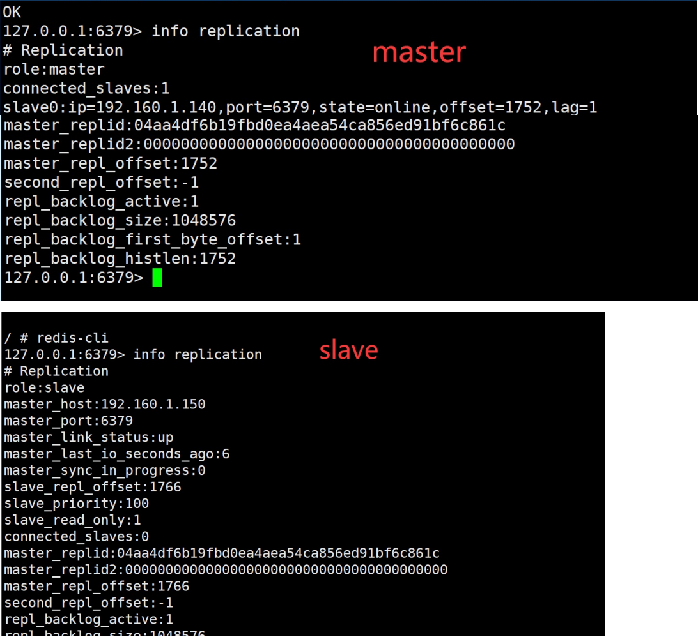
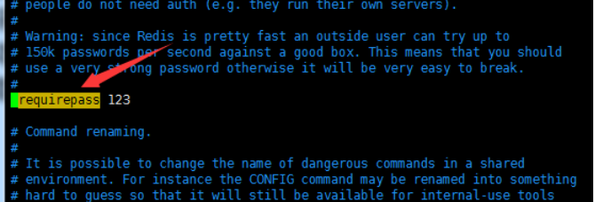
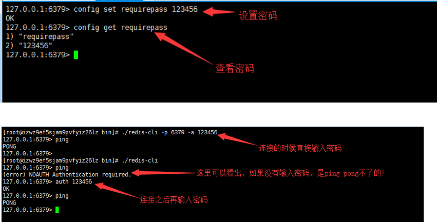
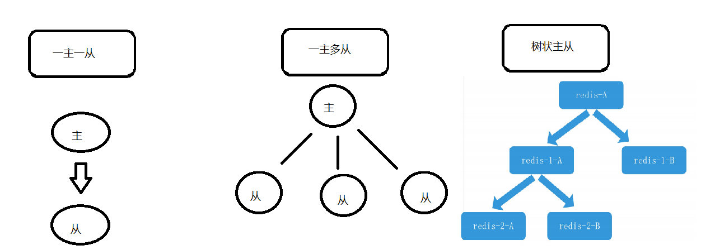
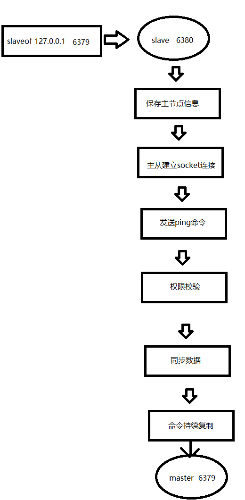
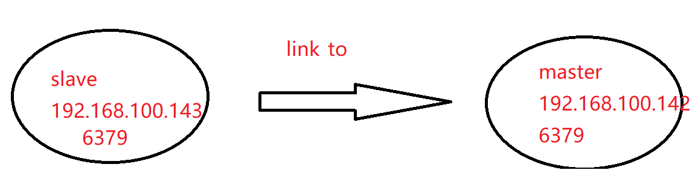
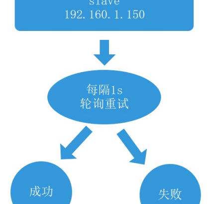
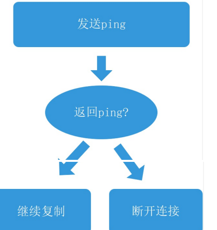
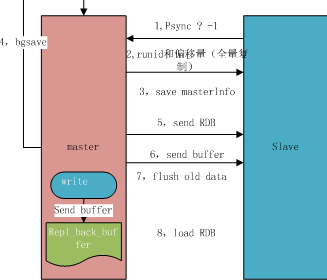
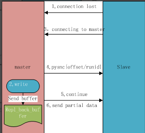

# redis主从详解及相关问题解决
## 主从配置

>一定先修改配置文件中的 ``bind 0.0.0.0`` 和 ``protected-mode no``

- redis对于主从复制有三种方式
>1. 在配置文件中加入 slaveof {masterHost} {masterPort} 随redis启动生效,5.0之后更换了名字
``replicaof <masterip> <masterport> 作用相同``,配置从节点的redis.conf ``slaveof 192.160.1.150 6379``
>
>2. 在redis-server启动命令后输入:``slaveof {masterHost} {masterPort} ``生效 
>
>3. 直接使用命令(客户端)：客户端启动后,直接使用命令, slaveof {masterHost} {masterPort}
>
>4. 使用``slaveof no one``取消主从

- 在成功建立主从连接之后我们可以通过 info replication 命令查看复制相关状态



- redis如何设置密码
> 1.配置文件—redis.conf文件，然后修改里面的requirepass 



>2.不需要重启redis服务的密码设置方式,连接redis之后，通过命令设置，如下:``config set requirepass 123456``,设置之后，可通过以下指令查看密码:``config get requirepass``



````
注意： 
1. 安全： 
    对于数据比较重要的节点，主节点会通过设置requirepass参数进行密码验证，这时所有的客户端访问必须使用auth 命令实行验证。从节点与主节点的复制链接是通 过一个特殊标识的客户端来完成，
因此需要配置从节点的masterauth参数与主节点密码保持一致，这样从节点才可以正确地链接到主节点并发起复制流程 
2. 从节点只读 
    默认情况下    slave-read-only=yes    配置为制度。由于复制只能从主节点到从节点，对于从节点的任何修改主节点都无法感知，修改从节点会造成主从数据不一 致。因此没必要就不要动这个配置。 
3. 网络延迟问题 
    主从节点一般部署在不同机器上，复制时的网络延迟就成为需要考虑的问题，Redis 为我们提供了repl-disable-tcp-nodelay参数用于控制是否关闭TCP NODELAY,默 认关闭，说明如下:
        * 当关闭时，主节点产生的命令数据无论大小都会及时地发送给从节点，这样主从之间延迟会变小，但增加了网络带宽的消耗。适用于主从之间的网络环境 良好的场景，如同机架或同机房部署。 
        * 当开启时，主节点会合并较小的TCP数据包从而节省带宽。默认发送时间间隔取决于Linux的内核，- -般默认为40毫秒。这种配置节省了带宽
但增大主从 之间的延迟。适用于主从网络环境复杂或带宽紧张的场景，如跨机房部署。

注意： 运提部署主从节点时需要考虑网络延迟、带宽使用率、防灾级别等因素，如要求低延迟时，建议同机架或同机房部署并关闭repl-disable-tcp-nodelay;如果考 虑高容灾性，可以
同城跨机房部署并开启repl-disable-tcp-nodelay.
````
----
## redis复制连接过程

- 主从常见的几种结构



- 配置文件中开启下日志,方便查看过程: ``logfile "/usr/local/redis/log/redis.log" ``

- 后台运行设置 , 配置文件中 ``daemonize yes``

### 复制过程 



- 1.保存主节点(master)
>执行slaveof后从节点只保存主节点的地址信息便直接返回，这时建立复制流程还没有开始，在从节点6350执行 info replication 可以看到如下信息:
````
master_host:192.160.1.50 
master_port:6379 
master_link_status:up
````
>从节点保存主节点的ip:port，状态是上线状态。我们也可以参考redis的日志查看到复制信息：
````
114:S 28 Apr 2020 18:57:33.459 * Connecting to MASTER 192.160.1.150:6379 
114:S 28 Apr 2020 18:57:33.460 * MASTER <-> REPLICA sync started 
114:S 28 Apr 2020 18:57:33.460 * Non blocking connect for SYNC fired the event. 
114:S 28 Apr 2020 18:57:33.460 * Master replied to PING, replication can continue... 
114:S 28 Apr 2020 18:57:33.461 * Trying a partial resynchronization (request 04aa4df6b19fbd0ea4aea54ca856ed91bf6c861c:17027). 
114:S 28 Apr 2020 18:57:33.464 * Full resync from master: 0deae7db14cf069bf86408b8abecedf08952c0a8:0 
114:S 28 Apr 2020 18:57:33.464 * Discarding previously cached master state. 
114:S 28 Apr 2020 18:57:33.537 * MASTER <-> REPLICA sync: receiving 210 bytes from master 114:S 28 Apr 2020 18:57:33.537 * MASTER <-> REPLICA sync: Flushing old data 
114:S 28 Apr 2020 18:57:33.537 * MASTER <-> REPLICA sync: Loading DB in memory 
114:S 28 Apr 2020 18:57:33.537 * MASTER <-> REPLICA sync: Finished with success 
114:S 28 Apr 2020 18:58:31.326 * REPLICAOF would result into synchronization with the master we are already connected with. No operation performed.
````
- 2.从节点(slave) 内部通过每秒运行的定时任务维护复制相关逻辑，当定时任务发现存在新的主节点后，会尝试与该节点建立网络连接



>从节点会建立一个 socket 套接字，从节点建立了一个端口为 51234 的套接字，专门用于接受主节点发送的复制命令。从节点连接成功后打印如下日志
>
>如果从节点无法建立连接，定时任务会无限重试直到连接成功或者执行 slaveof no one 取消复制
>
>关于连接失败，可以在从节点执行 info replication 查看 master_link_down_since_seconds 指标，它会记录与主节点连接失败的系统时间。从节点连接主 节点失败 时也会每秒打印如下日志，方便发现问题：``Error condition on socket for SYNC: {socket_error_reason}``

- 3.发送 ping 命令
>连接建立成功后从节点发送 ping 请求进行首次通信， ping 请求主要目的如下
````
* 检测主从之间网络套接字是否可用。
* 检测主节点当前是否可接受处理命令。
````
>如果发送 ping 命令后，从节点没有收到主节点的 pong 回复或者超时，比如网络超时或者主节点正在阻塞无法响应命令，从节点会断开复制连接，下次 定时任务 会发起重连





>从节点发送的ping命令成功返回，Redis 打印如下日志，并继续后续复制流程:``从节点发送的ping命令成功返回，Redis 打印如下日志，并继续后续复制流程``

- 4.权限验证
>如果主节点设置了 requirepass 参数，则需要密码验证，从节点必须配置 masterauth 参数保证与主节点相同的密码才能通过验证；如果验证失败复制将终 止，从 节点重新发起复制流程。

- 5.同步数据集
>主从复制连接正常通信后，对于首次建立复制的场景，主节点会把持有的数据全部发送给从节点，这部分操作是耗时最长的步骤。

- 6.命令持续复制
>当主节点把当前的数据同步给从节点后，便完成了复制的建立流程。接下来主节点会持续地把写命令发送给从节点，保证主从数据一致性。 注意 主从在同步的过程当中，会把原本的从节点的数据清空

### 复制基础概念

#### 复制偏移量
>参与复制的主从节点都会维护自身复制偏移量。主节点（master）在处理完写入命令后，会把命令的字节长度做累加记录，统计信息在 info relication 中的 master_repl_offset 指标中：
````
主:
127.0.0.1:6379> info replication
# Replication role:master ... 
master_repl_offset:6104

从:
# Replication role:master 
connected_slaves:1 
slave0:ip=192.160.1.140,port=6379,state=online,offset=6104,lag=1

从节点在接收到主节点发送的命令后，也会累加记录自身的偏移量。统计信息在 info relication 中的 slave_repl_offset 中
````
####  复制积压缓冲区
>复制积压缓冲区是保存在主节点上的一个固定长度的队列，默认大小为1MB，当主节点有连接的从节点（slave）时被创建，这时主节点（master）响应写命令 时，不但会把命令发送给从节点，还会写入复制积压缓冲区,在命令传播阶段，主节点除了将写命令发送给从节点，还会发送一份给复制积压缓冲区，作为写命令的备份；除了存储写命令，复制积压缓冲区中还存储了其中 的每个字节对应的复制偏移量(offset) 。由于复制积压缓冲区定长且先进先出，所以它保存的是主节点最近执行的写命令；时间较早的写命令会被挤出缓冲区()。

#### 主节点运行ID
>每个Redis节点启动后都会动态分配一个40位的十六进制字符串作为运行ID。运行ID的主要作用是用来唯一识别 Redis节点，比如从节点保存主节点的运行ID识别自 己正在复制的是哪个主节点。如果只使用ip+port的方式识别主节点，那么主节点重启变更了整体数据集(如替换RDB/AOF文件)，从节点再基于偏移量复制数据将是 不安全的，因此当运行ID变化后从节点将做全量复制。可以运行info server命令查看当前节点的运行ID:

````
127.0.0.1:6379> info server 
# Server redis_version:5.0.7 ...
 run_id:868a5d49a276620b9f79788a1c894f07bd872f56
````
>需要注意的是Redis关闭再启动，运行的id会随之变化

----
### 全量复制与部分复制

#### 全量复制过程
>用于初次复制或其它无法进行部分复制的情况，将主节点中的所有数据都发送给从节点，是一个非常重型的操作，当数据量较大时，会对主从节点和网络造 成很 大的开销



````
流程说明 
1. 发送psync命令(用于复制功能(replication)的内部命令。)进行数据同步，由于是第一次进行复制，从节点没有复制偏移量和主节点的运行id，所以发送psync ? -1 

2. 主节点根据psync ? -1解析出当前为全量复制，回复+FULLRESYNC响应(主机会向从机发送 runid 和 offset，因为 slave 并没有对应的 offset，所以是全量复制) 

3. 从节点接收主节点的响应数据保存运行ID和偏移量offset(从机 slave 会保存 主机master 的基本信息 save masterInfo) 

4. 主节点收到全量复制的命令后，执行bgsave（异步执行），在后台生成RDB文件（快照），并使用一个缓冲区（称为复制缓冲区）记录从现在开始执行 的所 有写命令 

5. 主节点发送RDB文件给从节点，从节点把接收到的RDB文件保存在本地并直接作为从节点的数据文件，接收完RDB后从节点打印相关日志，可以在日志中查看 主节点发送的数据量
    (主机send RDB 发送 RDB 文件给从机)
MASTER <-> REPLICA sync: Flushing old data

注意！对于数据量较大的主节点，比如生成的RDB文件超过6GB以上时要格外小心。传输文件这一步操作非常耗时，速度取决于主从节点之间网络带宽，通过 细致分析Full resync和MASTER <-> SLAVE这两行日志的时间差，
可以算出RDB文件从创建到传输完毕消耗的总时间。

如果总时间超过repl-timeout所配置的值 (默认60秒)，从节点将放弃接受RDB文件并清理已经下载的临时文件，导致全量复制失败;针对数据量较大的节点，建议调大repl-timeout参数防止出现全量同步 数据超时; 
例如对于千兆网卡的机器，网卡带宽理论峰值大约每秒传输100MB,在不考虑其他进程消耗带宽的情况下，
6GB的RDB文件至少需要60秒传输时间，默认配置 下，极易出现主从数同步超时。

6. 对于从节点开始接收RDB快照到接收完成期间，主节点仍然响应读写命令，因此主节点会把这期间写命令数据保存在复制客户端缓冲区内，当从节点加载完 RDB文件后，主节点再把缓冲区内的数据发送给从节点，
保证主从之间数据致性。(发送缓冲区数据) 

7. 从节点接收顽主节点传送来的全部数据后会清空自身旧数据(刷新旧的数据，从节点在载入主节点的数据之前要先将老数据清除) 

8. 从节点清空数据后开始加载RDB文件，对于较大的RDB文件，这一步操作依然比较消耗时间，可以通过计算日志之间的实际差来判断加载RDB的总消耗时间(加 载 RDB 文件将数据库状态更新至主节点执行bgsave时的数据库状态和缓冲区数据的加载。)

9. 从节点成功加载完RDB后，如果当前节点开启了AOF持久化的功能，它会立刻做bgrewriteeaof的操作，为了保证全量复制后AOF持久化文件立刻可用。 
通过分析全量复制的所有流程，全量制是一个非常耗时费力的操作。他的实际开销主要包括：
        主节点bgsave时间 RDB文件网络传输时间。 
        从节点清空数据时间 
        从节点加载RDB的时间 
        可能的AOF重写时间
````

#### 部分复制过程
>用于处理在主从复制中因网络闪断等原因造成的数据丢失场景，当从节点再次连上主节点后，如果（条件允许)，主节点会补发丢失数据给从节点。 因为补 发的数据远远小于全量数据，可以有效避免全量复制的过高开销，需要注意的是，如果网络中断时间过长，造成主节点没有能够完整地保存中断期间执行 的写命令，则无法进行部分复制，仍使用全量复制
>
>部分复制是 Redis 2.8 以后出现的，之所以要加入部分复制，是因为全量复制会产生很多问题，比如像上面的时间开销大、无法隔离等问题， Redis 希望能够在 master 出现抖动（相当于断开连接）的时候，可以有一些机制将复制的损失降低到最低

````
1. 当主从节点之间网络出现中断时，如果超过repl-timeout时间，主节点会认为从节点出问题了并断开复制链接(如果网络抖动（连接断开 connection lost）) 
2. 主从连接中断期间主节点依然响应命令，但因复制链接中断命令无法发送给从节点不过主节点内部存在的复制积压缓存去，依然可以保存一段时间的写命令数 据，默认最大缓存1MB(主机master 还是会写 replbackbuffer（复制缓冲区）) 
3. 当主从节点网络恢复后，从节点会再次连上主节点。(从机slave 会继续尝试连接主机) 
4. 当主从连接恢复后，由于从节点之前保存了自身已复制的偏移量和主节点的运行id。因此会把他们当作psync参数发送给主节点，要求进行部分复制操作。(从 机slave 会把自己当前 runid 和偏移量传输给主机 master，并且执行 pysnc 命令同步) 
5. 主节点接到psync命令后首先核对参数的runid，如果 master 发现你的偏移量是在缓冲区的范围内，根据参数offset在缓冲区查找复制内内，如果在偏移量之后 的数据存在缓存区中，则对从节点发送continue表示可以进行部分复制 
6. 主节点根据偏移量把复制积压缓冲区里的数据发送给从节点，保证主从复制进入正常状态。(同步了 offset 的部分数据，所以部分复制的基础就是偏移量 offset)
````



--- 

## redis 读写分离

````
这里准备一主两从:

主备的网络为redis:
docker network create --subnet 172.10.0.1/16 redis // 创建网关

docker run -itd -v /redis/master:/redis -p 6379:6379  --network=redis  --ip=172.10.0.2 --name redis_m redis/redis:5 sh

docker run -itd -v /redis/slave1:/redis -p 6380:6379  --network=redis  --ip=172.10.0.3 --name redis_s1 redis/redis:5 sh 

docker run -itd -v /redis/slave2:/redis -p 6381:6379 --network=redis --ip=172.10.0.4  --name redis_s2 redis/redis:5 sh

````
- 代码部分
````
config.php:

$config = [
     'is_ms' => true,
    'master' => [
        'host' => '172.10.0.2',
        'post' => '6379'
    ]
    ,
    'slaves'  =>[
        'slave1' => [
            'host' => '172.18.0.3',
            'post' => '6379'
        ],
        'slave2' => [
            'host' => '172.18.0.4',
            'post' => '6379'
        ]
    ]
];
````
````
redis.php:

<?php
/**
 * Create By: Will Yin
 * Date: 2020/5/2
 * Time: 15:43
 **/
//$redis = new Redis();
//$redis->connect('172.10.0.2', 6379);
//var_dump($redis->get('name'));

class RedisMS{
    protected $config;
    //记录连接
    protected $connections;
    //各种方法,自行添加
    protected  $call = [
                    'write' => ['set', 'lpush'],
                    'read' => ['get', 'mget']
                    ];
    public function __construct($config)
    {
        $this->config = $config;
        if ($config['is_ms']){
            //主节点连接
            $this->connections['master'] = $this->getRedis($config['master']['host'],$config['master']['port']);
        }
        //从节点连接
        if($config['slaves']){
            $this->createSlave($config['slaves']);
        }


    }

    //从节点有多个,我们随机遍历连接
    private function createSlave($slaves){
      //用于做负载的时候选择从节点对象
        $index = 1;
          foreach ($slaves as $k => $slave){
              $this->connections['slave'][$index] = $this->getRedis($slave['host'],$slave['port']);
                  $index ++;
          }
}
        //连接redis
       private function getRedis($host,$port){
            $redis = new Redis();
            $redis->connect($host,$port);
            return $redis;
       }
//------------------------获取主连接方法----------------------------------------------------------
    public function getMaster()
    {
       return $this-> connections['master'];
  }

    public function getSlaves()
    {
        return $this-> connections['slaves'];
  }
    public function oneSlave()
    {
        $slaves = $this->getSlaves();
        //对于所有从节点,使用了负载均衡,这里用了随机数
        $i = mt_rand(1,count($slaves));
        return $this-> connections['slaves'][$i];
  }
  //----------------执行命令--------------------------------------------------------
    public function runCall($command,$params=[])
    {
        try {
            if($this->config['is_ms']){
              $redis = $this->getRedisCall($command);
              //动态传参
                return $redis->{$command}(...$params);
             // return $redis->{$command}(...$params);
            }
        }catch (Exception $e){

        }
    }
    protected function  getRedisCall($command){

        if(in_array($command,$this->call['write'])){
            //return $this->oneSlave();
            return $this->getMaster();
        } else if(in_array($command,$this->call['read'])){

            return $this->getMaster();
        }else {
            throw new Exception('不支持');
        }

    }
}

````
````
index.php

<?php
/**
 * Create By: Will Yin
 * Date: 2020/5/2
 * Time: 17:27
 **/
require_once "./config.php";
require_once "./redis.php";

$redis = new RedisMS($config);

$res = $redis->runCall("get",'name');
var_dump($res);
//测试连接
//var_dump(
//    [
//        'master' => $redis->getMaster(),
 //         'slave' =>$redis->oneSlave()
//    ]
//);

````


