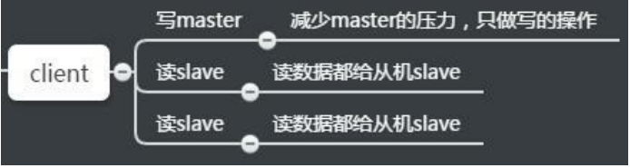
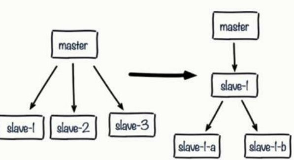
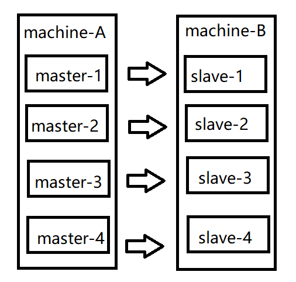
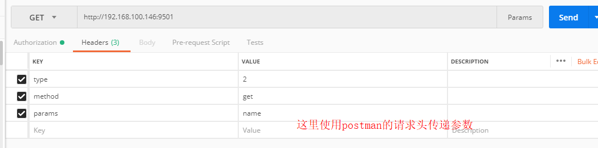
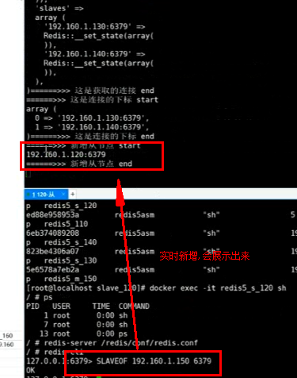
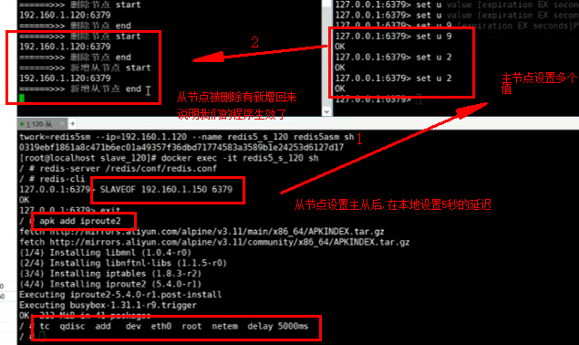

# Redis主从复制相关问题及Redis持久化机制详解

## 1.主从复制的常用相关配置(配置文件)
- slaveof <masterip> <masterport>
>slave实例需要配置该项，指向master的（ip, port）。
- masterauth <master-password>
>如果master实例启用了密码保护，则该配置项需填master的启动密码；若master未启用密码，该配置项需要注释掉
- slave-serve-stale-data
>指定 slave 与 master 连接中断时的动作。默认为yes，表明slave会继续应答来自client的请求，但这些数据可能已经过期（因为连接中断导致无法从 master 同步）。 若配置为no，则slave除正常应答"INFO"和"SLAVEOF"命令外，其余来自客户端的请求命令均会得到" SYNC with master in progress "的应答，直到该 slave 与 master 的连接重建成功或该 slave 被提升为 master 。
- slave-read-only
>指定slave是否只读，默认为yes。若配置为no，这表示slave是可写的，但写的内容在主从同步完成后会被删掉.
- repl-disable-tcp-nodelay
>指定向slave同步数据时，是否禁用 socket 的 NO_DELAY 选项。若配置为yes，则禁用 NO_DELAY ，则TCP协议栈会合并小包统一发送，这样可以减少主从节点 间的包数量并节省带宽，但会增加数据同步到slave的时间。 若配置为no，表明启用 NO_DELAY ，则TCP协议栈不会延迟小包的发送时机，这样数据同步的延时会减少，但需要更大的带宽。通常情况下，应该配置为no以降 低同步延时，但在主从节点间网络负载已经很高的情况下，可以配置为yes。
- slave-priority
>指定 slave 的优先级。在不只1个 slave 存在的部署环境下，当 master 宕机时， Redis Sentinel 会将priority值最小的slave提升为master。需要注意的是，若 该配置项为0，则对应的slave永远不会被 Redis Sentinel 自动提升为 master 。

---
## 2.主从复制进阶常见问题解决
1、读写分离 

2、数据延迟 

3、主从配置不一致
 
4、规避全量复制 

5、规避复制风暴

### 2.1读写分离
>读流量分摊到从节点。这是个非常好的特性，如果一个业务只需要读数据，那么我们只需要连一台 slave 从机读数据。



>虽然读写有优势，能够让读这部分分配给各个 slave 从机，如果不够，直接加 slave 机器就好了。但是也会出现以下问题。

### 2.2复制数据延迟。
>可能会出现 slave 延迟导致读写不一致等问题，当然你也可以使用监控偏移量 offset ，如果 offset 超出范围就切换到 master 上,逻辑切换，而具体延迟多少，可以通过 info replication 的 offset 指标进行排查。

对于无法容忍大量延迟场景，可以编写外部监控程序监听主从节点的复制偏移量，当延迟较大时触发报警或者通知客户端避免读取延迟过高的从节点 同时从节点的 slave-serve-stale-data 参数也与此有关，它控制这种情况下从节点的表现 当从库同主机失去连接或者复制正在进行，从机库有两种运行方式：
````
1)如果slave-serve-stale-data设置为yes(默认设置),从库会继续响应客户端的请求.
2)如果slave-serve-stale-data设置为no,slave除正常应答"INFO"和"SLAVEOF"命令外，其余来自客户端的请求命令均会得到" SYNC with master in progress "的应答
````
### 2.3异步复制导致数据丢失
因为master->slave的复制是异步，所以可能有部分还没来得及复制到slave就宕机了，此时这些部分数据就丢失了.(只能降低到可控范围,没办法做到100%不丢失)
````
#最少有多少台从机器才能写入 
min-slaves-to-write 1 
#从节点最大延迟时间,延迟小于min-slaves-max-lag秒的slave才认为是健康的slave 
min-slaves-max-lag 10
````
要求至少有1个slave，数据复制和同步的延迟不能超过10秒 如果说一旦所有的slave，数据复制和同步的延迟都超过了10秒钟，那么这个时候，master就不会再接收任何请求了 有了min-slaves-max-lag这个配置，就可以确保说，一旦slave复制数据和[ack](https://blog.csdn.net/qq_29066329/article/details/97172805)延时太长，就认为可能master宕机后损失的数据太多了，那么就拒绝写请求，这样可 以把master宕机时由于部分数据未同步到slave导致的数据丢失降低到可控范围内
- #### 如何选择，要不要读写分离？
>没有最合适的方案，只有最合适的场景，读写分离需要业务可以容忍一定程度的数据不一致，适合读多写少的业务场景，读写分离，是为了什么，主要是因 为要建立一主多从的架构，才能横向任意扩展 slave node 去支撑更大的读吞吐量。

### 2.4从节点故障问题
对于从节点的故障问题，需要在客户端维护一个可用从节点可用列表，当从节 点故障时，立刻切换到其他从节点或主节点，需要redis Cluster(请关注后期跟新)

### 2.5配置不一致
>主机和从机不同，经常导致主机和从机的配置不同，并带来问题
#### 数据丢失： 主机和从机有时候会发生配置不一致的情况，例如 [maxmemory](https://blog.csdn.net/codetomylaw/article/details/50017633) 不一致，如果主机配置 maxmemory 为8G，从机 slave 设置为4G，[这个时候是可以用的，而且还不会报错]()。 但是如果要做高可用，让从节点变成主节点的时候，就会发现数据已经丢失了，而且无法挽回。

### 2.6规避全量复制
全量复制指的是当 slave 从机断掉并重启后，[runid](https://www.jianshu.com/p/54dabc470eb6) 产生变化而导致需要在 master 主机里拷贝全部数据。这种拷贝全部数据的过程非常耗资源。 全量复制是不可避免的，例如第一次的全量复制是不可避免的，这时我们需要选择小主节点，且 maxmemory 值不要过大，这样就会比较快。同时选择在低峰值 的时候做全量复制。
#### 造成全量复制的原因
- 是主从机的运行 runid 不匹配。解释一下，主节点如果重启， runid 将会发生变化。如果从节点监控到 runid 不是同一个，它就会认为你的节点不安全。 当发生故障转移的时候，如果主节点发生故障，那么从机就会变成主节点。我们会在后面讲解哨兵和集群。
-  复制缓冲区空间不足，比如默认值1M，可以部分复制。但如果缓存区不够大的话，首先需要网络中断，部分复制就无法满足。其次需要增大复制缓冲区配 置（relbacklogsize），对网络的缓冲增强。参考之前的说明。
#### 解决全量复制的方法
>在一些场景下，可能希望对主节点进行重启，例如主节点内存碎片率过高，或者希望调整一些只能在启动时调整的参数。如果使用普通的手段重启主节点，会使 得runid发生变化，可能导致不必要的全量复制。 
>
>为了解决这个问题，Redis提供了debug reload的重启方式：重启后，主节点的runid和offset都不受影响，避免了全量复制

### 2.7单机器的复制风暴
- #### 当一个主机下面挂了很多个 slave 从机的时候，主机 master 挂了，这时 master 主机重启后，因为 runid 发生了变化，所有的 slave 从机都要做一次全 量复制。这将引起单节点和单机器的复制风暴，开销会非常大。

解决：
>可以采用树状结构降低多个从节点对主节点的消耗
>
>从节点采用树状树非常有用，网络开销交给位于中间层的从节点，而不必消耗顶层的主节点。但是这种树状结构也带来了运维的复杂性，增加了手动和自动 处理故障转移的难度



- #### 由于 Redis 的单线程架构，通常单台机器会部署多个 Redis 实例。当一台机器（machine）上同时部署多个主节点 （master） 时，如果每个 master 主 机只有一台 slave 从机，那么当机器宕机以后，会产生大量全量复制。这种情况是非常危险的情况，带宽马上会被占用，会导致不可用。



解决:
>应该把主节点尽量分散在多台机器上，避免在单台机器上部署过多的主节点
>
>当主节点所在机器故障后提供故障转移机制，避免机器恢复后进行密集的全量复制

---
## 主从配置参数参考
````
###########从库############## 
#设置该数据库为其他数据库的从数据库 
slaveof <masterip> <masterport> 

#主从复制中，设置连接master服务器的密码（前提master启用了认证）,
#主节点配置方式: 
#    requirepass  "admin.123" //设置redis登录密码 
#    masterauth  "admin.123" 　//主从认证密码，否则主从不能同步 
masterauth <master-password> 


slave-serve-stale-data yes 
# 当从库同主库失去连接或者复制正在进行，从库有两种运行方式： 
# 1) 如果slave-serve-stale-data设置为yes(默认设置)，从库会继续相应客户端的请求 
# 2) 如果slave-serve-stale-data设置为no，除了INFO和SLAVOF命令之外的任何请求都会返回一个错误"SYNC with master in progress" 


#当主库发生宕机时候，哨兵会选择优先级最高的一个称为主库，从库优先级配置默认100，数值越小优先级越高 slave-priority 100 


#从节点是否只读；默认yes只读，为了保持数据一致性，应保持默认 
slave-read-only yes 


########主库配置############## 
#在slave和master同步后（发送psync/sync），后续的同步是否设置成TCP_NODELAY假如设置成yes，则redis会合并小的TCP包从而节省带宽，但会增加 同步延迟（40ms），造成master与slave数据不一致假如设置成no，则redis master会立即发送同步数据，没有延迟 #前者关注性能，后者关注一致性 
repl-disable-tcp-nodelay no 


#从库会按照一个时间间隔向主库发送PING命令来判断主服务器是否在线，默认是10秒 
repl-ping-slave-period 10 
    


#复制积压缓冲区大小设置 
repl-backlog-size 1mb 


#master没有slave一段时间会释放复制缓冲区的内存，repl-backlog-ttl用来设置该时间长度。单位为秒。 
repl-backlog-ttl 3600 


#redis提供了可以让master停止写入的方式，如果配置了min-slaves-to-write，健康的slave的个数小于N，mater就禁止写入。master最少得有多少个健康的slave存活才能执行写命令。这个配置虽然不能保证N个slave都一定能接收到master的写操作，但是能避免没有足够健康的slave的时候，master不 能写入来避免数据丢失。设置为0是关闭该功能。 

min-slaves-to-write 3 
//从库在3个或以上可以写入,一主一从,命令设置下:config set min-slaves-to-write 0
min-slaves-max-lag 10  
//在进行数据的复制和同步的延迟不能超过10秒
````

----
## 代码复现,redis复制数据延迟的优化操作
简单的应用[swoole的定时器](https://wiki.swoole.com/#/timer?id=%e5%ae%9a%e6%97%b6%e5%99%a8-timer)
````
<?php
Swoole\Timer::tick(1000, function(){
    echo "this is swoole\n";
});
echo "这是异步的";
````
使用``php swoole.php``运行
````
[root@localhost redis]# php swoole.php 
这是异步的
this is swoole
this is swoole
this is swoole ....
````
swoole初尝试
````
<?php
/**
 * Create By: Will Yin
 * Date: 2020/5/10
 * Time: 22:25
 **/
$http = new Swoole\Http\Server("0.0.0.0", 9501);
//设置进程个数为1
$http->set([
    'worker_num' => 1
]);
//创建进程的的时候执行,类似于构造函数
$http->on('workStart', function ($server, $worker_id) {
      echo "初始化操作";
});
//请求成功后返回的内容
$http->on('request', function ($request, $response) {
    var_dump($request->get, $request->post);
    $response->header("Content-Type", "text/html; charset=utf-8");
    $response->end("<h1>Hello Swoole. #".rand(1000, 9999)."</h1>");
});

$http->start();
````
效果
````
[root@localhost will]# php swoole.php 
初始化操作

[root@localhost ~]# curl 127.0.0.1:9501
<h1>Hello Swoole. #5468</h1>
````

数据延迟优化思路:
- 获取主节点信息
- 获取从节点的偏移量
- 获取链接个数
>偏移量的计算
>
>维护列表

config.php
````
<?php

$config = [
    // 做个判断是否开启主从
    'is_ms' => true,
    'master' => [
        'host' => '172.10.0.2',
        'port' => 6379
    ],
    'slaves' => [
        'slave1' => [
            'host' => '172.10.0.3',
            'port' => 6379]
//        ],
//        'slave2' => [
//            'host' => '172.10.0.4',
//            'port' => 6379
//        ]
    ],
];
````
input.php(展示的工具类)
````
<?php
class Input
{
    public static function info($message, $description = null)
    {
        echo "======>>> ".$description." (开始)\n";
        if (\is_array($message)) {
            echo \var_export($message, true);
        } else if (\is_string($message)) {
            echo $message."\n";
        } else {
            var_dump($message);
        }
        echo  "======>>> ".$description." (结束)\n\n\n\n\n";
    }
}

/*var_export — 输出或返回一个变量的字符串表示
此函数返回关于传递给该函数的变量的结构信息，它和 var_dump() 类似，不同的是其返回的表示是合法的 PHP 代码。
$a = var_export($array,true) 将变量打印出来包括类型记录下来 然后输出，常用于记录日志

array (
    0 => 1,
    1 => 2,
    2 =>
        array (
            0 => 'a',
            1 => 'b',
            2 => 'c',
        ),
)*/
````
redis.php(核心工具类)
````
<?php
require 'Input.php';
/**
 * redis 基于c写的
 * predis 基于php扩展
 */
class RedisMS
{
    protected $config;

    /**
     * 记录redis连接
     * [
     *     "master" => \\Redis,
     *     "slaves "=> [
     *       'slaveIP1:port' => \Redis
     *       'slaveIP2:port' => \Redis
     *       'slaveIP3:port' => \Redis
     *    ]
     * ]
     */
    protected $connections;
    /**
     *
     array (
         0 => '172.10.0.3:6379',
        )
     */

    //获取连接下标
    protected $connSlaveIndexs;

    protected $call = [
        'write' => [
            'set',
            'sadd'
            // ..
        ],
        'read' => [
            'get',
            'smembers'
            //..
        ],
    ];

    public function __construct($config)
    {
        if ($config["is_ms"]) {
            $this->connections['master'] = $this->getRedis($config['master']['host'], $config['master']['port']);

            $this->createSlave($config['slaves']);

            Input::info($this->connections, "这是获取的连接");
            Input::info($this->connSlaveIndexs, "这是从节点连接的下标");

            $this->maintain();

        }
        $this->config = $config;
    }

    // --------------主从维护--------------------

    /**
     * 去维护从节点列表
     * 重整 1台服务器，多个从节点
     */
    protected function maintain()
    {
        /*
        1. 获取主节点连接信息
        2. 获取从节点的偏移量
        3. 获取连接个数
            3.1 偏移量的计算
            3.2 维护列表
         */
        $masterRedis = $this->getMaster();
        swoole_timer_tick(2000, function ($timer_id) use($masterRedis){
            // 得到主节点的连接信息
            $replInfo = $masterRedis->info('replication');
            // Input::info($replInfo, "主节点的复制信息");
            // 得到主节点偏移量
            $masterOffset = $replInfo['master_repl_offset'];
            // 记录新增的从节点
            $slaves = [];
            for ($i=0; $i < $replInfo['connected_slaves']; $i++) {
                // 获取slave的信息
                $slaveInfo = $this->stringToArr($replInfo['slave'.$i]);
                $slaveFlag = $this->redisFlag($slaveInfo['ip'], $slaveInfo['port']);
                // 延迟检测
                if (($masterOffset - $slaveInfo['offset']) < 100) {
                    // 是正常范围
                    // 如果之前因为网络延迟删除了节点，现在恢复了网络 -》新增
                    // 这是动态新增
                    if (!in_array($slaveFlag, $this->connSlaveIndexs)) {
                        $slaves[$slaveFlag] = [
                            'host' => $slaveInfo['ip'],
                            'port' => $slaveInfo['port']
                        ];
                        Input::info($slaveFlag, "新增从节点");
                    }
                } else {
                    // 延迟 -> 删除节点
                    Input::info($slaveFlag, "删除节点");
                    unset($this->connections['slaves'][$slaveFlag]);
                }
            }
            $this->createSlave($slaves);
        });
    }

    //因为主机点获取的信息:  "ip=192.160.1.130,port=6379,state=online,offset=72574,lag=0"
    //我们做一个字符串的处理
    protected function stringToArr($str, $flag1 = ',', $flag2 = '=')
    {
        $arr = explode($flag1, $str);
        //[ip=192.160.1.130,
        //port=6379..]
        $ret = [];
        foreach ($arr as $key => $value) {
            $arr2 = explode($flag2, $value);
            //array (
            // 0 => 'ip',
            // 1 => '192.160.1.130',
            // )
            //array (
            // 0 => 'port',
            // 1 => '6379',
            // )
            //array (
            // 0 => 'state',
            // 1 => 'online',
            // )array (
            // 0 => 'offset',
            // 1 => '72574',
            // )array (
            // 0 => 'lag',
            // 1 => '0',
            // )
            $ret[$arr2[0]] = $arr2[1];
        }
        return $ret;
        // array (
            // 'ip' => '192.160.1.130',
            // 'port' => '6379',
            // 'state' => 'online',
            // 'offset' => '72574',
            // 'lag' => '0',
            // )
    }

    // --------------创建主从连接--------------------
    /**
     * $slaves = [
     *   'slave1' => [
     *     'host' => '192.160.1.130',
     *     'port' => 6379
     *    ],
     *   'slave2' => [
     *     'host' => '192.160.1.140',
     *     'port' => 6379
     *   ]
     * ]
     *
     */
    private function createSlave($slaves)
    {
        // var_dump($slaves);
        // 这个是用于做负载的时候选择从节点对象
        foreach ($slaves as $key => $slave) {
            $this->connections['slaves'][$this->redisFlag($slave['host'], $slave['port'])] = $this->getRedis($slave['host'], $slave['port']);
        }
        // 记录从节点的下标
        $this->connSlaveIndexs = array_keys($this->connections['slaves']);
    }

    private function redisFlag($host, $port)
    {
        return $host.":".$port;
    }

    public function getRedis($host, $port)
    {
        $redis = new \Redis();
        $redis->pconnect($host, $port);
        return $redis;
    }

    public function getConnSlaveIndexs()
    {
        return $this->connSlaveIndexs;
    }

    // --------------获取主从连接方法--------------------

    public function getMaster()
    {
        return $this->connections['master'];
    }
    public function getSlaves()
    {
        return $this->connections['slaves'];
    }

    public function oneSlave()
    {
        $indexs = $this->connSlaveIndexs;
        $i = mt_rand(0, count($indexs) - 1);
        return $this->connections['slaves'][$indexs[$i]];
        // $slaves = $this->getSlaves();
        // // 对于所有从节点  负载均衡算法
        // $i = mt_rand(0, count($slaves) - 1);
        // return $slaves[$i];
    }

    // --------------执行命令方法--------------------

    public function runCall($command, $params = [])
    {
        try {
            if ($this->config['is_ms']) {
                // 获取操作的对象（是主还是从）
                $redis = $this->getRedisCall($command);
                // var_dump($redis);
                return $redis->{$command}(...$params);
            }
        } catch (\Exception $e) {}
    }
    /**
     * 判断操作类型
     */
    protected function getRedisCall($command)
    {
        if (in_array($command, $this->call['write'])) {
            return $this->getMaster();
        } else if (in_array($command, $this->call['read'])){
            return $this->oneSlave();
        } else {
            throw new \Exception("不支持");
        }
    }
}
/*
1. 主节点连接，从节点
2. 对于主节点连接和从节点
3. 写命令 -》
    3.1 -》 判断类型
    3.2 -》 主
    3.3 -》 从（从是有多个节点）
        3.3.4 -》 负载均衡（随机）
 */
````
index.php(调用接口)
````
<?php
require_once "./config.php";
require_once "./redis.php";

// 在swoole事件中 echo 和 var_dump是输出在 控制台 不是浏览器
$http = new Swoole\Http\Server("0.0.0.0", 9501);

// 设置swoole进程个数
$http->set([
    'worker_num' => 1
]);
// 在创建的时候执行  ； 进程创建的时候触发时候
// 理解为一个构造函数，初始化
$http->on('workerStart', function ($server, $worker_id) use($config){
    global $redisMS;
    $redisMS = new RedisMS($config);
});

// 通过浏览器访问 http://本机ip ：9501会执行的代码
$http->on('request', function ($request, $response) {
    global $redisMS;
    /*
    $request->header = [
        'type' => '操作类型 1写，2读' ,
        'method' => '操作的方法',
        'params' => []
    ]
     */
   // $ret = 'p';
    //var_dump($request->header);
    if ($request->header['type'] == 1) {
        $ret = $redisMS->runCall($request->header['method'],  explode(',', $request->header['params']));
    } else {
        // 读
        $ret = $redisMS->runCall($request->header['method'], [$request->header['params']]);
    }

    $response->end($ret);
});

$http->start();

// $redisMS = new RedisMS($config);

// var_dump([
//     'master' => $redisMS->getMaster(),
//     'slaves' => $redisMS->getSlaves(),
// ]);


// $redisMS->runCall('set', ['name', 'shineyork']);
//
// var_dump($redisMS->runCall('get', ['name']));
````
模拟延迟的工具
````
例子：模拟网络延迟 docker run --privileged -itd -v /redis/slave2:/redis --name redis-slave2 --net redis -p 6381:6379 --ip 172.10.0.4 redis/redis:5 sh

--privileged Docker 容器将拥有访问主机所有设备的权限 

通过linux下的控流工具，模拟网络延迟，用代码模拟下，因为对于网络的操作属于特殊权限所以需要添加 --privileged 参数 

centos: yum install iproute 

alpine: apk add install iproute2 

进入到容器之后配置延迟5s 

tc qdisc add dev eth0 root netem delay 5000ms//添加5秒延迟

tc qdisc del dev eth0 root netem delay 5000ms//删除5秒延迟
````






