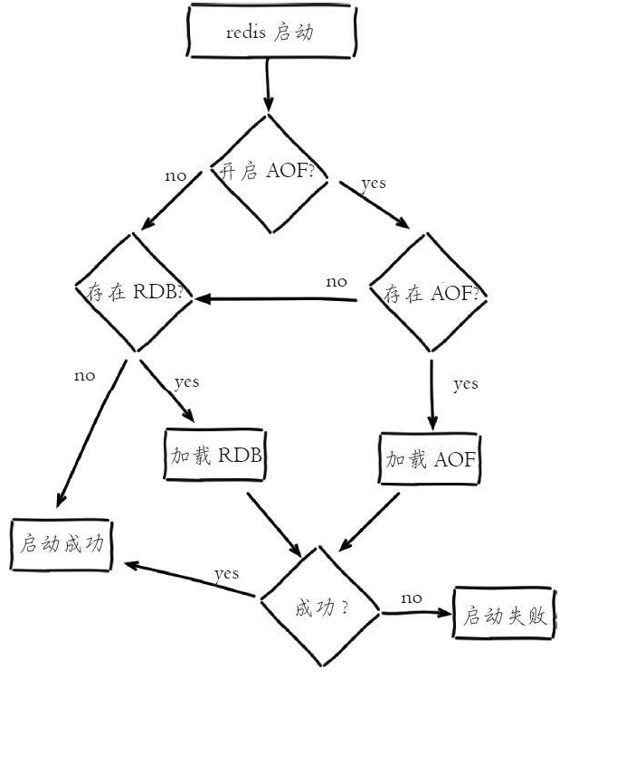

# 持久化问题及Redis配置优化问题
Redis持久化概述(开启持久化必然对性能有一些影响)
>持久化的功能：Redis是内存数据库，数据都是存储在内存中，为了避免进程退出导致数据的永久丢失，需要定期将Redis中的数据以某种形式（数据或命令）从 内存保存到硬盘。 当下次Redis重启时，利用持久化文件实现数据恢复。除此之外，为了进行灾难备份，可以将持久化文件拷贝到一个远程位置。Redis持久化分为 RDB持久化和AOF持久化，前者将当前数据保存到硬盘，后者则是将每次执行的写命令保存到硬盘。
>
>简单理解:就是把内存文件放进我们的磁盘中
>
>redis默认数据库是16个(配置文件中)
````
# Set the number of databases. The default database is DB 0, you can select
# a different one on a per-connection basis using SELECT <dbid> where
# dbid is a number between 0 and 'databases'-1
databases 16
````


-------
## 1.RDB
>RDB是一种快照存储持久化方式，具体就是将Redis某一时刻的内存数据保存到硬盘的文件当中，默认保存的文件名为dump.rdb，而在Redis服务器启动时，会重 新加载dump.rdb文件的数据到内存当中恢复数据。 ，触发 RDB 持久化过程分为手动触发和自动触发。
>
>在配置文件中手动指定RDB文件的存储地址
````
# Note that you must specify a directory here, not a file name.
 dir /redis/
````


内容(.rdb是一个二进制文件):
````
REDIS0009.      redis-ver^E5.0.7.
redis-bits.@.^Ectime....^.^Hused-mem..^G^]^@.^Nrepl-stream-db.^@.^Grepl-id(00d20deb0cf9fa43f1b84f7393e4f699195e3430.^Krep
````
###  1.1触发机制
- #### 手动触发分别对应 save 和 bgsave 命令：
````
·save 命令：阻塞当前 Redis 服务器，直到 RDB 过程完成为止，对于内存比较大的实例会造成长时间阻塞，线上环境不建议使用。 
·bgsave 命令：Redis 进程执行 fork 操作创建子进程，RDB 持久化过程由子进程负责，完成后自动结束。阻塞只发生在 fork 阶段，一般时间很短。 
显然 bgsave 命令是针对 save 阻塞问题做的优化。因此 Redis 内部所有的涉及 RDB 的操作都采用 bgsave 的方式 
除了执行命令手动触发之外，Redis 内部还存在自动触发 RDB 的持久化机制，例如以下场景： 
1）使用 save 相关配置，如“save m n”。表示 m 秒内数据集存在 n 次修改时，自动触发 bgsave。 
2）如果从节点执行全量复制操作，主节点自动执行 bgsave 生成 RDB 文件并发送给从节点。 
3）执行 debug reload 命令重新加载 Redis 时，也会自动触发 save 操作。
4）默认情况下执行 shutdown 命令时，如果没有开启 AOF 持久化功能则自动执行 bgsave。
````
我们删除dump.rdb文件,添加两个字段,手动保存一下新的.rdb文件
>bgsave
````
/redis # redis-cli
127.0.0.1:6379> incr u
(integer) 1
127.0.0.1:6379> incr u1
(integer) 1
127.0.0.1:6379> bgsave
Background saving started
````
>redis-check-rdb dump.rdb 
````
/redis # redis-check-rdb dump.rdb 

[offset 0] Checking RDB file dump.rdb
[offset 26] AUX FIELD redis-ver = '5.0.7' //redis版本
[offset 40] AUX FIELD redis-bits = '64'  //当前的资源大小
[offset 52] AUX FIELD ctime = '1588449635' //时间
[offset 67] AUX FIELD used-mem = '1902680' 
[offset 85] AUX FIELD repl-stream-db = '0'
[offset 135] AUX FIELD repl-id = '00d20deb0cf9fa43f1b84f7393e4f699195e3430'
[offset 151] AUX FIELD repl-offset = '25513'
[offset 167] AUX FIELD aof-preamble = '0'
[offset 169] Selecting DB ID 0
[offset 192] Checksum OK
[offset 192] \o/ RDB looks OK! \o/
[info] 2 keys read  //键值信息
[info] 0 expires
[info] 0 already expired
````
- #### 除了通过客户端发送命令外，还有一种方式，就是在Redis配置文件中的save指定到达触发RDB持久化的条件，比如【多少秒内至少达到多少写操作】就开 启RDB数据同步。

例如我们可以在配置文件redis.conf指定如下的选项：
````
# 900s内至少达到一条写命令 
save 900 1 
# 300s内至少达至10条写命令 
save 300 10 
# 60s内至少达到10000条写命令  
save 60 10000
````
>这种通过服务器配置文件触发RDB的方式，与bgsave命令类似，达到触发条件时，会forks一个子进程进行数据同步， 不过最好不要通过这方式来触发RDB持久 化，因为设置触发的时间太短，则容易频繁写入rdb文件，影响服务器性能， 时间设置太长则会造成数据丢失,就比如``save 60 10000``可能会造成1分钟的数据丢失。

### 1.2流程说明
bgsave 是主流的触发 RDB 持久化方式，根据下图了解它的运作流程


流程解析：
````
1）执行 bgsave 命令，Redis 父进程判断当前是否存在正在执行的子进程，如 RDB/AOF 子进程，如果存在 bgsave 命令直接返回。
 2）父进程执行 fork 操作创建子进程，fork 操作过程中父进程会阻塞，通过 info stats 命令查看 latest_fork_usec 选项，可以获取最近一个 fork 操作的耗时，单位为微秒。
3）父进程 fork 完成后，bgsave 命令返回“Background saving started”信息并不再阻塞父进程，可以继续响应其他命令。 
4）子进程创建 RDB 文件，根据父进程内存生成临时快照文件，完成后对原有文件进行原子替换。执行 lastsave 命令可以获取最后一次生成 RDB 的时间，对应 info 统计的 rdb_last_save_time 选项。 
5）进程发送信号给父进程表示完成，父进程更新统计信息，具体见 info Persistence 下的 rdb_* 相关选项。
````
### 1.3rdb文件结构


>od -c dump.rdb 
````
/redis # od -c dump.rdb 
0000000   R   E   D   I   S //标识   0   0   0   9 //版本 372 //当前库  \t   r   e   d   i   s
0000020   -   v   e   r 005   5   .   0   .   7 372  \n   r   e   d   i
0000040   s   -   b   i   t   s 300   @ 372 005   c   t   i   m   e 302
0000060   c 321 255   ^ 372  \b   u   s   e   d   -   m   e   m 302   X
0000100  \b 035  \0 372 016   r   e   p   l   -   s   t   r   e   a   m
0000120   -   d   b 300  \0 372  \a   r   e   p   l   -   i   d   (   0
0000140   0   d   2   0   d   e   b   0   c   f   9   f   a   4   3   f
0000160   1   b   8   4   f   7   3   9   3   e   4   f   6   9   9   1
0000200   9   5   e   3   4   3   0 372  \v   r   e   p   l   -   o   f
0000220   f   s   e   t 301 251   c 372  \f   a   o   f   -   p   r   e
0000240   a   m   b   l   e 300  \0 376  \0 373 002  \0  \0 002   u   1
0000260 300 001  \0 001   u 300 001 377 //代表结束符,后面的为校验码   9 213   , 017 002 373 232 236
0000300
````

### 1.4伪代码全诠释流程

- input.php
````
<?php
class Input
{
    public static function info($message, $description = null)
    {
        echo "======>>> ".$description." start\n";
        if (\is_array($message)) {
            echo \var_export($message, true);
        } else if (\is_string($message)) {
            echo $message."\n";
        } else {
            var_dump($message);
        }
        echo  "======>>> ".$description." end\n";
    }
}
````
pcntl初尝试(这里应用到了php中pcntl拓展,自行百度安装)
````
<?php
$pid = pcntl_fork(); // fork

if ($pid == 0) {
    // 子进程
    var_dump("子进程");
} else {
    // 父进程
    var_dump("父进程");
}
````
>若出现报错信息
````
PHP Warning:  pcntl_fork() has been disabled for security reasons in /www/will/test.php on line 7

Warning: pcntl_fork() has been disabled for security reasons in /www/will/test.php on line 7
this is son room[root@localhost will]# php pncl.php 
PHP Warning:  pcntl_fork() has been disabled for security reasons in /www/will/pncl.php on line 2

Warning: pcntl_fork() has been disabled for security reasons in /www/will/pncl.php on line 2
string(9) "子进程"
````
>说明函数被禁用了,配置文件中,找到需要的函数,手动解除就好了
````
disable_functions = passthru,exec,system,putenv,chroot,chgrp,chown,shell_exec,popen,proc_open,
pcntl_exec,ini_alter,ini_restore,dl,openlog,syslog,readlink,symlink,popepassthru,
pcntl_alarm,pcntl_fork,pcntl_waitpid,pcntl_wait,pcntl_wifexited,pcntl_wifstopped,
pcntl_wifsignaled,pcntl_wifcontinued,pcntl_wexitstatus,pcntl_wtermsig,
pcntl_wstopsig,pcntl_signal,pcntl_signal_dispatch,pcntl_get_last_error,
pcntl_strerror,pcntl_sigprocmask,pcntl_sigwaitinfo,pcntl_sigtimedwait,
pcntl_exec,pcntl_getpriority,pcntl_setpriority,imap_open,apache_setenv
````
再次执行
````
[root@localhost will]# php pncl.php 
string(9) "父进程"
string(9) "子进程"

[root@localhost ~]#  pstree -a | grep pnc
  |   |   |   `-php pncl.php
  |   |   |       `-php pncl.php
  |   |       |-grep --color=auto pnc
````
kill -l (产看linux中的所有信号),kill -9 就是在传递一个信号
````
[root@localhost ~]# kill -l
 1) SIGHUP       2) SIGINT       3) SIGQUIT      4) SIGILL       5) SIGTRAP
 6) SIGABRT      7) SIGBUS       8) SIGFPE       9) SIGKILL     10) SIGUSR1
11) SIGSEGV     12) SIGUSR2     13) SIGPIPE     14) SIGALRM     15) SIGTERM
16) SIGSTKFLT   17) SIGCHLD     18) SIGCONT     19) SIGSTOP     20) SIGTSTP
21) SIGTTIN     22) SIGTTOU     23) SIGURG      24) SIGXCPU     25) SIGXFSZ
26) SIGVTALRM   27) SIGPROF     28) SIGWINCH    29) SIGIO       30) SIGPWR
31) SIGSYS      34) SIGRTMIN    35) SIGRTMIN+1  36) SIGRTMIN+2  37) SIGRTMIN+3
38) SIGRTMIN+4  39) SIGRTMIN+5  40) SIGRTMIN+6  41) SIGRTMIN+7  42) SIGRTMIN+8
43) SIGRTMIN+9  44) SIGRTMIN+10 45) SIGRTMIN+11 46) SIGRTMIN+12 47) SIGRTMIN+13
48) SIGRTMIN+14 49) SIGRTMIN+15 50) SIGRTMAX-14 51) SIGRTMAX-13 52) SIGRTMAX-12
53) SIGRTMAX-11 54) SIGRTMAX-10 55) SIGRTMAX-9  56) SIGRTMAX-8  57) SIGRTMAX-7
58) SIGRTMAX-6  59) SIGRTMAX-5  60) SIGRTMAX-4  61) SIGRTMAX-3  62) SIGRTMAX-2
63) SIGRTMAX-1  64) SIGRTMAX
````
````
<?php
//pcntl_signal ( int $signo , callback $handler [, bool $restart_syscalls = true ] ) : bool
// 函数pcntl_signal()为signo指定的信号安装一个新的信号处理器。
//理解为设置信号
pcntl_signal(SIGUSR1, "sig_handler");
function sig_handler($sig){
    sleep(2);
    echo "这是测试信号的一个测试类\n";
}


//posix_kill （ int $pid ， int $sig ）,pid:进程标识符。 sig:其中的PCNTL信号常数。
//将信号发送给sig具有过程标识符的过程pid。
//理解为发送信号
posix_kill(posix_getpid(), SIGUSR1);

echo "其他事情\n";

//函数pcntl_signal_dispatch()调用每个等待信号通过pcntl_signal() 安装的处理器。
//可以理解为部署信号
pcntl_signal_dispatch();
````
- save模式执行的方式
````
<?php
require 'Input.php';

// rdb-save保存方法
function save()
{
    rdbSave();
    call();
}
save();
// 实际保存rdb文件保存方法
function rdbSave()
{
    Input::info("rdbSave 保存文件  开始");
    sleep(2);// 表示的持久化过程
    Input::info("rdbSave 保存文件  结束");
}
// 其他执行命令
function call()
{
    Input::info("rdbSave 持久化的时候 -》 需要执行的命令");
}
````
````
[root@localhost will]# php RDB.php 
======>>>  start
rdbSave 保存文件  开始
======>>>  end
======>>>  start
rdbSave 保存文件  结束
======>>>  end
======>>>  start
rdbSave 持久化的时候 -》 需要执行的命令
======>>>  end
````
- bgsave模式执行方式,[帮助文档1](https://blog.csdn.net/qq_35845964/article/details/84188299) | [帮助文档2](https://blog.csdn.net/shj_php/article/details/89209937)
````
<?php
require 'Input.php';
// rdb-bgsave保存方法
function bgsave()
{
    $pid = pcntl_fork(); // fork子进程

    //设置一个信号
    pcntl_signal(SIGUSR1, function ($sig){
        Input::info("成功接收到子进程的持久化信息，并且执行完成");
    });

    if ($pid == 0) {
        // 子进程
        rdbSave();
        //向当前进程发送SIGUSR1信号
        posix_kill(posix_getpid(), SIGUSR1);
        //exit;
    } else {
        // file_put_contents('t.xt','p',8);
        // 父进程
        // var_dump("父进程");
        call();
    }
    // 部署 SIGUSR1 信号发送到linux系统中
    pcntl_signal_dispatch();
}
bgsave();

// 实际保存rdb文件保存方法
function rdbSave()
{
    Input::info("rdbSave 保存文件  开始");
    sleep(2);// 表示的持久化过程
    Input::info("rdbSave 保存文件  结束");
}

// 其他执行命令
function call()
{
    Input::info("rdbSave 持久化的时候 -》 主进程执行的其他命令");
}

函数pcntl_signal_dispatch()调用每个等待信号通过pcntl_signal() 安装的处理器。
----------------------------------------------------------------------------
其实就是调用上面写的那个回调方法，

在调用该方法的同时，将从命令行输入的那个kill后面的那个数字当做参数传递到这个回调方法中（或者将posix_kill()方法中的信号，

当做参数传递到这个方法中去），然后开始执行那个回调方法中的逻辑 。
比如下面的这个代码块儿，就是传递的posix_kill()中的信号：


echo "安装信号处理器...\n";
pcntl_signal(SIGHUP, function ($signo) {
    echo "信号处理器被调用\n";
});
 

echo "为自己生成SIGHUP信号...\n";
posix_kill(posix_getpid(), SIGHUP);//posix_getpid()函数是获取当前进程号
 
echo "分发...\n";
pcntl_signal_dispatch();
 
echo "完成\n";

[root@localhost will]# php test.php 
安装信号处理器...
为自己生成SIGHUP信号...
分发...
信号处理器被调用
完成
````
````
[root@localhost will]# php RDB.php 
======>>>  start
rdbSave 持久化的时候 -》 主进程执行的其他命令
======>>>  end
[root@localhost will]# ======>>>  start
rdbSave 保存文件  开始
======>>>  end
======>>>  start
rdbSave 保存文件  结束
======>>>  end
======>>>  start
成功接收到子进程的持久化信息，并且执行完成
======>>>  end
````
### 1.5RDB 的优/缺点： 
#### 优点
- RDB 是一个非常紧凑的文件，它保存了 Redis 在某个时间点上的数据集。 这种文件非常适合用于进行备份： 比如说，你可以在最近的 24 小 时内，每小时备份一次 RDB 文件，并且在每个月的每一天，也备份一个 RDB 文件。 这样的话，即使遇上问题，也可以随时将数据集还原到不同的版本。 
- RDB 可以最大化 Redis 的性能：父进程在保存 RDB 文件时唯一要做的就是 fork 出一个子进程，然后这个子进程就会处理接下来的所有保存工 作，父进程无须执行任何磁盘 I/O 操作。 
- RDB 在恢复大数据集时的速度比 AOF 的恢复速度要快。
#### 缺点
- RDB 方式数据没办法做到实时持久化/秒级持久化 如果服务器宕机的话，采用RDB的方式会造成某个时段内数据的丢失，比如我们设置10分钟同步一次或5分钟达到1000次写入就同步一次，那么如果还没达 到触发条件服务器就死机了，那么这个时间段的数据会丢失。
 - 使用bgsave命令在forks子进程时，如果数据量太大，forks的过程也会发生阻塞，另外，forks子进程会耗费内存。 
 
 针对 RDB 不适合实时持久化的问题，Redis 提供了 AOF 持久化方式来解决。
 
---
## 2.AOF
>本质区别:RDB记录数据,AOF记录命令
### 2.1 使用AOF
>开启 AOF 功能需要设置配置：appendonly yes，默认不开启 为 no。AOF 文件名通过 appendfilename 配置设置，默认文件名是 appendonly.aof。保存路径同 RDB 持久化方式一致，通过 dir 配置指定
````
# Please check http://redis.io/topics/persistence for more information.
appendonly no
# The name of the append only file (default: "appendonly.aof")
appendfilename "appendonly.aof"
````
>通过命令查看是否开启
````
127.0.0.1:6379> config get appendonly
1) "appendonly"
2) "no"
````
>AOF向磁盘刷新的描述(配置文件)
````
# If unsure, use "everysec".
# appendfsync always //每次收到写命令就立即强制写入磁盘，最慢的大概只有几百的TPS，但是保证完全的持久化，不推荐使用
appendfsync everysec //每秒钟强制写入磁盘一次，在性能和持久化方面做了很好的折中，推荐
# appendfsync no //完全依赖os，性能最好,持久化没保证，Redis不会主动调用fsync去将AOF日志内容同步到磁盘，所以这一切就完全依赖于操作系统的 调试了。对大多数Linux操作系统，
//是每30秒进行一次fsync，将缓冲区中的数据写到磁盘上。

使用最多的是 everysec
````


>od -c appendonly.aof 查看文件的内容,


>其内容和rdb内容相似,唯一不同就是一个存数据,一个存命令
>
>在5.0之前命令是没有加密的,在5.0之后命令加密了 

### 2.2工作流程


#### 流程如下：
- 所有的写入命令会追加到 aof_buf（缓冲区）中。 
- AOF 缓冲区根据对应的策略向硬盘做同步操作。
- 随着 AOF 文件越来越大，需要定期对 AOF 文件进行重写，达到压缩的目的。
- 当 Redis 服务器重启时，可以加载 AOF 文件进行数据恢复。
#### 重写机制说明
````
AOF将客户端的每一个写操作都追加到aof文件末尾，随着命令不断写入 AOF，文件会越来越大，为了解决这个问题，Redis 引入 AOF 重写机制压缩文件 体积。 
AOF 文件重写是把 Redis 进程内的数据转化为写命令同步到新 AOF 文件的过程。 
比如： 
多条写命令可以合并为一个，如：lpush list a、lpush list b、lpush list c 可以转化为：lpush list a b c。 
AOF 重写降低了文件占用空间，除此之外，另一个目的是：更小的 AOF 文件可以更快地被 Redis 加载。
````
#### 2.3触发机制
AOF 重写过程可以手动触发和自动触发：
````
·手动触发：直接调用 bgrewriteaof 命令。 
·自动触发：根据 auto-aof-rewrite-min-size和auto-aof-rewrite-percentage 参数确定自动触发时机。
     ·auto-aof-rewrite-min-size：表示运行 AOF 重写时文件最小体积，默认为 64MB。 
    ·auto-aof-rewrite-percentage：代表当前 AOF 文件空间（aof_current_size）和上一次重写后 AOF 文件空间（aof_base_size）的比值。 
示例： 
    auto-aof-rewrite-percentage：100 
    auto-aof-rewrite-min-size：64mb 默认配置是当AOF文件大小是上次rewrite后大小的一倍且文件大于64M时触发
````
当触发 AOF 重写时，内部做了哪些事呢？下面介绍下它的运行流程


#### 流程说明
- 执行 AOF 重写请求。 如果当前进程正在执行 AOF 重写，请求不执行并返回如下响应： ERR Background append only file rewriting already in progress
- 父进程执行 fork 创建子进程，开销等同于 bgsave 过程。
- 主进程 fork 操作完成后，继续响应其他命令。所有修改命令依然写入 AOF 缓冲区并根据 appendfsync 策略同步到硬盘，保证原有 AOF 机制正确 性。
- 由于 fork 操作运用写时复制技术，子进程只能共享 fork 操作时的内存数据。由于父进程依然响应命令，Redis 使用“AOF 重写缓冲区”保存这部分 新数据，防止新 AOF 文件生成期间丢失这部分数据。
- 子进程根据内存快照，按照命令合并规则写入到新的 AOF 文件。每次批量写入硬盘数据量由配置 aof-rewrite-incremental-fsync 控制，默认为 32MB，防止单次 刷盘数据过多造成硬盘阻塞。
- 新 AOF 文件写入完成后，子进程发送信号给父进程，父进程更新统计信息，具体见 info persistence 下的 aof_*相关统计。
- 父进程把 AOF 重写缓冲区的数据写入到新的 AOF 文件。
- 使用新 AOF 文件替换老文件，完成 AOF 重写。

### 2.4伪代码复现从数据库中读取数据进行AOF重写替换
>在redis中,生产环境下,不推荐使用``keys *``方式读取,会引起redis阻塞,推荐使用游标读取,``scan 0 ``,scan命令是一个基于游标的迭代器
>
>config get databases     获取服务器数据库数量配置
````
$redis = new Redis();
$redis->pconnect('172.10.0.3',6379);
//var_dump($redis->sMembers("myset1"));
var_dump($redis->config('GET', 'databases'));
/* 结果
 * array(1) {
    ["databases"]=>
  string(2) "16"
}*/
var_dump($redis->config('GET', 'databases')['databases']);
/* 结果
 * string(2) "16"
 * */
 * */
````
>Redis Select 命令用于切换到指定的数据库，数据库索引号 index 用数字值指定，以 0 作为起始索引值。
````
redis 127.0.0.1:6379> SET db_number 0  # 默认使用 0 号数据库
OK

redis 127.0.0.1:6379> SELECT 1  # 使用 1 号数据库
OK

redis 127.0.0.1:6379[1]> GET db_number  # 已经切换到 1 号数据库，注意 Redis 现在的命令提示符多了个 [1]
(nil)

redis 127.0.0.1:6379[1]> SET db_number 1
OK
````
>Redis Type 命令用于返回 key 所储存的值的类型。
````
命令行中:
127.0.0.1:6379> type c
set

php代码中(test.php):
$redis = new Redis();
$redis->pconnect('172.10.0.3',6379);
var_dump($redis->type('c'));

[root@localhost will]# php test.php 
int(2) //返回的是一个整数,set就是2
````
>关于scan 
````
//这里设置了多个集合
127.0.0.1:6379> scan 0
1) "11"
2)  1) "w"
    2) "d"
    3) "f"
    4) "a"
    5) "t"
    6) "r"
    7) "z"
    8) "p"
    9) "c"
   10) "b"
127.0.0.1:6379> scan 11
1) "0"
2) 1) "l"
   2) "e"
   3) "n"
   4) "m"
---------------------------------------------------------------------------------------------
class A{
   //public  $iterator = 10;
    public function __construct($iterator){
        $redis = new Redis();
        $redis->pconnect('172.10.0.3',6379);
        var_dump($redis->scan($iterator));
        if($iterator>0){
            var_dump($redis->scan($iterator));
        }

    }
}
new A(-1);
---------------------------------------------------------------------------------------------
//结果
[root@localhost will]# php test.php 
array(10) {
  [0]=>
  string(1) "w"
  [1]=>
  string(1) "d"
  [2]=>
  string(1) "f"
  [3]=>
  string(1) "a"
  [4]=>
  string(1) "t"
  [5]=>
  string(1) "r"
  [6]=>
  string(1) "z"
  [7]=>
  string(1) "p"
  [8]=>
  string(1) "c"
  [9]=>
  string(1) "b"
}
array(4) {
  [0]=>
  string(1) "l"
  [1]=>
  string(1) "e"
  [2]=>
  string(1) "n"
  [3]=>
  string(1) "m"
}
````
#### 正式模拟

input.php
````
<?php
class Input
{
    public static function info($message, $description = null)
    {
        echo "======>>> ".$description." start\n";
        if (\is_array($message)) {
            echo \var_export($message, true);
        } else if (\is_string($message)) {
            echo $message."\n";
        } else {
            var_dump($message);
        }
        echo  "======>>> ".$description." end\n";
    }
}
````
redis.php(重写了基类中的type方法,原方法返回整数,修改后返回字符串)
````
<?php


class RedisModel extends \Redis
{
    /**
     * 根据传递的key返回一下数据类型
     * @param  [type] $key [description]
     * @return [type]      [description]
     */

    public function getType($key)
    {
        $keyType = $this->type($key);
        switch ($keyType) {
          case Redis::REDIS_SET :
            return "Set";
            break;
          case Redis::REDIS_LIST :
            return "List";
            break;
          case Redis::REDIS_ZSET :
            return "Zset";
            break;
          case Redis::REDIS_STRING :
            return "String";
            break;
          case Redis::REDIS_HASH :
            return "Hash";
            break;
        }
    }
}
````
aof.php(核心方法,这里我们只是以set方法举例)
````
<?php
require_once 'Redis.php';
require_once 'Input.php';

class Aof
{
    /**
     * [protected description]
     * @var Redis
     */
    protected $redis;

    protected $commands;

    protected $filePath ;

    public function __construct($host = "172.10.0.3", $port = 6379, $file = "/aof_file.aof")
    {
        $this->redis = new RedisModel();
        $this->redis->pconnect($host, $port);
        $this->filePath = __DIR__.$file;
    }
    /**
     * aof重写方法
     * @return [type] [description]
     */
    public function aofRewrite()
    {
        // 1. 获取所有的 数据库
        $dbs = $this->redis->config('GET', 'databases')['databases'];
        // Input::info($dbs);
        // 2. 根据库去循环获取key scan
        //    key可能很多
        for ($i=0; $i < $dbs; $i++) {
            // 3. 再根据key 调用重写的规则的方法 去重写
            //    判断重写的数据类型

            // 用于记录命令的
            $commands = null;
            // 切换数据库
            $this->redis->select($i);
            // 针对于 $i 这个数据库去进行命令的重写
            $commands = $this->rewrite($commands);

            if (!empty($commands)) {
              Input::info($commands);
              $this->rewriteFile( "db:".$i.";key:".$commands);
            }
        }
    }

    protected function rewrite($commands, $iterator = -1)
    {
        $keys = $this->redis->scan($iterator);
        // Input::info($keys);
        // Input::info($iterator);

        // 是否有数据
        if (empty($keys)) {
            return ;
        }
        // 重写获取的key的数据
        foreach ($keys as $key) {
            // 得到key的类型
            $keyType = $this->redis->getType($key);
            // 再根据类型去重写命令，并且拼接
            //protected function rewriteSet($key)
            $commands .= $this->{"rewrite".$keyType}($key);
        }

        // 判断后面是否还有数据
        if ($iterator > 0) {
            $this->rewrite($commands, $iterator);
        } else {
            return $commands;
        }
    }

    protected function rewriteFile($commands)
    {
        file_put_contents($this->filePath, $commands, 8);
    }

    protected function rewriteSet($key)
    {
        $value = $this->redis->sMembers($key);
        return $this->rewriteCommand('SADD', $key, implode(" ", $value));
    }
    // protected function rewriteList($key)
    // {
    //     return $this->rewriteCommand('', $key, $value);
    // }
    // protected function rewriteZset($key)
    // {
    //     return $this->rewriteCommand('', $key, $value);
    // }
    // protected function rewriteString($key)
    // {
    //     return $this->rewriteCommand('', $key, $value);
    // }
    // protected function rewriteHash($key)
    // {
    //     return $this->rewriteCommand('', $key, $value);
    // }
    // protected function rewriteExpireTime($key)
    // {
    //     return $this->rewriteCommand('SADD', $key, $value);
    // }
    protected function rewriteCommand($method, $key, $value)
    {
        return $method." ".$key." ".$value.";";
    }
}
(new Aof)->aofRewrite();
````
结果:
````
[root@localhost will]# php Aof.php 
======>>>  start
SADD a 1 2 3 4 5 6 7 8 9;SADD c 1 2 3 4;SADD b 1 2 3 4 5 6 7;
======>>>  end
````
### 2.5AOF的优缺点
AOF的优点
- AOF可以设置 完全不同步、每秒同步、每次操作同，默认是每秒同步。因为AOF是操作指令的追加，所以可以频繁的大量的同步。
- AOF文件是一个值追加日志的文件，即使服务宕机为写入完整的命令，也可以通过redis-check-aof工具修复这些问题。
- 如果AOF文件过大，Redis会在后台自动地重写AOF文件。重写后会使AOF文件压缩到最小所需的指令集。 
- AOF文件是有序保存数据库的所有写入操作，易读，易分析。即使如果不小心误操作数据库，也很容易找出错误指令，恢复到某个数据节点。例如不小 心FLUSHALL，可以非常容易恢复到执行命令之前。
AOF的缺点
- 相同数据量下，AOF的文件通常体积会比RDB大。因为AOF是存指令的，而RDB是所有指令的结果快照。但AOF在日志重写后会压缩一些空间。 
- 在大量写入和载入的时候，AOF的效率会比RDB低。因为大量写入，AOF会执行更多的保存命令，载入的时候也需要大量的重执行命令来得到最后的结果。 RDB对此更有优势。
AOF缺点
- 对于相同的数据集来说，AOF 文件的体积通常要大于 RDB 文件的体积。
- 根据所使用的 fsync 策略，AOF 的速度可能会慢于 RDB。 在一般情况下， 每秒 fsync 的性能依然非常高， 而关闭 fsync 可以让 AOF 的速度和 RDB 一样快， 即使在高负荷之下也是如此。 

--- 
## 3重启加载的选项
AOF和RDB都可以用于服务器重启时的数据恢复




注意


---
## 4持久化的分析
### 4.1持久化配置方案
````
1、企业级的持久化的配置策略 
    save 60 10000：如果你希望尽可能确保说，RDB最多丢1分钟的数据，那么尽量就是每隔1分钟都生成一个快照，低峰期，数据量很少，也没必要 10000->生成RDB，

    1000->RDB，这个根据你自己的应用和业务的数据量，你自己去决定 

    AOF一定要打开，fsync，everysec 

    auto-aof-rewrite-percentage 100: 就是当前AOF大小膨胀到超过上次100%，上次的两倍 
    auto-aof-rewrite-min-size 64mb: 根据你的数据量来定，16mb，32mb 
2、数据备份方案 RDB非常适合做冷备，每次生成之后，就不会再有修改了 

数据备份方案 
    （1）写crontab定时调度脚本去做数据备份 
    （2）每小时都copy一份rdb的备份，到一个目录中去，仅仅保留最近48小时的备份 
    （3）每天都保留一份当日的rdb的备份，到一个目录中去，仅仅保留最近1个月的备份 
    （4）每次copy备份的时候，都把太旧的备份给删了 
    （5）每天晚上将当前服务器上所有的数据备份，发送一份到远程的云服务上去【crontab】
````
### 4.2AOF常用配置总结
````
    appendonly no：是否开启AOF 

    appendfilename "appendonly.aof"：AOF文件名 

    dir ./：RDB文件和AOF文件所在目录 

    appendfsync everysec：fsync持久化策略 

    no-appendfsync-on-rewrite no：AOF重写期间是否禁止fsync；如果开启该选项，可以减轻文件重写时CPU和硬盘的负载（尤其是硬盘），但是可能会丢失 AOF重写期间的数据；需要在负载和安全性之间进行平衡 

    auto-aof-rewrite-percentage 100：文件重写触发条件之一 

    auto-aof-rewrite-min-size 64mb：文件重写触发提交之一 

    aof-load-truncated yes：如果AOF文件结尾损坏，Redis启动时是否仍载入AOF文件
````


