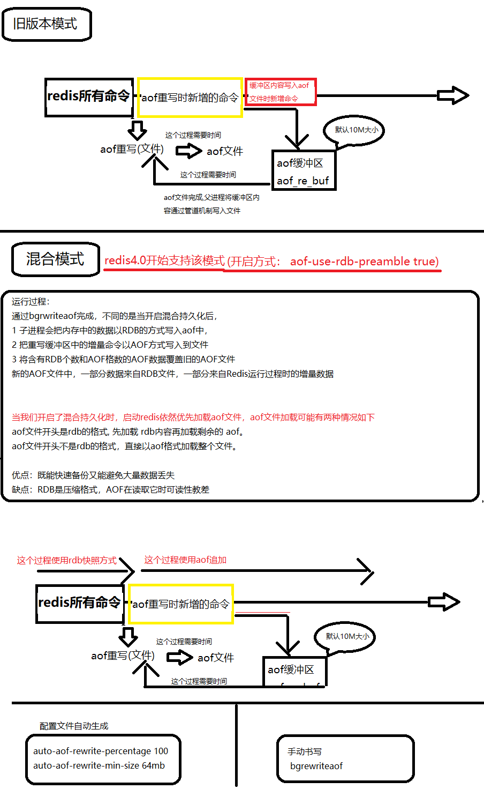
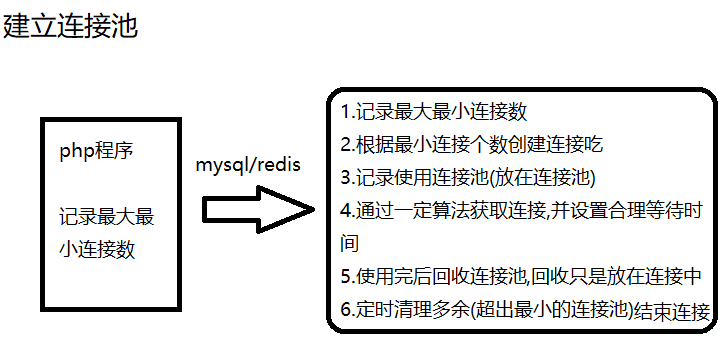
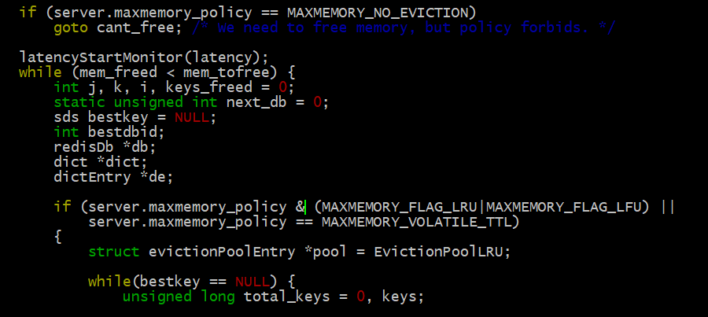

# Redis优化及其配置
命令补充
````
1. Linux egrep命令用于在文件内查找指定的字符串。
cat /redis/redis.conf | egrep "^sava|^append";

/ # cat /redis/redis.conf | egrep "^save|^append";
save 900 1
save 300 10
save 60 10000
appendonly yes
appendfilename "appendonly.aof"
appendfsync everysec
save 900 1
save 300 10
save 60 10000
appendonly no
appendfilename "appendonly.aof"
appendfsync everysec


2.  redis下debug命令
模拟oom，redis 直接退出：redis-cli debug oom
模拟宕机：redis-cli debug segfault
模拟 redis 线程挂起：redis-cli -p 6379 debug sleep 30
快速产生测试数据：debug populate
/redis # redis-cli dbsize
(integer) 0
/redis # redis-cli debug populate 10
OK
/redis # redis-cli dbsize
(integer) 10
模拟 RDB 加载情形（save 当前的 rdb 文件，并清空当前数据库，重新加载 rdb）：debug reload
模拟 AOF 加载情形（清空当前数据库，重新从aof文件里加载数据库）：debug loadaof
````

---
## 1.持久化数据恢复


这个数据恢复的流程在新的redis版本(3.*)中走不通
>在开启了AOF后,不会判断有没有aof的文件,即使没有aof文件,他也会创建一个新的aof文件,不在意你有没有rdb文件


````
配置文件中:
appendonly no
# The name of the append only file (default: "appendonly.aof")
appendfilename "appendonly.aof"

保存开启redis:
/redis # redis-cli
127.0.0.1:6379> config get appendonly
1) "appendonly"
2) "no"
127.0.0.1:6379> debug populate 10
OK
127.0.0.1:6379> save 
OK
127.0.0.1:6379> keys *
 1) "key:2"
 2) "key:8"
 3) "key:1"
 4) "key:7"
 5) "key:0"
 6) "key:9"
 7) "key:6"
 8) "key:3"
 9) "key:5"
10) "key:4"

//模拟意外的挂机
/redis # ps 
PID   USER     TIME  COMMAND
    1 root      0:00 sh
    5 root      0:00 sh
   92 root      0:00 redis-server /redis/redis.conf
   97 root      0:00 ps
/redis # kill 92

修改配置文件:
appendonly yes
# The name of the append only file (default: "appendonly.aof")
appendfilename "appendonly.aof"
//查看
/redis # cat /redis/redis.conf | egrep "^append"
appendonly yes
appendfilename "appendonly.aof"
appendfsync everysec

//进入redis
/redis # redis-server ./redis.conf 
/redis # redis-cli
127.0.0.1:6379> keys *
(empty list or set)

//发向生成了大小为0的aof文件,且被自动加载,导致数据为空
/redis # ls 
appendonly.aof  dump.rdb        redis.conf      redis.log
````
解决办法
- 先不开启aof的功能(不修改配置文件中appendonly选线)
- 启动redis
- 动态的启动aof``config set appendonly yes``

---
## 2.关于Linux配置事项
- vm.overcommit_memory
>Redis是内存操作，需要优先使用内存。设置overcommit 为1。是为了让 fork 操作能够在低内存下也执行成功。Linux 操作系统对大部分申请内存的请 求都回复 yes，以便能运行更多的程序。因为申请内存后，并不会马上使用内存，这种技术叫做 overcommit。
- swappiness
>swap 对于操作系统来比较重要，当物理内存不足时，可以将一部分内存页进行 swap 操作，已解燃眉之急。swap 空间由硬盘提供，对于需要高并发、 高吞吐的应用来说，磁盘 IO 通常会成为系统瓶颈。在 Linux 中，并不是要等到所有物理内存都使用完才会使用到 swap，系统参数 swppiness 会决定操 作系统使用 swap 的倾向程度。swappiness 的取值范围是0~100，swappiness 的值越大，说明操作系统可能使用swap的概率越高，swappiness 值越 低，表示操作系统更加倾向于使用物理内存。swap 的默认值是60，了解这个值的含义后，有利于 Redis 的性能优化。下表对 swappiness 的重要值进行 了说明。
- ulimit设置
>redis配置文件中,最大的客户端连接数量为10000,  # maxclients 10000
>
>可以通过 ulimit 查看和设置系统当前用户进程的资源数。其中 ulimit-a 命令包含的 open files 参数，是单个用户同时打开的最大文件个数：
````
[root@localhost master]# ulimit -a
core file size          (blocks, -c) 0
data seg size           (kbytes, -d) unlimited
scheduling priority             (-e) 0
file size               (blocks, -f) unlimited
pending signals                 (-i) 3829
max locked memory       (kbytes, -l) 64
max memory size         (kbytes, -m) unlimited
open files                      (-n) 1024
pipe size            (512 bytes, -p) 8
POSIX message queues     (bytes, -q) 819200
real-time priority              (-r) 0
stack size              (kbytes, -s) 8192
cpu time               (seconds, -t) unlimited
max user processes              (-u) 3829
virtual memory          (kbytes, -v) unlimited
file locks                      (-x) unlimited


Redis 允许同时有多个客户端通过网络进行连接，可以通过配置 maxclients 来限制最大客户端连接数。
对 Linux 操作系统来说，这些网络连接都是文件 句柄。假设当前 open files 是4096，那么启动 Redis 时会看到如下日志： 
#You requested maxclients of 10000 requiring at least 10032 max file descriptors. 
#Redis can’t set maximum open files to 10032 because of OS error: Operation not permitted. 
#Current maximum open files is 4096. Maxclients has been reduced to 4064 to compensate for low ulimit. If you need higher maxclients increase
````
>可以看出 open files 的限制优先级比 maxclients 大。
>
>可以使用连接池解决上方问题



连接池(pool.php):
````
<?php
use Swoole\Coroutine\Channel;


class pool
{
    /**
     * 最大避免超标
     * @var [type]
     */
    protected $maxConnection = 30;
    /**
     * 最小连接个数，就是在初始化的时候事先创建多少个
     *
     * 创建太多也会消耗内存，也不一定用的了那么多
     * @var [type]
     */
    protected $minConnection = 5;
    /**
     * 会在协程中使用，保存创建的连接个数
     * @var
     */
    protected $channel;
    // 从连接池中获取连接的时候超时的时间
    protected $timeout = 3;

    protected $count = 0;
    // 允许空闲时间
    protected $idleTime = 10;

    protected static $instance = null;

    private function __construct()
    {
        // var_dump(1);
        $this->init();
        $this->gc();

    }
    /**
     * [getInstance description]
     * @return pool
     */
    public static function getInstance()
    {
        if (is_null(self::$instance)) {
            self::$instance = new static;
        }
        return self::$instance;
    }
    /**
     * 初始化
     * 创建连接，并且把连接放在连接池中
     * @return [type] [description]
     */
    protected function init()
    {
        $this->channel = new Channel($this->maxConnection);
        for ($i=0; $i < $this->minConnection; $i++) {
            $connection = $this->createConnection();
            if ($connection) {
                $this->channel->push($connection);
                $this->count++;
            }
        }
    }

    public function call($conn, $method, $sql)
    {
        try {
            return $conn['db']->{$method}($sql);
        } catch (\Exception $e) {

        }
    }
    // 创建连接
    protected function createConnection()
    {
        try {
            $pdo = new PDO('mysql:host=localhost;dbname=swoole', 'root', '0000');
            $pdo->setAttribute(PDO::ATTR_ERRMODE, PDO::ERRMODE_EXCEPTION);
            return [
              'last_used_time' => time(),
               'db' =>$pdo
            ];
        } catch (\Exception $e) {
            return false;
        }
    }
    /**
     * 获取连接并使用
     * @return PDO
     */
    public function getConnection()
    {
        $connection = null;
        if ($this->channel->isEmpty()) {
            // 表示没有连接可用
            // 没有连接就要创建
            if ($this->count < $this->maxConnection) {
                // 判断是否超过最大连接个数
                $this->createConnection();
                if ($connection) {
                    $this->channel->push($connection);
                    $this->count++;
                }
            } else {
                var_dump("等待获取连接");
                // $connection = $this->channel->pop($this->timeout);
            }
        }
        // 表示还有空余的连接
        return $this->channel->pop($this->timeout);

        // $connection;
        // var_dump("超时");
    }

    /**
     * 释放连接（重回连接池）
     * @param  [type] $connection [description]
     * @return [type]             [description]
     */
    public function freeConnection($connection)
    {
        $connection['last_used_time'] = time();
        $this->channel->push($connection);
    }
    /**
     * 回收空闲的连接
     */
    protected function gc()
    {
        // 定时检测连接
        swoole_timer_tick(2000, function(){
            $conns = [];// 记录可用的连接
            // 要检测的连接不止一个
            while (true) {
                if (!$this->channel->isEmpty() && $this->count > $this->minConnection) {
                    $connection = $this->channel->pop();
                    var_dump($connection);
                    if (empty($connection)) {
                        continue;
                    }
                    // 检测是否空闲
                    if ((time()- $connection['last_used_time']) > $this->idleTime) {
                        $this->count--;
                        $connection['db'] = null;
                        echo "回收成功\n";
                    } else {
                        // 没有超过空闲时间就放回去
                        array_push($conns, $connection);
                    }
                } else {
                    break;
                }
            }
            foreach ($conns as $key => $value) {
                $this->channel->push($value);
            }
              var_dump($this->channel->length());
            echo "当前连接数是多少：".$this->count;
        });
    }
}
````
http.php
````
<?php
Swoole\Runtime::enableCoroutine(true);
require "pool.php";
$http = new Swoole\Http\Server("0.0.0.0", 9200);

$http->on('workerStart', function($server){

});

$http->on('request', function ($request, $response) {

    if ($request->server['request_uri'] == '/favicon.ico') {
        return ;
    }
    // // 在压测下 会出现短暂高峰期
    // $pdo = new PDO('mysql:host=localhost;dbname=swoole', 'root', '0000');
    // $pdo->query('select sleep(2)');

    // 会一直保持平稳状态
    $pool = pool::getInstance();
    $conn = $pool->getConnection();
    $pool->call($conn, 'query', 'select sleep(2)');
    // $conn->query('select sleep(2)');
    $pool->freeConnection($conn);


    $response->end("执行ok\n");
});
echo "http://0.0.0.0:9200\n";
$http->start();
````

---
## 3.Redis内存消耗
命令``redis-cli info memory``查看redis内存的使用情况,[更多命令](https://www.cnblogs.com/mushroom/p/4738170.html)
- used_memory 
>used_memory是Redis使用的内存总量，
>
>自身内存+对象内存(key-value redisObjic)+缓存内存(客户端/复制积压/aof缓冲区)
- used_memory_human
>和used_memory是一样的值，它以M为单位显示，仅为了方便阅读。
- used_memory_rss
>从操作系统上显示已经分配的内存总量。
- mem_fragmentation_ratio
>内存碎片率。如果该值小于1,说明redis将部分数据放入了swap交换区,需要关注
- used_memory_lua(从 2.6版本 起, Redis 开始支持 Lua 脚本 让开发者自己扩展 Redis …)
>Lua脚本引擎所使用的内存大小。

#### 因内存交换引起的性能问题
````
内存使用率是Redis服务最关键的一部分。如果一个Redis实例的内存使用率超过可用最大内存 (used_memory > 可用最大内存)，那么操作系统开始进
行内存与swap空间交换，把内存中旧的或不再使用的内容写入硬盘上（硬盘上的这块空间叫Swap分区），以便腾出新的物理内存给新页或活动页(page)
使用。
在硬盘上进行读写操作要比在内存上进行读写操作，时间上慢了近5个数量级，内存是0.1μs单位、而硬盘是10ms。如果Redis进程上发生内存交换，那
么Redis和依赖Redis上数据的应用会受到严重的性能影响。 通过查看used_memory指标可知道Redis正在使用的内存情况，如果used_memory>可用最
大内存，那就说明Redis实例正在进行内存交换或者已经内存交换完毕。管理员根据这个情况，执行相对应的应急措施
````

---
## 4.Redis缓存淘汰优化
redis 内存数据集大小上升到一定大小的时候，就会进行数据淘汰策略。如果不淘汰经常不用的缓存数据，那么正常的数据将不会存储到缓存当中。 

我们通过配置redis.conf中的maxmemory这个值来开启内存淘汰功能。
- maxmemory
>值得注意的是，maxmemory为0的时候表示我们对Redis的内存使用没有限制
- maxmemory-policy(内存淘汰的过程)
````
首先，客户端发起了需要申请更多内存的命令（如set）。 
然后，Redis检查内存使用情况，如果已使用的内存大于maxmemory则开始根据用户配置的不同淘汰策略来淘汰内存（key），从而换取一定的内存。 
最后，如果上面都没问题，则这个命令执行成功。
````
#### 动态改配置命令
此外，redis支持动态改配置，无需重启。 

设置最大内存 ``config set maxmemory 100000 ``

设置淘汰策略 ``config set maxmemory-policy noeviction``

#### 内存淘汰策略
在``maxmemory 100000 ``的指标超出会自动执行以下淘汰策略
````
当内存使用达到设置的最大阀值时，需要选择一种key的回收策略，可在Redis.conf配置文件中修改“maxmemory-policy”属性值。 

若是Redis数据集中的key都设置了过期时间，那么“volatile-ttl”策略是比较好的选择。

但如果key在达到最大内存限制时没能够迅速过期，或者根本没有设置过期时间。那么设置为“allkeys-lru”值比较合适，它允许Redis从整个数据集中
挑选最近最少使用的key进行删除(LRU淘汰算法)。
````
##### Redis还提供了一些其他淘汰策略，如下： 
- volatile-lru：使用LRU算法从已设置过期时间的数据集合中淘汰数据。
- volatile-ttl：从已设置过期时间的数据集合中挑选即将过期的数据淘汰。
- volatile-random：从已设置过期时间的数据集合中随机挑选数据淘汰。
- allkeys-lru：使用LRU算法从所有数据集合中淘汰数据。
- allkeys-random：从数据集合中任意选择数据淘汰
- no-enviction：禁止淘汰数据。

redis中淘汰策略文件位置:```/redis/src/evict.c ```



通过设置maxmemory为系统可用内存的45%或95%(取决于持久化策略)和设置
“maxmemory-policy”为“volatile-ttl”或“allkeys-lru”(取决于过期设置
)，可以比较准确的限制Redis最大内存使用率，在绝大多数场景下使用这2种
方式可确保Redis不会进行内存交换。倘若你担心由于限制了内存使用率导致
丢失数据的话，可以设置noneviction值禁止淘汰数据。


