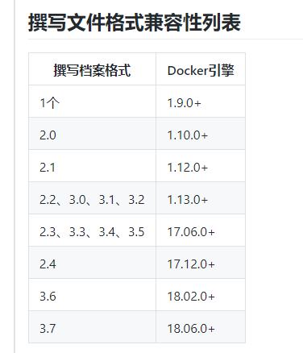
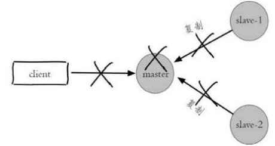
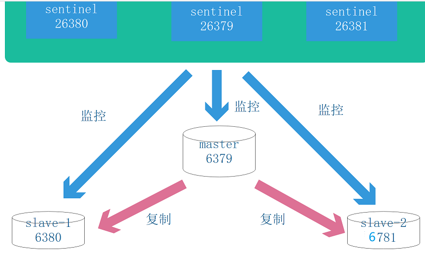
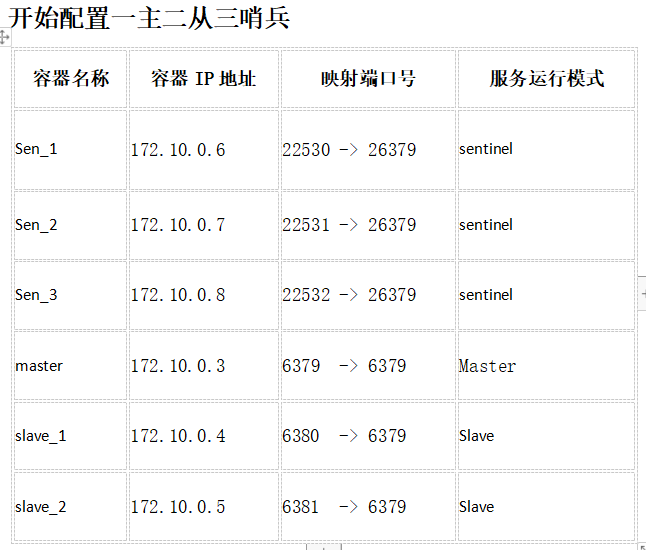
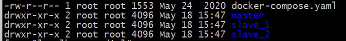
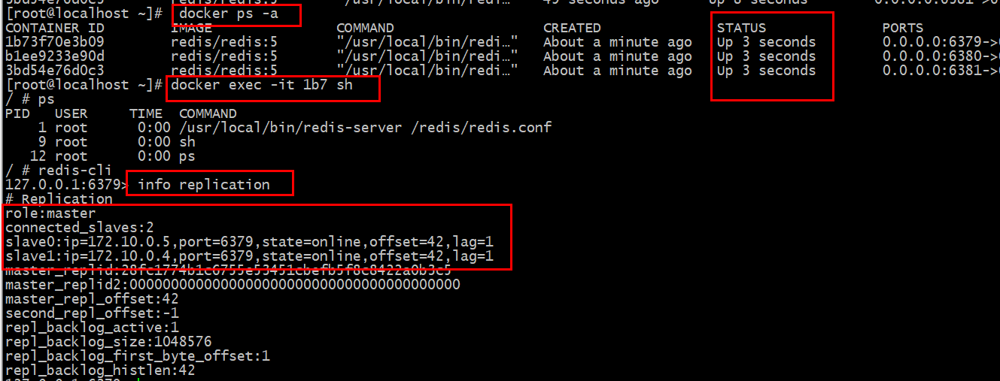
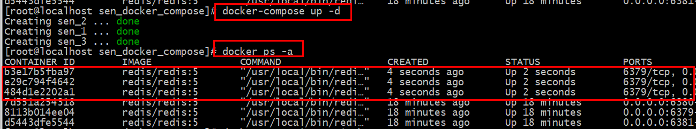

# 初试哨兵
docker指令
````
Docker 指令
0.启动docker  systemctl start docker
1. docker network ls  查看默认的网络
2.开启所有容器 docker start  $(docker ps -a -q) 
3. 停止所容器docker stop  $(docker ps -a -q) 
4. 删除 所有容器  docker rm  $(docker ps -a -q) 
5. 因为默认的网络不能制定固定的地址，所以我们将创建自定义网络，并指定网段：172.10.0.0/1并命名为mynetwork，指令docker network create  --subnet=172.10.0.0/16  mynetwork
6. docker network ls 展示所有网络
7.Docker ps -a 产看所有容器
8.Docker images 查看所有的镜像
9.Docker rm 容器名1(或者id )  容器名2(或者id )   删除一个或者多个容器
10.Docker stop 容器名1(或者id )  容器名2(或者id )  停止一个或者多个容器
11.Docker exec -it 容器名(或者id) bash
12.Exit 退出容器
13.docker run -itd  --name  sentinel-1  --net will  -v /root/sentinel.conf:/usr/docker/sentinel/sentinel.conf -p 26379:26379  --ip 172.11.0.8  redis    共享目录
````
## 1.Compose介绍
>Compose是 Docker 的服务编排工具，主要用来构建基于Docker的复杂应用Compose 通过一个配置文件来管理多个 -Docker 容器，非常适合组合使用多个容器进行开发的场景。

>用了``docker-composer``之后，你就可以把这些命令一次性写在 ``docker-composer.yml``或者``docker-composer.yaml``文件中，以后每次启动这一整个环境的时候，你只要敲一个``docker-composer up``命令就ok了。 dockerfile 的作用是从无到有的构建镜像。它包含安装运行所需的环境、程序代码等。这个创建过程就是使用 dockerfile 来完成的。Dockerfile -为 docker build 命令准备的，用于建立一个独立的 image ，在 docker-compose 里也可以用来实时 build

#### 安装
- [道客云安装](http://get.daocloud.io/#install-compose)
````
Docker Compose 存放在Git Hub，不太稳定。
你可以也通过执行下面的命令，高速安装Docker Compose。

curl -L https://get.daocloud.io/docker/compose/releases/download/1.25.5/docker-compose-`uname -s`-`uname -m` > /usr/local/bin/docker-compose
chmod +x /usr/local/bin/docker-compose
````
- [官方安装](https://github.com/docker/compose)
>速度会慢些,不推荐使用
````
Curl方式下载新的版本
curl -L https://github.com/docker/compose/releases/download/1.22.0/docker-compose-`uname -s`-`uname -m` > /usr/local/bin/docker-compose
修改权限
chmod +x /usr/local/bin/docker-compose
````
安装完成后可以查看版本：``docker-compose --version``

卸载`` rm /usr/local/bin/docker-compose``
#### 使用步骤
- 定义Dockerfile，方便迁移到任何地方；
- 编写docker-compose.yml文件；
- 运行docker-compose up启动服务
>注意:docker-compose不负责帮助我们一步步的构建镜像,他只负责从本地已有的镜像或者是dockerfile或者是远程仓库的中的镜像来帮助我们构建容器

#### 参数说明
yml文件的书写类似于python,以换行符作为命令的结束标志,十分注重格式

- version  : 根据你宿主机docker的版本,对应相应的version版本
````
[root@localhost bin]# docker -v
Docker version 18.03.1-ce, build 9ee9f40

这里就应该选用 service 3.6
````


- service : 一个应用容器，实际上可以运行多个相同镜像的实例,直白点就是构建一组服务

#### 以构建lrnp为实例
````
文本获取地址:
链接：https://pan.baidu.com/s/1VA3K8lA9bM3m0zCePoeTaQ 
提取码：ash8
~~~~~~~~~~~~~~~~~~~~~~~~~~~~~~~~~~~~~~~~~~~~~~~~~~~~~~~~~~~~~~~~~~~~~~~~~~~~~~~~~
version: "3.6"

services: # 代表就是构建一组服务 -》一组容器 php,nginx,redis
  php:  # 要创建的服务-》就是容器php
    build:
      context: ./php
    image: php_compose
    container_name: php_compose # 指定创建的容器名称
    networks:
      cluster_net:
        ipv4_address: 172.16.238.100
    ports: # 绑定端口
      - "9001:9000" # - "宿主机端口 ： 容器端口"
    volumes: # 数据卷
      - "/redis_2004/09/test/php/www:/www" # - "宿主机目录 ： 容器目录"
  nginx: # 要创建的服务-》就是容器nginx
    build:
      context: ./nginx
    image: nginx_compose
    container_name: nginx_compose # 指定创建的容器名称
    ports:
      - "8001:80"
    volumes:
      - "/redis_2004/09/test/nginx/conf:/conf"
    command: top
  redis: # 要创建的服务-》就是容器redis
    image: redis5asm
    container_name: redis_compose # 指定创建的容器名称
    networks:
      redis5sm:
        ipv4_address: 192.160.1.100
    ports:
      - "6379:6379"
    command: top
# 设置网络段
networks:
  # 自定义网络段
  cluster_net:
    driver: bridge
    ipam:
      config:
        - subnet: "172.16.238.0/24"
  # 引用外部的网络段
  redis5sm:
    external: # 标识为扩展的
      name: redis5sm
~~~~~~~~~~~~~~~~~~~~~~~~~~~~~~~~~~~~~~~~~~~~~~~~~~~~~~~~~~~~~~~~~~~~~~~~~~~~~~~~~~~~~
查看容器的日志信息 docker logs 容器名 例如: ``docker logs master``
````
- 我们启动应用： ``docker-compose up``
- 如果想后台运行：``docker-compose up –d``
- 查看状态： ``docker-compose ps``
- 停止服务： ``docker-compose stop``
- 重新启动服务： ``docker-compose restart``

---
## 2.哨兵详解
>我们讲了 Redis 复制的主要内容，但 Redis 复制有一个缺点，当主机 Master 宕机以后，我们需要人工解决切换，比如使用 slaveof no one 。实际上主从复制 并没有实现高可用。



>一旦主节点宕机，写服务无法使用，就需要手动去切换，重新选取主节点，手动设置主从关系。

>Redis Sentinel 一个分布式架构，其中包含若干个 Sentinel 节点和 Redis 数据节点，每个 Sentinel 节点会对数据节点和其余 Sentinel 节点进行监 控，当它发现节点不可达时，会对节点做下线标识。 
>
>如果被标识的是主节点，它还会和其他 Sentinel 节点进行“协商”，当大多数 Sentinel 节点都认为主节点不可达时，它们会选举出一个 Sentinel 节点来 完成自动故障转移的工作，同时会将这个变化实时通知给 Redis 应用方。整个过程完全是自动的，不需要人工来介入，所以这套方案很有效地解决了 Redis 的高可用问题。



#### 并且Redis Sentinel 具有以下几个功能： 
- 监控：Sentinel 节点会定期检测 Redis 数据节点、其余 Sentinel 节点是否可达 
- 通知：Sentinel 节点会将故障转移的结果通知给应用方 
- 主节点故障转移： 实现从节点晋升为主节点并维护后续正确的主从关系 
- 配置提供者： 在 Redis Sentinel 结构中，客户端在初始化的时候连接的是 Sentinel 节点集合 ，从中获取主节点信息。 
>同时Redis Sentinel 包含了若个 Sentinel 节点，这样做也带来了两个好处： 
- 对于节点的故障判断是由多个 Sentinel 节点共同完成，这样可以有效地防止误判。 
- Sentinel 节点集合是由若干个 Sentinel 节点组成的(最好是奇数个)，这样即使个别 Sentinel 节点不可用，整个 Sentinel 节点集合依然是健壮的。 
>但是 Sentinel 节点本身就是独立的 Redis 节点，只不过它们有一些特殊，它们不存储数据， 只支持部分命令
---
## 3.利用docker-compose构建哨兵
>哨兵不影响主从结构,只是做监控
````
redis镜像构建

FROM alpine:3.11
RUN sed -i 's/dl-cdn.alpinelinux.org/mirrors.aliyun.com/g' /etc/apk/repositories \
  && apk add  gcc g++ libc-dev  wget vim  openssl-dev make  linux-headers \
  && rm -rf /var/cache/apk/*

COPY ./redis-5.0.7.tar.gz redis-5.0.7.tar.gz

#通过选择更小的镜像，删除不必要文件清理不必要的安装缓存，从而瘦身镜像
#创建相关目录能够看到日志信息跟数据跟配置文件  sh
RUN mkdir -p /usr/src/redis \
      && mkdir -p /redis/data \
      && mkdir -p /redis/conf \
      && mkdir -p /redis/log   \
      && mkdir -p /var/log/redis \
      && tar -zxvf redis-5.0.7.tar.gz -C /usr/src/redis \
      && rm -rf redis-5.0.7.tar.gz \
      && cd /usr/src/redis/redis-5.0.7 && make \
      && cd /usr/src/redis/redis-5.0.7 && make install;

EXPOSE 6379

CMD ["redis-server","/redis/conf/redis.conf"]
````
#### 编排规划


#### 主从的编排

````
主服务器配置
bind 0.0.0.0
port 6379
protected-mode no
logfile "/redis/redis.log"
dir "/redis"
daemonize no


两个从服务器配置
bind 0.0.0.0
protected-mode no
port 6379
daemonize no
logfile "/redis/redis.log"
dir "/redis"
replicaof 172.10.0.3 6379
````

主从 ``docker-compose.yaml``
````
version: "3.6"
services: # 代表就是构建一组服务 -》一组容器 php,nginx,redis
  master:  # 要创建的服务-》就是容器php
    image: redis/redis:5
    networks:
      redis:
        ipv4_address: 172.10.0.3
    container_name: master # 指定创建的容器名称
    ports: # 绑定端口
      - "6379:6379" # - "宿主机端口 ： 容器端口"
    volumes: # 数据卷
      - "/redis/master:/redis" # - "宿主机目录 ： 容器目录"
    command: /usr/local/bin/redis-server /redis/redis.conf
  slave_1:  # 要创建的服务-》就是容器php
    image: redis/redis:5
    networks:
      redis:
        ipv4_address: 172.10.0.4
    container_name: slave_1 # 指定创建的容器名称
    ports: # 绑定端口
      - "6380:6379" # - "宿主机端口 ： 容器端口"
    volumes: # 数据卷
      - "/redis/slave_1:/redis" # - "宿主机目录 ： 容器目录"
    command: /usr/local/bin/redis-server /redis/redis.conf
  slave_2:  # 要创建的服务-》就是容器php
    image: redis/redis:5
    container_name: slave_2 # 指定创建的容器名称
    networks:
      redis:
        ipv4_address: 172.10.0.5
    ports: # 绑定端口
      - "6381:6379" # - "宿主机端口 ： 容器端口"
    volumes: # 数据卷
      - "/redis/slave_2:/redis" # - "宿主机目录 ： 容器目录"
    command: /usr/local/bin/redis-server /redis/redis.conf
# 设置网络段
networks:
  # 引用外部的网络段
  redis:
    external: # 标识为扩展的
      name: redis
````


#### 哨兵的编排
哨兵的配置文件
````
bind 0.0.0.0
port 26379
protected-mode no
logfile "/redis/sentinel.log"
daemonize no

sentinel monitor mymaster 172.10.0.3 6379 2
# 配置检测主机点超过多久,多长时间没有ping通 单位毫秒
sentinel down-after-milliseconds mymaster 30000
# 配置故障迁移时间,如果超出了指定时间标识失败
sentinel failover-timeout mymaster 180000
# 避免复制风暴
sentinel parallel-syncs mymaster 1
````
哨兵``docker-compose.yaml``
````
version: "3.6"
services: # 代表就是构建一组服务 -》一组容器 php,nginx,redis
  sen_1:  # 要创建的服务-》就是容器php
    image: redis/redis:5
    networks:
      redis:
        ipv4_address: 172.10.0.6
    container_name: sen_1 # 指定创建的容器名称
    ports: # 绑定端口
      - "22530:26379" # - "宿主机端口 ： 容器端口"
    volumes: # 数据卷
      - "/redis/sen__1:/redis" # - "宿主机目录 ： 容器目录"
    command: /usr/local/bin/redis-sentinel /redis/sentinel.conf
  sen_2:  # 要创建的服务-》就是容器php
    image: redis/redis:5
    networks:
      redis:
        ipv4_address: 172.10.0.7
    container_name: sen_2 # 指定创建的容器名称
    ports: # 绑定端口
      - "22531:26379" # - "宿主机端口 ： 容器端口"
    volumes: # 数据卷
      - "/redis/sen__2:/redis" # - "宿主机目录 ： 容器目录"
    command: /usr/local/bin/redis-sentinel /redis/sentinel.conf
  sen_3:  # 要创建的服务-》就是容器php
    image: redis/redis:5
    networks:
      redis:
        ipv4_address: 172.10.0.8
    container_name: sen_3 # 指定创建的容器名称
    ports: # 绑定端口
      - "22532:26379" # - "宿主机端口 ： 容器端口"
    volumes: # 数据卷
      - "/redis/sen__3:/redis" # - "宿主机目录 ： 容器目录"
    command: /usr/local/bin/redis-sentinel /redis/sentinel.conf
# 设置网络段
networks:
  # 引用外部的网络段
  redis:
    external: # 标识为扩展的
      name: redis
````


进入其中一个哨兵查看信息
````
127.0.0.1:26379> info sentinel
# Sentinel
sentinel_masters:1
sentinel_tilt:0
sentinel_running_scripts:0
sentinel_scripts_queue_length:0
sentinel_simulate_failure_flags:0
master0:name=mymaster,status=ok,address=172.10.0.3:6379,slaves=2,sentinels=3
````

