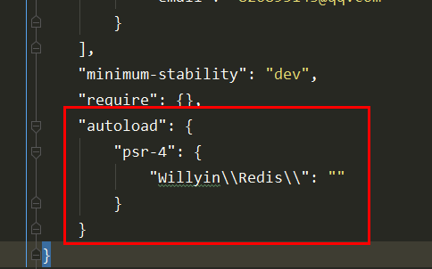
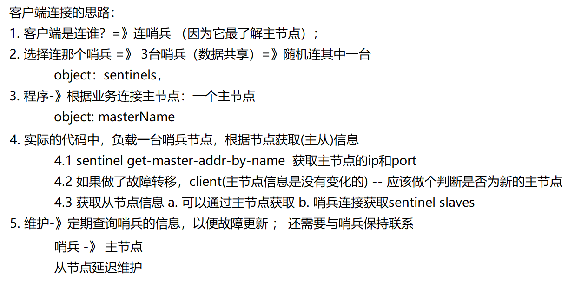

# 哨兵详解
## 1. sentinel命令
sentinel是一个特殊的redis节点，它有自己专属的api；
````
1. sentinel masters 显示被监控的所有master以及它们的状态. 
2. sentinel master <master name> 显示指定master的信息和状态； 
3. sentinel slaves <master name> 显示指定master的所有slave以及它们的状态； 
4. sentinel get-master-addr-by-name <master name> 返回指定master的ip和端口， 如果正在进行failover或者failover已经完成，将会显示被提升 为master的slave的ip和端口。 
5. sentinel failover <master name> 强制sentinel执行failover，并且不需要得到其他sentinel的同意。 但是failover后会将最新的配置发送给其他 sentinel。
````
- sentinel masters
>展示所有被监控的主节点状态以及相关的信息  (因为这里只是监控了一台redis,所以信息只有一个)  如：
````
/ # redis-cli -p 26379
127.0.0.1:26379> sentinel masters
1)  1) "name"
    2) "mymaster"
    3) "ip"
    4) "172.10.0.3"
    5) "port"
    6) "6379"
    7) "runid"
    8) "285c0baf3136caa02e612cb089d5c503a24804b6"  .....
````
-  sentinel master <master name>
>展示指定<master name>状态以及相关的统计信息
````
127.0.0.1:26379> sentinel masters mymaster
1)  1) "name"
    2) "mymaster"
    3) "ip"
    4) "172.10.0.3"
    5) "port"
    6) "6379"
    7) "runid"
    8) "285c0baf3136caa02e612cb089d5c503a24804b6" ....
````
-  sentinel slaves <master name>
>展示指定<master name>的从节点状态以及相关的统计信息，如：
````
127.0.0.1:26379> sentinel slaves mymaster
1)  1) "name"
    2) "172.10.0.5:6379"
    3) "ip"
    4) "172.10.0.5"
    5) "port"
    6) "6379"
    7) "runid"
    8) "d16ea2deb3bf8b142e2f116236f563c47b7a9038"   ....
2)  1) "name"
    2) "172.10.0.4:6379"
    3) "ip"
    4) "172.10.0.4"
    5) "port"
    6) "6379"
    7) "runid"
    8) "592e8cba08f4222ff27661f6ddd4dd171dae6264"    ....
````
- sentinel sentinels <master name>
>展示指定 <master name> 的sentinel节点集合（不包含当前sentinel节点）如:
````
127.0.0.1:26379> sentinel sentinels mymaster
1)  1) "name"
    2) "92f13ab0dae3dd0834f57ac255cd24c20144ea57"
    3) "ip"
    4) "172.10.0.8"
    5) "port"
    6) "26379"
    7) "runid"
    8) "92f13ab0dae3dd0834f57ac255cd24c20144ea57"    ....
2)  1) "name"
    2) "8eff4fa027ec20ffd3378889151552105c231375"
    3) "ip"
    4) "172.10.0.7"
    5) "port"
    6) "26379"
    7) "runid"
    8) "8eff4fa027ec20ffd3378889151552105c231375"     ....
````
- sentinel get-master-addr-by-name <master name>
>获取主节点信息
````
127.0.0.1:26379> sentinel get-master-addr-by-name mymaster
1) "172.10.0.3"
2) "6379"
````
-  sentinel failover <master name>
>对<master name>进行强制故障转移
````
127.0.0.1:26379> sentinel failover mymaster 
OK
127.0.0.1:26379> info sentinel 
# Sentinel 
sentinel_masters:1 
sentinel_tilt:0 
sentinel_running_scripts:0 
sentinel_scripts_queue_length:0 
sentinel_simulate_failure_flags:0 
master0:name=mymaster,status=ok,address=192.160.1.80:6379,slaves=2,sentinels=3
````
- sentinel reset
>故障清理命令
---
## 2. 源码复现哨兵机制
我们使用[composer组件开发](https://www.jianshu.com/p/3b871acc6259)
````
D:\phpstudy\phpstudy_pro\WWW\redis--swoole>composer init                                        
  Welcome to the Composer config generator  
                           
This command will guide you through creating your composer.json config.

Package name (<vendor>/<name>) [administrator/redis--swoole]: willyin/redis
Description []: this is test for redis sentinel
Author [will <826895143@qq.com>, n to skip]:
Minimum Stability []: dev
Package Type (e.g. library, project, metapackage, composer-plugin) []: 1
License []: MIT

Define your dependencies.

Would you like to define your dependencies (require) interactively [yes]?
Search for a package:
Would you like to define your dev dependencies (require-dev) interactively [yes]?

.....


在上一步生成的composer.json中追加
 "autoload": {
        "psr-4": {
            "Willyin\\Redis\\": ""
        }
    }

最后更新:   composer update

检测vender下 auto_load_psr4.php,出现以下内容即可

$vendorDir = dirname(dirname(__FILE__));
$baseDir = dirname($vendorDir);

return array(
    'Willyin\\Redis\\' => array($baseDir . '/'),
);
````


#### 功能设计


````
[2020-05-19 03:02:39 *28949.0]  ERROR   php_swoole_server_rshutdown (ERRNO 503): Fatal error: Uncaught Error: Class 'Willyin\Redis\SentinelClient\RedisMS' not found in /www/will/redisStudy/SentinelClient/test/index.php:14
Stack trace:
#0 {main}
  thrown in /www/will/redisStudy/SentinelClient/test/index.php on line 14
````
遇到这个错误,从新加载composer,到composer.json所在目录下执行以下命令
````
drwxr-xr-x 3 root root 4096 May 19 03:01 vendor
[root@localhost redisStudy]# composer config -g repo.packagist composer https://mirrors.aliyun.com/composer/

Do not run Composer as root/super user! See https://getcomposer.org/root for details

[root@localhost redisStudy]# composer update

Do not run Composer as root/super user! See https://getcomposer.org/root for details
Loading composer repositories with package information
Updating dependencies (including require-dev)
Nothing to install or update
Generating autoload files
````
目录结构
````
redisStudy 
- SentinelClient 
    - test 
        - config.php 
        - index.php 
    - Input.php 
    - RedisMs.php
    - Tratis
        - Sentinel.php
- vendor
- composer.json
````
素材内容
- ``redisStudy\composer.json``
````
{
    "name": "willyin/redis-study",
    "authors": [
        {
            "name": "willyin",
            "email": "826895143@qq.com"
        }
    ],
    "require": {},
    "autoload":{
        "psr-4":{
            "Willyin\\Redis\\":""
        }
    }
}
````
- ``redisStudy\SentinelClient\RedisMs.php``
````
<?php
namespace Willyin\Redis\SentinelClient;

use Willyin\Redis\SentinelClient\Tratis\Sentinel;

class RedisMS
{
   use Sentinel;

   protected $config;

   /**
    * 记录redis连接
    * [
    *     "master" => \\Redis,
    *     "slaves "=> [
    *       'slaveIP1:port' => \Redis
    *       'slaveIP2:port' => \Redis
    *       'slaveIP3:port' => \Redis
    *    ],
    *    'sentinel' => [
    *
    *    ],
    * ]
    */
   protected $connections;

   protected $connIndexs;

   protected $call = [
       'write' => [
           'set',
           'sadd'
       ],
       'read' => [
           'get',
           'smembers'
       ],
   ];

   public function __construct($config)
   {
       $this->config = $config;
       $this->{$this->config['initType']."Init"}();
   }

   // ---初始化操作---

    protected function isMsInit()
    {
        $this->connections['master'] = $this->getRedis($this->config['master']['host'], $this->config['master']['port']);

        $this->createConn($this->config['slaves']);

        // Input::info($this->connections, "这是获取的连接");
        // Input::info($this->connIndexs, "这是连接的下标");

        $this->maintain();
    }

    protected function isNormalInit()
    {
        $this->connections['master'] = $this->getRedis($this->config['master']['host'], $this->config['master']['port']);
    }

   /**
    * 去维护从节点列表
    *
    * 重整 1台服务器，多个从节点
    */
   protected function maintain()
   {
        swoole_timer_tick(2000, function ($timer_id) use($masterRedis){
            if ($this->config['initType'] == 'isSentinel') {
                Input::info("哨兵检测");
                $this->sentinelInit();
            }
            $this->delay();
        });
   }
   // 这是处理从节点延迟问题
   protected function delay()
   {
       try {
           $masterRedis = $this->getMaster(); // 故障迁移之后是使用原有主节点的连接
           $replInfo = $masterRedis->info('replication');
       } catch (\Exception $e) {
           Input::info("哨兵检测");
           return null;
       }

       $masterOffset = $replInfo['master_repl_offset'];
       $slaves = [];
       for ($i=0; $i < $replInfo['connected_slaves']; $i++) {
           $slaveInfo = $this->stringToArr($replInfo['slave'.$i]);
           $slaveFlag = $this->redisFlag($slaveInfo['ip'], $slaveInfo['port']);
           if (($masterOffset - $slaveInfo['offset']) < 1000) {
               if (!in_array($slaveFlag, $this->connIndexs)) {
                   $slaves[$slaveFlag] = [
                       'host' => $slaveInfo['ip'],
                       'port' => $slaveInfo['port']
                   ];
                   // Input::info($slaveFlag, "新增从节点");
               }
           } else {
               // Input::info($slaveFlag, "删除节点");
               unset($this->connections['slaves'][$slaveFlag]);
           }
       }
       $this->createConn($slaves);
   }

   protected function stringToArr($str, $flag1 = ',', $flag2 = '=')
   {
       $arr = explode($flag1, $str);
       $ret = [];
       foreach ($arr as $key => $value) {
           $arr2 = explode($flag2, $value);
           $ret[$arr2[0]] = $arr2[1];
       }
       return $ret;
   }

   /**
    * $slaves = [
    *   'slave1' => [
    *     'host' => '192.160.1.130',
    *     'port' => 6379
    *    ],
    *   'slave2' => [
    *     'host' => '192.160.1.140',
    *     'port' => 6379
    *   ]
    * ]
    */
   protected function createConn($conns, $flag = 'slaves')
   {
       foreach ($conns as $key => $conn) {
          if ($redis = $this->getRedis($conn['host'], $conn['port'])) {
            $this->connections[$flag][$this->redisFlag($conn['host'], $conn['port'])] = $redis;
          }
       }
       $this->connIndexs[$flag] = array_keys($this->connections[$flag]);
   }

   protected function redisFlag($host, $port)
   {
       return $host.":".$port;
   }

   public function getRedis($host, $port)
   {
      try {
          $redis = new \Redis();
          $redis->pconnect($host, $port);
          return $redis;
      } catch (\Exception $e) {
          Input::info($this->redisFlag($host, $port),"连接有问题");
          return null;
      }

   }

   public function getconnIndexs()
   {
       return $this->connIndexs;
   }


   public function getMaster()
   {
       return $this->connections['master'];
   }
   public function getSlaves()
   {
       return $this->connections['slaves'];
   }

   public function oneConn($flag = 'slaves')
   {
       $indexs = $this->connIndexs[$flag];
       $i = mt_rand(0, count($indexs) - 1);

       Input::info($indexs[$i], "选择的连接");

       return $this->connections[$flag][$indexs[$i]];
   }


   public function runCall($command, $params = [])
   {
       try {
           // if ($this->config['is_ms']) {

               $redis = $this->getRedisCall($command);
               return $redis->{$command}(...$params);
           // }
       } catch (\Exception $e) {}
   }
   /**
    * 判断操作类型
    * @param  [type]  $command [description]
    * @return boolean          [description]
    */
   protected function getRedisCall($command)
   {
       if (in_array($command, $this->call['write'])) {
           return $this->getMaster();
       } else if (in_array($command, $this->call['read'])){
           return $this->oneConn();
       } else {
           throw new \Exception("不支持");
       }
   }
}
````
-  ``redisStudy/SentinelClient/Input.php``
````
<?php
namespace Willyin\Redis\SentinelClient;
class Input
{
    public static function info($message, $description = null)
    {
        echo "======>>> ".$description." start\n";
        if (\is_array($message)) {
            echo \var_export($message, true);
        } else if (\is_string($message)) {
            echo $message."\n";
        } else {
            var_dump($message);
        }
        echo  "======>>> ".$description." end\n";
    }
}

````
- ``redisStudy/SentinelClient/test/config.php``
````
<?php
$config = [
    'host' => '',
    'port' => '',
    // 'is_ms' => true,
    // isMs, isSentinel, isNormal 正常
    'initType' => 'isSentinel',
    'master' => [
        'host' => '172.10.0.3',
        'port' => 6379,
    ],
    'slaves' => [
        'slave1' => [
            'host' => '172.10.0.4',
            'port' => 6379,
        ],
        'slave2' => [
            'host' => '172.10.0.5',
            'port' => 6379,
        ],
    ],
    'sentinels' => [
        'master_name' => 'mymaster', // 指定哨兵监控主节点的别名
        'addr' => [ // 配置的是哨兵的ip port
            [
                'host' => '172.10.0.6',
                'port' => 26379
            ],[
                'host' => '172.10.0.7',
                'port' => 26379
            ],[
                'host' => '172.10.0.8',
                'port' => 26379
            ]
        ]
    ]
];

````
- ``redisStudy/SentinelClient/Tratis/Sentinel.php``
````
<?php
namespace Willyin\Redis\SentinelClient\Tratis;

use Willyin\Redis\SentinelClient\Input;

/**
 *
 */
trait Sentinel
{
    protected $masterName = null;

    protected $masterFlag = null;

    protected $sentinelFlag = 'sentinel';

    protected function isSentinelInit()
    {
        $this->setSentinels($this->config['sentinels']['addr']);
        $this->sentinelInit();
    }

    public function sentinelInit()
    {
        // 获取哨兵
        $sentinel = $this->oneConn($this->sentinelFlag);
        // Input::info($sentinel);
        $masterInfo = $sentinel->rawCommand('sentinel', 'get-master-addr-by-name', $this->config['sentinels']['master_name']);
        $newFlag = $this->redisFlag($masterInfo[0], $masterInfo[1]);
        // 判断是否新的主节点
        if ($this->masterFlag == $newFlag) {
            Input::info("主节点没有问题");
            return;
        }
        Input::info($newFlag , "主节点有问题，切换节点");
        $this->masterFlag = $newFlag;

        // 配置维护

        unset($this->config['master']);
        unset($this->config['slaves']);

        $this->config['master'] = [
            'host' => $masterInfo[0],
            'port' => $masterInfo[1]
        ];

        $slavesInfo = $sentinel->rawCommand('sentinel', 'slaves', $this->config['sentinels']['master_name']);
        foreach ($slavesInfo as $key => $slave) {
            $this->config['slaves'][$key] = [
                'host' => $slave[3],
                'port' => $slave[5]
            ];
        }

        Input::info($this->config);

        $this->isMsInit();
    }

    public function setSentinels($sentinels)
    {
        $this->createConn($sentinels, $this->sentinelFlag);
    }
}
````
- 入口文件``redisStudy/SentinelClient/test/index.php``
````
<?php
require __DIR__.'/../../vendor/autoload.php';

use Willyin\Redis\SentinelClient\RedisMS;

$http = new Swoole\Http\Server("0.0.0.0", 9501);

$http->set([
    'worker_num' => 1
]);
$http->on('workerStart', function ($server, $worker_id) use($config){
    global $redisMS;
    require_once "./config.php";
    $redisMS = new RedisMS($config);
});

$http->on('request', function ($request, $response) {
    global $redisMS;
    $ret = 'p';
    if ($request->get['type'] == 1) {
        $ret = $redisMS->runCall($request->get['method'], explode(',', $request->get['params']));
    } else {
        // 读
        $ret = $redisMS->runCall('get', [$request->get['params']]);
    }

    $response->end($ret);
});

$http->start();

````

--- 
## 3. 哨兵的切换实现原理
#### [发布订阅](http://doc.redisfans.com/topic/pubsub.html)
````
publish channel message -- 发布消息 
publish channel:sports "hello channel" -- 向channel:sports发送消息 
subscribe channel [channel ...] -- 订阅消息
````
 对于redis的发布订阅来说消息是不会做保存的
 
#### [哨兵的实现原理](http://doc.redisfans.com/topic/sentinel.html)
````
1.检测问题，主要讲的是三个定时任务，这三个内部的执行任务可以保证出现问题马上让 Sentinel 知道。 
2.发现问题，主要讲的是主观下线和客观下线。当有一台 Sentinel 机器发现问题时，它就会主观对它主观下线。 但是当多个 Sentinel 都发现有问题的时候，才会出现客观下线。 
3.找到解决问题的人，主要讲的是领导者选举，如何在 Sentinel 内部多台节点做领导者选举，选出一个领导者。 
4.解决问题，主要讲的是故障转移，即如何进行故障转移
````
#### 三个定时任务
- 每10秒每个 Sentinel 对 Master 和 Slave 执行一次 Info Replication 。
>第一个定时任务，指的是 Redis Sentinel 可以对 Redis 节点做失败判断和故障转移，在 Redis 内部有三个定时任务作为基础，来 Info Replication 发现 Slave 节点， 这个命令可以确定主从关系。 
- 每2秒每个 Sentinel 通过 Master 节点的 channel 交换信息（pub/sub）。 
>第二个定时任务，类似于发布订阅， Sentinel 会对主从关系进行判定，通过 sentinel:hello 频道交互。了解主从关系可以帮助更好的自动化操作 Redis 。然后 Sentinel 会告知系统消息给其它 Sentinel 节点，最终达到共识，同时 Sentinel 节点能够互相感知到对方。
- 每1秒每个 Sentinel 对其他 Sentinel 和 Redis 执行 ping
>第三个定时任务，指的是对每个节点和其它 Sentinel 进行心跳检测，它是失败判定的依据

#### 部署建议
- Sentinel 节点不应该部署在一台物理“机器”上。 这里特意强调物理机是因为一台物理机做成了若干虚拟机或者现今比较流行的容器，它们虽然有不同的 ** IP ** 地址，但实际上它们都是同一台物理机，同 一 台物理机意味着如果这台机器有什么硬件故障，所有的虚拟机都会受到影响，为了实现 Sentinel 节点集合真正的高可用，请勿将 ** Sentinel **节点部署在 同一 台物理机器上。 
- 部署至少三个且奇数个的 Sentinel 节点。 
- 个以上是通过增加 Sentinel 节点的个数提高对于故障判定的准确性，因为领导者选举需要至少一半加1个节点。 奇数个节点可以在满足该条件的基础上节省一 个节点。
#### 需要关注的问题
配置
````
min-slaves-to-write 1 -- 要求至少有1个slave 
min-slaves-max-lag 10 -- 数据复制和同步的延迟不能超过10秒,如果说一旦所有的slave，数据复制和同步的延迟都超过了10秒钟，那么这个时候， master就不会再接收任何请求了
````
- 异步复制导致数据丢失
>描述：因为master->slave的复制是异步，所以可能有部分还没来得及复制到slave就宕机了，此时这些部分数据就丢失了。 解决：在异步复制的过程当中，通过 min-slaves-max-lag 这个配置，就可以确保的说，一旦 slave 复制数据和 ack 延迟时间太长，就认为可能 master 宕机 后损失的数据太多了，那么就拒绝写请求， 这样就可以把master宕机时由于部分数据未同步到 slave 导致的数据丢失降低到可控范围内
- 集群脑裂导致数据丢失
>描述: 脑裂，也就是说，某个master所在机器突然脱离了正常的网络，跟其它slave机器不能连接，但是实际上master还运行着此时哨兵可能就会认为master宕机 了，然后开始选举，将其它 slave 切换成 master 。这时候集群里就会有2个 master ，也就是所谓的脑裂。此时虽然某个 slave 被切换成了 master ，但是可能client 还没来得及切换成新的 master ，还继续写向旧的 master 的数据可能就丢失了。因此旧master再次恢复的时候，会被作为一个 slave 挂到新的 master 上去，自己的数据会被清空，重新从新的 master 复制数据。怎么解决 解决：集群脑裂因为 client 还没来得及切换成新的 master ，还继续写向旧的 master 的数据可能就丢失了 通过 min-slaves-to-write 确保必须是有多少个从 节点连接，并且延迟时间小于 min-slaves-max-lag 多少秒
>
>对于客户端来说：就需要做些处理，比如先将数据缓存到内存当中，然后过一段时间处理，或者连接失败，接收到错误切换新的 master 处理

#### 代码流程
首先可以根据启动来看，在之前有提过哨兵有两种启动方式分别通过redis-server,redis-sentinel这两方式启动；

可以看看server.c中的代码体现:

````
int main(int argc, char **argv) { 
server.sentinel_mode = checkForSentinelMode(argc,argv); 
/*...省略代码....*/ 
if (server.sentinel_mode) { 
initSentinelConfig(); // 讲监听端口设置为26379 
initSentinel(); // 更改哨兵可执行命令。哨兵中只能执行优先的几种服务端命令，如ping，sentinel等 
}
/*...省略代码....*/ 
/* 哨兵的配置通过 sentinelHandleConfiguration 在config.c中加载 */
if (!server.sentinel_mode) { 
} else { 
InitServerLast(); 
sentinelIsRunning();
 // 随机生成一个40子节点哨兵id，打印启动日志 
} }
````
在主程序的函数中主要是对于哨兵进行初始，而实际的简历命令连接和消息连接是通过redis的时间让我severCron处理的
````
int serverCron(){
 /*...省略代码....*/ 
if (server.sentinel_mode) sentinelTimer();
/*...省略代码....*/ 
}
````
哨兵每次执行serverCron时，都会调用sentineTimer()函数。该函数会建立连接，并且定时发送心跳包并采集信息。该函数主要功能如下。
- 简历命令连接和消息连接。消息连接建立之后会订阅redis服务的__sentinel__:hello频道。 
- 在命令连接上每10s发送info命令进行信息采集；每1s在命令连接上发送ping命令探测存活性； ...
 