# Redis集群部署
## 1.关于哨兵的补充
### 1.1 需要关注的问题
配置
````
min-slaves-to-write 1 -- 要求至少有1个slave 

min-slaves-max-lag 10 -- 数据复制和同步的延迟不能超过10秒,如果说一旦所有的slave，数据复制和同步的延迟都超过了10秒钟，那么这个时候， master就不会再接收任何请求了
````
 - 异步复制导致数据丢失
 >描述：因为master->slave的复制是异步，所以可能有部分还没来得及复制到slave就宕机了，此时这些部分数据就丢失了。 解决：在异步复制的过程当中，通过 min-slaves-max-lag 这个配置，就可以确保的说，一旦 slave 复制数据和 ack 延迟时间太长，就认为可能 master 宕机 后损失的数据太多了，那么就拒绝写请求， 这样就可以把master宕机时由于部分数据未同步到 slave 导致的数据丢失降低到可控范围内
- 集群脑裂导致数据丢失
>描述: 脑裂，也就是说，某个master所在机器突然脱离了正常的网络，跟其它slave机器不能连接，但是实际上master还运行着此时哨兵可能就会认为master宕机 了，然后开始选举，将其它 slave 切换成 master 。这时候集群里就会有2个 master ，也就是所谓的脑裂。此时虽然某个 slave 被切换成了 master ，但是可能client 还没来得及切换成新的 master ，还继续写向旧的 master 的数据可能就丢失了。因此旧master再次恢复的时候，会被作为一个 slave 挂到新的 master 上去，自己的数据会被清空，重新从新的 master 复制数据。怎么解决 解决：集群脑裂因为 client 还没来得及切换成新的 master ，还继续写向旧的 master 的数据可能就丢失了 通过 min-slaves-to-write 确保必须是有多少个从 节点连接，并且延迟时间小于 min-slaves-max-lag 多少秒
>
>对于客户端来说：就需要做些处理，比如先将数据缓存到内存当中，然后过一段时间处理，或者连接失败，接收到错误切换新的 master 处理

### 1.2 代码流程
首先可以根据启动来看，在之前有提过哨兵有两种启动方式分别通过redis-server,redis-sentinel这两方式启动； 

可以看看server.c中的代码体现:
````
int main(int argc, char **argv) { 
server.sentinel_mode = checkForSentinelMode(argc,argv); 

/*...省略代码....*/ 
if (server.sentinel_mode) { 
initSentinelConfig(); // 讲监听端口设置为26379 
initSentinel(); // 更改哨兵可执行命令。哨兵中只能执行优先的几种服务端命令，如ping，sentinel等 
}
/*...省略代码....*/ /* 哨兵的配置通过 sentinelHandleConfiguration 在config.c中加载 */
if (!server.sentinel_mode) { 
} else { 
InitServerLast(); 
sentinelIsRunning(); // 随机生成一个40子节点哨兵id，打印启动日志 } 
}
````
哨兵每次执行serverCron时，都会调用sentineTimer()函数。该函数会建立连接，并且定时发送心跳包并采集信息。该函数主要功能如下。
-  简历命令连接和消息连接。消息连接建立之后会订阅redis服务的__sentinel__:hello频道
- 在命令连接上每10s发送info命令进行信息采集；每1s在命令连接上发送ping命令探测存活性；
--- 
# 2.初试集群
为了最大化利用内存，可以采用cluster群集，就是分布式存储。即每台redis存储不同的内容。

对于redis的集群其实就和MySQL的分库分表的切分是有很大的相似性，把数据根据规则切分在不同的节点上

### 2.1 redis cluster
>Redis Cluster 是 Redis 的分布式解决方案，在3.0版本正式推出，有效地解决了 Redis 分布式方面的需求。当遇到单机内存、并发、流量等瓶颈时，可以采用 Cluster 架构方案达到负载均衡的目的。

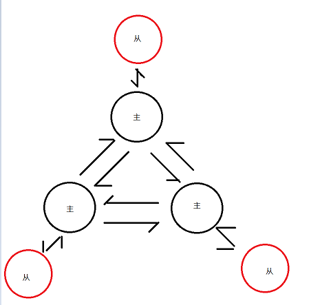

在这个图中，每一个圈都代表着一个redis的服务器节点。它们任何两个节点之间都是相互连通的。客户端可以与任何一个节点相连接，然后就可以访问集群 中的任何一个节点，对其进行存取和其他操作。

### 2.2 Redis 集群提供了以下优缺点：
优点:
- 将数据自动切分到多个节点的能力
- 当集群中的一部分节点失效或者无法进行通讯时， 仍然可以继续处理命令请求的能力，拥有自动故障转移的能力。

缺点
- 部署困难,架构不是很方便
- 团队开发成本大,项目开发难度大,以及维护后期的扩容

### 2.3 redis中replication(主从) sentinal(哨兵) cluster(集群)  如何选择
- 如果你的``数据量很少``，``主要是承载高并发高性能的场景``，比如你的缓存一般就``几个G``，单机足够了(info memory)。
- Replication：一个mater，多个slave，要几个slave跟你的要求的读吞吐量有关系，结合``sentinal集群``，去保证redis主从架构的高可用性，就可以了。
- redis cluster：主要是针对``海量数据+高并发+高可用的场景``，海量数据，如果你的数据量很大，那么建议就用redis cluster。

### 2.4 数据分布理论
分布式数据库首先要解决把整个数据集按照分区规则映射到多个节点的问题，即把数据集划分到多个节点上，每个节点负责整体数据的一个子集. 

常见的分区规则有``哈希分区``和``顺序分区``两种

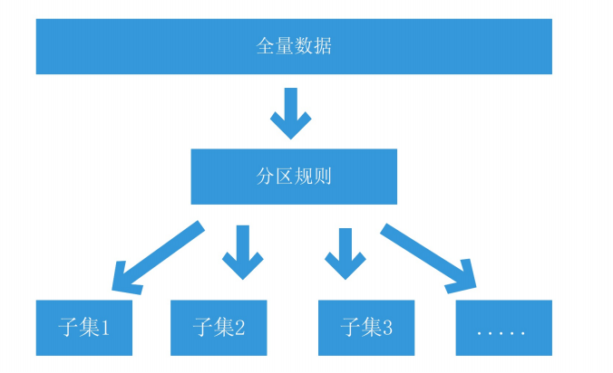

#### 2.4.1 顺序分区
顺序分布就是把一整块数据分散到很多机器中(顺序分布一般都是平均分配的)，如下图所示。

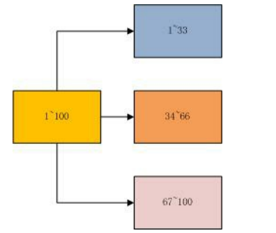

#### 2.4.2 哈希分区
如下图所示，1~100这整块数字，通过 hash 的函数，取余产生的数。这样可以保证这串数字充分的打散，也保证了均匀的分配到各台机器上
>mysql中数据分库分表式直接取模,而redis要经过hash算法,主要是redis中key的原因,以保证随机分配,避免``热点数据``集中于一台服务器。

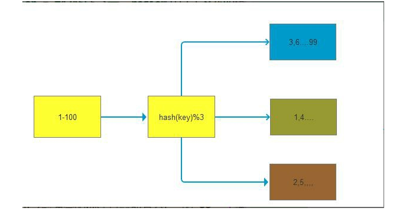

#### 2.4.3 对比
哈希分布和顺序分布只是场景上的适用。哈希分布不能顺序访问，比如你想访问1~100，哈希分布只能遍历全部数据，同时哈希分布因为做了 hash 后导致与业务 数据无关了。

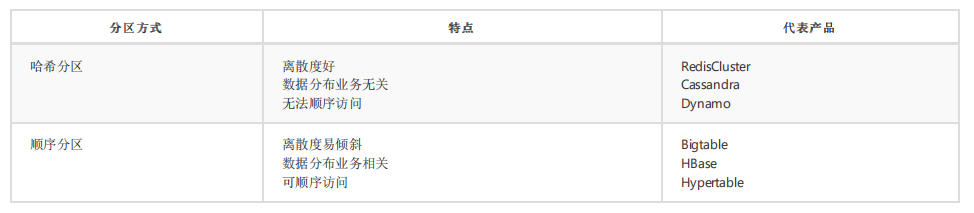

#### 2.4.4 数据倾斜与数据迁移跟节点伸缩
>顺序分布是会导致数据倾斜的，主要是访问的倾斜。每次点击会重点访问某台机器，这就导致最后数据都到这台机器上了，这就是顺序分布最大的缺点。 但哈希分布其实是有个问题的，当我们要扩容机器的时候，专业上称之为“节点伸缩”，这个时候，因为是哈希算法，会导致数据迁移。

#### 2.4.5 hash分区的分区方式:
- #### 节点取余分区
>使用特定的数据（包括redis的键或用户ID），再根据节点数量N，使用公式：hash(key)%N计算出一个0~（N-1）值，用来决定数据映射到哪一个节点上。即哈希值 对节点总数取余。 
>
>缺点：当节点数量N变化时（扩容或者收缩），数据和节点之间的映射关系需要重新计算，这样的话，按照新的规则映射，要么之前存储的数据找不到，要么之前 数据被重新映射到新的节点（导致以前存储的数据发生数据迁移） 
>
>实践：常用于数据库的分库分表规则，一般采用预分区的方式，提前根据数据量规划好分区数，比如划分为512或1024张表，保证可支撑未来一段时间的数据量， 再根据负载情况将表迁移到其他数据库中。

- #### [一致性哈希](https://www.cnblogs.com/lpfuture/p/5796398.html)
>一致性哈希分区（Distributed Hash Table）实现思路是为系统中每个节点分配一个 token，范围一般在0~232，这些 token 构成一个哈希环。数据读写执行节点查 找操作时，先根据 key 计算 hash 值，然后顺时针找到第一个大于等于该哈希值的 token 节点

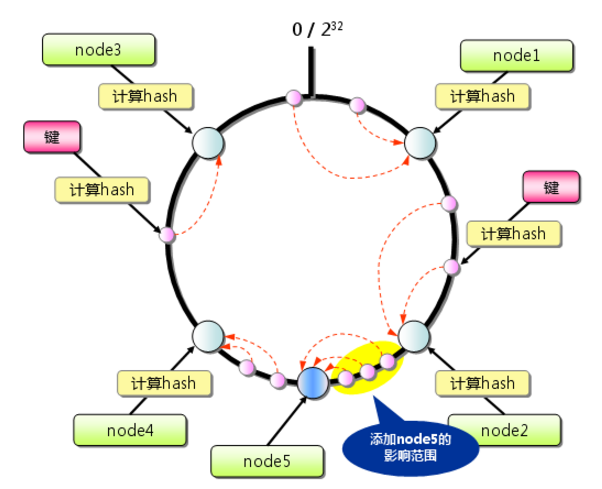

>假设我们有 node1~node4 这四台机器，我们对每一台机器分配一个唯一 token，每次有数据（图中黄色代表数据），一致性哈希算法规定每次都顺时针漂移数据

>这个时候我们需要增加一个节点 n5，在 n2 和 n3 之间，数据还是会发生漂移（会偏移到大于等于的节点），但是这个时候你是否注意到，其实只有 node4~node2 这部 分的数据被漂移，其他的数据都是不会变的，这种方式相比节点取余最大的好处在于加入和删除节点只影响哈希环中相邻的节点，对其他节点无影响

缺点：
>每个节点的负载不相同，因为每个节点的hash是根据key计算出来的,换句话说就是假设key足够多，被hash算法打散得非常均匀，但是节点过少，导致 每个节点处理的key个数不太一样，甚至相差很大，这就会导致某些节点压力很大
>
>：加减节点会造成哈希环中部分数据无法命中，需要手动处理或者忽略这部分数据，因此一致性哈希常用于缓存场景

- #### 虚拟槽分区
>虚拟槽分区巧妙地使用了哈希空间，使用分散度良好的哈希函数把所有数据映射到一个固定范围的整数集合中，整数定义为槽（slot）。这个范围一般远远大于节 点数，比如 Redis Cluster 槽范围是 0~16383 （也就是说有16383个槽）。槽是集群内数据管理和迁移的基本单位。采用大范围槽的主要目的是为了方便数据拆分和集群扩展。每个节点会负责一定数量的槽

由于采用了分散性较好的哈希函数，所有的数据大致均匀分布在0~16383各个槽中，计算公式为slot = CRC16(key) & 16383，当要操作数据时，只需要计算出相应的槽，并根据槽即可找到对应的 节点(node-1 ~ node-5)。

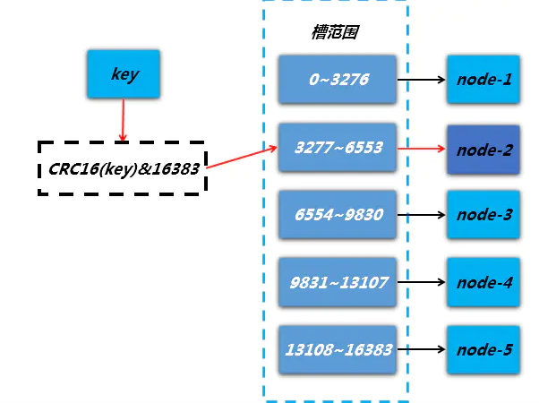

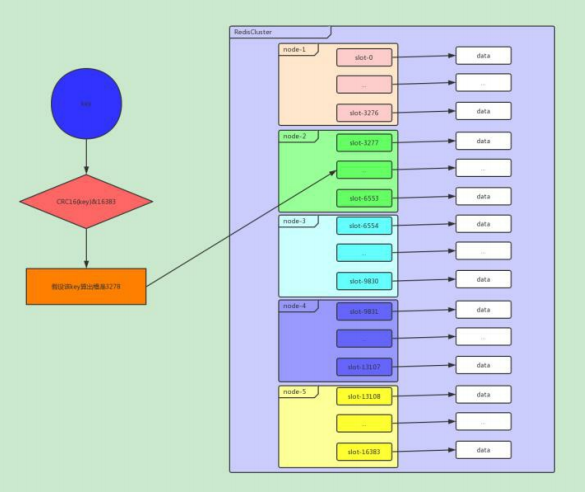

每当 key 访问过来，Redis Cluster 会计算哈希值是否在这个区间里。它们彼此都知道对应的槽在哪台机器上，这样就能做到平均分配了。

集群限制： Key批量操作，mget()

---
# 3.搭建集群
### 3.1 使用redis5搭建建群的方式
配置好docker 网关
````
docker network create --subnet 172.10.0.1/16 redis 
````
首先只需要配置好配置文件
````
bind 0.0.0.0 
cluster-enabled yes  #开启集群模式
cluster-config-file "/redis/nodes.conf"  #集群内部配置文件
cluster-node-timeout 5000  #节点超时时间，单位毫秒
protected-mode no 
port 6379 
daemonize no 
dir "/redis" 
logfile "/redis/redis.log"
````
然后配置好，docker-compose及目录结构
>快捷删除命令`` docker stop $(docker ps -aq)|xargs docker rm ``

设计的编排文件为(这里设置了redis网关)
````
version: "3.6" # 确定docker-composer文件的版本
services: # 代表就是一组服务 - 简单来说一组容器
  redis_1: # 这个表示服务的名称，课自定义; 注意不是容器名称
    image: redis/redis:5 # 指定容器的镜像文件
    networks: ## 引入外部预先定义的网段
       redis:
         ipv4_address: 172.10.0.10   #设置ip地址
    container_name: redis_1 # 这是容器的名称
    ports: # 配置容器与宿主机的端口
      - "6320:6379" # php java python 语言连接
      - "16320:16379" # 对节点 6379 + 10000 = 端口 对节点进行通信
    volumes: # 配置数据挂载
        - /redis/redis_1:/redis
    command: /usr/local/bin/redis-server /redis/conf/redis.conf
  redis_2: # 这个表示服务的名称，课自定义; 注意不是容器名称
    image: redis/redis:5 # 指定容器的镜像文件
    networks: ## 引入外部预先定义的网段
      redis:
        ipv4_address: 172.10.0.11   #设置ip地址
    container_name: redis_2 # 这是容器的名称
    ports: # 配置容器与宿主机的端口
      - "6321:6379" # php java python 语言连接
      - "16321:16379" # 对节点 6379 + 10000 = 端口 对节点进行通信
    volumes: # 配置数据挂载
      - /redis/redis_2:/redis
    command: /usr/local/bin/redis-server /redis/conf/redis.conf
  redis_3: # 这个表示服务的名称，课自定义; 注意不是容器名称
    image: redis/redis:5 # 指定容器的镜像文件
    networks: ## 引入外部预先定义的网段
      redis:
        ipv4_address: 172.10.0.12   #设置ip地址
    container_name: redis_3 # 这是容器的名称
    ports: # 配置容器与宿主机的端口
      - "6322:6379" # php java python 语言连接
      - "16322:16379" # 对节点 6379 + 10000 = 端口 对节点进行通信
    volumes: # 配置数据挂载
      - /redis/redis_3:/redis
    command: /usr/local/bin/redis-server /redis/conf/redis.conf
  redis_4: # 这个表示服务的名称，课自定义; 注意不是容器名称
    image: redis/redis:5 # 指定容器的镜像文件
    networks: ## 引入外部预先定义的网段
      redis:
        ipv4_address: 172.10.0.13   #设置ip地址
    container_name: redis_4 # 这是容器的名称
    ports: # 配置容器与宿主机的端口
      - "6323:6379" # php java python 语言连接
      - "16323:16379" # 对节点 6379 + 10000 = 端口 对节点进行通信
    volumes: # 配置数据挂载
      - /redis/redis_4:/redis
    command: /usr/local/bin/redis-server /redis/conf/redis.conf
  redis_5: # 这个表示服务的名称，课自定义; 注意不是容器名称
    image: redis/redis:5 # 指定容器的镜像文件
    networks: ## 引入外部预先定义的网段
      redis:
        ipv4_address: 172.10.0.14   #设置ip地址
    container_name: redis_5 # 这是容器的名称
    ports: # 配置容器与宿主机的端口
      - "6324:6379" # php java python 语言连接
      - "16324:16379" # 对节点 6379 + 10000 = 端口 对节点进行通信
    volumes: # 配置数据挂载
      - /redis/redis_5:/redis
    command: /usr/local/bin/redis-server /redis/conf/redis.conf
  redis_6: # 这个表示服务的名称，课自定义; 注意不是容器名称
    image: redis/redis:5 # 指定容器的镜像文件
    networks: ## 引入外部预先定义的网段
      redis:
        ipv4_address: 172.10.0.15   #设置ip地址
    container_name: redis_6 # 这是容器的名称
    ports: # 配置容器与宿主机的端口
      - "6325:6379" # php java python 语言连接
      - "16325:16379" # 对节点 6379 + 10000 = 端口 对节点进行通信
    volumes: # 配置数据挂载
      - /redis/redis_6:/redis
    command: /usr/local/bin/redis-server /redis/conf/redis.conf
# 网段设置
networks:
  #引用外部预先定义好的网段
  redis:
    external:
      name: redis
````
执行编排文件

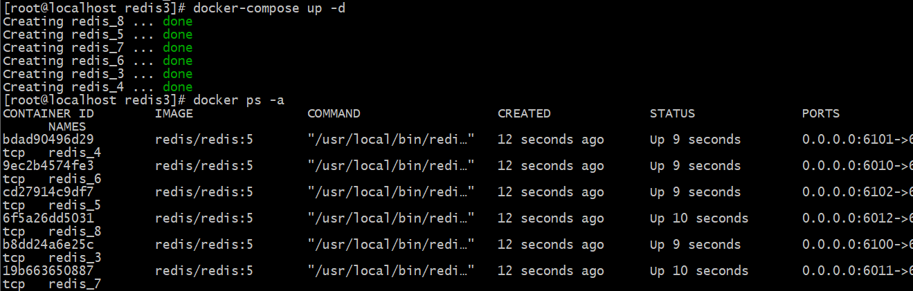

进入任意容器,查看初始日志信息
````
[root@localhost redis]# docker exec -it redis_1 sh
/ # cat /redis/log/nodes.conf
786367dd3cf1cd816b9e169ea7c6b49540d9484f :0@0 myself,master - 0 0 0 connected
vars currentEpoch 0 lastVoteEpoch 0

记录节点id以及集群的相关信息
````
通过命令建立集权模式(所有redis服务器ip)
````
redis-cli --cluster create 172.10.0.10:6379 172.10.0.11:6379 172.10.0.12:6379 172.10.0.13:6379 172.10.0.14:6379 172.10.0.15:6379  --cluster-replicas 1
````
````
redis-cli --cluster create 172.10.0.10:6379 172.10.0.11:6379 172.10.0.12:6379 172.10.0.13:6379 172.10.0.14:6379 172.10.0.15:6379  --cluster-replicas 1  //最后的参数标识从节点的个数 
~~~~~~~~~~~~~~~~~~~~~~~~~~~~~~~~~~~~~~~~~~~~~~~~~~~~~~~~~~~~~~~~~~~~~~~~~~~~~~~~~~~~~~~~~~~~~~~~~~~~~~~~~~~~~~~~~~~~~~~~~~~~~~~~~~~~~~~~~~~~~~~~~~~~~~~
结果:

>>> Performing hash slots allocation on 6 nodes...
Master[0] -> Slots 0 - 5460
Master[1] -> Slots 5461 - 10922
Master[2] -> Slots 10923 - 16383
Adding replica 172.10.0.14:6379 to 172.10.0.10:6379
Adding replica 172.10.0.15:6379 to 172.10.0.11:6379
Adding replica 172.10.0.13:6379 to 172.10.0.12:6379
M: 786367dd3cf1cd816b9e169ea7c6b49540d9484f 172.10.0.10:6379
   slots:[0-5460] (5461 slots) master
M: 528f80fe890d52a268f8e2db5af038015d206eea 172.10.0.11:6379
   slots:[5461-10922] (5462 slots) master
M: 65ff17f2daea187914a0236f4ad3d6ec3255d9c1 172.10.0.12:6379
   slots:[10923-16383] (5461 slots) master
S: f515631d9bb397858709bffc4c0c1317e0245a02 172.10.0.13:6379
   replicates 65ff17f2daea187914a0236f4ad3d6ec3255d9c1
S: daa9aee3a31f433aa0b2f13d1bbe44696a82cf8e 172.10.0.14:6379
   replicates 786367dd3cf1cd816b9e169ea7c6b49540d9484f
S: 2197cae8af9a5ceeb0a1235f19a9efb2017f99bd 172.10.0.15:6379
   replicates 528f80fe890d52a268f8e2db5af038015d206eea


Can I set the above configuration? (type 'yes' to accept): yes  //yes代表接受这个分配,no代表拒绝


>>> Nodes configuration updated
>>> Assign a different config epoch to each node
>>> Sending CLUSTER MEET messages to join the cluster
Waiting for the cluster to join
....
>>> Performing Cluster Check (using node 172.10.0.10:6379)
M: 786367dd3cf1cd816b9e169ea7c6b49540d9484f 172.10.0.10:6379
   slots:[0-5460] (5461 slots) master
   1 additional replica(s)
S: f515631d9bb397858709bffc4c0c1317e0245a02 172.10.0.13:6379
   slots: (0 slots) slave
   replicates 65ff17f2daea187914a0236f4ad3d6ec3255d9c1
M: 65ff17f2daea187914a0236f4ad3d6ec3255d9c1 172.10.0.12:6379
   slots:[10923-16383] (5461 slots) master
   1 additional replica(s)
S: 2197cae8af9a5ceeb0a1235f19a9efb2017f99bd 172.10.0.15:6379
   slots: (0 slots) slave
   replicates 528f80fe890d52a268f8e2db5af038015d206eea
M: 528f80fe890d52a268f8e2db5af038015d206eea 172.10.0.11:6379
   slots:[5461-10922] (5462 slots) master
   1 additional replica(s)
S: daa9aee3a31f433aa0b2f13d1bbe44696a82cf8e 172.10.0.14:6379
   slots: (0 slots) slave
   replicates 786367dd3cf1cd816b9e169ea7c6b49540d9484f
[OK] All nodes agree about slots configuration.
>>> Check for open slots...
>>> Check slots coverage...
[OK] All 16384 slots covered.
````
此时查看日志,发现了主从搭建的信息
````
/ # cat /redis/log/nodes.conf 

f515631d9bb397858709bffc4c0c1317e0245a02 172.10.0.13:6379@16379 slave 65ff17f2daea187914a0236f4ad3d6ec3255d9c1 0 1589848527000 4 connected
65ff17f2daea187914a0236f4ad3d6ec3255d9c1 172.10.0.12:6379@16379 master - 0 1589848527000 3 connected 10923-16383
2197cae8af9a5ceeb0a1235f19a9efb2017f99bd 172.10.0.15:6379@16379 slave 528f80fe890d52a268f8e2db5af038015d206eea 0 1589848527660 6 connected
528f80fe890d52a268f8e2db5af038015d206eea 172.10.0.11:6379@16379 master - 0 1589848527000 2 connected 5461-10922
daa9aee3a31f433aa0b2f13d1bbe44696a82cf8e 172.10.0.14:6379@16379 slave 786367dd3cf1cd816b9e169ea7c6b49540d9484f 0 1589848527559 5 connected
786367dd3cf1cd816b9e169ea7c6b49540d9484f 172.10.0.10:6379@16379 myself,master - 0 1589848526000 1 connected 0-5460
vars currentEpoch 6 lastVoteEpoch 0
````

### 3.2 使用redis3搭建建群的方式
#### 搭建集群工作需要以下三个步骤：
- 准备节点
- 节点握手
- 分配槽

Redis 集群一般由多个节点组成，节点数量至少为6个才能保证组成完整高可用的集群，前面的主从复制跟哨兵共同构成了高可用。每个节点需要开启配置 cluster- enabled yes ，让Redis 运行在集群模式下。
>性能：这是Redis赖以生存的看家本领，增加集群功能后当然不能对性能产生太大影响，所以Redis采取了P2P而非Proxy方式、异步复制、客户端重定向等设计，而牺牲了部分的一致性、使用性。
>
>水平扩展：集群的最重要能力当然是扩展，文档中称可以线性扩展到1000结点。 可用性：在Cluster推出之前，可用性要靠Sentinel保证。有了集群之 后也自 动具有了Sentinel的监控和自动Failover能力

#### 集群相关配置如下：
````
port 6379                             #节点端口 
cluster-enabled yes                   #开启集群模式 
cluster-node-timeout 15000            #节点超时时间，单位毫秒 
cluster-config-file "nodes-6379.conf" #集群内部配置文件 
bind 0.0.0.0
cluster-node-timeout 5000
protected-mode no
daemonize no
dir "/redis/data"
logfile "/redis/log/redis.log"
````
#### docker-compose 编排文件
````
version: "3.6"
services:
  # -------- 主节点 --------
  redis_3:
    image: redis/redis:5
    networks:
       redis:
         ipv4_address: 172.10.0.3
    container_name: redis_3
    ports:
      - "6100:6379"
      - "16100:16379"
    volumes:
        - /redis/redis3/master/100:/redis
    command: /usr/local/bin/redis-server /redis/conf/redis.conf
  redis_4:
    image: redis/redis:5
    networks:
       redis:
         ipv4_address: 172.10.0.4
    container_name: redis_4
    ports:
      - "6101:6379"
      - "16101:16379"
    volumes:
        - /redis/redis3/master/101:/redis
    command: /usr/local/bin/redis-server /redis/conf/redis.conf
  redis_5:
    image: redis/redis:5
    networks:
       redis:
         ipv4_address: 172.10.0.5
    container_name: redis_5
    ports:
      - "6102:6379"
      - "16102:16379"
    volumes:
        - /redis/redis3/master/102:/redis
    command: /usr/local/bin/redis-server /redis/conf/redis.conf

  # -------- 从节点 --------

  redis_6:
    image: redis/redis:5
    networks:
       redis:
         ipv4_address: 172.10.0.6
    container_name: redis_6
    ports:
      - "6010:6379"
      - "16010:16379"
    volumes:
        - /redis/redis3/slaves/10:/redis
    command: /usr/local/bin/redis-server /redis/conf/redis.conf
  redis_7:
    image: redis/redis:5
    networks:
       redis:
         ipv4_address: 172.10.0.7
    container_name: redis_7
    ports:
      - "6011:6379"
      - "16011:16379"
    volumes:
        - /redis/redis3/slaves/11:/redis
    command: /usr/local/bin/redis-server /redis/conf/redis.conf
  redis_8:
    image: redis/redis:5
    networks:
       redis:
         ipv4_address: 172.10.0.8
    container_name: redis_8
    ports:
      - "6012:6379"
      - "16012:16379"
    volumes:
        - /redis/redis3/slaves/12:/redis
    command: /usr/local/bin/redis-server /redis/conf/redis.conf
# 网段设置
networks:
  #引用外部预先定义好的网段
  redis:
    external:
      name: redis

````
#### 执行编排文件


#### 节点握手
>节点握手是指一批运行在集群模式下的节点通过 Gossip 协议彼此通信，达到感知对方的过程。节点握手是集群彼此通信的第一步，由客户端发起命令： cluster meet{ip}{port}
>
>通过命令 cluster meet 127.0.0.1 6380 让节点 6379 和 6380 节点进行握手通信。 cluster meet 命令是一个异步命令，执行之后立刻返回。内部发起与目标节 点进行握手通信

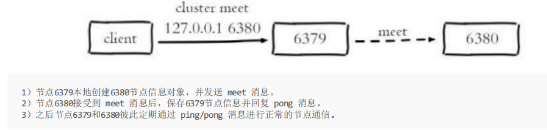

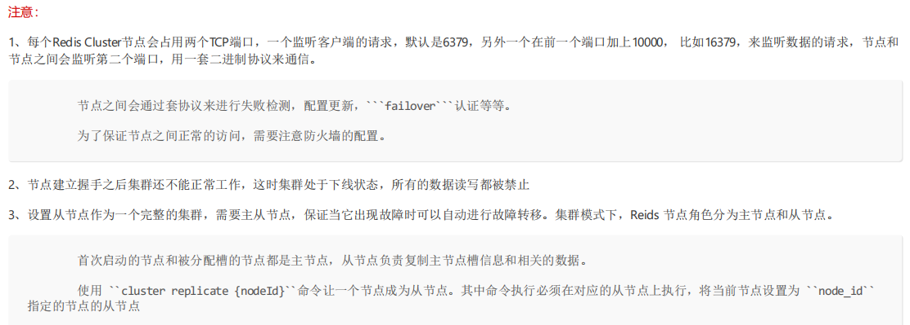

#### 进行握手
``cluster meet 172.10.0.4 6379``

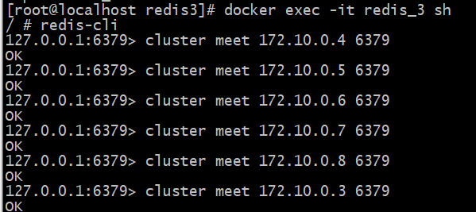

``cluster nodes``

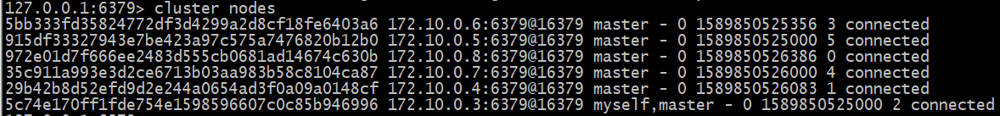

#### 并且配置好每个主节点下的从节点
````
 redis-cli -h 172.10.0.4(从) cluster replicate 5bb333fd35824772df3d4299a2d8cf18fe6403a6(主172.10.0.3的唯一标识id)
 redis-cli -h 172.10.0.6(从) cluster replicate cd27914c9df7(主172.10.0.5的唯一标识id)
 redis-cli -h 172.10.0.8(从) cluster replicate 19b663650887(主172.10.0.7的唯一标识id)
````

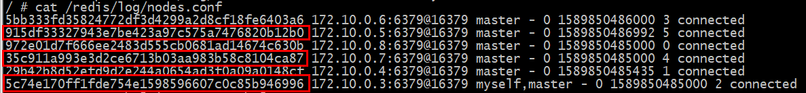

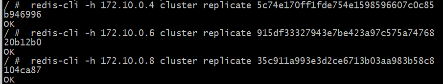

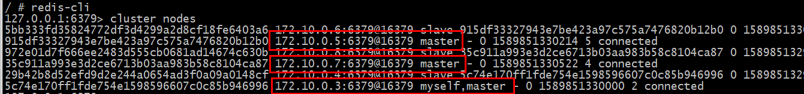

#### 分配槽
Redis 集群把所有的数据映射到16384个槽中。每个 key 会映射为一个固定的槽，只有当节点分配了槽，才能响应和这些槽关联的键命令。通过 cluster addslots 命 令为节点分配槽
>注意alpine系统不知持 ``{}``操作,需要从镜像中退出,使用命令
````
[root@localhost ~]# for i in {1..5} ; do echo $i ; done  
1
2
3
4
5
````
执行命令
````
 redis-cli -h 172.10.0.3 -p 6379 cluster addslots {0..5461}
 redis-cli -h 172.10.0.5 -p 6379 cluster addslots {5462..10922}
 redis-cli -h 172.10.0.7 -p 6379 cluster addslots  {10923..16383}
````

如果没有指定集群模式，那么会出现如下错误
````
/ # redis-cli
127.0.0.1:6379> set name will
(error) MOVED 5798 172.10.0.11:6379
````
加入 -c 参数指定
````
/ # redis-cli -c
127.0.0.1:6379> set name will
-> Redirected to slot [5798] located at 172.10.0.11:6379
OK
````
所有命令
````
CLUSTER info： 打印集群的信息
CLUSTER nodes： 列出集群当前已知的所有节点（node）的相关信息。

CLUSTER meet <ip> <port>： 将ip和port所指定的节点添加到集群当中
CLUSTER addslots <slot> [slot ...]： 将一个或多个槽（slot）指派（assign）给当前节点。
CLUSTER delslots <slot> [slot ...]： 移除一个或多个槽对当前节点的指派。
CLUSTER slots： 列出槽位、节点信息。

CLUSTER slaves <node_id>： 列出指定节点下面的从节点信息
CLUSTER replicate <node_id>： 将当前节点设置为指定节点的从节点。

CLUSTER saveconfig： 手动执行命令保存保存集群的配置文件，集群默认在配置修改的时候会自动保存配置文件。 
CLUSTER keyslot <key>： 列出key被放置在哪个槽上。 
CLUSTER flushslots： 移除指派给当前节点的所有槽，让当前节点变成一个没有指派任何槽的节点。

CLUSTER countkeysinslot <slot>： 返回槽目前包含的键值对数量。 
CLUSTER getkeysinslot <slot> <count>： 返回count个槽中的键。 
CLUSTER setslot <slot> node <node_id> 将槽指派给指定的节点，如果槽已经指派给另一个节点，那么先让另一个节点删除该槽，然后再进行指 派。
CLUSTER setslot <slot> migrating <node_id> 将本节点的槽迁移到指定的节点中。 
CLUSTER setslot <slot> importing <node_id> 从 node_id 指定的节点中导入槽 slot 到本节点。 
CLUSTER setslot <slot> stable 取消对槽 slot 的导入（import）或者迁移（migrate）。

CLUSTER failover： 手动进行故障转移。 
CLUSTER forget <node_id>： 从集群中移除指定的节点，这样就无法完成握手，过期时为60s，60s后两节点又会继续完成握手。 
CLUSTER reset [HARD|SOFT]： 重置集群信息，soft是清空其他节点的信息，但不修改自己的id，hard还会修改自己的id，不传该参数则使用soft方式。

CLUSTER count-failure-reports <node_id>： 列出某个节点的故障报告的长度。 
CLUSTER SET-CONFIG-EPOCH： 设置节点epoch，只有在节点加入集群前才能设置。
````


