# redis集群详情
## 1. 节点通信
### 1.1 通信流程
>在分布式存储中需要提供维护节点元数据信息的机制，所谓元数据是指：节点负责哪些数据，是否出现故障等状态信息，Redis 集群采用 Gossip（流言）协议， Gossip 协议工作原理就是节点彼此不断通信交换信息，一段时间后所有的节点都会知道集群完整的信息，这种方式类似流言传播

- 集群中的每个节点都会单独开辟一个 TCP 通道，用于节点之间彼此通信，通信端口号在基础端口上加10000。
- 每个节点在固定周期内通过特定规则选择几个节点发送 ping 消息。
- 接收到 ping 消息的节点用 pong 消息作为响应。
>集群中每个节点通过一定规则挑选要通信的节点，每个节点可能知道全部节点，也可能仅知道部分节点，只要这些节点彼此可以正常通信，最终它们会达到一致的 状态。当节点出故障、新节点加入、主从角色变化、槽信息变更等事件发生时，通过不断的 ping/pong 消息通信，经过一段时间后所有的节点都会知道整个集群 全部节点的最新状态，从而达到集群状态同步的目的。

### 1.2 Gossip消息
>Gossip协议的主要职责就是信息交换。信息交换的载体就是节点彼此发送的Gossip消息，了解这些消息有助于我们理解集群如何完成信息交换。Gossip消息可分为：ping消息，pong消息，meet消息，fail消息等
- meet消息:用于通知新节点加人。消息发送者通知接收者加人到当前集群,meet消息通信正常完成后，接收节点会加人到集群中并进行周期性的ping、pong消自交换,``用来做通信握手``。
- ping消息：集群内交换最频繁的消息，集群内每个节点每秒向多个其他节点发送ping消息，用于检测节点是否在线和交换彼此状态信息。``ping消息发送封装了自身节点和部分其他节点的状态数据``,``用来做信息交换和心跳检测``。
- pong消息:当接收到ping、 meet消息时，作为响应消息回复给发送方确认消息正常通信。pong消息内部封装了自身状态数据。节点也可以向集群内广播自身的pong消息来通知整个集群,并对自身状态进行更新,``回复自身的消息状态``。
- fail消息:当节点判定集群内另一个节点下线时，会向集群内广播一个fail消息，其他节点接收到fail消息之后把对应节点更新为下线状态,``标识某个节点下线出现了问题,一个节点判断另一个节点有问题的时候广播`` .

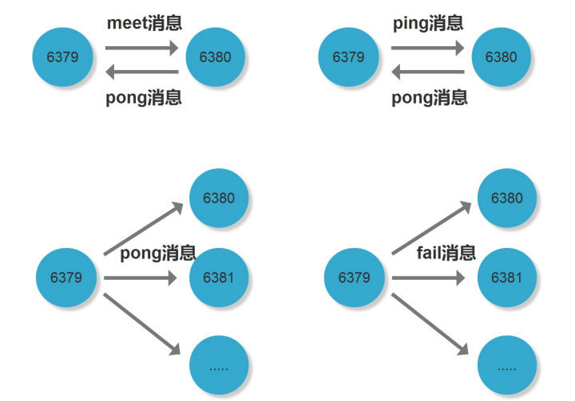

所有门店消息格式划分为：消息头和消息体。消息头包含发送节点自身状态数据，接收节点根据消息头就可以获取到发送节点的相关数据，结构如下(``安装目录下的 /usr/src/redis/redis-5.0.7/src/cluster.h``): 
````
typedef struct {
    char sig[4];        /* 信号的标识 */
    uint32_t totlen;    /* 信号的长度 */
    uint16_t ver;       /* 版本信息 */
    uint16_t port;      /* tcp端口信息 */
    uint16_t type;      /* 消息类型,用于区分 meet,ping,pong */
    uint16_t count;     /* 消息体包含的节点数量 meet,ping,pong. */
    uint64_t currentEpoch;  /* 当前发送节点的配置纪元.*/ 
    uint64_t configEpoch;   /* 从节点的主节点配置纪元*/
    uint64_t offset;    /* 复制的偏移量*/
    char sender[CLUSTER_NAMELEN]; /*发送节点的nodeId*/
    unsigned char myslots[CLUSTER_SLOTS/8]; /* 发送节点负责的槽信息 */
    char slaveof[CLUSTER_NAMELEN]; /* 如果发送节点是从节点，记录对应主节点的nodeId */
    char myip[NET_IP_STR_LEN];    /* Sender IP, if not all zeroed. */
    char notused1[34];  /* 34 bytes reserved for future usage. */
    uint16_t cport;      /* Sender TCP cluster bus port */
    uint16_t flags;      /* 发送节点标识，区分主从是否下线*/
    unsigned char state; /* 发送节点所处的集群状态*/
    unsigned char mflags[3]; /* Message flags: CLUSTERMSG_FLAG[012]_... */
    union clusterMsgData data;
} clusterMsg;
````
集群内所有的消息都采用相同的消息结构clusterMsg，它包含了发送节点关键信息，如节点id、槽映射、节点标识（角色，是否下线）；而消息体在Redis内部采用 clusterMsgData结构(``安装目录下的 /usr/src/redis/redis-5.0.7/src/cluster.h``):
````
union clusterMsgData {
    /* PING, MEET and PONG */
    struct {
        /* Array of N clusterMsgDataGossip structures */
        clusterMsgDataGossip gossip[1];
    } ping;

    /* FAIL */
    struct {
        clusterMsgDataFail about;
    } fail;

    /* PUBLISH */
    struct {
        clusterMsgDataPublish msg;
    } publish;

    /* UPDATE */
    struct {
        clusterMsgDataUpdate nodecfg;
    } update;

    /* MODULE */
    struct {
        clusterMsgModule msg;
    } module;
};


typedef struct {
    char nodename[CLUSTER_NAMELEN];
    uint32_t ping_sent;
    uint32_t pong_received;
    char ip[NET_IP_STR_LEN];  /* IP address last time it was seen */
    uint16_t port;              /* base port last time it was seen */
    uint16_t cport;             /* cluster port last time it was seen */
    uint16_t flags;             /* node->flags copy */
    uint32_t notused1;
} clusterMsgDataGossip;
````
消息体clusterMsgData定义发送消息的数据，其中ping、meet、pong都采用clusterMsgDataGossi作为消息体用于信息的交换

#### 如下为ping、meet消息时，接收节点会解析消息内容并根据自身的识别情况作出相应处理的流程图

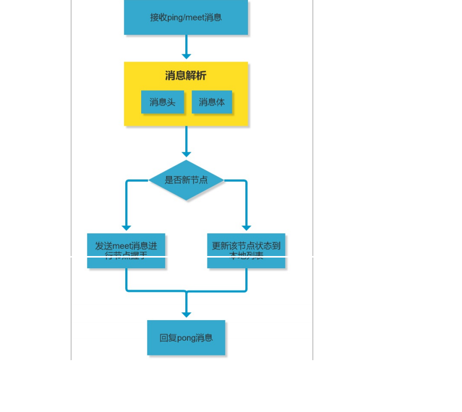

>接收节点收到ping/meet消息时，执行解析消息头和消息体流程
- 解析消息头过程：消息头包含了发送节点的信息，如果发送节点是新节点且消息是meet类型，则加入到本地节点列表；如果是已知节点，则尝试更新发送节点 的状态，如槽映射关系，主从角色等状态。
- 解析消息体过程：如果消息体的clusterMsgDataGossip数组包含的节点是新节点，则尝试发起与新节点的meet握手流程;如果是已知节点，则根据 clusterMsgDataGossip中的flags字段判断该节点是否下线，用于故障转移
>消息处理完后回复pong消息，内容同样包含消息头和消息体，发送节点接收到回复的pong消息后，采用类似的流程解析处理消息并更新与接收节点最后通信时 间，完成一次消息通信。

### 1.3 [为什么redis选择槽的个数为16383个](https://www.jianshu.com/p/de268f62f99b)
对于客户端请求的key，根据公式HASH_SLOT=CRC16(key) mod 16384，计算出映射到哪个分片上，然后Redis会去相应的节点进行操作！那么为什么会是16384

ps:CRC16算法产生的hash值有16bit，该算法可以产生2^16-=65536个值。换句话说，值是分布在0~65535之间。那作者在做mod运算的时候，为什么不 mod65536，而选择mod16384？[作者解释](https://github.com/antirez/redis/issues/2576)

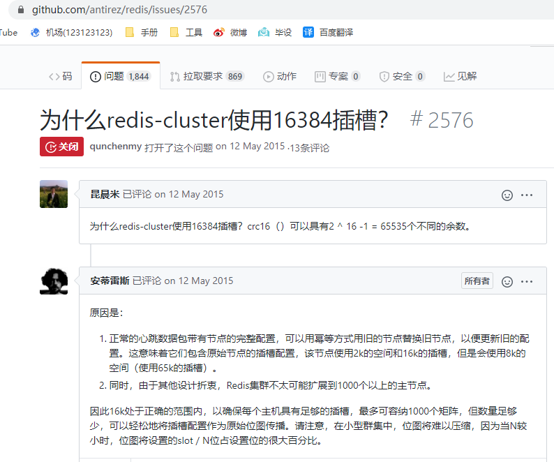

#### 1.3.1 先回顾下redis cluster之间的通信原理:

这里要先将节点握手讲清楚。我们让两个redis节点之间进行通信的时候，需要在客户端执行下面一个命令``192.160.1.200:7000>cluster meet 192.160.1.201:7001``

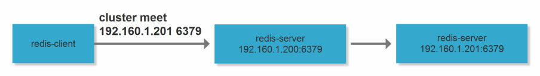

意思很简单，让192.160.1.200节点和192.160.1.201节点知道彼此存在！在握手成功后，连个节点之间会定期发送ping/pong消息，交换数据信息，如下图所示。

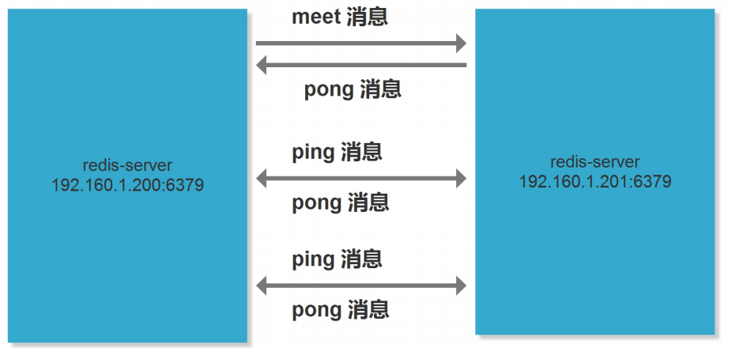

'cluster.h'
````
#define CLUSTERMSG_TYPE_COUNT 10        /* 消息的类型总数是10 */


typedef struct {
 uint16_t type;      /*消息类型，用于区分meet,ping,pong */ 
.....
 unsigned char myslots[CLUSTER_SLOTS/8];/* 发送节点负责的槽信息 */
.....
unsigned char mflags[3]; /* 至少有3个节点信息 */
} clusterMsg;
````
#### 1.3.2 那在消息体中，会携带一定数量的其他节点信息用于交换。那这个其他节点的信息，到底是几个节点的信息呢？
- 约为集群``总节点数量的1/10``，``如果节点数过少至少携带3个节点的信息``。节点数量越多，消息体内容越大。消息体大小是10个节点的状态信息约1kb

redis集群内节点，每秒都在发ping消息。
>Gossip协议信息的交换机制具有天然的分布式特性，但ping pong发送的频率很高，可以实时得到其它节点的状态数据，但频率高会加重带宽和计算能力，因此每次都会有目的性地选择一些节点； 但是节点选择过少又会影响故障判断的速度，redis集群的Gossip协议兼顾了这两者的优缺点


- 选择发送消息的节点数量：集群内每个节点维护定时任务默认为每秒执行10次，每秒会随机选取5个节点，找出最久没有通信的节点发送ping消息，用来保证信息交换的随机性，每100毫秒都会扫描本地节点列表，如果发现节点最近一次接受pong消息的时间大于cluster-node-timeout/2 则立刻发送ping消息，这样做目的是防止该节点信息太长时间没更新，当我们宽带资源紧张时，在可redis.conf将cluster-node-timeout 15000 改成30秒，但不能过度加大
- 消息数据：节点自身信息和其他节点信息

#### 1.3.3 那么发送的数据包为多大呢?

>需知：
>
>char 1个字节,字节也叫Byte，是计算机数据的基本存储单位。
>
>8bit(位)=1Byte(字节) |  1024Byte(字节)=1KB | 1024KB=1MB ....
>
>typedef struct {char sig[4];        /* 信号的标识 */
>  ... }  这里提到过存储的类型是一个char类型

在消息头中，最占空间的是 myslots[CLUSTER_SLOTS/8]。这块的大小是:16384÷8÷1024=2kb

因此，每秒单节点发出ping消息数量为``数量=1+10*num（node.pong_received>cluster_node_timeout/2）``

当槽位为65536时，这块的大小是: 65536 ÷ 8 ÷ 1024 = 8kb 因为每秒钟，redis节点需要发送一定数量的ping消息作为心跳包，如果槽位为65536，这个ping消息的 消息头太大了，浪费带宽

----
## 2 故障转移与恢复
### 2.1 代码启动流程
安装目录(``/usr/src/redis/redis-5.0.7/src/server.c``)
````
void initServer(void) {
    /* 代码省略 */ 
    if (server.cluster_enabled) clusterInit();
}
````
在这个函数中会加载配置并且初始化一些状态指标，监听集群通信端口。除此之外，该函数执行了如下一些回调函数的注册
- 集群通信端口建立监听后，注册回调函数clusterAccpeteHandler。当节点之间建立连接时先由该函数进行处理
- 当节点之间建立连接后，为新建立的连接注册读事件的回调函数clusterReadHandler
- 当有读时间发生时，当clusterReadHandler读取到一个完整的包体后，调用clusterProcessPacket解析具体的包体。集群之间通信数据包的解析都在改函数内完 成

并且有类似哨兵一样的redis时间让我函数serverCron中会调用
````
int serverCron(....){ 
    /* 代码省略 */ 
    /* Run the Redis Cluster cron. */ 
    run_with_period(100) { 
    if (server.cluster_enabled)
        clusterCron(); 
    }
    /* Run the Sentinel timer if we are in sentinel mode. */ 
    if (server.sentinel_mode) 
    sentinelTimer(); 
}
````
clusterCron函数执行如下操作。
- 向其他节点发送meet消息，将其加入集群
- 每1s会随机选择一个节点发送ping消息
- 如果一个节点在超时间之内仍然没收到ping包响应，则标记为pfail

还有在每次进入循环之前，会在beforeSleep函数中执行一些操作，如下：
````
void beforeSleep(struct aeEventLoop *eventLoop) { 
    if (server.cluster_enabled) clusterBeforeSleep(); 
}
````
clusterBeforeSleep()函数会执行如下操作
- 检查主从切换状态，如果需要，执行主从切换相关操作。
- 更新集群状态，通过检查是否所有slot都有响应的节点提供服务以及是否大部分主服务都是可用状态，来决定集群处于正常状态还是失败状态
- 刷新集群状态到配置文件中

### 2.2 故障演示

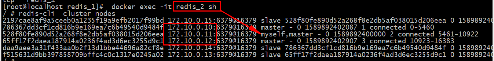

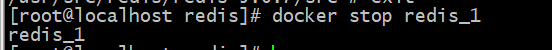

通过观察可以清楚的看到，出问题的节点发送了一个fail信号

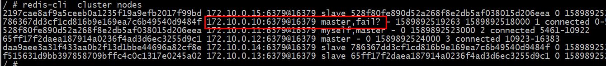

当我再次上线之前的节点之后，可以看到节点转为了从节点；这个过程；通过观察日志我们可以很清楚的了解到

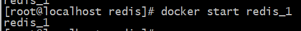

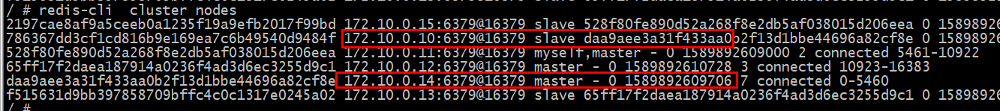

在节点发生问题的时候，所有的节点就会收到fail的信号，同时切换对应的从节点作为主节点

### 2.3 故障解释
Redis集群自身实现了高可用。高可用首先需要解决集群部分失败的场景:当集群内少导节点出现故障时通过自动故障转移保证集群可以正常对外提供服务。
#### 2.3.1 故障发现
当集群内某个节点出现问题时，需要通过一-种健壮的方式保证识别出节点是否发生了故障。Redis 集群内节点通过ping/pong消息实现节点通信，消息不但可以传 播节点槽信息，还可以传播其他状态如:主从状态、节点故障等。因此故障发现也是通过消息传播机制实现的，主要环节包括:主观下线(pfail)和客观下线(fail)。
- #### 2.3.1.1 主观下线:指某个节点认为另一一个节点不可用，即下线状态，这个状态并不是最终的故障判定，只能代表一个节 点的意见，可能存在误判情况。
>集群中每个节点都会定期向其他节点发送ping消息，接收节点回复pong消息作为响应。如果在cluster-node- timeout时间内通信一直失败， 则发送节点会认为接收 节点存在故障，把接收节点标记为主观下线(pfail)状态。流程如图下


````
1. 节点a发送ping消息给节点b,如果通信正常将接收到pong消息，节点a更新最近一次与节点b的通信时间。 
2. 如果节点a与节点b通信出现问题则断开连接，下次会进行重连。如果直通信失败，则节点a记录的与节点b最后通信时间将无法更新。 
3. 节点a内的定时任务检测到与节点b最后通信时间超高cluster-node-timeout时，更新本地对节点b的状态为主观下线(pfail)。
````
简单来讲就是，当cluster-note-timeout时间内某节点无法与另一个节点顺利完成ping消息通信时，则将该节点标记为主观下线状态。每个节点内的 clusterState结构都需要保存其他节点信息，用于从自身视角判断其他节点的状态。结构关键属性

##### 源码位置(``安装目录下的 /usr/src/redis/redis-5.0.7/src/cluster.h``)  
##### 对应的源码则cluster.h中的 clusterState,clusterNode
以及标识状态
````
#define CLUSTER_NODE_MASTER 1 /* The node is a master */ 
#define CLUSTER_NODE_SLAVE 2 /* The node is a slave */ 
#define CLUSTER_NODE_PFAIL 4 /* Failure? Need acknowledge */ 
#define CLUSTER_NODE_FAIL 8 /* The node is believed to be malfunctioning */ 
#define CLUSTER_NODE_MYSELF 16 /* This node is myself */ 
#define CLUSTER_NODE_HANDSHAKE 32 /* We have still to exchange the first ping */ 
#define CLUSTER_NODE_NOADDR 64 /* We don't know the address of this node */
````
Redis集群对于节点最终是否故障判断非常严谨，只有一个节点认为主观下线并不能准确判断是否故障。多个节点协作完成故障发现的过程叫做客观下线。

- #### 2.3.1.2 客观下线:指标记-一个节点真正的下线，集群内多个节点都认为该节点不可用，从而达成共识的结果。如果是持有槽的主节点故障，需要为该节点进行故障转 移。
>当某个节点判断另一个节点主管下线后，相应的节点状态会跟随消息在集群内传播。ping/pong消息的消息体会携带集群1/10的其他节点状态数据，当接收节点发 现消息体中含有主观下线的节点状态时、会在本地找到故障及诶单clusterNode结构，保存到下线报告连接中 clusterNode fail_reportsx

通过Gossip消息传播，集群内节点不断收集到故障节点的下线报告。``当半数以上持有槽的主节点都标记某个节点是主观下线时``。触发客观下线流程。
>例如: 假设节点a标记节点b为主观下线，一段时间后节点a通过消息把节点b的状态发送到其他节点，当节点c接受到消息并解析出消息体含有节点b的pfail状态时，会触发 客观下线流程

流程：
- 当消息体内含有其他节点的pfail状态会判断发送节点的状态，如果``发送节点是主节点则对报告的pfail状态处理，从节点则忽略``
- 找到pfail对应的节点结构，更新clusterNode内部下线报告链表
- 根据更新后的``下线报告``链接表尝试进行客观下线。

- #### 2.3.1.3 维护下线报表

信息的内容结构 cluster.h
````
typedef struct clusterNodeFailReport { 
    struct clusterNode *node; /* Node reporting the failure condition. */ 
    mstime_t time; /* 最晚时间 */ 
} clusterNodeFailReport
````
下线报告中保存了报告故障的节点结构和最近收到下线报告的时间，当接收到fail状态时，会维护对应节点的下线上报连接表

- #### 2.3.1.4 尝试客观下线

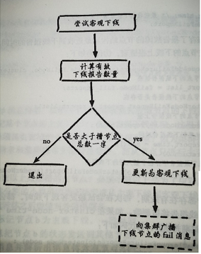

流程说明：
- 首先统计有效的下线报告数量，如果小于集群内持有槽的主节点总数的一半则退出。
- 当下线报告大于槽主机诶单数量一半时，标记对应故障节点为客观下线状态
- 向集群广播一条fail消息，通知所有的节点讲故障接地那标记为客观下线，fail消息的消息体指包含故障节点的id

广播fail消息是客观下线的最后一步，它承担着非常重要的职责:
- 通知集群内所有的节点标记故障节点为客观下线状态并立刻生效
- 通知故障节点的从节点触发故障转移流程。

#### 2.3.2 故故障障恢恢复复
>故障节点变为客观下线后，如果下线节点是持有槽的主节点则需要在它的从节点中选出一个替换它，从而保证集群的高可用。下线主节点的所有从节点承担故障恢复的义务，当从节点通过内部定时任务发现自身复制的主节点进人客观下线时，将会触发故障恢复流程。

流程:
- 1.资格检查
>每个从节点都要检查最后与主节点断线时间，判断是否有资格替换故障的主接地那。如果从节点与主节点断线时间超过 cluster-node-time * cluster-slave-validity- factor，则当前从节点不具备故障转移资格。 
- 2.准备选举时间 
>当从节点符合故障资格后，更新触发故障选举的时间，只有到达该时间后才能执行后续流程。
````
typedef struct clusterState { 
    /* 省略 */ 
    /* The following fields are used to take the slave state on elections. */ 
    mstime_t failover_auth_time;
     /* Time of previous or next election. */ 
    int failover_auth_count; 
    /* Number of votes received so far. */ 
    int failover_auth_sent; 
    /* True if we already asked for votes. */ 
    int failover_auth_rank; 
    /* This slave rank for current auth request. */ 
} clusterState;
````
这里之所以采用延迟触发机制，主要是通过对多个从节点使用不同的延迟选举时间来支持优先级问题。复制偏移量越大说明从节点延迟越低，那么它应该具有更高 的优先级来替换故障主节点

``所有的从节点中复制偏移量最大的将提前触发故障选举流程``
- 3.发起选举
>``配置纪元是一个 只增不减的整数``， 每个主节点自身维护一个配置纪元( clusterNode.configEpoch)标示当前主节点的版本，所有主节点的配置纪元都不相等，从节 点会复制主节点的配置纪元。整个集群又维护一个全局的配置纪元( clusterState. currentEpoch),用于记录集群内所有主节点配置纪元的最大版本。执行``cluster info`` 命令可以在看配置纪元信息:
````
/ # redis-cli  cluster info
..... 
cluster_current_epoch:7
cluster_my_epoch:2    .....
````
配置纪元会跟随ping/pong消息在集群内传播，当发送方与接收方都是主节点且配置纪元相等时代表出现了冲突，``nodeld更大的一方会递增全局配置纪元并赋值给当前节点来避开冲突``
- 4.选举投票
>这个过程就类似于哨兵的操作，会根据拥有槽的主节点进行投票，而从节点必须要等到N/2 + 1的票数才可以，此过程从节点不参与投票
- 5.替换主节点
> - 取消复制变为主节点
> - 通过redis内置,撤销对``原来(fail)redis主机``的槽分配,并添加到自身上
> - 向集群广播自己的pong消息,便于其他的节点更新配置


