# redis集群扩容缩容及客户端连接
## 1. 集群伸缩
>redis 集群提供了灵活的节点扩容和收缩方案。在不影响集群对外服务的情况下，可以为集群添加节点进行扩容也可以下线部分节点进行缩容
>
>集群伸缩=槽和数据在节点之间的移动。

### 1.1 扩容集群
扩容是分布式存储最常见的需求，Redis 集群扩容操作可分为如下步骤
- 准备新节点
- 加入集群
- 迁移槽和数据
#### 1.1.1 准备新节点
编排文件同集群构建相容,不过多赘述

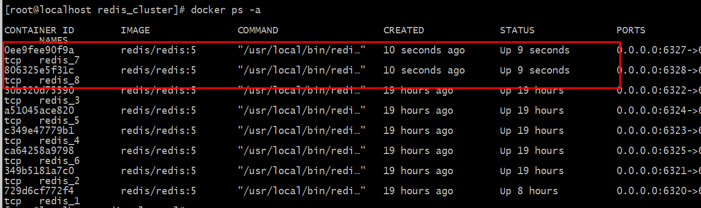
 
 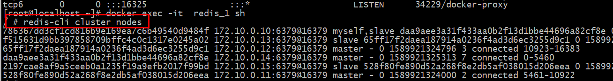
 
 #### 1.1.2 加入集群
 这里我们可以先了解一下redis5.0给我们提供的集群命令 redis-cli --cluster help 在redis5中，并不需要像redis4之前的管理方式需要通过 redis-trib 管理集群,这里可以使用``redis-cli cluster --help``查看帮助命令
 
 当然你也可以使用 cluster meet ip port 进行集群之间的感知也是一样的 
````
/ # redis-cli --cluster add-node 172.10.0.17:6379 172.10.0.13:6379
````
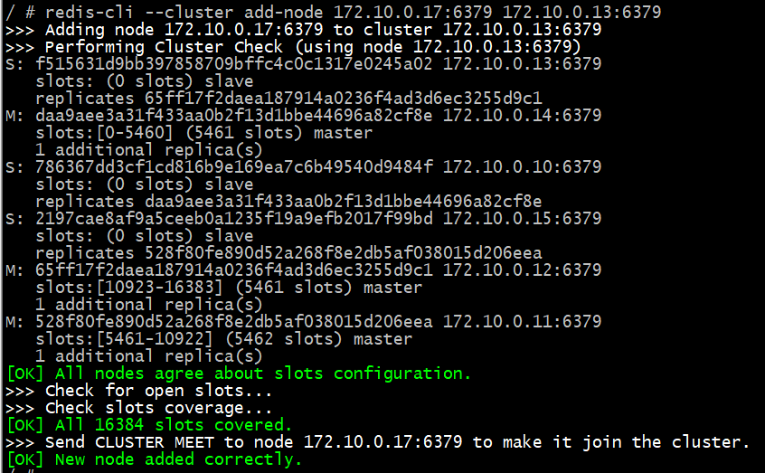

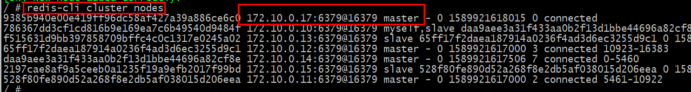

````
/ # redis-cli --cluster add-node 172.10.0.18:6379 172.10.0.17:6379 --cluster-sla
ve
````
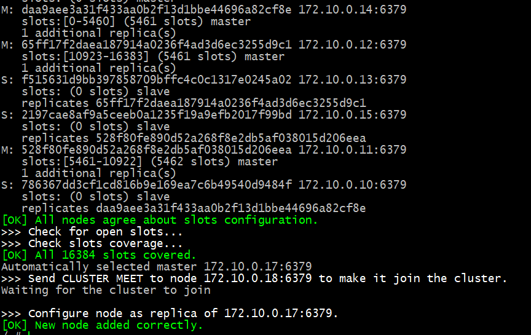

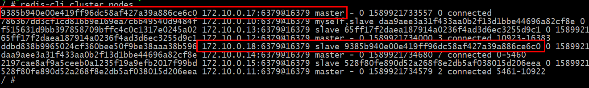

在redis5中这一过程因为对redis-cli的命令优化而变得异常的简单；我们这里对于流程做一个简述一下
>首先对于节点在加入的时候集群内新旧接地那经过一段时间的ping/pong消息通信指挥，所有节点会发现新的节点并将它们的状态保存到本地。但是因为是刚刚加
入的主节点，没有分配槽，所以还是不能接任何读写操作。

#### 1.1.3 迁移槽和数据
加入集群后需要为新节点迁移槽和相关数据，槽在迁移过程中集群可以正常提供读写服务，迁移过程是集群扩容最核心的环节，下面详细讲解。

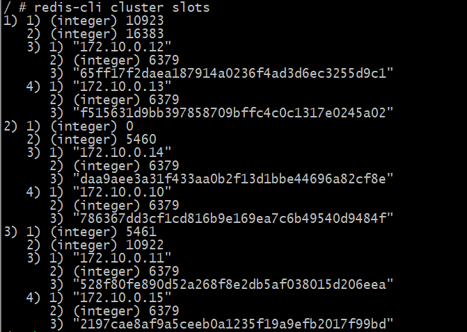

-  #### 槽迁移计划
>槽是 Redis 集群管理数据的基本单位，首先需要为新节点制定槽的迁移计划，确定原有节点的哪些槽需要迁移到新节点。迁移计划需要确保每个节点负责相似数量
 的槽，从而保证各节点的数据均匀，比如之前是三个节点，现在是四个节点，把节点槽分布在四个节点上。

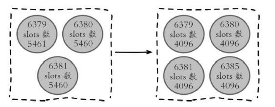

槽迁移计划确定后开始逐个把槽内数据从源节点迁移到目标节点

- #### 迁移数据
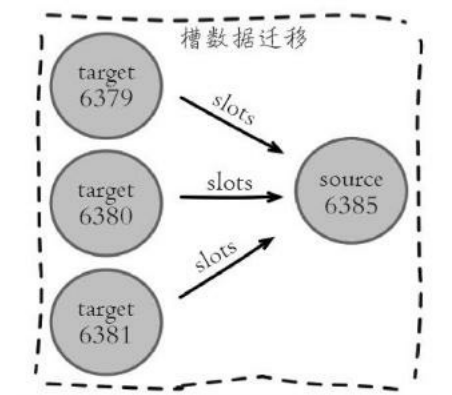

````
流程说明：
1. 对目标节点发送 cluster setslot {slot} importing {sourceNodeId} 导入命令，让目标节点准备导入槽的数据。
2. 对源节点发送 cluster setslot {slot} migrating {sourceNodeId} 导出命令，让源节点准备迁出槽的数据。
3. 源节点循环执行 cluster getkeysinslot {slot} {count} 迁移命令，获取count个属于槽{slot}的键。
4. 在源节点上会执行 migrate {targetIp} {targetPort} "" 0 {timeout} keys {keys...} 命令，把获取的键通过流水线(pipeline)机制批量迁移到目标节。
5. 重复 3,4操作指导槽下所有的兼职数据迁移到目标节点
6. 向集群内所有主节点发送 cluster setslot {slot} node {targetNodeId} 命令，通知槽分配给目标节点。为了保证槽节点映射更及时传播，需要遍历发送给
所有主节点更新呗迁移的槽指向新节点。
````
实际到了redis5之后就是异常简单....一个命令解决 redis-cli --cluster reshard {ip:port}

步骤如下:
````
重新分配哈希槽
redis-cli -h 172.10.0.17:6379 --cluster reshard 172.10.0.13:6379

这个 172.10.0.13:6379 是可以随意一个节点都可以（有效主节点）
````
 输入要分配多少个哈希槽（数量）？比如我要分配4000个哈希槽

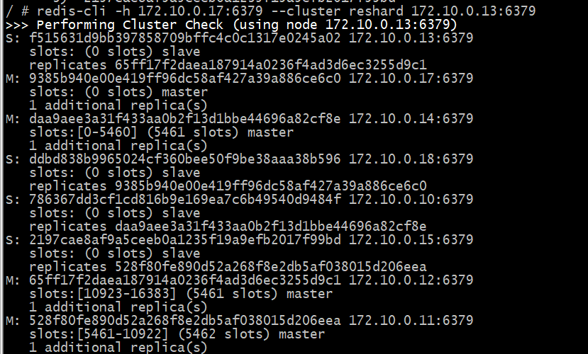
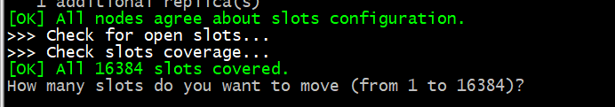

输入指定要``接收分配哈希槽``的节点ID，如``172.10.0.17:6379``的master节点哈希槽的数量为0（选择任意一个节点作为目标节点进行分配哈希槽）

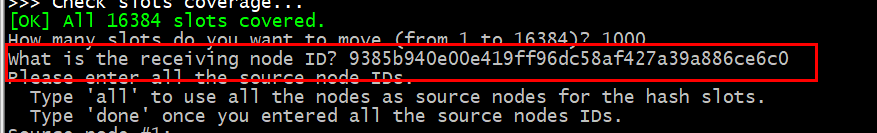

分配哈希槽有两种方式
````
1. all : 将所有节点用作哈希槽的源节点
2. done : 在指定的节点拿出指定数量的哈希槽分配到目标节点
````
- all方式:

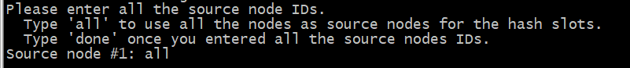

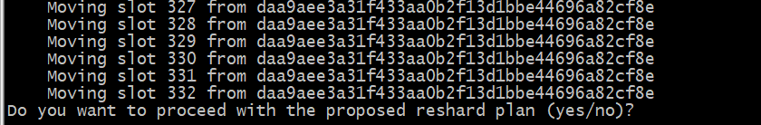

- done方式

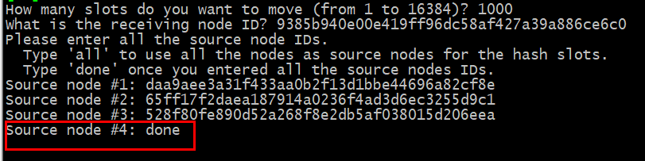

- 全部重新分配
````
redis-cli -h 172.10.0.13:6379 --cluster rebalance 172.10.0.13:6379
````
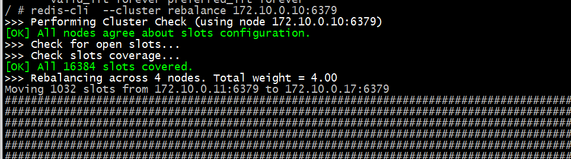

### 1.2 收缩集群
>收缩集群意味着缩减规模，需要从现有集群中安全下线部分节点，下线节点过程如下

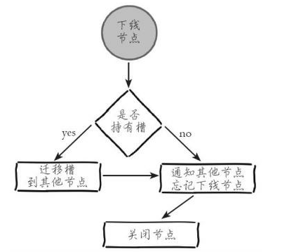

````
1）首先需要确定下线节点是否有负责的槽，如果是，需要把槽迁移到其他节点，保证节点下线后整个集群槽节点映射的完整性。
2）当下线节点不再负责槽或者本身是从节点时，就可以通知集群内其他节点忘记下线节点，当所有的节点忘记该节点后可以正常关闭。
````
- 将主节点的槽分配出去
````
 # redis-cli -h 172.10.0.13:6379 --cluster reshard 172.10.0.17:6379
````
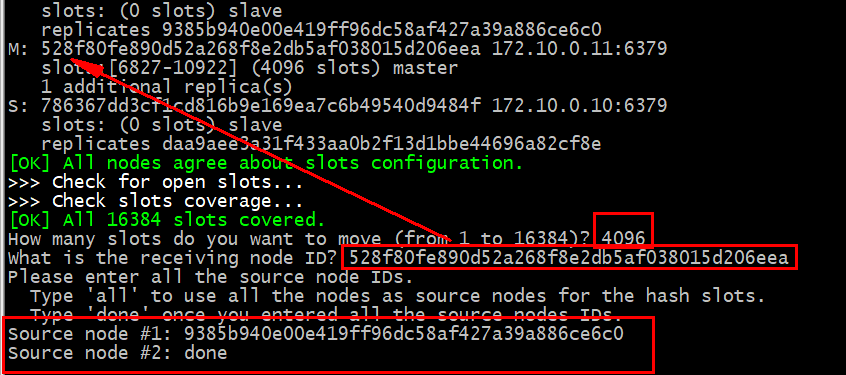

- 依次删除主从节点
````
redis-cli -h 172.10.0.13:6379 --cluster del-node 172.10.0.17:6379 9385b940e00e419ff96dc58af427a39a886ce6c0

redis-cli -h 172.10.0.13:6379 --cluster del-node 172.10.0.18:6379 ddbd838b9965024cf360bee50f9be38aaa38b596
````
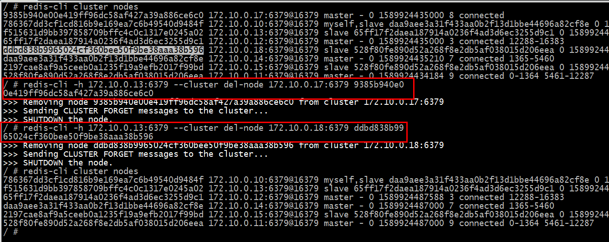

### 1.3 命令说明
````
-- 检查集群
redis-cli --cluster check ip:port
-- 集群信息查看
redis-cli --cluster info ip:port
-- 修复集群
redis-cli --cluster fix ip:port
-- 平衡（rebalance）slot：
redis-cli -a mima --cluster rebalance ip:port
````

## 2.请求重定向
>目前我们已经搭建好redis集群并且能理解了通信和伸缩细节，但是还没有使用客户端去操作集群。redis集群对客户端通信协议做了比较大的修改，为了追求性能最
 大化，并没有采用代理方式而是采用客户端直接连节点的方式。
 
>在集群模式下，Redis 接收任何键相关命令时首先计算键对应的槽，再根据槽找出所对应的节点，如果节点是自身，则处理键命令；否则回复 MOVED 重定向错
 误，通知客户端请求正确的节点。这个过程称为 MOVED 重定向，这个过程之前已经体验过了

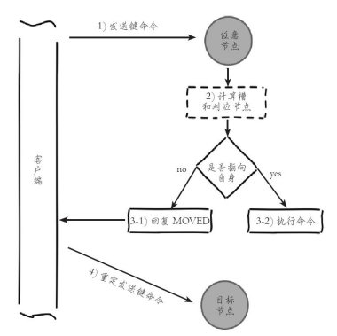

执行set命令成功因为刚刚好对应的槽位于我们的节点上，但是后面失败是因为不在我们的节点上；可以通过 cluster keyslot {key} 命令返回key所对应的槽
````
/ # redis-cli
127.0.0.1:6379> cluster keyslot a
(integer) 15495

127.0.0.1:6379> cluster nodes
786367dd3cf1cd816b9e169ea7c6b49540d9484f 172.10.0.10:6379@16379 myself,slave daa9aee3a31f433aa0b2f13d1bbe44696a82cf8e 0 1589924800000 1 connected
f515631d9bb397858709bffc4c0c1317e0245a02 172.10.0.13:6379@16379 slave 65ff17f2daea187914a0236f4ad3d6ec3255d9c1 0 1589924801533 4 connected
65ff17f2daea187914a0236f4ad3d6ec3255d9c1 172.10.0.12:6379@16379 master - 0 1589924800405 3 connected 12288-16383
daa9aee3a31f433aa0b2f13d1bbe44696a82cf8e 172.10.0.14:6379@16379 master - 0 1589924801428 7 connected 1365-5460
2197cae8af9a5ceeb0a1235f19a9efb2017f99bd 172.10.0.15:6379@16379 slave 528f80fe890d52a268f8e2db5af038015d206eea 0 1589924799380 9 connected
528f80fe890d52a268f8e2db5af038015d206eea 172.10.0.11:6379@16379 master - 0 1589924801000 9 connected 0-1364 5461-12287
````
``redis-cli -c`` 模式解决

redis-cli自动帮我们连接到正确的节点执行命令，这个过程是载入edis-cli内部维护，实际上就是在redis-cli接收到MOVED信息之后再次发起请求，并不在Redis节点
中完成请求转发。节点对于不属于它的键命令只回复重定向响应，并不负责转发。
键命令执行步骤：计算槽，查找槽所对应的节点

### 2.1 计算槽
>redis首先需要计算键对应的槽。根据键的有效部分使用CRC16函数计算出散列值，再取对16383的余数，使每个键都可以映射到0~16383槽范围内。

源码中``/usr/src/redis/redis-5.0.7/src``
````
unsigned int keyHashSlot(char *key, int keylen) {
    int s, e; /* start-end indexes of { and } */

    for (s = 0; s < keylen; s++)
        if (key[s] == '{') break;

    /* No '{' ? Hash the whole key. This is the base case. */
    if (s == keylen) return crc16(key,keylen) & 0x3FFF;

    /* '{' found? Check if we have the corresponding '}'. */
    for (e = s+1; e < keylen; e++)
        if (key[e] == '}') break;

    /* No '}' or nothing between {} ? Hash the whole key. */
    if (e == keylen || e == s+1) return crc16(key,keylen) & 0x3FFF;

    /* If we are here there is both a { and a } on its right. Hash
     * what is in the middle between { and }. */
    return crc16(key+s+1,e-s-1) & 0x3FFF;
}
````
根据伪代码可以看出来，如果键内容包含{ 和 } 大括号字符，则计算槽的有效部分是大括号的内容；否则采用简单全部内容计算槽。

cluster keyslot 命令就是采用keyHashSlot函数实现的
````
[root@localhost ~]# redis-cli -h 192.160.1.200
192.160.1.200:6379> cluster keyslot ytl
(integer) 12078
192.160.1.200:6379> cluster keyslot y{t}l
(integer) 15891
192.160.1.200:6379> cluster keyslot t
(integer) 15891
192.160.1.200:6379>
````
cluster keyslot y{t}l => cluster keyslot key{hash_tag} 这大括号中的内容叫做hash_tag，它提供不同的键可以具备相同slot的功能，常用批量操作；

比如在集群模式下使用mset/mget等命令优化批量调用时，键列表必须具有同的slot，否则会报错，这个时候可以利用hash_tag让不同的键具有相同的slot达到目
的
````
[root@localhost ~]# redis-cli -h 192.160.1.200 -c
192.160.1.200:6379> mset name{1000} u ok{1000} o
-> Redirected to slot [11326] located at 192.160.1.201:6379
OK
192.160.1.201:6379> mset name u ok o
(error) CROSSSLOT Keys in request don't hash to the same slot
192.160.1.201:6379> mget name{1000} ok{1000}
1) "u"
2) "o"
192.160.1.201:6379> mget name ok
(error) CROSSSLOT Keys in request don't hash to the same slot
192.160.1.201:6379>
````
redis计算得到键对应的槽后，需要查找槽所对应的节点。集群内通过消息交换每个节点都会知道所有节点的槽信息，内部保存在clusterState结构中
````
 if ((de = dictNext(di)) != NULL) {
            robj *key = dictGetKey(de);
            int slot = keyHashSlot((char*)key->ptr, sdslen(key->ptr));
            clusterNode *node = server.cluster->slots[slot];

            /* We send an error and unblock the client if:
             * 1) The slot is unassigned, emitting a cluster down error.
             * 2) The slot is not handled by this node, nor being imported. */
            if (node != myself &&
                server.cluster->importing_slots_from[slot] == NULL)
            {
                if (node == NULL) {
                    clusterRedirectClient(c,NULL,0,
                        CLUSTER_REDIR_DOWN_UNBOUND);
                } else {
                    clusterRedirectClient(c,node,slot,
                        CLUSTER_REDIR_MOVED);
                }
                dictReleaseIterator(di);
                return 1;
            }
        }
````
通过伪代码诠释
````
<?php
class cluster
{
    /**
    * 节点集合
    * @var clusterNode
    */
    public $nodes = [];
    public $myself ;
    // ...
    /**
    * [
    * '槽标识' => 节点标识
    * ]
    * @var [type]
    */
    public $slots = [
    ];
    public function __construct(){}
    public function keyHashSlot($key) {
    // ....
    }
    // 请求重定向
    public function clusterRedirectBlockedClientIfNeeded(client $c)
    {
    // 等到对应的key
    $slot = $this->keyHashSlot($this->dictGetKey());
    // 获取对应的集群节点
    $node = $this->server->cluster->slots[$slot];
    if ($node == $this->myself) {
    return $this->dictReleaseIterator();
    } else {
    return "{$error} MOVED {$slot} {$node->ip}:{$node->port}";
    }
    }
    public function dictGetKey()
    {
    return "key";
    }
    public function dictReleaseIterator() {}
}?>
````
根据代码看出节点对于判定键命令执行韩式MOVED重定向，都是建筑slots[CLUSTER_SLOTS]数组实现，根据moved重定向机制，客户端可以随机连接集群内任意
redis获取键所在节点


