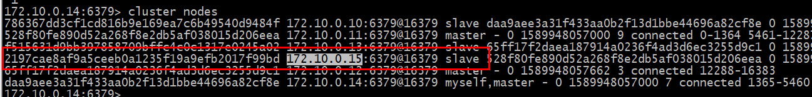
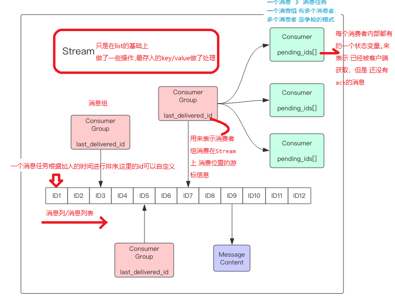
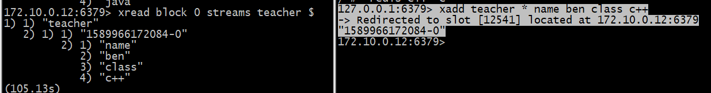

# Redis内容回顾
## [1.phpredis连接方式及使用](https://github.com/phpredis/phpredis/blob/develop/cluster.markdown#readme):
````
<?php
 $redis = new RedisCluster(Null,Array('172.10.0.13:6379','172.10.0.11:6379',' 172.10.0.12:6379'));
 echo($redis->get('b'));
````
[官方指南](https://www.ctolib.com/docs-Redis-Official-Guide-c-index)
## 2.对于读写分离问题:



````
<?php
 $redis = new RedisCluster(Null,Array('172.10.0.15:6379'));
$redis->set('a','will');
 echo($redis->get('a'));
````
这里的172.10.0.15是一台从节点,依然可以正常写入,读取

针对在数据槽迁移的时候,对写入或读取的影响
>槽的迁移不影响数据的读取写入操作,因为这个过程迁移的是新的槽(没有数据的槽),连个操作并行,互不影响


````
/ # redis-cli -h 172.10.0.11 
172.10.0.11:6379> set c 1
OK


# Replication
role:master
connected_slaves:1
slave0:ip=172.10.0.15,port=6379,state=online,offset=132840,lag=1
master_replid:848384ce7a5de4c0b52767f13818040cc6fda8e2


在172.10.0.15中读取数据
/ # redis-cli -h 172.10.0.15
172.10.0.15:6379> get c
(error) MOVED 7365 172.10.0.11:6379
````
这里为什么读取不到呢?
>在redis的集群中,``主从的复制默认是关闭的``,你需要手动开启,这样做是避免一些延迟问题,输入[readonly](https://redis.io/commands/readonly)即可,这里需要每个从节点都手动执行下该命令,``如果宕机了重启,需要重新执行这个命令``
````
172.10.0.15:6379>  readonly
OK
172.10.0.15:6379> get c
"1"
````

##  3.redis5的新数据类型(streams)
>streams ：这是redis5放出来的新特性，其实Antirez在几年前开了一个新项目叫做disque, 也是用来做消息队列的；而stream可以说是基于disque而设计的，它是一
 个新的强大的支持多播的可持久化的消息队列，作者坦言 Redis Stream 借鉴了 Kafka 的设计



>[Redis Stream](https://redis.io/topics/streams-intro) 的结构如上图所示，它有一个消息链表，将所有加入的消息都串起来，每个消息都有一个唯一的 ID 和对应的内容。消息是持久化的，Redis 重启后，
 内容还在.其类似于[发布订阅](https://www.ctolib.com/docs-Redis-Official-Guide-c-153985.html)

- Consumer Group:消费者组，可以简单看成记录流状态的一种数据结构。消费者既可以选择使用XREAD命令进行 独立消费,也可以多个消费者同时加入一个消
  费者组进行 组内消费。同一个消费者组内的消费者共享所有的Stream信息, 同一条消息只会有一个消费者消费到，这样就可以应用在分布式的应用场景中来
  保证消息的唯一性。
- last_ delivered_ id: 用来表示消费者组消费在Stream上 消费位置的游标信息。每个消费者组都有一个Stream内 唯一的名称，消费者组不会自动创建，需要使用
  XGROUP CREATE指令来显式创建,诅需要指定从哪一个消息ID开始消费，用来初始化last delivered. id这个变量。
- pending_ ids: 每个消费者内部都有的一个状态变量,来表示 已经被客户端 获取，但是 还没有ack的消息。 记录的目的是为了保证客户端至少消费了消息一
  次,不会在网络传输的中途秩而没有对消息进行处理。如果客户端没有ack,那么这个量里面的消息ID就会越来越多，一旦某个消息被ack,它就会对应开始减少。
  这个变量也被Redis官訪称为PEL (Pending Entries List)。
 
每个 Stream 都有唯一的名称，它就是 Redis 的 key，在我们首次使用xadd指令追加消息时自动创建。

每个 Stream 都可以挂多个消费组，每个消费组会有个游标last_delivered_id在 Stream 数组之上往前移动，表示当前消费组已经消费到哪条消息了。每个消费组都有
一个 Stream 内唯一的名称，消费组不会自动创建，它需要单独的指令xgroup create进行创建，需要指定从 Stream 的某个消息 ID 开始消费，这个 ID 用来初始化
last_delivered_id变量。

每个消费组 (Consumer Group) 的状态都是独立的，相互不受影响。也就是说同一份 Stream 内部的消息会被每个消费组都消费到。

同一个消费组 (Consumer Group) 可以挂接多个消费者 (Consumer)，这些消费者之间是竞争关系，任意一个消费者读取了消息都会使游标last_delivered_id往前移
动。每个消费者有一个组内唯一名称。

消费者 (Consumer) 内部会有个状态变量pending_ids，它记录了当前已经被客户端读取的消息，但是还没有 ack。如果客户端没有 ack，这个变量里面的消息 ID 会
越来越多，一旦某个消息被 ack，它就开始减少。这个 pending_ids 变量在 Redis 官方被称之为PEL，也就是Pending Entries List，这是一个很核心的数据结构，它
用来确保客户端至少消费了消息一次，而不会在网络传输的中途丢失了没处理。

### 3.1  消息Id和消息内容
消息id：
>消息ID如果是由XADD 命令返回自动创建的话，那么它的格式会像这样:tinestampInMillis- sequence(毫秒时间戳-序例号)，例如1527846880585-5 ，它表示当前的消
 息是在毫秒时间戳1527846880585 时产生的，且是该毫秒内产生的第5条消息。
>
>这些ID的格式看起来有一些奇怪，为什么要使用时间来当做ID的一部分呢?一方面，我们要满足ID自增的属性，另一方面，也是为了支持范围查找的功能。于ID和
 生成消息的时间有关，这样就使得在根据时间范围内查找时基本上是没有额外损耗的
>
>当然消息ID也可以由客户端自定义，但是形式必须是"整数-整数"，而且后面加入的消息的ID必须要大于前面的消息ID。
>
>消息 ID 的形式是timestampInMillis-sequence，例如1527846880572-5，它表示当前的消息在毫米时间戳1527846880572时产生，并且是该毫秒内产生的第 5 条消
 息。消息 ID 可以由服务器自动生成，也可以由客户端自己指定，但是形式必须是整数-整数，而且必须是后面加入的消息的 ID 要大于前面的消息 ID。

消息内容
>消息内容就是键值对，形如 hash 结构的键值对，这没什么特别之处

### 3.2 消息的curd
````
-- xadd 追加消息
-- 格式：xadd {stream name}      */{消息id *表示服务器默认生成}     key1 value1   key2 value2
-- 这里的消息id: 类型是 int-int 默认是 毫秒时间戳-序号
-- 消息类型型: hash类型 
-- 实例
172.10.0.14:6379> xadd will * sex man age 12 
-> Redirected to slot [13775] located at 172.10.0.12:6379
"1589960661700-0"
172.10.0.12:6379> xadd will * sex woman age 13 
"1589960674806-0"
172.10.0.12:6379> xadd will * sex man age 14 
"1589960684529-0"
172.10.0.12:6379> keys *
1) "a"
2) "yin"
3) "will"

-- xrange 消息的查看
-- 根据范围查询  从小到大的方式进行排序(根据消息的id)   "-"表示最小  "+"表示最大
-- 实例
172.10.0.12:6379> xrange will - +
1) 1) "1589960550501-0"
   2) 1) "sex"
      2) "man"
      3) "age"
      4) "12"
2) 1) "1589960661700-0"
   2) 1) "sex"
      2) "man"
      3) "age"
      4) "12"
3) 1) "1589960674806-0"
   2) 1) "sex"
      2) "woman"
      3) "age"
      4) "13"
4) 1) "1589960684529-0"
   2) 1) "sex"
      2) "man"
      3) "age"
      4) "14"


-- xrevrange 反序列查询
-- 实例
172.10.0.12:6379> xrevrange will + -
1) 1) "1589960684529-0"
   2) 1) "sex"
      2) "man"
      3) "age"
      4) "14"
2) 1) "1589960674806-0"
   2) 1) "sex"
      2) "woman"
      3) "age"
      4) "13"
3) 1) "1589960661700-0"
   2) 1) "sex"
      2) "man"
      3) "age"
      4) "12"
4) 1) "1589960550501-0"
   2) 1) "sex"
      2) "man"
      3) "age"
      4) "12"


-- xlen 查看长度
-- 实例:
172.10.0.12:6379> xlen will
(integer) 4


-- xdel删除消息内容
-- 实例
172.10.0.12:6379> xdel will 1589960550501-0
(integer) 1
````

### 3.3 独立消费
>我们可以在不定义消费组的情况下进行Stream消息的独立消费，当Stream没有新消息时，甚至可以阻塞等待。Redis 设计了一个单独的消费指令xread，可以将
 Stream当成普通的消息队列(list)来使用。使用xread时，我们可以完全忽略消费组(Consumer Group)的存在，就好比Stream就是一个普通的列表(list):
````
172.10.0.12:6379> keys *
(empty list or set)
172.10.0.12:6379> xadd teacher * name ben class php
"1589965426911-0"
172.10.0.12:6379> xadd teacher * name will class java
"1589965436450-0"
172.10.0.12:6379> xadd teacher * name yin class python
"1589965449661-0"
````
演示
````
-- xread : 其作用是返回streams中从来没有读取的，且比参数ID更大的元素。
-- 格式: xread {[count num] | [block milliseconds]} {stream name} {id}
-- 实例: 获取前两条数据
172.10.0.12:6379> xread    count 2   streams teacher    0-0
1) 1) "teacher"
   2) 1) 1) "1589965426911-0"
         2) 1) "name"
            2) "ben"
            3) "class"
            4) "php"
      2) 1) "1589965436450-0"
         2) 1) "name"
            2) "will"
            3) "class"
            4) "java"


-- 说明: BLOCK为0表示一致等待知道有新的数据，否则永远不会超时。并且ID的值我们用特殊字符`$`表示，这个特殊字符表示我们只获取最新添加的消息。
127.0.0.1:6379> xadd teacher * name ben class c++
-> Redirected to slot [12541] located at 172.10.0.12:6379
"1589966172084-0"


-- 可以开启了一个窗体添加数据
127.0.0.1:6379> xadd teacher * name ben class c++
-> Redirected to slot [12541] located at 172.10.0.12:6379
"1589966172084-0"
````



