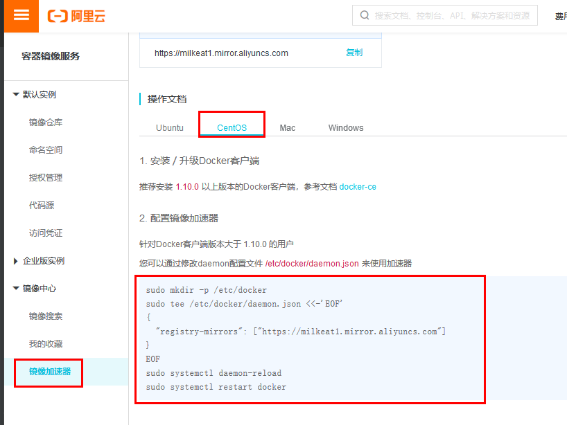
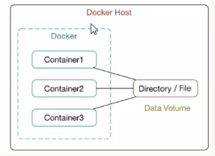
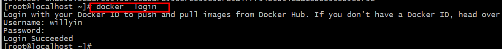
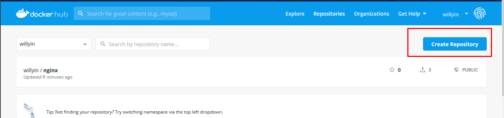
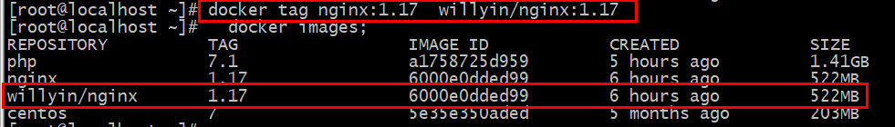
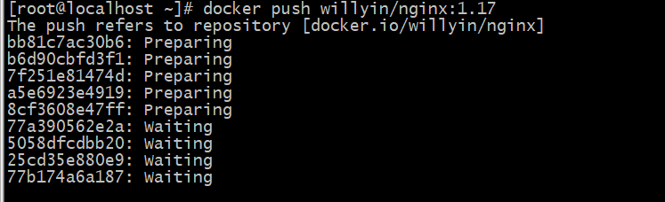
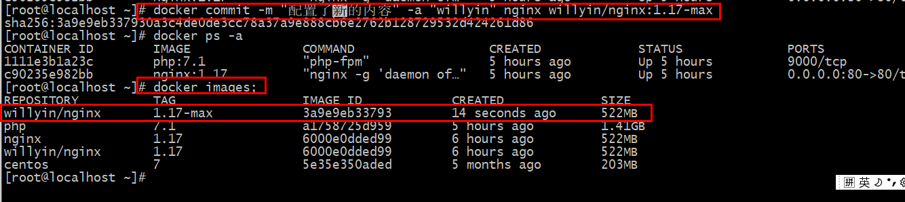

# Docker准备
## 1.docker介绍
### 1.1 Docker是什么？
>Docker 是一个开源的应用容器引擎，你可以将其理解为一个轻量级的虚拟机，开发者可以打包他们的应用以及依赖包到一个可移植的容器中，然后发布到任何流行的 Linux 机器上。
### 1.2 为什么要使用 Docker？
>作为一种新兴的虚拟化方式，Docker 跟传统的虚拟化方式相比具有众多的优势。
### 1.3 docker优势
- 更高效的利用系统资源
- 更快速的启动时间
- 一致的运行环境
- 更轻松的迁移
- 更轻松的维护和扩展
### 1.4 docker主要用途
- 提供一次性的环境。比如，本地测试他人的软件、持续集成的时候提供单元测试和构建的环境。
- 提供弹性的云服务。因为 Docker 容器可以随开随关，很适合动态扩容和缩容。
- 组建微服务架构。通过多个容器，一台机器可以跑多个服务，因此在本机就可以模拟出微服务架构。
### 1.5 docker安装(centos7)
- 更新update到最新的版本
```
yum  update 
```
卸载老版本docker
````
yum  remove docker  docker-common docker-selinux  docker-engine
````
- 安装需要的软件包
````
yum install -y yum-utils  device-mapper-persistent-data lvm2
````
- 设置yum源
````
yum-config-manager --add-repo https://download.docker.com/linux/centos/docker-ce.repo
````
- 查看docker版本
````
yum list docker-ce --showduplicates|sort -r  
````
安装docker
````
yum  install  docker-ce-18.03.1.ce -y
````
- 启动docker
````
systemctl start docker
````
加入开机自启
````
systemctl enable docker
````
- 配置国内镜像, [进入网址](https://cr.console.aliyun.com/cn-hangzhou/mirrors)
````
vi /etc/docker/daemon.json 
{
  "registry-mirrors": ["https://milkeat1.mirror.aliyuncs.com"]
}
````
- 刷新重启
````
systemctl daemon-reload
systemctl restart docker
````


### 1.6 docker安装(centos8)
设置阿里 yun 源
````
// 设置 yum 源
cd /etc/yum.repos.d/ && mkdir backup && mv *repo backup/

curl -o /etc/yum.repos.d/Centos-8.repo http://mirrors.aliyun.com/repo/Centos-8.repo

sed -i -e "s|mirrors.cloud.aliyuncs.com|mirrors.aliyun.com|g " /etc/yum.repos.d/Centos-*

sed -i -e "s|releasever|releasever-stream|g" /etc/yum.repos.d/Centos-*
````
````
// 获取 docker yum 源
wget -O /etc/yum.repos.d/docker-ce.repo https://mirrors.aliyun.com/docker-ce/linux/centos/docker-ce.repo
````
验证 yum 源
```
[root@101 yum.repos.d]# yum repolist
Failed to set locale, defaulting to C.UTF-8
repo id                                                                                    repo name
AppStream                                                                                  CentOS-8-stream - AppStream - mirrors.aliyun.com
base                                                                                       CentOS-8-stream - Base - mirrors.aliyun.com
docker-ce-stable                                                                           Docker CE Stable - aarch64
extras
```
安装
````
yum -y install docker-ce
````

---

## 2. 镜像的结构
利用 composer（php）与 docker 做一个对比
````
      composer               docker
镜像  composer.json          dockerfile
容器  composer组件包          容器   
仓库(Packagist )             (dockerhub)
仓库(存放公共发布的资源)
````
---

## 3. dockerfile介绍与镜像的构建
### 3.1 dockerfile
>Dockfile是一种被Docker程序解释的脚本，Dockerfile由一条一条的指令组成，每条指令对应Linux下面的一条命令。Docker程序将这些Dockerfile指令翻译真正的Linux命令。Dockerfile有自己书写格式和支持的命令，Docker程序解决这些命令间的依赖关系，类似于Makefile。

>Dockerfile的指令是忽略大小写的，建议使用大写，
 使用 # 作为注释，
 每一行只支持一条指令，每条指令可以携带多个参数。
 
>Dockerfile的指令根据作用可以分为两种，构建指令和设置指令。构建指令用于构建image，其指定的操作不会在运行image的容器上执行；设置指令用于设置image的属性，其指定的操作将在运行image的容器中执行。
````
FROM（指定基础image）
FROM  <image>:<tag> 

MAINTAINER（用来指定镜像创建者信息）
MAINTAINER <name> 

RUN（安装软件用）
RUN <command>

ENV（用于设置环境变量）
ENV <key> <value> 

ADD（从src复制文件到container的dest路径）
ADD  <src> <dest>    复制过去 直接解压

COPY  src  dest   不给解压

CMD（设置container启动时执行的操作）
CMD ["executable","param1","param2"]

ENTRYPOINT（设置container启动时执行的操作）
ENTRYPOINT ["executable", "param1", "param2"]

USER（设置container容器的用户）
USER daemon

EXPOSE（指定容器需要映射到宿主机器的端口）
EXPOSE <port> [<port>...]  

VOLUME（指定挂载点)）
VOLUME ["<mountpoint>"]  

WORKDIR（切换目录）
WORKDIR  /path/to/workdir  

ONBUILD（在子镜像中执行）
ONBUILD <Dockerfile关键字> 

2.
docker  build
-f  指定 dockerfile文件    Dockerfile  默认 可以不用加  -f   
-t  指定image  tag  标签
.   上下文选项
docker  build  -f   dockerfile文件    -t   image:tag   
````
### 3.2 数据卷
>Docker中的数据可以存储在类似于虚拟机磁盘的介质中，在Docker中称为数据卷（Data Volume）。数据卷可以用来存储Docker应用的数据，也可以用来在Docker容器间进行数据共享。数据卷呈现给Docker容器的形式就是一个目录，支持多个容器间共享，修改也不会影响镜像。


````
选项
-d: 后台运行容器，并返回容器ID；
-i: 以交互模式运行容器，通常与 -t 同时使用；
-t: 为容器重新分配一个伪输入终端，通常与 -i 同时使用；
--name:   为容器指定一个名称；
-h:       指定容器的hostname；
-p: 指定端口映射，格式为：主机(宿主)端口:容器端口

docker run -d  --name web-6  -p 90:80  nginx 
-P: 随机端口映射，容器内部端口随机映射到主机的高端口
--link   添加链接到另一个容器；
--restart   启动docker自动启动  always/no（默认）
-m   --memory   限制使用的最大内存
-cpus   限制使用的cpu数量
-v  绑定数据卷   -v /home/www:/usr/share/nginx/html  (/home/www为宿主机目录)
--mount  挂载文件系统到容器

数据卷:
volume   
docker volume  
选项  
create   创建数据卷
inspect  查看
ls           列出数据卷
prune     删除不用的数据卷 
rm          移除数据卷


创建数据卷:
docker volume create  vol_test(宿主机数据卷的目录:/var/lib/docker/volumes)

 1.创建并绑定数据卷(可以不执行上面的命令,执行下面命令,有就使用,没有自动创建数据卷vol_test):
   docker run -d --name web5 -p 99:80  -v vol_test:/usr/share/nginx/html   nginx
   此时是/var/lib/docker/volumes/vol_test/_data 与 容器中/usr/share/nginx/html目录同步
 
 2.直接挂载到指定目录,原来的文件没有了
   docker run  -d --name web6  -p 2223:80  -v /home/www:/usr/share/nginx/html  nginx 
   此时是/home/www 与 容器中的 /usr/share/nginx/html 目录同步
````

## 4.将容器生成为镜像
- 先停止现有容器 `docker stop container-name`
- 将容器commit成为一个镜像 `docker commit container-name  new-image-name`
- 用新镜像运行容器  `docker run -it -d --name container-name -p p1:p1 -p p2:p2 new-image-name`

---
## 5.dockerhub发布
- 注册 docker hub    https://hub.docker.com/
- 同步服务器时间  yum install ntpdate     ntpdate  ntp1.aliyun.com
- docker  login



- 先创建项目



- 修改 镜像 标签 docker tag nginx:1.17  willyin/nginx:1.17
>这里的名字一定和项目名程一致, : 后面为标签(willyin/nginx:1.17)

- 镜像推送 docker push  willyin/nginx:1.17 
 


- 如果容器中修改了内容,想要生成镜像并推送
>docker commit -m "配置了新的内容" -a "willyin" nginx willyin/nginx:1.17-max


- 从仓库拉下来 docker pull willyin/nginx:1.17

## 6. [docker-compose 安装](http://get.daocloud.io/#install-compose)
Docker Compose 存放在Git Hub，不太稳定。
你可以也通过执行下面的命令，高速安装Docker Compose。
````
# 下载安装包
curl -L https://get.daocloud.io/docker/compose/releases/download/v2.5.0/docker-compose-`uname -s`-`uname -m` > /usr/local/bin/docker-compose

# 设置权限
chmod +x /usr/local/bin/docker-compose

# 添加软连接
sudo ln -s /usr/local/bin/docker-compose /usr/bin/docker-compose

# 查看安装信息
docker-compose --version

# 卸载数据
sudo rm /usr/local/bin/docker-compose
````
这里的版本（ `v2.5.0`）选择要根据 docker 版本进行适配选择
