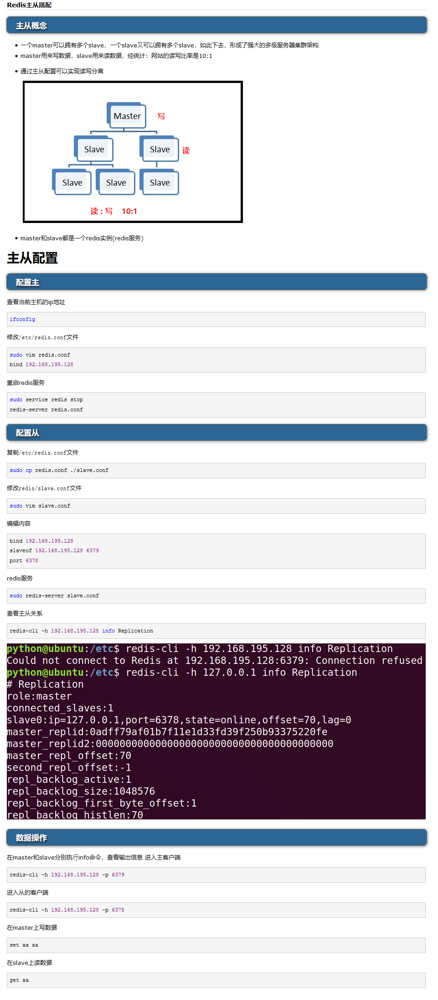
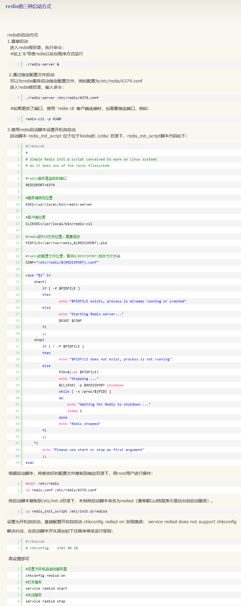

# Docker-Redis 主从复制构建
## 1.构建redis主从
>如果要制作镜像，强烈推荐alpine linux作为基础镜像，当然最大的优点是镜像小，对于运行分发肯定有好处的。可能有人觉得centos里面命令多，软件、库比较多，理应会比较好，事实上恰好相反，alpine包含了基础的一些命令足够在容器中使用，然centos中包含的很多库都潜藏着很多系统漏洞，从安全层面来说真不如alpine
alpine现在的软件包也有很多，而且国内也有很多站点提供软件包的下载，也是得益于docker广泛使用，alpine也会变得现在越来越流行了
````
FROM alpine:3.11
RUN sed -i 's/dl-cdn.alpinelinux.org/mirrors.aliyun.com/g' /etc/apk/repositories \
  && apk add  gcc g++ libc-dev  wget vim  openssl-dev make  linux-headers \
  && rm -rf /var/cache/apk/*

COPY ./redis-5.0.7.tar.gz redis-5.0.7.tar.gz

# 通过选择更小的镜像，删除不必要文件清理不必要的安装缓存，从而瘦身镜像
# 创建相关目录能够看到日志信息跟数据跟配置文件  sh
RUN mkdir -p /usr/src/redis \
      && mkdir -p /redis/data \
      && mkdir -p /redis/conf \
      && mkdir -p /redis/log   \
      && mkdir -p /var/log/redis \
      && tar -zxvf redis-5.0.7.tar.gz -C /usr/src/redis \
      && rm -rf redis-5.0.7.tar.gz \
      && cd /usr/src/redis/redis-5.0.7 && make \
      && cd /usr/src/redis/redis-5.0.7 && make install;

EXPOSE 6379

CMD ["redis-server","/usr/src/redis/redis-5.0.7/redis.conf"]

#ENTRYPOINT ["redis-server", "/usr/src/redis/redis-5.0.7/redis.conf"]
````
构建镜像
````
docker build -t redis/redis:5 .  
````
创建网络:
````
docker network create --subnet=192.160.1.0/24 redis
````
创建容器
````
docker run -itd -v /redis/master:/redis -p 6350:6379 --network=redis --ip=192.160.1.150 --name redis_master  redis/redis:5
````
````
docker run -itd -v /redis/salve:/redis -p 6340:6379 --network=redis --ip=192.160.1.140 --name redis_salve redis/redis:5
````
进入容器
````
docker exec -it ba24e9cdcbb6  sh //这里不用bash命令
````
````
docker exec -it bfdsafdas9cd  sh
````

修改配置文件, 确保主服务器的redis-master的配置文件这两项是开启的
````
bind 0.0.0.0
protected-mode no
````
进入从服务器, 执行如下命令 
````
SLAVEOF 192.160.1.150 6379
````
### 1.1 网关命令
docker network命令
````
1.docker network create
    # 不指定网络驱动时默认创建的bridge网络
    docker network create simple-network
    --subnet选项创建子网
    docker network create --subnet=192.160.1.0/24 redis5sm

docker network ls

docker network rm
    docker network rm simple-network
docker network inspect
    # 查看网络内部信息
    docker network inspect simple-network

启动docker容器时报错：
iptables failed: iptables --wait -t nat -A DOCKER -p tcp -d 0/0 --dport 5000 -j DNAT --to-destination 172.18.0.4:5000 ! -i br-ff45d935188b: iptables: No chain/target/match by that name. (exit status 1)

解决方案：重启docker
systemctl restart docker
````




## 2.快速搭建
````
docker pull redis

docker run  -v /root/redis:/usr/local/etc/redis  --name redis -p 6379:6379 redis:latest redis-server /usr/local/etc/redis/redis.conf
````
