# Redis 单线程实现

Redis 仅仅靠单线程就可以支撑起每秒数万 QPS 的高处理能力, 那只是靠单线程是如何来保证在多连接的时候， 系统的高吞吐量。

## 1. I/O 多路复用

Redis 是跑在单线程中的，所有的操作都是按照顺序线性执行的，但是由于读写操作等待用户输入或输出都是阻塞的，所以 I/O 操作在一般情况下往往不能直接返回，这会导致某一文件的 I/O 阻塞导致整个进程无法对其它客户提供服务，而 I/O 多路复用就是为了解决这个问题而出现的

那么我们就详细介绍一下 I/O 多路复用,  I/O 多路复用 实现的方式有很多, 最为经典的就是 **epoll**, 关于epoll 模型的演进过程, 也是有必要了解一下

#### 前置内容

**程序发起一次IO访问是分为两个阶段的：**

- IO 调用阶段：应用程序向内核发起系统调用。
- IO执行阶段：内核执行IO操作并返回。(主要考察的部分)
  - 数据准备阶段：内核等待IO设备准备好数据
  - 数据拷贝阶段：将数据从内核缓冲区拷贝到用户空间缓冲区

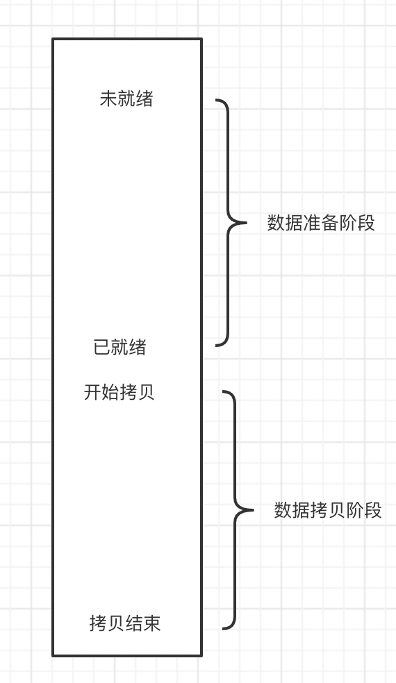

**用户空间&内核空间**

操作系统是利用CPU 指令来计算和控制计算机系统的，有些指令我们操作它不会对操作系统产生什么危害，而有些指令使用不当则会导致系统崩溃，如果操作系统允许所有的应用程序能够直接访问这些很危险的指令，这会让计算机大大增加崩溃的概率。所以操作系统为了更加地保护自己，则将这些危险的指令保护起来，不允许应用程序直接访问。

现代操作系统都是采用虚拟存储器，操作系统为了保护危险指令被应用程序直接访问，则将虚拟空间划分为内核空间和用户空间

- 内核空间则是操作系统的核心，它提供操作系统的最基本的功能，是操作系统工作的基础，它负责管理系统的进程、内存、设备驱动程序、文件和网络系统，决定着系统的性能和稳定性。
- 用户空间，非内核应用程序则运行在用户空间。用户空间中的代码运行在较低的特权级别上，只能看到允许它们使用的部分系统资源，并且不能使用某些特定的系统功能，也不能直接访问内核空间和硬件设备，以及其他一些具体的使用限制

**[用户态和内核态进程切换](https://www.cnblogs.com/shangxiaofei/p/5567776.html)**

- 内核态: CPU可以访问内存所有数据, 包括外围设备, 例如硬盘, 网卡等, CPU也可以将自己从一个程序切换到另一个程序。 
- 用户态: 只能受限的访问内存, 且不允许访问外围设备。占用CPU的能力被剥夺, CPU资源可以被其他程序获取。

CPU为了保护操作系统将空间划分为内核空间和用户空间，进程既可以在内核空间运行，也可以在用户空间运行。当进程运行在内核空间时，它就处在内核态，当进程运行在用户空间时，他就是用户态。

开始所有应用程序都是运行在用户空间的，这个时候它是用户态，但是它想做一些只有内核空间才能做的事情，如读取IO，这个时候进程需要通过系统调用来访问内核空间，进程则需要从用户态转变为内核态。

用户态和内核态之间的切换开销有点儿大，它开销大的地方有如下几点：

- 保留用户态现场（上下文、寄存器、用户栈等）
- 复制用户态参数，用户栈切到内核栈，进入内核态
- 额外的检查（因为内核代码对用户不信任）
- 执行内核态代码
- 复制内核态代码执行结果，回到用户态
- 恢复用户态现场（上下文、寄存器、用户栈等）

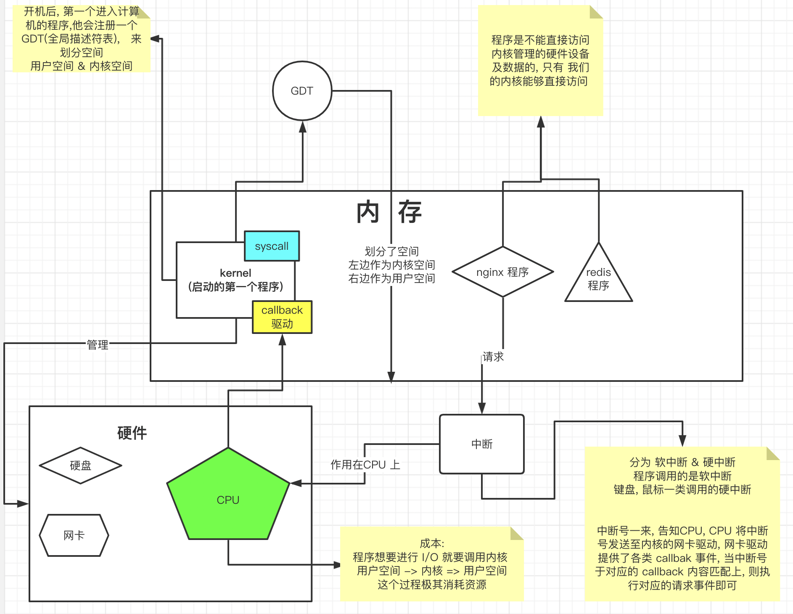

**程序示例观测**

```go
package main

import (
	"log"
	"net"
	"time"
)

func main() {
	//建立socket端口监听
	netListen, err := net.Listen("tcp", "localhost:1024")
	if err != nil {
		log.Fatal(err)
	}
	defer netListen.Close()
	log.Println("Waiting for clients ...")

	//等待客户端访问
	for {
		conn, err := netListen.Accept() //监听接收
		if err != nil {
			continue //如果发生错误，继续下一个循环。
		}
		log.Println(conn.RemoteAddr().String(), "tcp connect success") //tcp连接成功
		go handleConnection(conn)
	}
}

//处理连接
func handleConnection(conn net.Conn) {
	buffer := make([]byte, 2048) //建立一个slice
	for {
		n, err := conn.Read(buffer) //读取客户端传来的内容
		if err != nil {
			log.Println(conn.RemoteAddr().String(), "connection error: ", err)
			return //当远程客户端连接发生错误（断开）后，终止此协程。
		}
		log.Println(conn.RemoteAddr().String(), "receive data string:\n", string(buffer[:n]))

		//返回给客户端的信息
		strTemp := "CofoxServer got msg \"" + string(buffer[:n]) + "\" at " + time.Now().String()
		conn.Write([]byte(strTemp))
	}
}

```

使用 go 编写一个 socket 服务端实例, 我们使用 `strace` (自行补充知识) 进行追踪

```
[root@99 GoProject]# strace -ff -o ./strace go  run main.go
2022/05/08 22:29:11 Waiting for clients ...

[root@99 GoProject]# ll
total 3492
-rw-r--r--. 1 root root   1128 May  8 22:20 main.go
-rw-r--r--. 1 root root 266577 May  8 22:56 strace.6552
-rw-r--r--. 1 root root 238735 May  8 22:56 strace.6553
-rw-r--r--. 1 root root 787567 May  8 22:56 strace.6554
-rw-r--r--. 1 root root 246691 May  8 22:56 strace.6555
-rw-r--r--. 1 root root    484 May  8 22:56 strace.6556
-rw-r--r--. 1 root root 283166 May  8 22:56 strace.6557

// .......

-rw-r--r--. 1 root root  79872 May  8 22:56 strace.6592
-rw-r--r--. 1 root root  40874 May  8 22:56 strace.6593
-rw-r--r--. 1 root root   3313 May  8 22:56 strace.6594
-rw-r--r--. 1 root root    611 May  8 22:56 strace.6595
-rw-r--r--. 1 root root    567 May  8 22:56 strace.6596
-rw-r--r--. 1 root root    881 May  8 22:56 strace.6597
-rw-r--r--. 1 root root    519 May  8 22:56 strace.6598
```

当程序运行, 从 strace.* 文件列表中我们可以看出, 一下启动了诸多的线程, 那么那个是主进程呢?

```
[root@99 GoProject]# grep "Waiting" ./strace.65*
./strace.6593:write(2, "2022/05/08 22:56:11 Waiting for "..., 44) = 44

[root@99 GoProject]# vim strace.6593
// ..... 
375 write(2, "2022/05/08 22:29:11 Waiting for "..., 44) = 44
```

由此我们知道主进程是 pid = 6593, 因为go程序启动后, 启动多个线程执行不同任务, 有负责监听的, 有负责 GC ...... 所以目录下有诸多的其他线程的 strace 文件


通过 `netstat` 一样可以查询到信息

```
[root@99 fd]#  netstat -nltp
Active Internet connections (only servers)
Proto Recv-Q Send-Q Local Address           Foreign Address         State       PID/Program name
tcp        0      0 0.0.0.0:22              0.0.0.0:*               LISTEN      896/sshd
tcp        0      0 127.0.0.1:1024          0.0.0.0:*               LISTEN      6593/main   // tcp 监听的主进程
```


proc 目录下存放的 各个进行的详细信息(符合 Linux 中一切皆文件的说法) 

```
[root@99 6593]# pwd
/proc/6593


[root@99 6593]# ll
total 0
// ....
dr-x------.  2 root root 0 May  8 22:56 fd
// ....
-r--------.  1 root root 0 May  8 23:00 syscall
dr-xr-xr-x.  8 root root 0 May  8 23:00 task
// ..... 


[root@99 6593]# cd task
[root@99 task]# ll
total 0
dr-xr-xr-x. 7 root root 0 May  8 23:03 6593  //  主进程 
dr-xr-xr-x. 7 root root 0 May  8 23:03 6594  
dr-xr-xr-x. 7 root root 0 May  8 23:03 6595
dr-xr-xr-x. 7 root root 0 May  8 23:03 6596
dr-xr-xr-x. 7 root root 0 May  8 23:03 6597
dr-xr-xr-x. 7 root root 0 May  8 23:03 6598
// 之后的都为 6593 的线程 


[root@99 6593]# cd fd
[root@99 fd]# ll
total 0
lrwx------. 1 root root 64 May  8 23:05 0 -> /dev/pts/2
lrwx------. 1 root root 64 May  8 23:05 1 -> /dev/pts/2
lrwx------. 1 root root 64 May  8 23:05 2 -> /dev/pts/2
lrwx------. 1 root root 64 May  8 22:56 3 -> 'socket:[62422]'
lrwx------. 1 root root 64 May  8 23:05 4 -> 'anon_inode:[eventpoll]'
lr-x------. 1 root root 64 May  8 23:05 5 -> 'pipe:[62416]'
l-wx------. 1 root root 64 May  8 23:05 6 -> 'pipe:[62416]'
// 这里的 0 1 2 3 4 5 6 称之为文件描述符, 任何一个程序都有 I/O, 那么每个程序都有三个最基本的 I/O, 0: 标准输入, 1: 标准输出, 2: 错误输出

```

我们执行 nc 进行连接

```
[root@99 ~]# nc localhost 1024

```

服务端收连接

```
[root@99 GoProject]# strace -ff -o ./strace go run main.go
2022/05/08 22:56:11 Waiting for clients ...
2022/05/08 23:15:28 127.0.0.1:57468 tcp connect success

```

查看 fd 目录变化

```
[root@99 fd]# ll
total 0
lrwx------. 1 root root 64 May  8 23:11 0 -> /dev/pts/2
lrwx------. 1 root root 64 May  8 23:11 1 -> /dev/pts/2
lrwx------. 1 root root 64 May  8 23:11 2 -> /dev/pts/2
lrwx------. 1 root root 64 May  8 23:11 3 -> 'socket:[62422]'
lrwx------. 1 root root 64 May  8 23:11 4 -> 'anon_inode:[eventpoll]'
lr-x------. 1 root root 64 May  8 23:11 5 -> 'pipe:[62416]'
l-wx------. 1 root root 64 May  8 23:11 6 -> 'pipe:[62416]'
lrwx------. 1 root root 64 May  8 23:15 7 -> 'socket:[68360]'  // 多了一个 socket 连接的线程
```

````
[root@99 GoProject]# netstat -nltpa
Active Internet connections (servers and established)
Proto Recv-Q Send-Q Local Address           Foreign Address         State       PID/Program name
tcp        0      0 0.0.0.0:22              0.0.0.0:*               LISTEN      896/sshd
tcp        0      0 127.0.0.1:1024          0.0.0.0:*               LISTEN      6593/main
tcp        0      0 127.0.0.1:1024          127.0.0.1:57468         ESTABLISHED 6593/main     // 多了一个就绪的线程
````

查看日志

```
380 accept4(3, {sa_family=AF_INET, sin_port=htons(57468), sin_addr=inet_addr("127.0.0.1")}, [112->16], SOCK_CLOEXEC|SOCK_NONBLOCK) = 7   // 可以看到这里的 accept 的操作, htons(57468) 与 我们 netstat -nltpa 中获取的一致
381 epoll_ctl(4, EPOLL_CTL_ADD, 7, {EPOLLIN|EPOLLOUT|EPOLLRDHUP|EPOLLET, {u32=1965192688, u64=281472646936048}}) = 0
382 getsockname(7, {sa_family=AF_INET, sin_port=htons(1024), sin_addr=inet_addr("127.0.0.1")}, [112->16]) = 0
383 setsockopt(7, SOL_TCP, TCP_NODELAY, [1], 4) = 0
384 setsockopt(7, SOL_SOCKET, SO_KEEPALIVE, [1], 4) = 0
385 setsockopt(7, SOL_TCP, TCP_KEEPINTVL, [15], 4) = 0
386 setsockopt(7, SOL_TCP, TCP_KEEPIDLE, [15], 4) = 0
387 write(2, "2022/05/08 23:15:28 127.0.0.1:57"..., 56) = 56
388 futex(0x4000080150, FUTEX_WAKE_PRIVATE, 1) = 1
```

那这个文件描述符的 3 是这么来的呢, 我们继续查阅 strace.6593, vim 快捷命令 `scoket.*3` 定位到

````
// .....
socket(AF_INET, SOCK_STREAM|SOCK_CLOEXEC|SOCK_NONBLOCK, IPPROTO_IP) = 3  // go 通过 socket 调用获取文件描述符 3  
// ....
367 bind(3, {sa_family=AF_INET, sin_port=htons(1024), sin_addr=inet_addr("127.0.0.1")}, 16) = 0  // 绑定端口
368 listen(3, 4096)  // 开始监听这个 3 

380 accept4(3, {sa_family=AF_INET, sin_port=htons(57468), sin_addr=inet_addr("127.0.0.1")}, [112->16], SOCK_CLOEXEC|SOCK_NONBLOCK) = 7    // 这里就是收取到了 nc 传递的客户端连接, 也就是文件描述符为 7 的  socket
````

通过 man 命令可以查看 socket   bind    listen   accept .... 系统函数详情

```
[root@99 fd]# man accept

[root@99 fd]# man bind
```


### 1.1 阻塞 I/O (BIO )

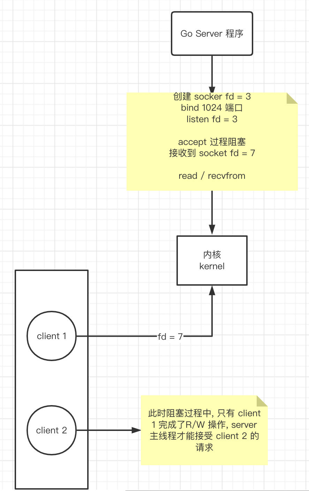

服务端处理请求的大致逻辑

```go
// 伪代码
listenfd := socket()  // 打开一个网络通信端口
bind(listenfd)        // 绑定
listen(listenfd)     // 监听
for {
  connfd := accept(listenfd)  // 阻塞建立连接
  n := read(connfd, buf)  // 阻塞读数据
  doSomeThing(buf)  		// 利用读到的数据做些什么
  close(connfd)     		// 关闭连接，循环等待下一个连接
}
```

这里大致看到阻塞发生在了 `accept` 和 `read` 过程, **当 accept 之后，进程会创建一个新的 socket 出来，专门用于和对应的客户端通信，然后把它放到当前进程的打开文件列表中, read 大致分为两个阶段: 数据从网卡拷贝到内核缓冲区, 数据在从内核缓冲区拷贝到用户缓冲区**

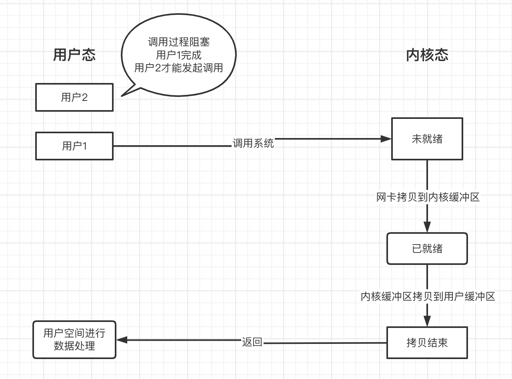


可见请求调用是串行化的,一个完成才能进行下一个, 这里不需要主动探测就绪态, 因为进程(或线程)一直处于阻塞态

### 1.2 **非阻塞 IO(NIO)**

我们是不是可以对阻塞模型进行一个改进呢, 每次进来一个客户请求我们创建一个新的线程就接受处理请求


```go
// 伪代码
for {
  connfd := accept(listenfd) // 阻塞建立连接
  pthread_create（doWork)  // 创建一个新的线程
}
func doWork() {
  n := read(connfd, buf)  // 阻塞读数据
  doSomeThing(buf)       // 利用读到的数据做些什么
  close(connfd)        // 关闭连接，循环等待下一个连接
}
```

这样，当给一个客户端建立好连接后，就可以立刻等待新的客户端连接，而不用阻塞在原客户端的 read 请求上。但是这叫多线程, 不叫非阻塞 I/O, read 本身阻塞的特性是没有改变的

**操作系统其实为我们提供一个非阻塞的 read 函数 fcntl, 这个 read 函数的效果是，如果没有数据到达时（到达网卡并拷贝到了内核缓冲区），立刻返回一个错误值（-1），而不是阻塞地等待, 只需要在调用 read 前，将文件描述符设置为非阻塞即可。**  

```
fcntl(connfd, F_SETFL, O_NONBLOCK);      // 非阻塞调用
int n = read(connfd, buffer) != SUCCESS);
```

非阻塞的 read，指的是在数据到达前，即数据还未到达网卡，或者到达网卡但还没有拷贝到内核缓冲区之前，这个阶段是非阻塞的。当数据已到达内核缓冲区，此时调用 read 函数仍然是阻塞的，需要等待数据从内核缓冲区拷贝到用户缓冲区才能返回。

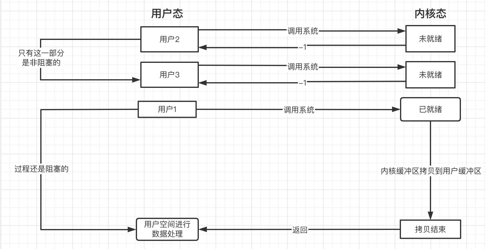

由此可见, 非阻塞 I/O 在等待就绪状态的的过程中，进程并没有阻塞，它可以做其他的事情, 但是需要主动轮训去探测是否就绪

那这种模型存在什么问题呢? **C 10K** , 当有一万个客户端同时连接呢? 每个客户端都需要进行一次系统调用, **每循环内会有 O(n) 的 SC(系统调用)**, 可能 10000 次调用中, 只有一次调用是处于就绪态, 其他的 9999 是白调用的, 这也太伤了~

可见在并发量大的应用程序中, 该模型还是不适用的

### 1.3 I/O 多路复用

基于非阻塞IO模型，它需要进程(或线程)不断地轮询发起系统调用，看看状态是否就绪, 在整个过程中，轮询会占据很大一部分过程，而且不断轮询是很消耗CPU的, 而且我们又不是只有一个进程(或线程)在这里发起系统低调用，有可能是几万几十万个, 每一段时间就有人问你, "Are you ready" 你烦不烦(主要你能扛住么?)

那可不可以给出一种方式, 让内核主动告知我们那些连接处于就绪态, 然后我们直接处理这些就绪态的连接, 进行 I/O 请求, 也就是**降低 SC 的时间复杂的, 让原来 O(n) 的复杂度变为 O(1)**

**用户空间处理方式**

我们可以给一数组, 只要有一个进程(或线程)连接进来, 我们就将其 append 进去 

```go
fdlist = append(fdlist, connfd)
```

然后我们后台开启一个线程, 遍历数组每一个元素, 去调用他的非阻塞的 read 方法, 但是这种方式又别于真正的 I/O 多路复用, 而且每次遍历遇到 read 返回 -1 时仍然是一次浪费资源的系统调用。

####  select(多路复用器-同步模型)

select 是操作系统提供的系统调用函数，通过它，我们可以把一个文件描述符的数组发给操作系统， 让操作系统去遍历，确定哪个文件描述符可以读写， 然后告诉我们去处理

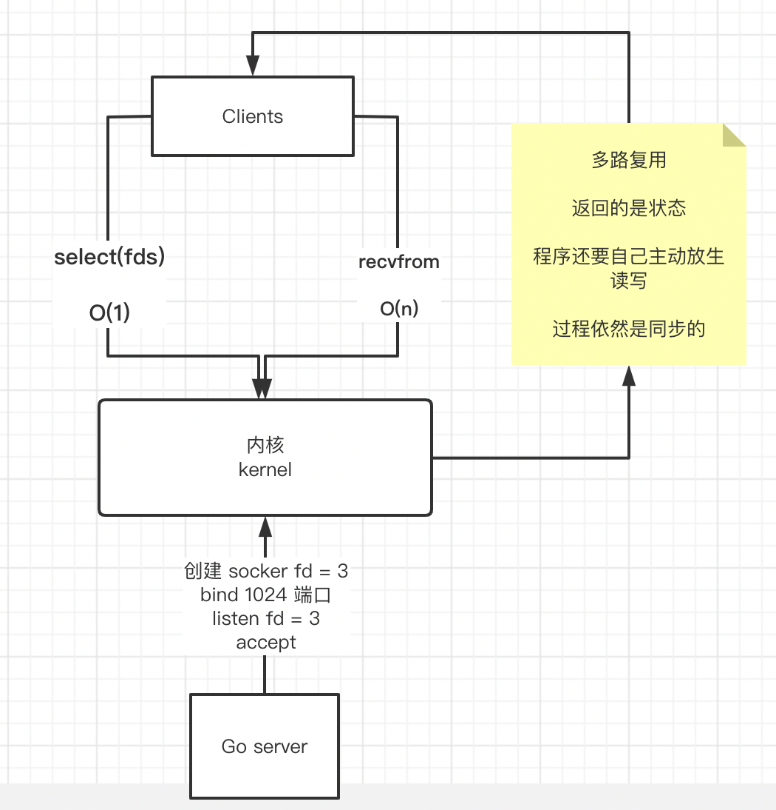

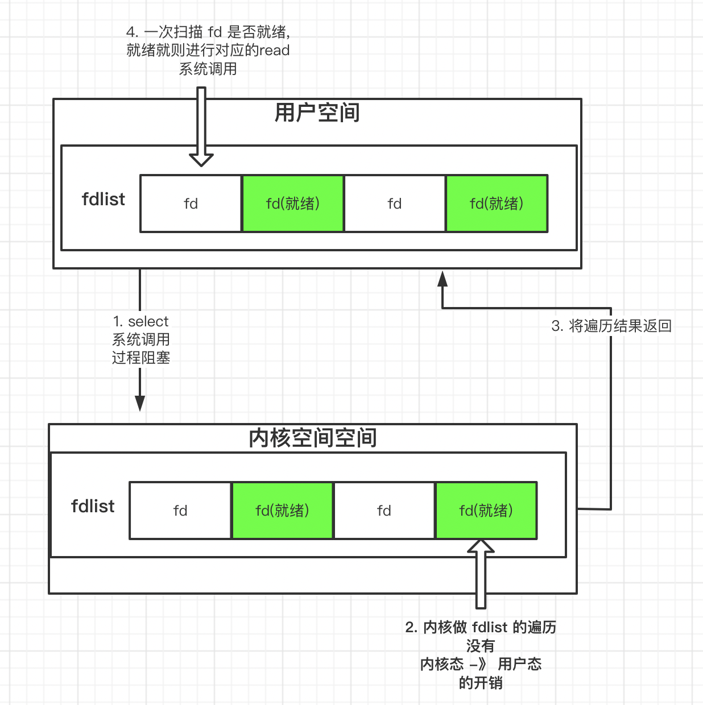

此时调用逻辑就变得简单了很多, 主线程不断接受客户端连接，并把 socket 文件描述符放到一个 list 里。启动一个 goroutine 不再自己遍历，而是调用 select，将这批文件描述符 list 交给操作系统去遍历

```go
func select() {
  for {
    connfd := accept(listenfd)
    fcntl(connfd, F_SETFL, O_NONBLOCK)
    fdlist.add(connfd)
	}

  go func () {
      for {
        // 把一堆文件描述符 list 传给 select 函数
        // 有已就绪的文件描述符就返回，nready 表示有多少个就绪的
        nready := select(list);
        // ...
      }	
  }
}

func readStatue() {
  	for {
      nready := select(list)
      // 用户层依然要遍历，只不过少了很多无效的系统调用
      for(fd <-- fdlist) {
        if fd != -1 {
          // 只读已就绪的文件描述符
          read(fd, buf)
            // 总共只有 nready 个已就绪描述符，不用过多遍历
            if(--nready == 0) break;
          }
        }
    }
}
```

不过，当 select 函数返回后，用户依然需要遍历刚刚提交给操作系统的 list, 只不过，操作系统会将准备就绪的文件描述符做上标识，用户层将不会再有无意义的系统调用开销。

**那么我们看看 select 的不足之处在哪里呢?**

- 从用户空间到内核空间的 fdlist 需要做一个全量拷贝, 这个操作极其消耗资源, 高并发情况下是不可接受的
- 内核空间还是需要对 fdlist 做循环遍历检查文件描述符的就绪状态, 这个过程依然是同步的, 只不过减少了 内核态 -》 用户态 的切换
- select 仅仅返回可读文件描述符的个数，具体哪个可读还是要用户自己遍历

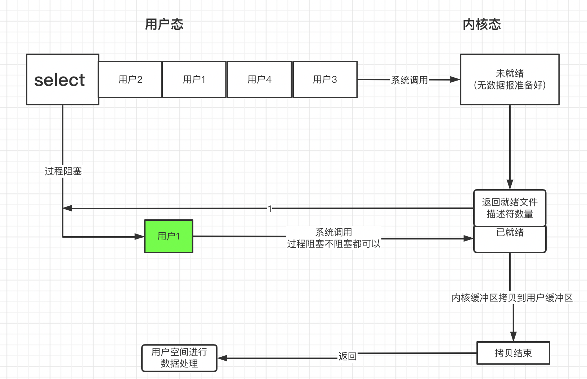

**poll 也是多路复用的一种实现机制, 它和 select 的主要区别就是，去掉了 select 只能监听 1024 个文件描述符的限制。**

### 1.4 I/O 多路复用 - epoll异步模型

epoll 主要是针对 select 提到的三点问题做了改进

- 内核中保存一份文件描述符集合，无需用户每次都重新传入，只需告诉内核修改的部分即可。
- 内核不再通过轮询的方式找到就绪的文件描述符，而是通过异步 IO 事件唤醒。
- 内核仅会将有 IO 事件的文件描述符返回给用户，用户也无需遍历整个文件描述符集合。

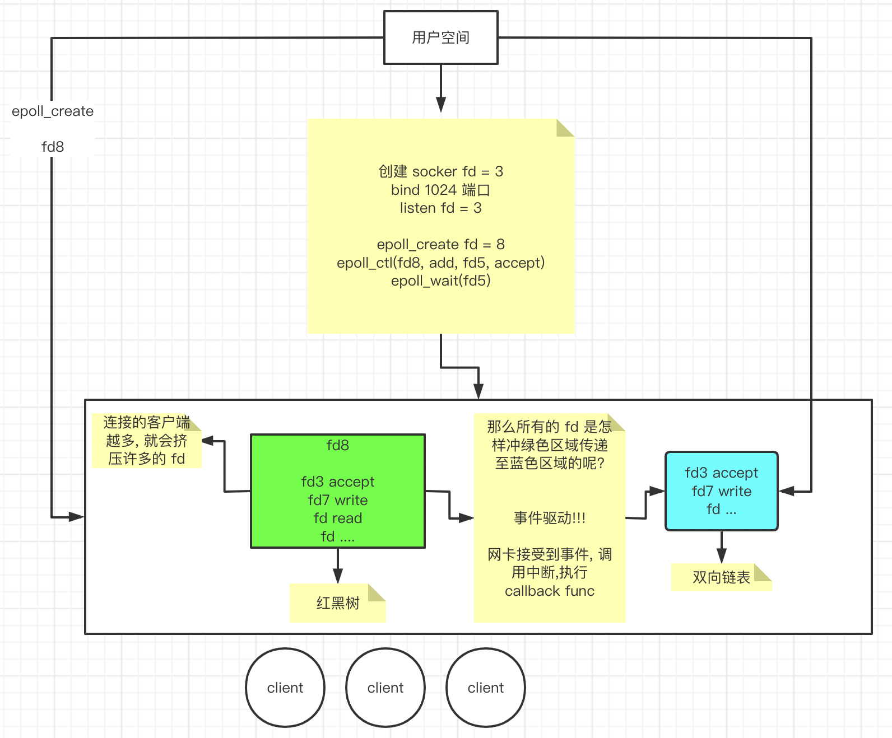

**主要过程**

通过 `man epoll` 查看

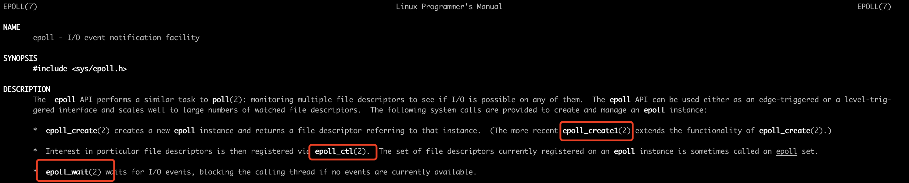

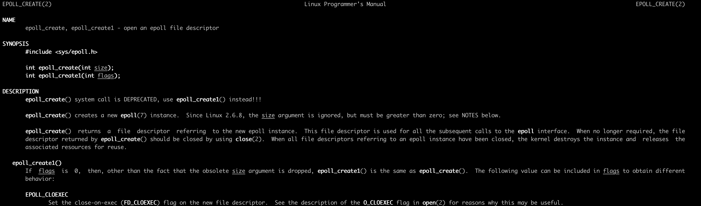

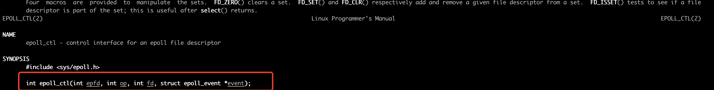

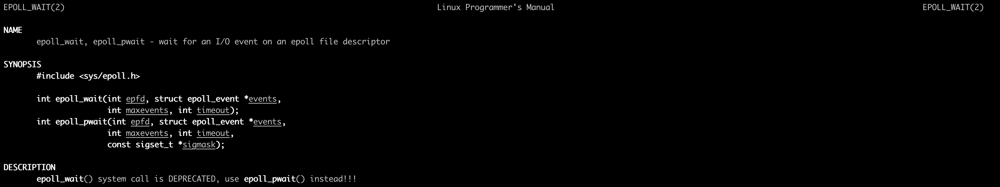

- **epoll_create**: 创建一个 epoll 句柄(内核会创建一个 struct eventpoll 的内核对象: wait_queue_head_t wq(epoll_wait 等待队列);  struct list_head rdllist(就绪描述符队列); struct rb_root rbr(红黑树) )
- **wq：** 等待队列链表。软中断数据就绪的时候会通过 wq 来找到阻塞在 epoll 对象上的用户进程。
  
- **rbr：** 一棵红黑树。为了支持对海量连接的高效查找、插入和删除，eventpoll 内部使用了一棵红黑树。通过这棵树来管理用户进程下添加进来的所有 socket 连接。
  
- **rdllist：** 就绪的描述符的链表。当有的连接就绪的时候，内核会把就绪的连接放到 rdllist 链表里。这样应用进程只需要判断链表就能找出就绪进程，而不用去遍历整棵树。

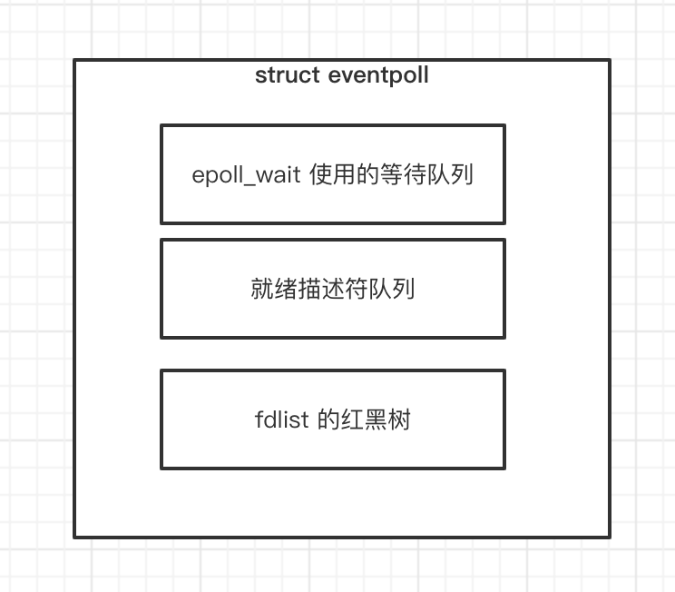


- **epoll_ct**l: 向内核添加、修改或删除要监控的文件描述符, epoll_ctl 注册每一个 socket 的时候，内核会做如下三件事情
  - 分配一个红黑树节点对象 epitem
  - 添加等待事件到 socket 的等待队列中, 并设置 func ep_poll_callback() 作为数据就绪时候的回调函数。
  - 将 epitem 插入到 epoll 对象的红黑树里(在查找效率、插入效率、内存开销等等多个方面比较均衡，红黑树是最为合适的数据结构)
- **epoll_wait**: 它被调用时它观察 就绪描述符队列(eventpoll->rdllist 链表) 里有没有数据即可。有数据就返回，没有数据就创建一个等待队列项，将其添加到 eventpoll 的等待队列上，然后把自己阻塞掉就完事(直白点就是 epoll_wait 是一个阻塞调用, 在数据准备阶段, 通过一个 epoll 来检测多路数据的状态发生的变化 )

```c
int main(){
    listen(lfd, ...);

    cfd1 = accept(...);
    cfd2 = accept(...);
    efd = epoll_create(...);

    epoll_ctl(efd, EPOLL_CTL_ADD, cfd1, ...);
    epoll_ctl(efd, EPOLL_CTL_ADD, cfd2, ...);
    epoll_wait(efd, ...)
}
```

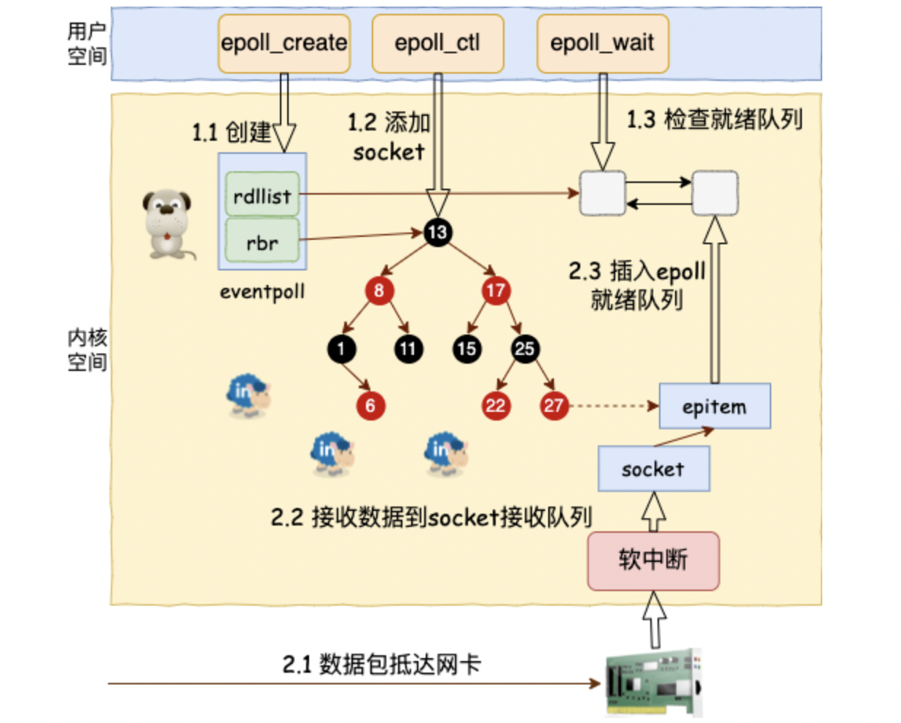

epoll 充分发挥硬件特性, 尽量不浪费 CPU  

### 1.5 Reactor 模型

**组成：**非阻塞的io+io多路复用

**特征：**基于事件循环，以事件驱动或者事件回调的方式来实现业务逻辑

## 2. Redis 内核模型

### 2.1 strace 检测 redis-epoll 流程

```
[root@99 GoProject]# strace -ff -o ./redis /usr/local/redis/src/redis-server
```

```
[root@99 GoProject]# ll
total 976
-rw-r--r--. 1 root root   1128 May  8 22:20 main.go
-rw-r--r--. 1 root root 493909 May  9 03:14 redis.11909   // 一直在变化
-rw-r--r--. 1 root root    134 May  9 03:11 redis.11910
-rw-r--r--. 1 root root    134 May  9 03:11 redis.11911
-rw-r--r--. 1 root root    134 May  9 03:11 redis.11912
[root@99 GoProject]# ll
total 976
-rw-r--r--. 1 root root   1128 May  8 22:20 main.go
-rw-r--r--. 1 root root 500902 May  9 03:14 redis.11909  // 一直在变化
-rw-r--r--. 1 root root    134 May  9 03:11 redis.11910
-rw-r--r--. 1 root root    134 May  9 03:11 redis.11911
-rw-r--r--. 1 root root    134 May  9 03:11 redis.11912

[root@99 GoProject]#  ll
total 976
-rw-r--r--. 1 root root   1128 May  8 22:20 main.go
-rw-r--r--. 1 root root 717685 May  9 03:15 redis.11909  // 一直在变化
-rw-r--r--. 1 root root    134 May  9 03:11 redis.11910
-rw-r--r--. 1 root root    134 May  9 03:11 redis.11911
-rw-r--r--. 1 root root    134 May  9 03:11 redis.11912
```

这个值一直在变化的原因是 redis 在**事件处理循环**,  那为什么要循环呢?  

> Redis 是单线程, 他要做很多事情啊~ 比如 接收客户端, LRU, RDB.....
>
> Nginx 同样使用 epoll 为什么不用轮询呢? 因为其是多线程模型 

```
[root@99 GoProject]# netstat -nlatp
Active Internet connections (servers and established)
Proto Recv-Q Send-Q Local Address           Foreign Address         State       PID/Program name
tcp        0      0 0.0.0.0:6379            0.0.0.0:*               LISTEN      11909/redis-server
tcp6       0      0 :::6379                 :::*                    LISTEN      11909/redis-server
```

```
  [root@99 GoProject]# vim redis.11909
   
  // ....
  140 epoll_create1(0)                        = 5     				// 创建 epoll 空间 
  141 socket(AF_INET6, SOCK_STREAM, IPPROTO_TCP) = 6					// 创建 redis 主线程的 socke fd6 (ipv6, 下面同样可见一个 ipv4)
  142 setsockopt(6, SOL_IPV6, IPV6_V6ONLY, [1], 4) = 0
  143 setsockopt(6, SOL_SOCKET, SO_REUSEADDR, [1], 4) = 0
  144 bind(6, {sa_family=AF_INET6, sin6_port=htons(6379), sin6_flowinfo=htonl(0), inet_pton(AF_INET6, "::", &sin6_addr), sin6_scope_id=0}, 28) = 0                				// 对 6379 进行绑定
  145 listen(6, 511)
  146 fcntl(6, F_GETFL)                       = 0x2 (flags O_RDWR)
  147 fcntl(6, F_SETFL, O_RDWR|O_NONBLOCK)    = 0       			// 设置为非阻塞
  
  // ...
  154 epoll_ctl(5, EPOLL_CTL_ADD, 6, {EPOLLIN, {u32=6, u64=6}}) = 0   // 将 fd6 添加 到 fd5 的 epoll 空间去
```

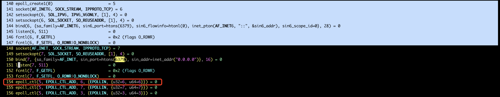

### 2.2 源码探究 redis-epoll

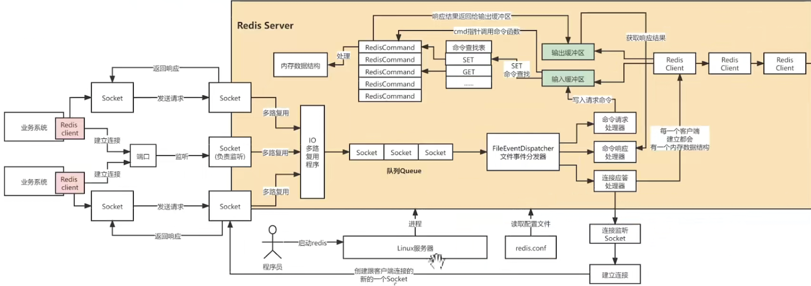

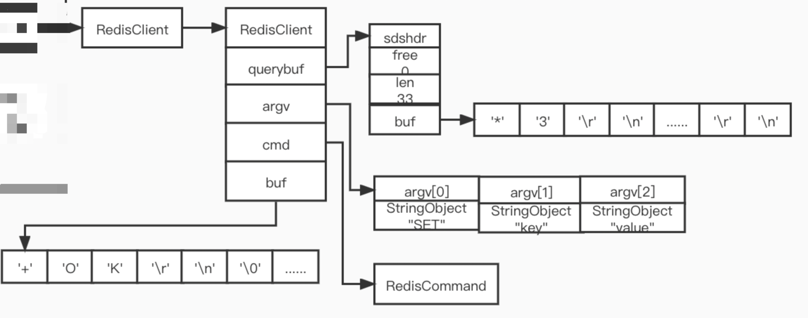

Redis 的入口函数, 主要包括 `initServer` 及 `aeMain`

**initServer 初始化**

````c
// https://github.com/redis/redis/blob/5.0/src/server.c
int main(int argc, char **argv) {
    //  ......
    
    // 启动初始化
    initServer();
    
    // ......
    
    // 运行事件处理循环，一直到服务器关闭为止
    aeMain(server.el);
}
````

在 initServer 函数中共做了三件事

- 创建一个 epoll 对象
- 对配置的监听端口进行 listen
- 把 listen socket 让 epoll 给管理起来

```c
// https://github.com/redis/redis/blob/5.0/src/server.c
void initServer(void) {
   // ....
  
 	 // 创建 epoll
    server.el = aeCreateEventLoop(server.maxclients+CONFIG_FDSET_INCR);

    // .....
  
    // 绑定监听服务端口
    listenToPort(server.port,server.ipfd,&server.ipfd_count);
  
    // ....
  
    // 注册 accept 事件处理器
    for (j = 0; j < server.ipfd_count; j++) {
        aeCreateFileEvent(server.el, server.ipfd[j], AE_READABLE, acceptTcpHandler,NULL);
    }
}
```

aeCreateFileEvent 时传的重要参数是 acceptTcpHandler，它表示将来在 listen socket 上有新用户连接到达的时候，该函数将被调用执行(相当于有新的连接接入, 需要从 epoll 中获取 fd, 绑定该连接后, 置于 epoll 管理池内 )

```c
// https://github.com/redis/redis/blob/5.0/src/ae.c
aeEventLoop *aeCreateEventLoop(int setsize) {
    aeEventLoop *eventLoop;
    eventLoop = zmalloc(sizeof(*eventLoop);

    //将来的各种回调事件就都会存在这里
    eventLoop->events = zmalloc(sizeof(aeFileEvent)*setsize);
    ......

    aeApiCreate(eventLoop);
    return eventLoop;
}

```

eventLoop->events 数组，注册的各种事件处理器会保存在这个地方。每一个 eventLoop->events 元素都指向一个 aeFileEvent 对象。

将来 当 epoll_wait 发现某个 fd 上有事件发生的时候，这样 redis 首先根据 fd 到 eventLoop->events 中查找 aeFileEvent 对象，然后再看 rfileProc、wfileProc 就可以找到读、写回调处理函数。

```c
// https://github.com/redis/redis/blob/5.0/src/redis.c
int listenToPort(int port, int *fds, int *count) {
    for (j = 0; j < server.bindaddr_count || j == 0; j++) {
        fds[*count] = anetTcpServer(server.neterr,port,NULL, server.tcp_backlog);  // anetTcpServer 进行 bind listen 操作
    }
}
```

```c
// https://github.com/redis/redis/blob/5.0/src/ae.c
int aeCreateFileEvent(aeEventLoop *eventLoop, int fd, int mask, aeFileProc *proc, void *clientData)
{
    // 取出一个文件事件结构
    aeFileEvent *fe = &eventLoop->events[fd];

    // 监听指定 fd 的指定事件
    aeApiAddEvent(eventLoop, fd, mask);

    // 设置文件事件类型，以及事件的处理器
    fe->mask |= mask;
    if (mask & AE_READABLE) fe->rfileProc = proc;
    if (mask & AE_WRITABLE) fe->wfileProc = proc;

    // 私有数据
    fe->clientData = clientData;
}
```

**aeMain 事件循环处理**

在 aeMain 则是无休止的循环调用(单线程么,当然很忙了)

````c
void aeMain(aeEventLoop *eventLoop) {
  // ...
  
    eventLoop->stop = 0;
    while (!eventLoop->stop) {

        // 如果有需要在事件处理前执行的函数，那么运行它
        // beforesleep 处理写任务队列并实际发送之
        if (eventLoop->beforesleep != NULL)
            eventLoop->beforesleep(eventLoop);

        // 开始等待事件并处理
        // epoll_wait 发现事件
        // 处理新连接请求
        // 处理客户连接上的可读事件
        aeProcessEvents(eventLoop, AE_ALL_EVENTS);
    }
}
````

- 通过 epoll_wait 发现 listen socket 以及其它连接上的可读、可写事件
- 若发现 listen socket 上有新连接到达，则接收新连接，并追加到 epoll 中进行管理
- 若发现其它 socket 上有命令请求到达，则读取和处理命令，把命令结果写到缓存中，加入写任务队列
- 每一次进入 epoll_wait 前都调用 beforesleep 来将写任务队列中的数据实际进行发送
- 如若有首次未发送完毕的，当写事件发生时继续发送

Redis 不管有多少个用户连接，都是通过 epoll_wait 来统一发现和管理其上的可读（包括 listen socket 上的 accept事件）、可写事件的。甚至连 timer，也都是交给 epoll_wait 来统一管理的。

```c
int aeProcessEvents(aeEventLoop *eventLoop, int flags)
{
    // 获取最近的时间事件
    tvp = xxx

    // 处理文件事件，阻塞时间由 tvp 决定
    numevents = aeApiPoll(eventLoop, tvp);
    for (j = 0; j < numevents; j++) {
        // 从已就绪数组中获取事件
        aeFileEvent *fe = &eventLoop->events[eventLoop->fired[j].fd];

        //如果是读事件，并且有读回调函数
        fe->rfileProc()

        //如果是写事件，并且有写回调函数
        fe->wfileProc()
    }
}
```

在有新的客户端连接进来(有新用户连接到达了), 就会调用我们在accept中事先注册好的acceptTcpHandler 函数, 在 acceptTcpHandler 中，主要做了几件事情

- 调用 accept 系统调用把用户连接给接收回来
- 为这个新连接创建一个唯一 redisClient 对象
- 将这个新连接添加到 epoll，并注册一个读事件处理函数 readQueryFromClient

当用户有命令到达(`Get name`), 就会调用预先注册的readQueryFromClient 函数, readQueryFromClient 中主要做了这么几件事情。

- 解析并查找命令
- 调用命令处理
- 添加写任务到队列 (图中的 RedisClient 队列, 每个RedisClient都对应一块输入缓冲区和输出缓冲区)
- 将输出写到缓存等待发送 (输出缓冲区中)

命令的处理函数

```c
struct redisCommand redisCommandTable[] = {
    {"module",moduleCommand,-2,"as",0,NULL,0,0,0,0,0},
    {"get",getCommand,2,"rF",0,NULL,1,1,1,0,0},
    {"set",setCommand,-3,"wm",0,NULL,1,1,1,0,0},
    {"setnx",setnxCommand,3,"wmF",0,NULL,1,1,1,0,0},
    {"setex",setexCommand,4,"wm",0,NULL,1,1,1,0,0},
    ......

    {"mget",mgetCommand,-2,"rF",0,NULL,1,-1,1,0,0},
    {"rpush",rpushCommand,-3,"wmF",0,NULL,1,1,1,0,0},
    {"lpush",lpushCommand,-3,"wmF",0,NULL,1,1,1,0,0},
    {"rpushx",rpushxCommand,-3,"wmF",0,NULL,1,1,1,0,0},
    ......
}
```

**beforesleep 处理写任务队列**

回想在 aeMain 函数中，每次在进入 aeProcessEvents 前都需要先进行 beforesleep 处理。这个函数名字起的怪怪的，但实际上大有用处

```c
void beforeSleep(struct aeEventLoop *eventLoop) {
    ......
    handleClientsWithPendingWrites();
}

int handleClientsWithPendingWrites(void) {
		// ....

    //遍历写任务队列 server.clients_pending_write
    listRewind(server.clients_pending_write,&li);
    while((ln = listNext(&li))) {
       // ....

        //实际将 client 中的结果数据发送出去
        writeToClient(c->fd,c,0)

        //如果一次发送不完则准备下一次发送
        if (clientHasPendingReplies(c)) {
            //注册一个写事件处理器，等待 epoll_wait 发现可写后再处理 
            aeCreateFileEvent(server.el, c->fd, ae_flags,
                sendReplyToClient, c);
        }
        ......
    }
}
```

该函数处理了许多工作，其中一项便是遍历发送任务队列，并将 client 发送缓存区中的处理结果通过 write 发送到客户端手中。

发送 write 并不总是能一次性发送完的。假如要发送的结果太大，而系统为每个 socket 设置的发送缓存区又是有限的。在这种情况下，clientHasPendingReplies 判断仍然有未发送完的数据的话，就需要注册一个写事件处理函数到 epoll 上。等待 epoll 发现该 socket 可写的时候再次调用 sendReplyToClient进行发送。

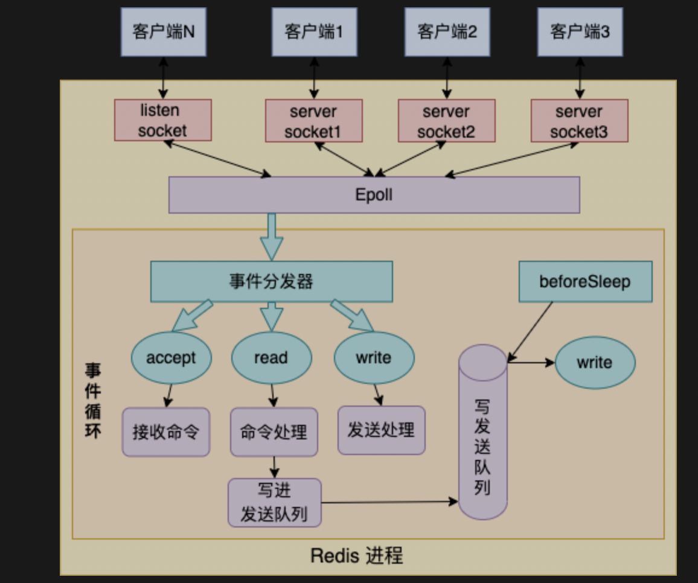

以上就是浅显的分析了redis - epoll, 欢迎联系探讨

[帮助文档](https://mp.weixin.qq.com/s/2y60cxUjaaE2pWSdCBX1lA)

