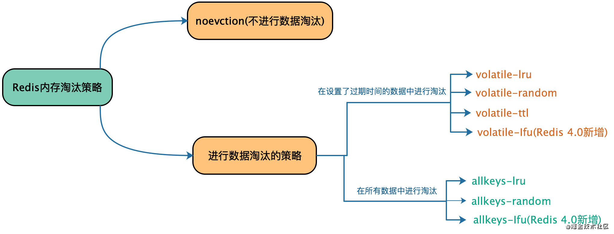
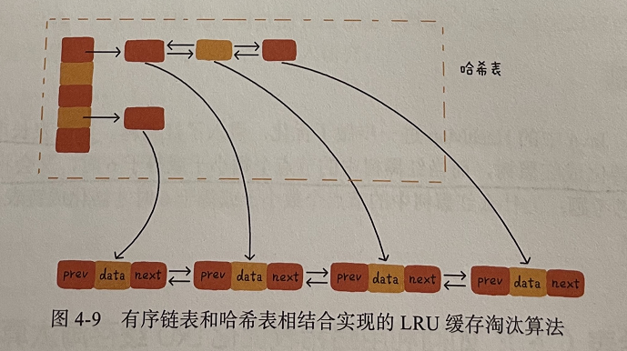
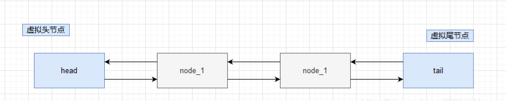
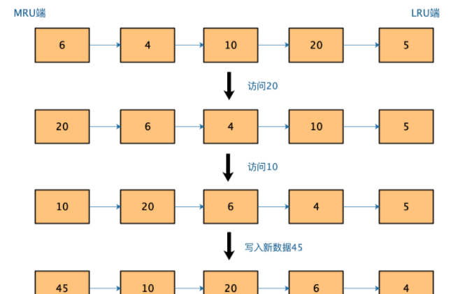
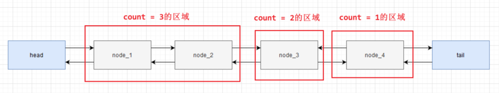

# Redis怎样清除过期key? 有哪些策略? lru是怎样的过程? volatile([ˈvɑːlətl] 不稳定的,易变的)什么作用?
### 内存回收
使用 Redis 服务时，很多情况下某些键值对只会在特定的时间内有效，为了防止这种类型的数据一直占有内存，我们可以给键值对设置有效期

Redis 中可以通过 4 个独立的命令来给一个键设置过期时间
- expire key ttl：将 key 值的过期时间设置为 ttl 秒。
- pexpire key ttl：将 key 值的过期时间设置为 ttl 毫秒。
- expireat key timestamp：将 key 值的过期时间设置为指定的 timestamp 秒数。
- pexpireat key timestamp：将 key 值的过期时间设置为指定的 timestamp 毫秒数

> 不管使用哪一个命令，最终 Redis 底层都是使用 pexpireat 命令来实现的
>
> 另外，set 等命令也可以设置 key 的同时加上过期时间，这样可以保证设值和设过期时间的原子性
>
> 设置了有效期后，可以通过 ttl 和 pttl 两个命令来查询剩余过期时间（如果未设置过期时间则下面两个命令返回 < > -1，如果设置了一个非法的过期时间，则都返回 -2）

- ttl key 返回 key 剩余过期秒数。
- pttl key 返回 key 剩余过期的毫秒数

### 过期策略
如果将一个过期的键删除，一般都会有三种策略
- 定时删除：为每个键设置一个定时器，一旦过期时间到了，则将键删除。这种策略对内存很友好，但是对 CPU 不友好(因为每个定时器都会占用一定的 CPU 资源)
- 惰性删除：不管键有没有过期都不主动删除，等到每次去获取键时再判断是否过期，如果过期就删除该键，否则返回键对应的值(这种策略对内存不够友好，可能会浪费很多内存)
- 定期扫描：系统每隔一段时间就定期扫描一次，发现过期的键就进行删除。这种策略相对来说是上面两种策略的折中方案(需要注意的是这个定期的频率要结合实际情况掌控好，使用这种方案有一个缺陷就是可能会出现已经过期的键也被返回)

#### redis 采用的过期策略
redis 过期策略是：定期扫描+惰性删除。
不过 Redis 的定期扫描只会扫描设置了过期时间的键，因为设置了过期时间的键 Redis 会单独存储
所以不会出现扫描所有键的情况
````
typedef struct redisDb {
    dict *dict; //所有的键值对
    dict *expires; //设置了过期时间的键值对
   dict *blocking_keys; //被阻塞的 key,如客户端执行 BLPOP 等阻塞指令时
   dict *watched_keys; //WATCHED keys
   int id; //Database ID
   //... 省略了其他属性
} redisDb;
````
### 如果定期删除漏掉了很多过期 key，然后你也没及时去查，也就没走惰性删除，此时会怎么样？
> 走内存淘汰机制。

首先 Redis 提供了一个参数 maxmemory 来配置 Redis 最大使用内存, 为Redis的缓存空间设置一个大小，不会让数据无限制的放入Redis缓存：
````
maxmemory <bytes>

// 或者也可以通过命令 config set maxmemory 1GB 来动态修改

// 如果没有设置该参数，那么在 32 位的操作系统中 Redis 最多使用 3GB 内存，而在 64 位的操作系统中则不作限制
````

通过info命令查看内存使用情况
````
# Memory
used_memory:854776
used_memory_human:834.74K
used_memory_rss:12177408
used_memory_rss_human:11.61M
used_memory_peak:4954424
used_memory_peak_human:4.72M
used_memory_peak_perc:17.25%
used_memory_overhead:841310
used_memory_startup:791392
used_memory_dataset:13466
used_memory_dataset_perc:21.25%
allocator_allocated:1260264
allocator_active:1527808
allocator_resident:8687616
total_system_memory:13291417600
total_system_memory_human:12.38G
used_memory_lua:37888
used_memory_lua_human:37.00K
used_memory_scripts:0
used_memory_scripts_human:0B
number_of_cached_scripts:0
maxmemory:0
maxmemory_human:0B
maxmemory_policy:noeviction
allocator_frag_ratio:1.21
allocator_frag_bytes:267544
allocator_rss_ratio:5.69
allocator_rss_bytes:7159808
rss_overhead_ratio:1.40
rss_overhead_bytes:3489792
mem_fragmentation_ratio:14.98
mem_fragmentation_bytes:11364632
mem_not_counted_for_evict:0
mem_replication_backlog:0
mem_clients_slaves:0
mem_clients_normal:49694
mem_aof_buffer:0
mem_allocator:jemalloc-5.1.0
active_defrag_running:0
lazyfree_pending_objects:0
````
#### Redis共提供了8中缓存淘汰策略，其中volatile([ˈvɑːlətl] 不稳定的,易变的)-lfu和allkeys-lfu是Redis 4.0版本新增的。



- noevction：一旦缓存被写满了，再有写请求来时，Redis 不再提供服务，而是直接返回错误。Redis 用作缓存时，实际的数据集通常都是大于缓存容量的，
  总会有新的数据要写入缓存，这个策略本身不淘汰数据，也就不会腾出新的缓存空间，我们不把它用在 Redis 缓存中。
- volatile-ttl 在筛选时，会针对设置了过期时间的键值对，根据过期时间的先后进行删除，越早过期的越先被删除。
- volatile-random 就像它的名称一样，在设置了过期时间的键值对中，进行随机删除。
- volatile-lru 会使用 LRU 算法(下文具体介绍)筛选设置了过期时间的键值对。
- volatile-lfu 会使用 LFU 算法(下文具体介绍)选择设置了过期时间的键值对。
- allkeys-random 策略，从所有键值对中随机选择并删除数据。
- allkeys-lru 策略，使用 LRU 算法在所有数据中进行筛选。
- allkeys-lfu 策略，使用 LFU 算法在所有数据中进行筛选

通常情况下推荐优先使用 allkeys-lru 策略。这样，可以充分利用 LRU 这一经典缓存算法的优势，把最近最常访问的数据留在缓存中，提升应用的访问性能

如果业务应用中的数据访问频率相差不大，没有明显的冷热数据区分，建议使用 allkeys-random 策略，随机选择淘汰的数据就行
### LRU(Least Recently Used|最近最不经常使用)算法
这是按照最近最少使用的原则来筛选数据，最不常用的数据会被筛选出来，而最近频繁使用的数据会留在缓存中

#### LRU总体上思路：
当要缓存某个数据的时候,先在链表中找这个数据,如果没找到,则直接放置到链表的头部,如果找到了,我们就把他移动到链表的头部(淡单纯使用链表的时间复杂度是O(n))

最近使用的放在最近的位置（最左边），那么保证了这个最少使用的就自然而然离你远了（往右边去了）,所以说使用双向链表来实现，但光有这还不够，
我们还需要使用Map来将key映射到对应的节点(哈希表,每个节点额外存储指向有序节点的指针),在双向链表(有序链表中)中，使用虚拟头节点和尾节点来作为节点，
这样在添加节点和删除节点的时候就不需要检查相邻的节点是否存在







如果有一个新数据 45 要被写入缓存，但此时已经没有缓存空间了，也就是链表没有空余位置了，那么，LRU 算法做两件事：数据 45 是刚被访问的，所以它会被放到 MRU 端；
算法把 LRU 端的数据 5 从缓存中删除，相应的链表中就没有数据 5 的记录了。

LRU认为刚刚被访问的数据，肯定还会被再次访问，所以就把它放在 MRU 端；长久不访问的数据，肯定就不会再被访问了，所以就让它逐渐后移到 LRU 端，在缓存满时，就优先删除它。

LRU 算法在实际实现时，需要用链表管理所有的缓存数据，这会带来额外的空间开销。而且，当有数据被访问时，需要在链表上把该数据移动到 MRU 端，如果有大量数据被访问，
就会带来很多链表移动操作，会很耗时，进而会降低 Redis 缓存性能。

所以，在 Redis 中，LRU 算法被做了简化，以减轻数据淘汰对缓存性能的影响。具体来说，Redis 默认会记录每个数据的最近一次访问的时间戳
（由键值对数据结构 RedisObject 中的 lru 字段记录）。然后，Redis 在决定淘汰的数据时，第一次会随机选出 N 个数据，把它们作为一个候选集合。
接下来，Redis 会比较这 N 个数据的 lru 字段，把 lru 字段值最小的数据从缓存中淘汰出去。

Redis 提供了一个配置参数 maxmemory-samples，这个参数就是 Redis 选出的数据个数 N。例如，我们执行如下命令，可以让 Redis 选出 100 个数据作为候选数据集：
``CONFIG SET maxmemory-samples 100``

当需要再次淘汰数据时，Redis 需要挑选数据进入第一次淘汰时创建的候选集合。这儿的挑选标准是：能进入候选集合的数据的 lru 字段值必须小于候选集合中最小的 lru 值。
当有新数据进入候选数据集后，如果候选数据集中的数据个数达到了 maxmemory-samples(maxmemory-samples在redis-3.0.0中的默认配置为5，如果增加，会提高LRU或TTL的精准度)，Redis 就把候选数据集中 lru 字段值最小的数据淘汰出去。
这样一来，Redis 缓存不用为所有的数据维护一个大链表，也不用在每次数据访问时都移动链表项，提升了缓存的性能

### LFU算法(Least Frequently Used|最近最少使用)
最近最少使用，跟使用的次数有关，淘汰使用次数最少的。

LFU是根据使用的频次，简单来说是根据使用的次数来编排（在保证次数的情况下，根据最近使用来排），所以对于链表节点需要多定义一个使用的次数count



#### LFU的实现更为复杂,需要考虑几个问题：
本着能省则省的原则，Redis 只用了 24bit （server.lruclock 也是24bit）来记录上述的信息,Redis 本身有全局的时钟 server.lruclock（单位为秒,24位，190多天会溢出），
然后随机采样 N 个 key 的访问时间，离现在最久的，淘汰之

- 问题一: 如果实现为链表，当对象被访问时按访问次数移动到链表的某个有序位置可能是低效的，因为可能存在大量访问次数相同的 key，最差情况是O(n) （链表无法直接用二分查找,可以用 跳表？）
> 核心就是访问次数越大，访问次数被递增的可能性越小，最大 255，此外你可以在配置 redis.conf 中写明访问多少次递增多少
由于访问次数是有限的，所以第一个问题也被解决了，直接一个255数组或链表就可以
- 问题二: 某些 key 访问次数可能非常之大，理论上可以无限大，但实际上我们并不需要精确的访问次数()
> 8bit : 访问次数 （解决第二个问题）,访问次数的计算如下：
````
uint8_t LFULogIncr(uint8_t counter) {
if (counter == 255) return 255;
double r = (double)rand()/RAND_MAX;
double baseval = counter - LFU_INIT_VAL;
if (baseval < 0) baseval = 0;
double p = 1.0/(baseval*server.lfu_log_factor+1);
if (r < p) counter++;
return counter;
}
````
- 问题三: 访问次数特别大的 key 可能以后都不再访问了，但是因为访问次数大而一直占用着内存不被淘汰，需要一个方法来逐步“驱除”（有点 LRU的意思），最简单的就是逐步衰减访问次数(16bit : 上一次递减时间 （解决第三个问题）)
> 16bit 部分怎么用呢？保存的是时间戳的后16位（分钟），表示上一次递减的时间，算法是这样执行，随机采样N个key(与原来的版本一样)，检查递减时间，如果距离现在超过 N 分钟（可配置），则将count递减或者减半（如果访问次数数值比较大）
> 新加入的 key 访问次数很可能比不被访问的老 key小，为了不被马上淘汰，新key访问次数设为 5
