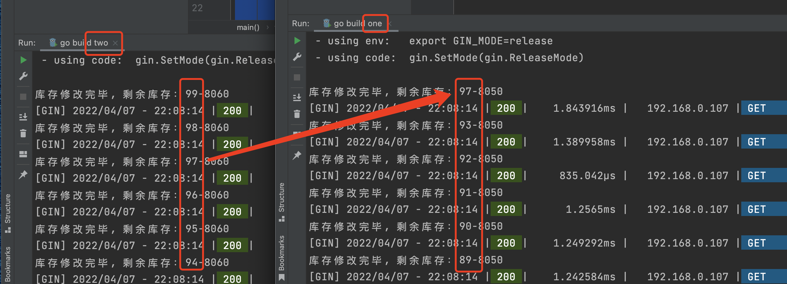

# 分布式锁(Redis)

多个应用对同一个消息进行抢占时就会产生问题,那么就需要借助分布式锁来帮助解决这个问题, 即两个请求同时进来，只会给一个进程返回成功，另一个返回失败（或等待）。所以简单来说,分布式锁的作用就是将进程间并行的操作转换为串行的操作(进程间的线程同步可以只用程序内置的锁,如 Mutex)

## 1. 项目准备

### 1.1 golang 代码(两份)

```go
package main

import (
	"fmt"
	"github.com/gin-gonic/gin"
	"strconv"
	"two/redis"
)

func main() {
	r := gin.Default()
	gin.SetMode("release")
	r.GET("/hello", func(c *gin.Context) {
		redis := redis.InitRedis()
		stack := redis.Get("num")
		if stack > 0 {
			newStack := stack - 1
			res := redis.Set("num", newStack)
			if res {
				fmt.Println("库存修改完毕, 剩余库存：" + strconv.Itoa(newStack) + "-8060")
				return
			}
			fmt.Println("库存修改失败-8060")
			return
		}
		// 没有库存
		return
	})
	r.Run(":8060")
}

```

```go
package redis

import (
	"github.com/garyburd/redigo/redis"
	"log"
)

type RedisResoce struct {
	RS redis.Conn
}

func InitRedis() *RedisResoce {
	host := "172.16.252.99:6379"

	rs, err := redis.Dial("tcp", host)
	//defer rs.Close()

	if err != nil {
		log.Println(err)
		return &RedisResoce{}
	}
	return &RedisResoce{
		rs,
	}
}

func (rs *RedisResoce) Get(key string) int {
	intVal, err := redis.Int(rs.RS.Do("get", key))
	if err != nil {
		log.Fatal("get err, ", err)
		return 0
	}
	return intVal
}

func (rs *RedisResoce) Set(key string, val int) bool {
	_, err := redis.String(rs.RS.Do("set", key, val))
	if err != nil {
		log.Fatal("set err, ", err)
		return false
	}
	return true
}

func (rs *RedisResoce) Expire(key string) {
	_, err := rs.RS.Do("expire", key, 10)
	if err != nil {
		log.Fatal("expire err, ", err)
		return
	}
}

func (rs *RedisResoce) SETNX(key string) bool {
	intVal, err := redis.Int(rs.RS.Do("setnx", key, 1))
	if err != nil {
		log.Fatal("setnx err, ", err)
		return false
	}
	return intVal > 0
}
```

### 1.2 Nginx 配置负载均衡

````
worker_processes  1;

#error_log  logs/error.log;
#error_log  logs/error.log  notice;
#error_log  logs/error.log  info;

#pid        logs/nginx.pid;


events {
    worker_connections  1024;
}


http {
    include       mime.types;
    default_type  application/octet-stream;
    sendfile        on;
    keepalive_timeout  65;

    # goland // 负载均衡
    upstream golang {
      #ip_hash;
			server 192.168.0.107:8050 weight=3;
   		server 192.168.0.107:8060 weight=3;
     }

    server {
        listen       80;
        location / {
            root   html;
	    			proxy_pass   http://golang;  // 负载均衡
            index  index.html index.htm;
        }

        error_page   500 502 503 504  /50x.html;
        location = /50x.html {
            root   html;
        }
 }       
````

### 1.3 ab 压测工具

````
yum -y install httpd-tools

-n :请求总次数
-c:并发数
-k:是否开启长连接
-s:超时设置
-t:请求时间

ab -c 4 -n 10 -t 1 localhost:80/hello
````

## 2. 单机服务问题

````go
package main

import (
	"fmt"
	"github.com/gin-gonic/gin"
	"strconv"
	"two/redis"
)

func main() {
	r := gin.Default()
	gin.SetMode("release")
	r.GET("/hello", func(c *gin.Context) {
		redis := redis.InitRedis()
		stack := redis.Get("num")
		if stack > 0 {
			newStack := stack - 1
			res := redis.Set("num", newStack)
			if res {
				fmt.Println("库存修改完毕, 剩余库存：" + strconv.Itoa(newStack) + "-8060")
				return
			}
			fmt.Println("库存修改失败-8060")
			return
		}
		// 没有库存
		return
	})
	r.Run(":8060")
}
````

使用以上代码压测后出现问题:

````
/*
			ab -c 4 -n 10 -t 1 localhost:80/hello
			
			为加锁之前的结果：
				库存修改完毕, 剩余库存：68-8060
				[GIN] 2022/04/07 - 22:04:47 | 200 |     919.709µs |   192.168.0.107 | GET      "/hello"
				库存修改完毕, 剩余库存：68-8060
				[GIN] 2022/04/07 - 22:04:47 | 200 |      682.25µs |   192.168.0.107 | GET      "/hello"
				库存修改完毕, 剩余库存：68-8060
				[GIN] 2022/04/07 - 22:04:47 | 200 |       897.5µs |   192.168.0.107 | GET      "/hello"
				库存修改完毕, 剩余库存：68-8060
			明显产生了并发问题，导致获取数量错误
		*/
````

#### 加入锁来解决 

```go
package main

import (
	"fmt"
	"github.com/gin-gonic/gin"
	"strconv"
	"sync"
	"two/redis"
)

var mutex sync.Mutex

func main() {
	r := gin.Default()
	gin.SetMode("release")
	r.GET("/hello", func(c *gin.Context) {
		redis := redis.InitRedis()

		/*
			加入 sync.Mutex 锁
		*/
		mutex.Lock()
		defer mutex.Unlock()

		stack := redis.Get("num")
		if stack > 0 {
			newStack := stack - 1
			res := redis.Set("num", newStack)
			if res {
				fmt.Println("库存修改完毕, 剩余库存：" + strconv.Itoa(newStack) + "-8060")
				return
			}
			fmt.Println("库存修改失败-8060")
			return
		}
		// 没有库存
		return
	})
	r.Run(":8060")
}
```

## 3. 分布式服务(多节点)问题

当项目部署在多台机器上,进行压测



可以看到已经出现了问题

### 使用 Redis SETNX 来解决

```go
package main

import (
	"fmt"
	"github.com/gin-gonic/gin"
	"strconv"
	"sync"
	"two/redis"
)

var mutex sync.Mutex

func main() {
	r := gin.Default()
	gin.SetMode("release")
	r.GET("/hello", func(c *gin.Context) {
		redis := redis.InitRedis()

		mutex.Lock()
		defer mutex.Unlock()

		ok := redis.SETNX("redis_lock", 1)
    defer redis.Del("redis_lock")
		if !ok { // 127.0.0.1:6379> SETNX redis_lock 1
			return
		}

		stack := redis.Get("num")
		if stack > 0 {
			newStack := stack - 1
			res := redis.Set("num", newStack)
			if res {
				fmt.Println("库存修改完毕, 剩余库存：" + strconv.Itoa(newStack) + "-8060")
				return
			}
			fmt.Println("库存修改失败-8060")
			return
		}
		// 没有库存
		return
	})
	r.Run(":8060")
}
```

```go
package redis

import (
	"github.com/garyburd/redigo/redis"
	"log"
)

type RedisResoce struct {
	RS redis.Conn
}

func InitRedis() *RedisResoce {
	host := "172.16.252.99:6379"

	rs, err := redis.Dial("tcp", host)
	//defer rs.Close()

	if err != nil {
		log.Println(err)
		return &RedisResoce{}
	}
	return &RedisResoce{
		rs,
	}
}

func (rs *RedisResoce) Get(key string) int {
	intVal, err := redis.Int(rs.RS.Do("get", key))
	if err != nil {
		log.Fatal("get err, ", err)
		return 0
	}
	return intVal
}

func (rs *RedisResoce) Set(key string, val int) bool {
	_, err := redis.String(rs.RS.Do("set", key, val))
	if err != nil {
		log.Fatal("set err, ", err)
		return false
	}
	return true
}

func (rs *RedisResoce) Expire(key string) {
	_, err := rs.RS.Do("expire", key, 10)
	if err != nil {
		log.Fatal("expire err, ", err)
		return
	}
}

func (rs *RedisResoce) SETNX(key string, val int) bool {
	intVal, err := redis.Int(rs.RS.Do("setnx", key, val))
	if err != nil {
		log.Fatal("setnx err, ", err)
		return false
	}
	return intVal > 0
}

func (rs *RedisResoce) Del(key string) {  
	_, err := rs.RS.Do("del", key)
	if err != nil {
		log.Fatal("expire err, ", err)
		return
	}
}
```

## 4. Redis SETNX 问题
### 4.1 死锁
SETNX存在一个很大的问题，死锁

- 程序处理业务逻辑异常，没及时释放锁

- 进程挂了，没机会释放锁

这时，这个客户端就会一直占用这个锁，而其它客户端就 永远 拿不到这把锁了。

#### 解决办法, 在设置锁的时候,给设置一个过期时间

```go
package main

import (
	"fmt"
	"github.com/gin-gonic/gin"
	"strconv"
	"sync"
	"two/redis"
)

var mutex sync.Mutex

func main() {
	r := gin.Default()
	gin.SetMode("release")
	r.GET("/hello", func(c *gin.Context) {
		redis := redis.InitRedis()

		mutex.Lock()
		defer mutex.Unlock()

		lockKey := "redis_lock"
		ok := redis.SETNX(lockKey, 1)
    ok1 := redis.Expire(lockKey, 10) // expire test 10
    if !ok || !ok1 { 
			return
		}
		defer redis.Del(lockKey)
    
		stack := redis.Get("num")
		if stack > 0 {
			newStack := stack - 1
			res := redis.Set("num", newStack)
			if res {
				fmt.Println("库存修改完毕, 剩余库存：" + strconv.Itoa(newStack) + "-8060")
				return
			}
			fmt.Println("库存修改失败-8060")
			return
		}
		// 没有库存
		return
	})
	r.Run(":8060")
}

```

### 4.2  SETNX 和 EXPIRE 的原子性问题

- SETNX 执行成功，执行 EXPIRE 时由于网络问题，执行失败

- SETNX 执行成功，Redis 异常宕机，EXPIRE 没有机会执行

- SETNX 执行成功，客户端异常崩溃，EXPIRE 也没有机会执行

这两条命令不能保证是原子操作（一起成功），就有潜在的风险导致过期时间设置失败，依旧发生死锁问题。


因为两个命令分开执行,涉及到原子性问题, redis 中给出了解决办法 `SET test 1 EX 10 NX`

```go
func (rs *RedisResoce) SetWitLock(key string, val int, time int) bool { //SET test 1 EX 10 NX
	intVal, err := rs.RS.Do("set", key, val, "EX", time, "NX")
	if err != nil {
		log.Fatal(err)
		return false
	}
	if intVal != nil {
		return true
	}
	return false
}
```

```go
package main

import (
	"fmt"
	"github.com/gin-gonic/gin"
	"strconv"
	"sync"
	"two/redis"
)

var mutex sync.Mutex

func main() {
	r := gin.Default()
	gin.SetMode("release")
	r.GET("/hello", func(c *gin.Context) {
		redis := redis.InitRedis()

		mutex.Lock()
		defer mutex.Unlock()

		lockKey := "redis_lock"
		ok := redis.SetWitLock(lockKey, 1, 10)  // 合并命令
		if !ok {
			return
		}
		defer redis.Del(lockKey)

		stack := redis.Get("num")
		if stack > 0 {
			newStack := stack - 1
			res := redis.Set("num", newStack)
			if res {
				fmt.Println("库存修改完毕, 剩余库存：" + strconv.Itoa(newStack) + "-8060")
				return
			}
			fmt.Println("库存修改失败-8060")
			return
		}
		// 没有库存
		return
	})
	r.Run(":8060")
}
```

### 4.3 设置的过期时间为多长合适 (先来解决问题4.4)?

在问题4解决后,给到的代码:

```go
package main

import (
	"fmt"
	"github.com/gin-gonic/gin"
	uuid "github.com/satori/go.uuid"
	"strconv"
	"sync"
	"two/redis"
)

var mutex sync.Mutex

func main() {
	r := gin.Default()
	gin.SetMode("release")
	r.GET("/hello", func(c *gin.Context) {
		redis := redis.InitRedis()

		mutex.Lock()
		defer mutex.Unlock()

		lockKey := "redisLock"
		clientID := uuid.NewV4().String()
		ok := redis.SetWitLock(lockKey, clientID, 10)
		if !ok {
			return
		}
		defer func() {
			// 删除自己所占用的锁
			if redis.Get(lockKey) == clientID {
				redis.Del(lockKey)
			}
		}()

		stack, _ := strconv.Atoi(redis.Get("num"))
		if stack > 0 {
			newStack := stack - 1
			res := redis.Set("num", newStack)
			if res {
				fmt.Println("库存修改完毕, 剩余库存：" + strconv.Itoa(newStack) + "-8060")
				return
			}
			fmt.Println("库存修改失败-8060")
			return
		}
		// 没有库存
		return
	})
	r.Run(":8060")
}
```

那么超时时间给多少合适呢? 给多少都不合适,关于程序执行时间连带的问题太多了,那应该怎么办?

> 加锁成功够,在后台开启一个分线程, 做一个定时任务,定时利用该线程来检测主线程持有的这把锁是否存在, 如果还存在,说明任务没有执行完成, 这里可以做一个“续命操作”, 延长该key的过期时间, 假设 key 的过期时间是 30s, 那么后台线程就可以每 10s 检查一次, 如果 key 还存在, 为其重新续命至 30s

市面上已经有很多成型的分布式锁,比如 [Redisson](https://redisson.org), Redisson 是一个 Java 语言实现的 Redis SDK 客户端，在使用分布式锁时，它就采用了 自动续期 的方案来避免锁过期，这个守护线程我们一般也把它叫做 看门狗 线程。

### 4.4 key 重复删除问题(锁被别人释放怎么办)

- A 服务加锁(redisLock), 值为1
- 此时A服务中途挂掉
- 锁到达过期时间,B服务此时成功加锁(redisLock), 值为1
- A服务恢复,误删了B服务设置的锁
- .......此过程循环往复就会出现问题

##### 客户端在加锁时，设置一个只有自己知道的 唯一标识 进去, 如 UUID（随机且唯一）

```go
package main

import (
	"fmt"
	"github.com/gin-gonic/gin"
	uuid "github.com/satori/go.uuid"
	"strconv"
	"sync"
	"two/redis"
)

var mutex sync.Mutex

func main() {
	r := gin.Default()
	gin.SetMode("release")
	r.GET("/hello", func(c *gin.Context) {
		redis := redis.InitRedis()

		mutex.Lock()
		defer mutex.Unlock()

		lockKey := "redisLock"
		clientID := uuid.NewV4().String()           // 值设置为唯一id
		ok := redis.SetWitLock(lockKey, clientID, 10)
		if !ok {
			return
		}
		defer func() {
			// 删除自己所占用的锁, !!!! 这里拥有原子性问题
			if redis.Get(lockKey) == clientID {
				redis.Del(lockKey)
			}
		}()

		stack, _ := strconv.Atoi(redis.Get("num"))
		if stack > 0 {
			newStack := stack - 1
			res := redis.Set("num", newStack)
			if res {
				fmt.Println("库存修改完毕, 剩余库存：" + strconv.Itoa(newStack) + "-8050")
				return
			}
			fmt.Println("库存修改失败-8050")
			return
		}
		// 没有库存
		return
	})
	r.Run(":8050")
}
```

### 4.5 多个命令原子性

使用 redis + lua 脚本来实现

#### 为什么使用 Lua

Redis提供了非常丰富的指令集，官网上提供了200多个命令。但是某些特定领域，需要扩充若干指令原子性执行时，仅使用原生命令便无法完成。
Redis 为这样的用户场景提供了 lua 脚本支持，用户可以向服务器发送 lua 脚本来执行自定义动作，获取脚本的响应数据。Redis 服务器会单线程原子性执行 lua 脚本，保证 lua 脚本在处理的过程中不会被任意其它请求打断

Redis中Lua的常用命令
\- EVAL   // 代码中选用的
\- EVALSHA
\- SCRIPT LOAD - SCRIPT EXISTS
\- SCRIPT FLUSH
\- SCRIPT KILL

##### EVAL 命令

>命令格式：`EVAL script numkeys key [key …] arg [arg …]`
>\- `script`参数是一段 Lua5.1 脚本程序。脚本不必(也不应该[^1])定义为一个 Lua 函数
>\- `numkeys`指定后续参数有几个key，即：key [key …]中key的个数。如没有key，则为0
>\- `key [key …]` 从 EVAL 的第三个参数开始算起，表示在脚本中所用到的那些 Redis 键(key)。在Lua脚本中通过KEYS[1], KEYS[2]获取。
>\- `arg [arg …]` 附加参数。在Lua脚本中通过ARGV[1],ARGV[2]获取。
>
>例: 
>
>```
>// 使用了redis为lua内置的redis.call函数
>
>127.0.0.1:6379> set name 123
>OK
>127.0.0.1:6379> get name
>"123"
>127.0.0.1:6379> EVAL "if redis.call('get',KEYS[1]) == ARGV[1] then return redis.call('del',KEYS[1]) else return 0  end" 1 name 123
>(integer) 1
>127.0.0.1:6379> get name
>(nil)
>
>
>127.0.0.1:6379> EVAL "redis.call('SET', KEYS[1], ARGV[1]);redis.call('EXPIRE', KEYS[1], ARGV[2]); return 1;" 1 userAge 10 60
>(integer) 1
>127.0.0.1:6379> get userAge
>"10"
>127.0.0.1:6379> ttl userAge
>(integer) 44
>```

##### SCRIPT LOAD命令 和 EVALSHA命令

SCRIPT LOAD命令格式：`SCRIPT LOAD script` (将 script 加密称为密文)
EVALSHA命令格式：`EVALSHA sha1 numkeys key [key …] arg [arg …]`

这两个命令放在一起解释的原因是：`EVALSHA` 命令中的sha1参数，就是`SCRIPT LOAD` 命令执行的结果。

````
## SCRIPT LOAD加载脚本，并得到sha1值
127.0.0.1:6379> SCRIPT LOAD "redis.call('set',KEYS[1],ARGV[1]);redis.call('expire',KEYS[1],ARGV[2]);return 1"
"c2835eee9cc513e3f9b7d6c02c61b507492247b9"

## SCRIPT LOAD加载脚本，并得到sha1值
127.0.0.1:6379> EVALSHA c2835eee9cc513e3f9b7d6c02c61b507492247b9  1 name  10 60
(integer) 1
127.0.0.1:6379> ttl name
(integer) 56
````

##### SCRIPT EXISTS 命令

命令格式：`SCRIPT EXISTS sha1 [sha1 …]`
作用：给定一个或多个脚本的 SHA1 校验和，返回一个包含 0 和 1 的列表，表示校验和所指定的脚本是否已经被保存在缓存当中

````
127.0.0.1:6379> SCRIPT EXISTS b027e7015b2cc95e0bc5d16f0d83e3ed4bd4a36f
1) (integer) 1
````

##### SCRIPT FLUSH 命令

命令格式：`SCRIPT FLUSH`
作用：清除Redis服务端所有 Lua 脚本缓存

````
127.0.0.1:6379> SCRIPT EXISTS b027e7015b2cc95e0bc5d16f0d83e3ed4bd4a36f
1) (integer) 1
127.0.0.1:6379> SCRIPT FLUSH
OK
127.0.0.1:6379> SCRIPT EXISTS b027e7015b2cc95e0bc5d16f0d83e3ed4bd4a36f
1) (integer) 0
````

#### 代码变更

```go
package main

import (
	"fmt"
	RS "github.com/garyburd/redigo/redis"
	"github.com/gin-gonic/gin"
	uuid "github.com/satori/go.uuid"
	"log"
	"strconv"
	"sync"
	"two/redis"
)

var mutex sync.Mutex

func main() {
	r := gin.Default()
	gin.SetMode("release")
	redis := redis.InitRedis()

	r.GET("/hello", func(c *gin.Context) {
		mutex.Lock()
		defer mutex.Unlock()

		lockKey := "redisLock"
		clientID := uuid.NewV4().String()
		ok := redis.SetWitLock(lockKey, clientID, 10)
		if !ok {
			return
		}
		defer func() {
			// 删除自己所占用的锁， 看值是否一致，一致则删除，lua脚本实现
			script := "if redis.call('get',KEYS[1]) == ARGV[1] then return redis.call('del',KEYS[1]) else return 0  end"
			s := RS.NewScript(1, script)
			_, err := s.Do(redis.RS, lockKey, clientID)
			if err != nil {
				log.Fatal(err)
			}
		}()

		stack, _ := strconv.Atoi(redis.Get("num"))
		if stack > 0 {
			newStack := stack - 1
			res := redis.Set("num", newStack)
			if res {
				fmt.Println("库存修改完毕, 剩余库存：" + strconv.Itoa(newStack) + "-8060")
				return
			}
			fmt.Println("库存修改失败-8060")
			return
		}
		// 没有库存
		return
	})
	r.Run(":8060")
}
```

## 5 解决方案总结

- **死锁**：设置过期时间
- **过期时间评估不好，锁提前过期**：守护线程，自动续期
- **锁被别人释放**：锁写入唯一标识，释放锁先检查标识，再释放
- **命令原子性**: 编写Lua 脚本

### 5.1 go-zero 提供的分布式锁的方式
```go
package main

import (
	"context"
	"github.com/go-redis/redis/v8"
	"log"
	"math/rand"
	"strconv"
	"sync/atomic"
	"time"
)

var ctx = context.Background()

const (
	letters     = "abcdefghijklmnopqrstuvwxyzABCDEFGHIJKLMNOPQRSTUVWXYZ0123456789"
	lockCommand = `if redis.call("GET", KEYS[1]) == ARGV[1] then
						redis.call("SET", KEYS[1], ARGV[1], "PX", ARGV[2])
						return "OK"
					else
						return redis.call("SET", KEYS[1], ARGV[1], "NX", "PX", ARGV[2])
					end`
	delCommand = `if redis.call("GET", KEYS[1]) == ARGV[1] then
						return redis.call("DEL", KEYS[1])
					else
						return 0
					end`
	randomLen = 16
	// 默认超时时间，防止死锁
	tolerance       = 500 // milliseconds
	millisPerSecond = 1000
)

// A RedisLock is a redis lock.
type RedisLock struct {
	// redis客户端
	store *redis.Conn
	// 超时时间
	seconds uint32
	// 锁key
	key string
	// 锁value，防止锁被别人获取到
	id string
}

func init() {
	rand.Seed(time.Now().UnixNano())
}

// NewRedisLock returns a RedisLock.
func NewRedisLock(store *redis.Conn, key string) *RedisLock {
	return &RedisLock{
		store: store,
		key:   key,
		// 获取锁时，锁的值通过随机字符串生成
		// 实际上go-zero提供更加高效的随机字符串生成方式
		// 见core/stringx/random.go：Randn
		id: randomStr(randomLen),
	}
}

// Acquire acquires the lock.
// 加锁
func (rl *RedisLock) Acquire() (bool, error) {
	// 获取过期时间
	seconds := atomic.LoadUint32(&rl.seconds)
	// 默认锁过期时间为500ms，防止死锁
	resp := rl.store.Eval(ctx, lockCommand, []string{rl.key}, []string{
		rl.id, strconv.Itoa(int(seconds)*millisPerSecond + tolerance),
	})
	reply := resp.String()
	if reply == "OK" {
		return true, nil
	}
	log.Printf("Unknown reply when acquiring lock for %s: %v", rl.key, resp)
	return false, nil
}

// Release releases the lock.
// 释放锁
func (rl *RedisLock) Release() (bool, error) {
	resp := rl.store.Eval(ctx, delCommand, []string{rl.key}, []string{rl.id})

	reply, err := resp.Int64()
	if err != nil {
		return false, nil
	}

	return reply == 1, nil
}

// SetExpire sets the expire.
// 需要注意的是需要在Acquire()之前调用
// 不然默认为500ms自动释放
func (rl *RedisLock) SetExpire(seconds int) {
	atomic.StoreUint32(&rl.seconds, uint32(seconds))
}

func randomStr(n int) string {
	b := make([]byte, n)
	for i := range b {
		b[i] = letters[rand.Intn(len(letters))]
	}
	return string(b)
}
````
randString
```go
package stringx

import (
	crand "crypto/rand"
	"fmt"
	"math/rand"
	"sync"
	"time"
)

const (
	letterBytes    = "abcdefghijklmnopqrstuvwxyzABCDEFGHIJKLMNOPQRSTUVWXYZ0123456789"
	letterIdxBits  = 6 // 6 bits to represent a letter index
	idLen          = 8
	defaultRandLen = 8
	letterIdxMask  = 1<<letterIdxBits - 1 // All 1-bits, as many as letterIdxBits
	letterIdxMax   = 63 / letterIdxBits   // # of letter indices fitting in 63 bits
)

var src = newLockedSource(time.Now().UnixNano())

type lockedSource struct {
	source rand.Source
	lock   sync.Mutex
}

func newLockedSource(seed int64) *lockedSource {
	return &lockedSource{
		source: rand.NewSource(seed),
	}
}

func (ls *lockedSource) Int63() int64 {
	ls.lock.Lock()
	defer ls.lock.Unlock()
	return ls.source.Int63()
}

func (ls *lockedSource) Seed(seed int64) {
	ls.lock.Lock()
	defer ls.lock.Unlock()
	ls.source.Seed(seed)
}

// Rand returns a random string.
func Rand() string {
	return Randn(defaultRandLen)
}

// RandId returns a random id string.
func RandId() string {
	b := make([]byte, idLen)
	_, err := crand.Read(b)
	if err != nil {
		return Randn(idLen)
	}

	return fmt.Sprintf("%x%x%x%x", b[0:2], b[2:4], b[4:6], b[6:8])
}

// Randn returns a random string with length n.
func Randn(n int) string {
	b := make([]byte, n)
	// A src.Int63() generates 63 random bits, enough for letterIdxMax characters!
	for i, cache, remain := n-1, src.Int63(), letterIdxMax; i >= 0; {
		if remain == 0 {
			cache, remain = src.Int63(), letterIdxMax
		}
		if idx := int(cache & letterIdxMask); idx < len(letterBytes) {
			b[i] = letterBytes[idx]
			i--
		}
		cache >>= letterIdxBits
		remain--
	}

	return string(b)
}

// Seed sets the seed to seed.
func Seed(seed int64) {
	src.Seed(seed)
}
````

## 6 [Redis 红锁](https://redis.io/docs/stack/)

我们在使用 Redis 时，一般会采用**主从集群 + 哨兵**的模式部署，这样做的好处在于，当主库异常宕机时，哨兵可以实现「故障自动切换」，把从库提升为主库，继续提供服务，以此保证可用性。

**那当主从发生切换时，这个分布锁会依旧安全吗？**

- 客户端 1 在主库上执行 SET 命令，加锁成功

- 此时，主库异常宕机，SET 命令还未同步到从库上（主从复制是异步的）

- 从库被哨兵提升为新主库，这个锁在新的主库上，丢失了！

可见，当引入 Redis 副本后，分布锁还是可能会受到影响。


**那么神奇而又伟大的 RedLock就登场了**

整体的流程是这样的，一共分为 5 步：

- 客户端先获取「当前时间戳T1」

- 客户端依次向这 5 个 Redis 实例发起加锁请求（用前面讲到的 SET 命令），且每个请求会设置超时时间（毫秒级，要远小于锁的有效时间），如果某一个实例加锁失败（包括网络超时、锁被其它人持有等各种异常情况），就立即向下一个 Redis 实例申请加锁

- 如果客户端从 >=3 个（大多数）以上 Redis 实例加锁成功，则再次获取「当前时间戳T2」，如果 T2 - T1 < 锁的过期时间，此时，认为客户端加锁成功，否则认为加锁失败

- 加锁成功，去操作共享资源（例如修改 MySQL 某一行，或发起一个 API 请求）

- 加锁失败，向「全部节点」发起释放锁请求（Lua 脚本释放锁）

**关于RedLock的世纪之争的文章就不过多赘述了, 自行查阅补充, 主要是其实现以来与服务器的时间戳而展开的**

参阅了很多资料, 对于 Redlock 的较多的看法是尽量不用它, 它的性能不如单机版 Redis，部署成本也高，还是优先考虑使用主从+ 哨兵的模式 实现分布式锁。那么关于分布式锁的一致性怎么保证呢(发生概率很低)?

- 客户端 1 在主库上执行 SET 命令，加锁成功

- 此时，主库异常宕机，SET 命令还未同步到从库上（主从复制是异步的）

- 从库被哨兵提升为新主库，这个锁在新的主库上，丢失了！

问题就落在了集群数据一致性的问题上了(简答粗暴的方式是直接不处理这个请求,或手动处理个别异常情况), 其次 **fecing token**  就是业务层面做好兜底
