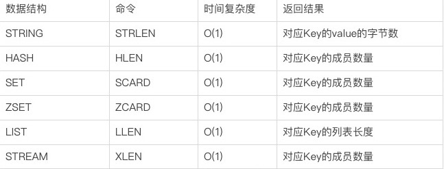
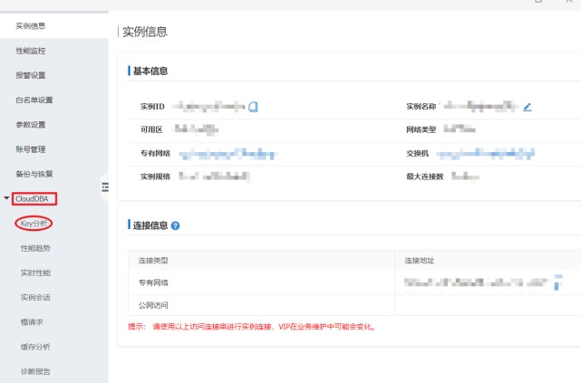

# 大key和热key
## 1.什么是大key？
> 通常我们会将含有较大数据或含有大量成员、列表数的Key称之为大Key，下面我们将用几个实际的例子对大Key的特征进行描述
- 一个STRING类型的Key，它的值为5MB（数据过大）
- 一个LIST类型的Key，它的列表数量为20000个（列表数量过多）
- 一个ZSET/SET类型的Key，它的成员数量为10000个（成员数量过多）
- 一个HASH格式的Key，它的成员数量虽然只有1000个但这些成员的value总大小为100MB（成员体积过大）

在实际业务中，大Key的判定仍然需要根据Redis的实际使用场景、业务场景来进行综合判断。
## 2.什么是热key?
> 在某个Key接收到的访问次数、显著高于其它Key时，我们可以将其称之为热Key
- 某Redis实例的每秒总访问量为10000，而其中一个Key的每秒访问量达到了7000（访问次数显著高于其它Key,比例为70%）
- 对一个拥有上千个成员且总大小为1MB的HASH Key每秒发送大量的HGETALL（带宽占用显著高于其它Key）
- 对一个拥有数万个成员的ZSET Key每秒发送大量的ZRANGE（CPU时间占用显著高于其它Key）
## 3.大key和热key带来的问题
### 大key带来的问题
- client 发现redis变慢
- redis内存不断变大引发OOM（Out Of Memory 内存用完了），活达到maxmemory设置值引发写阻塞或重要key被逐出
- redis cluster 中某个node内存远超于其他的node，但因redis cluster 的数据迁移最小粒度为key而无法将node上的内存均衡化
- 大key上的读请求使redis占用服务器全部带宽，自身变慢的同时影响到了该服务器上的其他服务
- 删除一个大key造成主库较长时间的阻塞并引发同步中断或主从切换
### 热key带来的问题
- 热Key占用大量的Redis CPU时间使其性能变差并影响其它请求
- Redis Cluster中各node流量不均衡造成Redis Cluster的分布式优势无法被Client利用，一个分片负载很高而其它分片十分空闲从而产生读/写热点问题
- 在抢购、秒杀活动中，由于商品对应库存Key的请求量过大超出Redis处理能力造成超卖
- 热Key的请求压力数量超出Redis的承受能力造成缓存击穿，此时大量强求将直接指向后端存储将其打挂并影响到其它业务
## 4.大Key与热Key的常见产生原因？
- 将Redis用在并不适合其能力的场景，造成Key的value过大，如使用String类型的Key存放大体积二进制文件型数据（大Key）
- 业务上线前规划设计考虑不足没有对Key中的成员进行合理的拆分，造成个别Key中的成员数量过多（大Key）
- 没有对无效数据进行定期清理，造成如HASH类型Key中的成员持续不断的增加（大Key）
- 预期外的访问量陡增，如突然出现的爆款商品、访问量暴涨的热点新闻、直播间某大主播搞活动带来的大量刷屏点赞、游戏中某区域发生多个工会间的战斗涉及大量玩家等
  （热Key）
- 使用LIST类型Key的业务消费侧代码故障，造成对应Key的成员只增不减（大Key）
## 5.找出Redis中的大Key与热Key？
### 使用Redis内置功能发现大Key及热Key
> Redis自4.0起提供了MEMORY USAGE命令来帮助分析Key的内存占用，相对debug object它的执行代价更低，但由于其时间复杂度为O(N)因此在分析大Key时仍有阻塞风险

> 建议通过风险更低方式来对Key进行分析，Redis对于不同的数据结构提供了不同的命令来返回其长度或成员数量

> 通过以上Redis内置命令我们可以方便且安全的对Key进行分析而不会影响线上服务，但由于它们返回的结果非Key的真实内存占用数据，因此不够精确，仅可作为参考
### 通过Redis官方客户端redis-cli的bigkeys参数发现大Key
> redis-cli的bigkeys参数能够方便的帮你实现找出整个Redis实例中的大Key

>Redis提供了bigkeys参数能够使redis-cli以遍历的方式分析整个Redis实例中的所有Key并汇总以报告的方式返回结果。该方案的优势在于方便及安全，
而缺点也非常明显：分析结果不可定制化。
### 通过Redis官方客户端redis-cli的hotkeys参数发现热Key
> Redis自4.0起提供了hotkeys参数来方便用户进行实例级的热Key分析功，该参数能够返回所有Key的被访问次数，它的缺点同样为不可定制化输出报告，
> 大量的信息会使你在分析结果时复杂度较大，另外，使用该方案的前提条件是将redis-server的maxmemory-policy参数设置为 [LFU](https://juejin.cn/post/6844904120533401607)

### 通过业务层定位热Key
>指向Redis的每一次访问都来自业务层，因此我们可以通过在业务层增加相应的代码对Redis的访问进行记录并异步汇总分析。
该方案的优势为能够准确并及时的分析出热Key的存在，缺点为业务代码复杂度的增加，同时可能会降低一些性能。
### 使用monitor命令在紧急情况时找出热Key
> Redis的monitor命令能够忠实的打印Redis中的所有请求，包括时间信息、Client信息、命令以及Key信息。
> 在发生紧急情况时，我们可以通过短暂执行monitor命令并将输出重定向至文件，在关闭monitor命令后通过对文件中请求进行归类分析即可找出这段时间中的热Key。

> 由于monitor命令对Redis的CPU、内存、网络资源均有一定的占用。因此，对于一个已处于高压状态的Redis，monitor可能会起到雪上加霜的作用。
> 同时，这种异步收集并分析的方案的时效性较差，并且由于分析的精确度取决于monitor的执行时间，因此在多数无法长时间执行该命令的线上场景中本方案的精确度也不够好。

### 依靠公有云的Redis分析服务发现大Key及热Key
- 阿里云Redis控制台中的CloudDBA
> CloudDBA是阿里云的数据库智能服务系统，它支持Redis大Key与热Key的实时分析、发现。

> 大Key及热Key分析底层为阿里云Redis内核的Key分析功能，该功能通过Redis内核直接发现并输出大Key热Key的相关信息，因此，该功能的分析结果准确性高效且对性能几乎无任何影响，
> 你可以通过点击CloudDBA中的“Key分析”进入该功能，

Key分析功能共有两个页面，它们允许在不同的时间维度对对应Redis实例中的Key进行分析：
- 实时：对当前实例立即开始分析当前实例，展示当前存在的所有大Key及热Key。
- 历史：展示该实例近期曾出现过的大Key及热Key，在历史页面中，所有出现过的大Key及热Key都会被记录，哪怕这些Key当前已经不存在。该功能能够很好的反映Redis的历史Key状态，帮助追溯过去或现场已遭破坏的问题。
## 6.大Key与热Key的处理
### 对大Key进行拆分
> 如将一个含有数万成员的HASH Key拆分为多个HASH Key，并确保每个Key的成员数量在合理范围，在Redis Cluster结构中，大Key的拆分对node间的内存平衡能够起到显著作用。
### 对大Key进行清理
> 将不适合Redis能力的数据存放至其它存储，并在Redis中删除此类数据。需要注意的是，我们已在上文提到一个过大的Key可能引发Redis集群同步的中断，
> Redis自4.0起提供了`UNLINK`命令，该命令能够以非阻塞的方式缓慢逐步的清理传入的Key，通过`UNLINK`，你可以安全的删除大Key甚至特大Key。
### 时刻监控Redis的内存水位
> 我们可以通过监控系统并设置合理的Redis内存报警阈值来提醒我们此时可能有大Key正在产生，如：Redis内存使用率超过70%，Redis内存1小时内增长率超过20%等。
### 使用阿里云的Tair(Redis企业版)服务避开失效数据的清理工作
> Tair是阿里云的Redis企业版，它在具备Redis所有特性（包括Redis的高性能特点）的同时提供了大量额外的高级功能。

> TairHash是一种可为field设置过期时间和版本的hash类型数据结构，它不但和Redis Hash一样支持丰富的数据接口和高处理性能，还改变了hash只能为key设置过期时间的限制：
> TairHash允许为field设置过期时间和版本。这极大地提高了hash数据结构的灵活性，简化了很多场景下的业务开发工作。

> TairHash使用高效的Active Expire算法，实现了在对响应时间几乎无影响的前提下，高效完成对field过期判断和删除的功能。
> 此类高级功能的合理使用能够解放大量Redis的运维、故障处理工作并降低业务的代码复杂度，让运维将精力投入到其它更有价值的工作中，让研发有更多的时间来写更有价值的代码。
## 7. 热Key的常见处理办法
- 在Redis Cluster结构中对热Key进行复制
- 使用读写分离架构
- 使用阿里云Tair的QueryCache特性