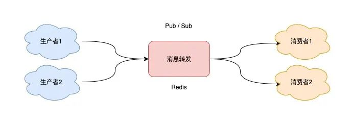
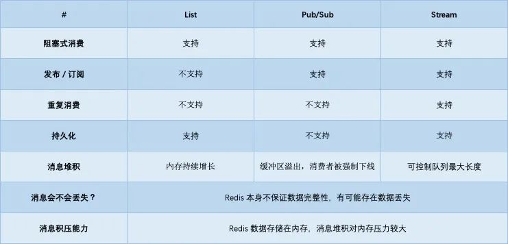

# 把Redis当作队列来用，真的合适吗？
### 一. 从最简单的开始：List 队列
如果把 List 当作队列，你可以这么来用
````
127.0.0.1:6379> LPUSH queue msg1
(integer) 1
127.0.0.1:6379> LPUSH queue msg2
(integer) 2

127.0.0.1:6379> RPOP queue
"msg1"
127.0.0.1:6379> RPOP queue
"msg2"
````


但这里有个小问题，当队列中已经没有消息了，消费者在执行 RPOP 时，会返回 NULL。
````
127.0.0.1:6379> RPOP queue
(nil)   // 没消息了
````
那么再消费的时候就会出现 「CPU 空转」，不仅浪费 CPU 资源，还会对 Redis 造成压力
````
while true:
    msg = redis.rpop("queue")
    // 没有消息，继续循环
    if msg == null:
        continue
    // 处理消息
    handle(msg)
````
解决办法是中间延迟几秒
````
while true:
    msg = redis.rpop("queue")
    // 没有消息，休眠2s
    if msg == null:
        sleep(2)
        continue
    // 处理消息        
    handle(msg)
````
这就解决了 CPU 空转问题, 但又带来另外一个问题：当消费者在休眠等待时，有新消息来了，那消费者处理新消息就会存在「延迟」

那如何做，既能及时处理新消息，还能避免 CPU 空转呢?
- Redis 确实提供了「阻塞式」拉取消息的命令：BRPOP / BLPOP，这里的 B 指的是阻塞（Block）
````
/var/redis # redis-cli
127.0.0.1:6379> lpush will 1
(integer) 1

127.0.0.1:6379> brpop will 0
1) "will"
2) "1"
````


````
while true:
    // 没消息阻塞等待，0表示不设置超时时间
    msg = redis.brpop("queue", 0) // 如果设置为 0，则表示不设置超时，直到有新消息才返回
    if msg == null:
        continue
    // 处理消息
    handle(msg)
````    
> #### 如果设置的超时时间太长，这个连接太久没有活跃过，可能会被 Redis Server 判定为无效连接，之后 Redis Server 会强制把这个客户端踢下线。
> #### 所以，采用这种方案，客户端要有重连机制

#### 那么总结下list
- 不支持重复消费：消费者拉取消息后，这条消息就从 List 中删除了，无法被其它消费者再次消费，即不支持多个消费者消费同一批数据
- 消息丢失：消费者拉取到消息后，如果发生异常宕机，那这条消息就丢失了
- 使用 List 做消息队列，它仅仅支持最简单的，一组生产者对应一组消费者，不能满足多组生产者和消费者的业务场景
- !!!!! 从 List 中 POP 一条消息出来后，这条消息就会立即从链表中删除了。也就是说，无论消费者是否处理成功，这条消息都没办法再次消费了

### 二. 发布/订阅模型：Pub/Sub
它正好可以解决前面提到的第一个问题：`重复消费`。

Redis 提供了 PUBLISH / SUBSCRIBE 命令，来完成发布、订阅的操作


````
127.0.0.1:6379> publish queue msg1
(integer) 2

127.0.0.1:6379> SUBSCRIBE queue
Reading messages... (press Ctrl-C to quit)
1) "subscribe"
2) "queue"
3) (integer) 1
1) "message"
2) "queue"
3) "msg"
1) "message"
2) "queue"
3) "msg1"

Reading messages... (press Ctrl-C to quit)
1) "subscribe"
2) "queue"
3) (integer) 1
1) "message"
2) "queue"
3) "msg"
1) "message"
2) "queue"
3) "msg1"
````
除此之外，Pub/Sub 还提供了「匹配订阅」模式，允许消费者根据一定规则，订阅「多个」自己感兴趣的队列
````
127.0.0.1:6379> publish queue1 msg1
(integer) 1
127.0.0.1:6379> publish queue2 msg1
(integer) 1

127.0.0.1:6379> PSUBSCRIBE queue.* 
````
可以看到，Pub/Sub 最大的优势就是，支持多组生产者、消费者处理消息

#### 那么它的缺点呢, `Pub/Sub 最大的问题就是:丢数据`, 一下集中情况会造成丢数据
- 消费者下线
- Redis 宕机
- 消息堆积

> Pub/Sub 在实现时非常简单，`它没有基于任何数据类型`，`也没有做任何的数据存储`，它只是单纯地为生产者、消费者建立「数据转发通道」，
> 把符合规则的数据，从一端转发到另一端

完整的流程是这样的:
- 消费者订阅指定队列，Redis 就会记录一个映射关系：队列->消费者
- 生产者向这个队列发布消息，那 Redis 就从映射关系中找出对应的消费者，把消息转发给它



整个过程中，没有任何的数据存储，一切都是实时转发的, 又因为因为 Pub/Sub 没有基于任何数据类型实现，所以它也不具备「数据持久化」的能力, 这种方式也就导致了丢数据的问题
Pub/Sub 的相关操作，不会写入到 RDB 和 AOF 中，当 Redis 宕机重启，Pub/Sub 的数据也会全部丢失。
#### 消息积压
当消费者的速度，跟不上生产者时，就会导致数据积压的情况发生,当消息积压时，Pub/Sub 的处理方式有可能会导致消费失败和消息丢失
> 每个消费者订阅一个队列时，Redis 都会在 Server 上给这个消费者在分配一个「缓冲区」，这个缓冲区其实就是一块内存
> 
> 当生产者发布消息时，Redis 先把消息写到对应消费者的缓冲区中
> 
> 因为这个缓冲区其实是有「上限」的（可配置），如果消费者拉取消息很慢，就会造成生产者发布到缓冲区的消息开始积压，缓冲区内存持续增长
> 
> 如果超过了缓冲区配置的上限，此时，Redis 就会「强制」把这个消费者踢下线, 这时消费者就会消费失败，也会丢失数据

配置文件中有这样一条配置信息 ``client-output-buffer-limit pubsub 32mb 8mb 60``, 其中 ``32mb`` 缓冲区一旦超过 32MB，Redis 直接强制把消费者踢下线
``8mb + 60`` 表示 缓冲区超过 8MB，并且持续 60 秒，Redis 也会把消费者踢下线, List 其实是属于「拉」模型，而 Pub/Sub 其实属于「推」模型
#### 那么总结下Pub/Sub
- 支持发布 / 订阅，支持多组生产者、消费者处理消息
- 消费者下线，数据会丢失
- 不支持数据持久化，Redis 宕机，数据也会丢失
- 消息堆积，缓冲区溢出，消费者会被强制踢下线，数据也会丢失

> 目前只有哨兵集群和 Redis 实例通信时，采用了 Pub/Sub 的方案，因为哨兵正好符合即时通讯的业务场景。
### 三. 新类型 Stream
基于内存的分布式消息队列中间件,在 Redis 5.0 版本，作者把 disque 功能移植到了 Redis 中，并给它定义了一个新的数据类型：`Stream`。

主要命令:
````
XADD：发布消息
XREAD：读取消息
````
使用:
````
// * 表示让Redis自动生成消息ID
127.0.0.1:6379> XADD queue * name zhangsan  // 其中的 * 表示让 Redis 自动生成唯一的消息 ID
"1618469123380-0"
127.0.0.1:6379> XADD queue * name lisi // ID 的格式是时间戳-自增序号
"1618469127777-0"
````
消费者拉取消息
````
// 从开头读取5条消息，0-0表示从开头读取
127.0.0.1:6379> XREAD COUNT 5 STREAMS queue 0-0
1) 1) "queue"
   2) 1) 1) "1618469123380-0"
         2) 1) "name"
            2) "zhangsan"
      2) 1) "1618469127777-0"
         2) 1) "name"
            2) "lisi"
````
如果想继续拉取消息，需要传入上一条消息的 ID, 没有消息，Redis 会返回 NULL。
````
127.0.0.1:6379> XREAD COUNT 5 STREAMS queue 1618469127777-0
(nil)
````
阻塞式拉去消息
````
// BLOCK 0 表示阻塞等待，不设置超时时间
127.0.0.1:6379> XREAD COUNT 5 BLOCK 0 STREAMS queue 1618469127777-0
````
支持发布订阅模式
- `XGROUP`：创建消费者组
- `XREADGROUP`：在指定消费组下，开启消费者拉取消息
````
127.0.0.1:6379> XADD queue * name zhangsan
"1618470740565-0"
127.0.0.1:6379> XADD queue * name lisi
"1618470743793-0"
````
我们想要开启 2 组消费者处理同一批数据，就需要创建 2 个消费者组：
````
// 创建消费者组1，0-0表示从头拉取消息
127.0.0.1:6379> XGROUP CREATE queue group1 0-0
OK
// 创建消费者组2，0-0表示从头拉取消息
127.0.0.1:6379> XGROUP CREATE queue group2 0-0
OK
````
第一个消费组开始消费：
````
// group1的consumer开始消费，>表示拉取最新数据
127.0.0.1:6379> XREADGROUP GROUP group1 consumer COUNT 5 STREAMS queue >
1) 1) "queue"
   2) 1) 1) "1618470740565-0"
         2) 1) "name"
            2) "zhangsan"
      2) 1) "1618470743793-0"
         2) 1) "name"
            2) "lisi"
````
同样地，第二个消费组开始消费：
````
// group2的consumer开始消费，>表示拉取最新数据
127.0.0.1:6379> XREADGROUP GROUP group2 consumer COUNT 5 STREAMS queue >
1) 1) "queue"
   2) 1) 1) "1618470740565-0"
         2) 1) "name"
            2) "zhangsan"
      2) 1) "1618470743793-0"
         2) 1) "name"
            2) "lisi"
````
这样一来，就达到了多组消费者「订阅」消费的目的

当一组消费者处理完消息后，需要执行 XACK 命令告知 Redis，这时 Redis 就会把这条消息标记为「处理完成」
````
// group1下的 1618472043089-0 消息已处理完成
127.0.0.1:6379> XACK queue group1 1618472043089-0
````


如果消费者异常宕机，肯定不会发送 XACK，那么 Redis 就会依旧保留这条消息。

待这组消费者重新上线后，Redis 就会把之前没有处理成功的数据，重新发给这个消费者。这样一来，即使消费者异常，也不会丢失数据了。
````
// 消费者重新上线，0-0表示重新拉取未ACK的消息
127.0.0.1:6379> XREADGROUP GROUP group1 consumer1 COUNT 5 STREAMS queue 0-0
// 之前没消费成功的数据，依旧可以重新消费
1) 1) "queue"
   2) 1) 1) "1618472043089-0"
         2) 1) "name"
            2) "zhangsan"
      2) 1) "1618472045158-0"
         2) 1) "name"
            2) "lisi"
````
####  Stream 数据会写入到 RDB 和 AOF 做持久化吗？
Stream 是新增加的数据类型，它与其它数据类型一样，每个写操作，也都会写入到 RDB 和 AOF 中。

我们只需要配置好持久化策略，这样的话，就算 Redis 宕机重启，Stream 中的数据也可以从 RDB 或 AOF 中恢复回来。
#### 消息堆积时，Stream 是怎么处理的？
- 生产者限流：避免消费者处理不及时，导致持续积压
- 丢弃消息：中间件丢弃旧消息，只保留固定长度的新消息

Redis 在实现 Stream 时，采用了第 2 个方案。在发布消息时，你可以指定队列的最大长度，防止队列积压导致内存爆炸
````
// 队列长度最大10000
127.0.0.1:6379> XADD queue MAXLEN 10000 * name zhangsan
"1618473015018-0"
````
当队列长度超过上限后，旧消息会被删除，只保留固定长度的新消息。Stream 在消息积压时，如果指定了最大长度，还是有可能丢失消息的。
### 四. 与专业的消息队列对比
其实，一个专业的消息队列，必须要做到两大块：
- 消息不丢
- 消息可堆积 
  
其实就分为三大块：生产者、队列中间件、消费者。

那么消息丢不丢关键就在于这三个环节了
- 生产者会不会丢消息？
- 消费者会不会丢消息？
- 队列中间件会不会丢消息？

只要客户端和服务端配合好，就能保证生产端、消费端都不丢消息, 但是，如果队列中间件本身就不可靠呢？ 在这个方面，Redis 其实没有达到要求。
Redis 在以下 2 个场景下，都会导致数据丢失。
- AOF 持久化配置为每秒写盘，但这个写盘过程是异步的，Redis 宕机时会存在数据丢失的可能
- 主从复制也是异步的，主从切换时，也存在丢失数据的可能（从库还未同步完成主库发来的数据，就被提成主库）

Redis 本身的无法保证严格的数据完整性。所以严格意义上讲它不适合做消息中间件

