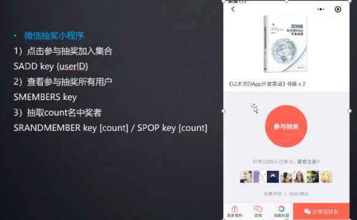
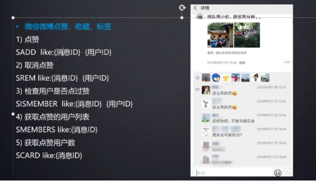
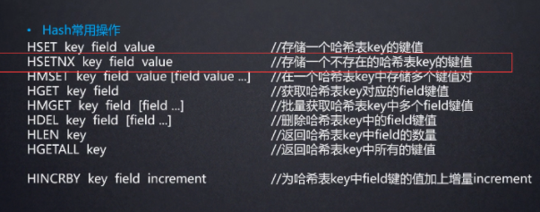
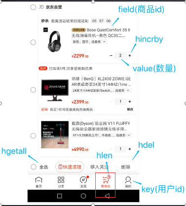
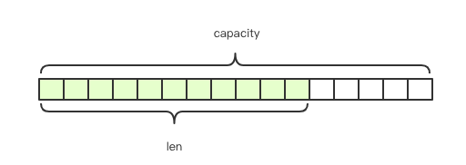
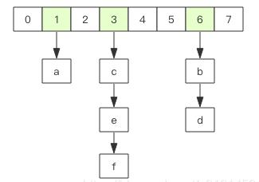

# 购物车为什么用Redis存?是永久存储引发问题..
````
库存的增减,分布式事务锁(setnx):
$ttl = 10;
$redis = new \Redis();
$rs = $redis->set('name', 1010, array('nx', 'ex' => $ttl));
if ($rs) {
    //处理更新缓存逻辑
    // ......
    //先判断随机数，是同一个则删除锁
    if ($redis->get('name') == 1010) {
        $redis->del('name');
    }
}
````
### 公众号阅读量(INCR):
127.0.0.1:6379> incr article:readcount:1000(文章id)
### 微博和公众号的消息流(list)
127.0.0.1:6379> lpush article value
### 微信抽奖(set)


- 参与抽奖： SADD key 用户id ： 参与了用户的id
- 查看参与抽奖的人员: SMEMBERS key
- 抽取n名中中奖者: SPOP key [count]
### 微信微博点赞、收藏、标签


````
127.0.0.1:6379> spop reward 2
1) "8"
2) "7"
````
### 购物车机制(Hash类型)

````
127.0.0.1:6379> hset will name yin
(integer) 1

// 以原子方式设置一个值,类似 setnx 方式
127.0.0.1:6379> hsetnx will name yin
(integer) 0

// 设置某一个字段自增
127.0.0.1:6379> hincrby will age 1
(integer) 13
````

[](./pic/企业微信截图_20210728164449.png)

- 加入购物车的商品使用 `hset cart:1001 10088 1`,啥意思 cart代表的购物车 当然这个key 你可以随意定 但是意义要让所有人清楚，:1001 这里代表的是用户id，
  后面的10088 代表的是商品id
- 购物车的增加商品按钮 可以使用`hincrby` 命令 对已有值进行增量操作
- 获取购物车商品总数 `hlen cart:1001`
- 删除商品，使用删除的命令 `hdel cart:1001 10088`
- 获取加购商品的总数量 使用`hgetall cart:1001`

#### 使用hash类型的 优/缺 点
````
优点:
    - 同类型数据进行整合存储,方便数据管理
    - 相比string操作消耗的内存和cpu更小
    - 相比string更节省空间
缺点:
    - 过期功能只能用在key上,不能用在field上
    - redis集群下不适合大规模使用,hash的会分配槽位，集群中 会导致数据过于集中，没办法做分片    
````
#### hash 与 string 的对比
利用redis 将用户的信息 ``{ "name": "will", "age": 2}`` 进行存储

由于redis的字符串是动态字符串,可以修改采用预分配冗余空间的方式来减少内存的频繁分配


#### 内部为当前字符串实际分配的空间capacity，一般高于实际字符串长度len

如果我们将name修改为 'yin',再进行存储,redis是不需要重新分配空间的,我们在读取和存储数据的时候只需要对做Json序列化与反序列化，比较方便

redis中的hash与数据结构中内部结构实现与HashMap一致,即数组+链表结构



hash结构也可以存储用户信息，不过是对每个字段单独存储，因此可以在查询时获取部分字段的信息，节省网络流量。
#### 不过Redis的hash的值只能是字符串
````
适合用string存储的情况
    每次需要访问大量的字段
    某些键的值存储差异，不能存储为字符串的时候

适合用hash存储的情况
    在大多数情况中只需要访问少量字段
    自己始终知道哪些字段可用，防止使用mget时获取不到想要的数据
````