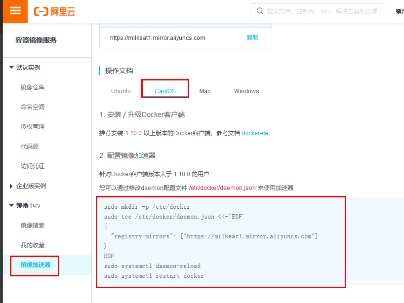
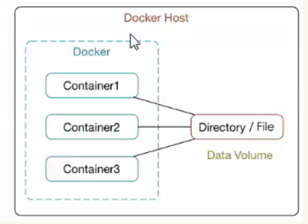
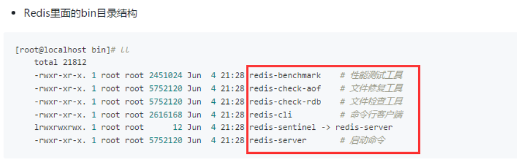
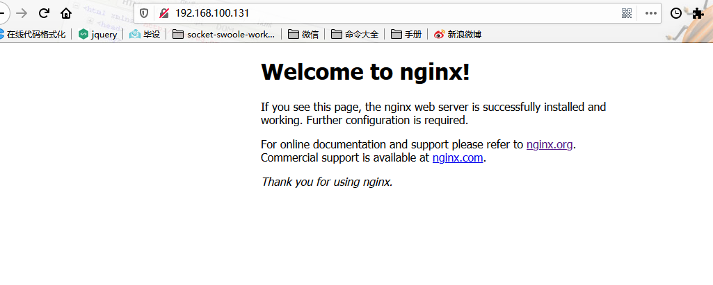
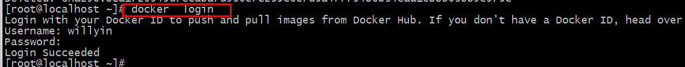
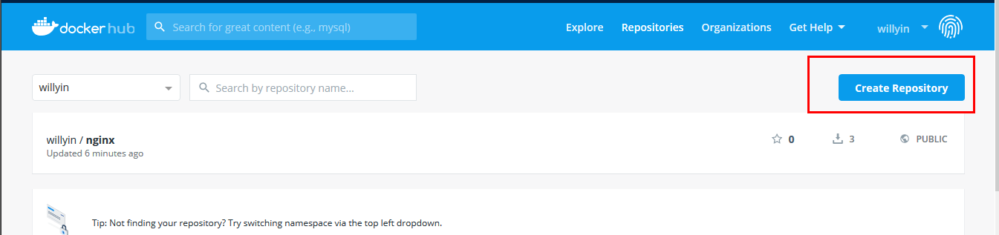
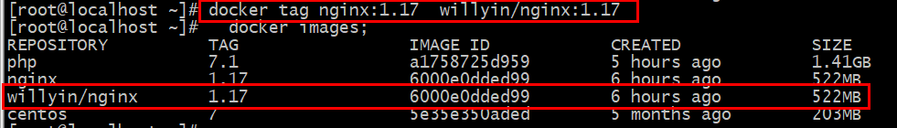
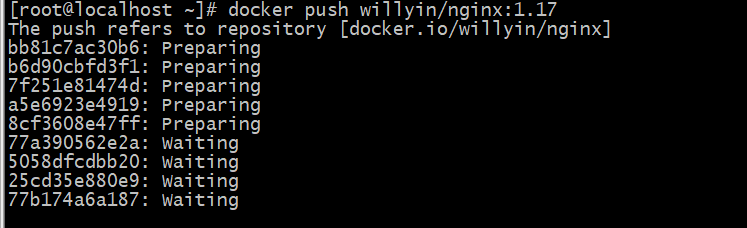
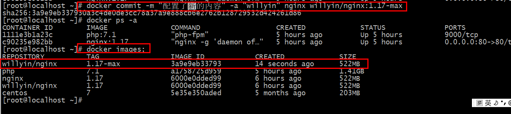

# Docker准备
## docker介绍
#### Docker是什么？
>Docker 是一个开源的应用容器引擎，你可以将其理解为一个轻量级的虚拟机，开发者可以打包他们的应用以及依赖包到一个可移植的容器中，然后发布到任何流行的 Linux 机器上。
#### 为什么要使用 Docker？
>作为一种新兴的虚拟化方式，Docker 跟传统的虚拟化方式相比具有众多的优势。
### docker优势
- 更高效的利用系统资源
- 更快速的启动时间
- 一致的运行环境
- 更轻松的迁移
- 更轻松的维护和扩展
### docker主要用途
- 提供一次性的环境。比如，本地测试他人的软件、持续集成的时候提供单元测试和构建的环境。
- 提供弹性的云服务。因为 Docker 容器可以随开随关，很适合动态扩容和缩容。
- 组建微服务架构。通过多个容器，一台机器可以跑多个服务，因此在本机就可以模拟出微服务架构。
### docker安装(centos7)
````
 1、更新update到最新的版本
yum  update 

2、卸载老版本docker
yum  remove docker  docker-common docker-selinux  docker-engine
3、安装需要的软件包
yum install -y yum-utils  device-mapper-persistent-data lvm2
4、设置yum源
yum-config-manager --add-repo https://download.docker.com/linux/centos/docker-ce.repo
5、查看docker版本
 yum list docker-ce --showduplicates|sort -r  

6、安装docker
yum  install  docker-ce-18.03.1.ce -y
7、启动docker
systemctl start docker
8、加入开机自启
systemctl enable docker

9、配置国内镜像
进入网址：https://cr.console.aliyun.com/cn-hangzhou/mirrors
vi /etc/docker/daemon.json 
{
  "registry-mirrors": ["https://milkeat1.mirror.aliyuncs.com"]
}
10.刷新重启
systemctl daemon-reload
 systemctl restart docker
````

---
## 安装redis6
````
  ~ wget https://github.com/antirez/redis/archive/6.0-rc2.tar.gz
  ~ tar -zxvf 6.0-rc2.tar.gz
  ~ cd redis-6.0-rc2/ 
  ~ /usr/local/bin/gcc -v 
  使用内建 specs。 
  COLLECT_GCC=/usr/local/bin/gcc
  COLLECT_LTO_WRAPPER=/usr/local/libexec/gcc/x86_64-pc-linux-gnu/7.1.0/lto-wrapper
  目标：x86_64-pc-linux-gnu
  配置为：../configure --enable-checking=release --enable-languages=c,c++ --disable-multilib
  线程模型：posix 
  gcc 版本 7.1.0 (GCC)
  ~ CC=/usr/local/bin/gcc make 
  ~ make install
  ~ redis-server

注意过程中的问题： 
1. 时间问题:如果出现时间问题可通过如下操解决 
~ date -s 04/15/2020(填写今天的日期) 

2. 编译出现如下问题：gzip: stdin: invalid compressed data--format violated
原因：是windows下上传到服务器存在这不统一的编码问题：如ascii; 解决直接在服务器上wget

3. 如果make下的报错 
zmalloc.h:50:31: fatal error: jemalloc/jemalloc.h: No such file or directory #include <jemalloc/jemalloc.h>^ compilation terminated. make[1]: *** [adlist.o] Error 1 make[1]: Leaving directory `/usr/local/redis-5.0.5/src' make: *** [all] Error 2
 如上的报错只需要编译的时候追加MALLOC=libc即可
 ~ make MALLOC=libc

4. Redis6安装是需要gcc5以上的版本 可参考这两篇文章安装gcc5： 
https://blog.csdn.net/qilimi1053620912/article/details/83862513
https://www.jianshu.com/p/f7cd0e2416b9 https://blog.csdn.net/qq_42609381/article/details/80915295 
~ sudo yum install wget
 ~ wget http://ftp.tsukuba.wide.ad.jp/software/gcc/releases/gcc-7.1.0/gcc-7.1.0.tar.gz 
~ tar -xvf gcc-7.1.0.tar.gz 
~ cd gcc-7.1.0 --可能需要安装：
 ~ sudo yum -y install bzip2 -- 会很久
 ~ ./contrib/download_prerequisites
 ~ mkdir build ~ cd build 
~ ../configure --enable-checking=release --enable-languages=c,c++ --disable-multilib -- 会很久 
~ make && sudo make install
 ~ sudo ldconfig 
~ gcc -v

5. server.h:1022:5: 
错误：expected specifier-qualifier-list before ‘_Atomic’ _Atomic unsigned int lruclock; /* Clock for LRU eviction */ 
参考文章：https://wanghenshui.github.io/2019/12/31/redis-ce 
这个问题是在redis6.0编译的时候会经常出现，解决的办法只需要手动指定gcc进行编译安装；注意默认编译redis的时候是会选择gcc低于5的版本


redis6的bug(要求gcc > 5 ,make编译安装依赖就是gcc)
yum安装(自动化安装) ->基于编译安装(make)完成的
````
---
## 镜像的结构
````
      composer               docker
镜像  composer.json         dockerfile
容器  composer组件包         容器   
仓库(Packagist )            (dockerhub)
仓库(存放公共发布的资源)
````
---
## dockerfile介绍与镜像的构建
#### dockerfile
>Dockfile是一种被Docker程序解释的脚本，Dockerfile由一条一条的指令组成，每条指令对应Linux下面的一条命令。Docker程序将这些Dockerfile指令翻译真正的Linux命令。Dockerfile有自己书写格式和支持的命令，Docker程序解决这些命令间的依赖关系，类似于Makefile。

>Dockerfile的指令是忽略大小写的，建议使用大写，
 使用 # 作为注释，
 每一行只支持一条指令，每条指令可以携带多个参数。
 
>Dockerfile的指令根据作用可以分为两种，构建指令和设置指令。构建指令用于构建image，其指定的操作不会在运行image的容器上执行；设置指令用于设置image的属性，其指定的操作将在运行image的容器中执行。
````
FROM（指定基础image）
FROM  <image>:<tag> 

MAINTAINER（用来指定镜像创建者信息）
MAINTAINER <name> 

RUN（安装软件用）
RUN <command>

ENV（用于设置环境变量）
ENV <key> <value> 

ADD（从src复制文件到container的dest路径）
ADD  <src> <dest>    复制过去 直接解压

COPY  src  dest   不给解压

CMD（设置container启动时执行的操作）
CMD ["executable","param1","param2"]

ENTRYPOINT（设置container启动时执行的操作）
ENTRYPOINT ["executable", "param1", "param2"]

USER（设置container容器的用户）
USER daemon

EXPOSE（指定容器需要映射到宿主机器的端口）
EXPOSE <port> [<port>...]  

VOLUME（指定挂载点)）
VOLUME ["<mountpoint>"]  

WORKDIR（切换目录）
WORKDIR  /path/to/workdir  

ONBUILD（在子镜像中执行）
ONBUILD <Dockerfile关键字> 

2.
docker  build
-f  指定 dockerfile文件    Dockerfile  默认 可以不用加  -f   
-t  指定image  tag  标签
.   上下文选项
docker  build  -f   dockerfile文件    -t   image:tag   
````
#### 数据卷
>Docker中的数据可以存储在类似于虚拟机磁盘的介质中，在Docker中称为数据卷（Data Volume）。数据卷可以用来存储Docker应用的数据，也可以用来在Docker容器间进行数据共享。数据卷呈现给Docker容器的形式就是一个目录，支持多个容器间共享，修改也不会影响镜像。


````
选项
-d: 后台运行容器，并返回容器ID；
-i: 以交互模式运行容器，通常与 -t 同时使用；
-t: 为容器重新分配一个伪输入终端，通常与 -i 同时使用；
--name:   为容器指定一个名称；
-h:       指定容器的hostname；
-p: 指定端口映射，格式为：主机(宿主)端口:容器端口

docker run -d  --name web-6  -p 90:80  nginx 
-P: 随机端口映射，容器内部端口随机映射到主机的高端口
--link   添加链接到另一个容器；
--restart   启动docker自动启动  always/no（默认）
-m   --memory   限制使用的最大内存
-cpus   限制使用的cpu数量
-v  绑定数据卷   -v /home/www:/usr/share/nginx/html  (/home/www为宿主机目录)
--mount  挂载文件系统到容器

数据卷:
volume   
docker volume  
选项  
create   创建数据卷
inspect  查看
ls           列出数据卷
prune     删除不用的数据卷 
rm          移除数据卷
创建数据卷:
docker volume create  vol_test(宿主机数据卷的目录:/var/lib/docker/volumes)
1.创建并绑定数据卷(可以不执行上面的命令,执行下面命令,有就使用,没有自动创建数据卷vol_test):
docker run -d --name web5 -p 99:80  -v vol_test:/usr/share/nginx/html   nginx
此时是/var/lib/docker/volumes/vol_test/_data 与 容器中/usr/share/nginx/html目录同步
2.直接挂载到指定目录,原来的文件没有了
docker run  -d --name web6  -p 2223:80  -v /home/www:/usr/share/nginx/html  nginx 
此时是/home/www 与 容器中的 /usr/share/nginx/html 目录同步
````
### 手动/使用dockerfile搭建lnmp环境
- 先构建一个redis尝试下:
````
帮助文档:https://jingyan.baidu.com/album/335530daf6abc919cb41c3b8.html?picindex=1
./redis-server &  加上‘&’号使redis以后台程序方式运行
./redis-server /etc/redis/6379.conf  通过指定配置文件启动
redis-cli -p 6380 如果更改了端口，使用`redis-cli`客户端连接时，也需要指定端口，例如：

centos中安装(帮助文档:https://blog.51cto.com/14010723/2298042)
1、需要提前安装好gcc相关的包；
yum install -y open-ssl-devel gcc glibc gcc-c*
2、下载redis的tar包；
cd /usr/local/src/
wget http://download.redis.io/releases/redis-4.0.2.tar.gz
3、解压tar包；
tar -xvzf redis-4.0.2.tar.gz
4、正式安装，指定特定到安装目录；
cd redis-4.0.2
make MALLOC=libc
cd src/
make install PREFIX=/usr/local/redis
5、拷贝redis.conf配置文件到特定目录；
mkdir -p /usr/local/redis/etc
cp /usr/local/src/redis-4.0.2/redis.conf /usr/local/redis/etc/
6、添加redis到命令到全局变量，方便在任何目录执行；
 vi /etc/profile
在最后行添加:
export PATH="$PATH:/usr/local/redis/bin"
````
- dockerfile构建redis内容
````
FROM centos:7
RUN groupadd -r redis && useradd -r -g redis redis
RUN yum update -y && yum install epel-release -y
RUN yum install wget -y && yum -y install gcc automake autoconf libtool make; \
    yum install  gcc-c++ -y
RUN mkdir -p /usr/src/redis; \
    wget https://github.com/antirez/redis/archive/5.0.7.tar.gz; \
    tar -zxvf 5.0.7.tar.gz -C /usr/src/redis; \
    rm -rf 5.0.7.tar.gz
RUN cd /usr/src/redis/redis-5.0.7 && make && make PREFIX=/usr/local/redis install
#安装清理缓存文件
RUN yum clean all
#拷贝配置文件
RUN cp /usr/src/redis/redis-5.0.7/redis.conf  /usr/local/redis
#修改绑定IP地址
RUN sed -i -e 's@bind 127.0.0.1@bind 0.0.0.0@g' /usr/local/redis/redis.conf
#关闭保护模式
RUN sed -i -e 's@protected-mode yes@protected-mode no@g' /usr/local/redis/redis.conf
#设置密码
#RUN echo "requirepass 123456" >> /usr/local/redis/redis.conf
#备份配置文件
#启动
ENTRYPOINT [ "/usr/local/redis/bin/redis-server","/usr/local/redis/redis.conf"]
CMD []

#此时redis的目录就在/usr/local/redis/ 下
#进入客户端命令 /usr/local/redis/bin/redis-cli
````


### 利用dockerhub镜像手动构建
````
手动安装(顺序不能错)
1.
docker pull mysql:5.7
//-e 是mysql自带的参数 给root用户添加密码
docker run -d  --name  mysql   -e MYSQL_ROOT_PASSWORD=123456   mysql:5.7

2.
docker pull php:7.3-fpm
docker run -d  --name php  --link mysql:mysql  -v /home/www:/usr/share/nginx/html  php:7.3-fpm
3.
docker pull nginx:1.17
docker run -d --name nginx -p 80:80  -v /home/www:/usr/share/nginx/html  --link lnmp_php:php  nginx:1.17
4.
//进入容器
docker exec -it nginx/php/mysql bash 
5.
docker exec -it nginx bash 
cd /etc/nginx/conf.d
//因为没有vi命令这里要下载,但是不是yum命令
apt-get update  
apt-get install vim -y
ls 
vim default.conf

修改nginx配置
location ~ \.php$ {
        root           /usr/share/nginx/html;
        fastcgi_pass   php:9000;
        fastcgi_index  index.php;
        fastcgi_param  SCRIPT_FILENAME  $document_root$fastcgi_script_name;
        include        fastcgi_params;
    }


查看错误日志
docekr log 容器名 : docker log nginx

宿主机查找容器文件
find  /   -name  文件名
find / -name "default.conf"
依次尝试

php安装拓展
docker exec -it php bash 
安装
docker-php-ext-install    pdo_mysql   mysqli
pecl install  redis    docker-php-ext-enable redis
````

### 利用dockerfile安装
>下面代码执行和网络情况有关系,如果报错就多执行几遍
>
>注意:这里为了节省事件将php 和 mysql 安装包提前下载下来

[参考文档](https://www.cnblogs.com/cxscode/p/11070880.html)

#### mysql
````
FROM centos:7

MAINTAINER willyin


RUN yum install -y  gcc gcc-c++ ncurses-devel perl cmake make autoconf  wget

RUN yum clean all

RUN groupadd mysql &&  useradd  -g mysql  -M -s /sbin/nologin  mysql

RUN  mkdir  /home/src


#RUN wget  -P /home/src   https://dev.mysql.com/get/Downloads/MySQL-5.6/mysql-5.6.44.tar.gz

COPY mysql-5.6.44.tar.gz /home/src

RUN cd  /home/src  && tar xf  mysql-5.6.44.tar.gz


WORKDIR /home/src/mysql-5.6.44


RUN  cmake -DCMAKE_INSTALL_PREFIX=/usr/local/mysql -DMYSQL_UNIX_ADDR=/tmp/mysql.sock -DMYSQL_USER=mysql -DDEFAULT_CHARSET=utf8 -DDEFAULT_COLLATION=utf8_general_ci -DWITH_MYISAM_STORAGE_ENGINE=1  -DWITH_INNOBASE_STORAGE_ENGINE=1 -DWITH_DEBUG=0 -DWITH_READLINE=1 -DWITH_EMBEDDED_SERVER=1 -DENABLED_LOCAL_INFILE=1 


RUN make && make install

RUN  chown -R mysql:mysql /usr/local/mysql

ENV PATH $PATH:/usr/local/mysql/bin

RUN  /usr/local/mysql/scripts/mysql_install_db --user=mysql --basedir=/usr/local/mysql  --datadir=/usr/local/mysql/data

RUN  /usr/local/mysql/support-files/mysql.server start && mysqladmin -u root password '123456'

EXPOSE  3306

CMD ["mysqld_safe"]


````
#### php
````
FROM centos:7

MAINTAINER willyin

RUN yum install  -y  https://mirrors.tuna.tsinghua.edu.cn/epel//epel-release-latest-7.noarch.rpm

RUN yum install -y  gcc gcc-c++ make gd-devel libxml2-devel libcurl-devel libjpeg-devel libpng-devel openssl-devel  libmcrypt-devel libxslt-devel libtidy-devel autoconf  wget

RUN yum clean all

RUN useradd -M -s /sbin/nologin www

RUN  mkdir  /home/src

COPY  php-7.1.30.tar.gz    /home/src

#RUN wget  -P /home/src  https://www.php.net/distributions/php-7.1.30.tar.gz


RUN cd  /home/src  && tar xf php-7.1.30.tar.gz


WORKDIR /home/src/php-7.1.30


RUN  ./configure --prefix=/usr/local/php --with-config-file-path=/usr/local/php/etc --enable-fpm --with-fpm-user=www --with-fpm-group=www --with-mysql=mysqlnd --with-mysqli=mysqlnd --with-pdo-mysql=mysqlnd --with-iconv-dir --with-freetype-dir=/usr/local/freetype --with-mcrypt --with-jpeg-dir --with-png-dir --with-zlib --with-libxml-dir=/usr --enable-xml --disable-rpath --enable-inline-optimization --with-curl --enable-mbregex --enable-mbstring --with-gd --enable-gd-native-ttf --with-openssl --with-mhash --enable-pcntl --with-xmlrpc --enable-zip --enable-soap --with-gettext --enable-opcache --with-xsl --enable-bcmath --enable-posix --enable-sockets


RUN make && make install


RUN cp php.ini-production /usr/local/php/etc/php.ini &&   cp /usr/local/php/etc/php-fpm.conf.default  /usr/local/php/etc/php-fpm.conf

RUN  cp  /usr/local/php/etc/php-fpm.d/www.conf.default   /usr/local/php/etc/php-fpm.d/www.conf


RUN sed  -i 's/listen = 127.0.0.1:9000/listen = 0.0.0.0:9000/g'   /usr/local/php/etc/php-fpm.d/www.conf

RUN sed -i "90a \daemonize = no" /usr/local/php/etc/php-fpm.conf


ENV PATH $PATH:/usr/local/php/sbin

#COPY php.ini /usr/local/php/etc/
#COPY php-fpm.conf /usr/local/php/etc/

EXPOSE 9000

CMD ["php-fpm"]


````

#### nginx
````
dockerfile内容:
FROM centos:7

MAINTAINER  willyin

RUN yum install -y gcc gcc-c++ glibc make autoconf wget  openssl-devel   libxslt-devel  gd-devel  GeoIP-devel  pcre-devel

RUN  yum clean all 
#-M：不要自动建立用户的登入目录
RUN groupadd  nginx && useradd  -g nginx  -M -s /sbin/nologin  nginx

RUN wget -P /home/src  http://nginx.org/download/nginx-1.17.0.tar.gz

RUN cd /home/src  && tar xf nginx-1.17.0.tar.gz

WORKDIR  /home/src/nginx-1.17.0

RUN ./configure --user=nginx --group=nginx --prefix=/usr/local/nginx --with-http_stub_status_module --with-http_ssl_module --with-http_gzip_static_module --with-http_sub_module

RUN make && make install

EXPOSE 80

ENV PATH $PATH:/usr/local/nginx/sbin

CMD ["nginx","-g","daemon off;"]


命令:
docker build -f nginx  -t nginx:1.17 .
docker run -d --name nginx -p 80:80 nginx:1.17
````
关闭防火墙进行访问



#### 构建lnmp
````
启动MySQL
 docker run  -d  --name  mysql   mysql:5.6

启动 php容器(--link   添加链接到另一个容器； 前一个是目标容器名称)
docker run -d  --name php  --link mysql:php_mysql   -v /home/www:/usr/local/nginx/html  php:7

启动nginx 容器(-v  绑定数据卷 /home/www:/usr/local/nginx/html  宿主机目录:容器目录)
 docker run -d  --name nginx  -p 80:80  --link php:nginx_php  -v /home/www:/usr/local/nginx/html nginx:1.17

配置nginx
1.docker exec -it nginx bash
2.cd /usr/local/nginx/conf  vi nginx.conf

location / {
  root html
  index  index.php  index.html  index.htl;
 }

location ~ \.php$ {
    // --link php:nginx_php  要与自定义名称一致 也就是 nginx_php
    fastcgi_pass   nginx_php:9000;  //php容器ip
    fastcgi_index  index.php;
    fastcgi_param  SCRIPT_FILENAME   $document_root$fastcgi_script_name; 
    include        fastcgi_params;
}
保存退出nginx 重启nginx: docker restart nginx

php与数据库的连接
<?php
// --link mysql:php_mysql(关联名称) 
//这里的host就要使用php关联mysql容器的关联名称
$pdo = new PDO('mysql:host=php_mysql;dbname=test','root','123456');
var_dump($pdo);
````

---
## dockerhub发布
- 注册 docker hub    https://hub.docker.com/
- 同步服务器时间  yum install ntpdate     ntpdate  ntp1.aliyun.com
- docker  login



- 先创建项目



- 修改 镜像 标签 docker tag nginx:1.17  willyin/nginx:1.17
>这里的名字一定和项目名程一致, : 后面为标签(willyin/nginx:1.17)

- 镜像推送 docker push  willyin/nginx:1.17 
 


- 如果容器中修改了内容,想要生成镜像并推送
>docker commit -m "配置了新的内容" -a "willyin" nginx willyin/nginx:1.17-max


- 从仓库拉下来 docker pull willyin/nginx:1.17


